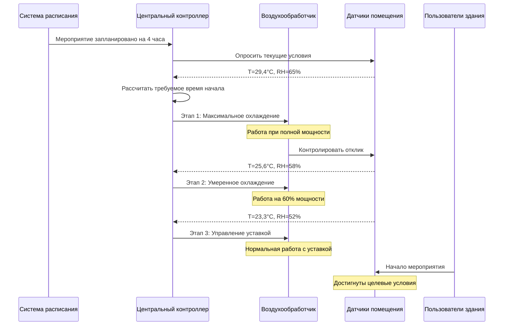

## Обзор

Кондиционирование перед мероприятием устанавливает оптимальные условия окружающей среды до начала занятости в объектах с переменной занятостью. Этот упреждающий подход принципиально отличается от реактивного управления благодаря использованию тепловой массы, прогнозированию явных и скрытых нагрузок и обеспечению немедленного комфорта при прибытии пользователей. Приложения включают аудитории, выставочные центры, спортивные площадки, религиозные учреждения и образовательные помещения с прерывистым режимом использования.

Основная цель — достижение целевых условий к моменту начала занятости при минимизации потребления энергии и избежании чрезмерного превышения или недостижения целевых значений. Успешное кондиционирование требует точного прогнозирования нагрузок, понимания теплового отклика здания и координации с графиками занятости.

## Основы теплового отклика

Тепловой отклик здания на кондиционирование зависит от тепловой массы и площади поверхности. Постоянная времени характеризует этот отклик:

$$\tau = \frac{mc_p}{hA}$$

где:
- $\tau$ = постоянная времени теплового отклика (часы)
- $m$ = тепловая масса (кг)
- $c_p$ = удельная теплоемкость (Дж/кг·К)
- $h$ = коэффициент конвективного теплопередачи (Вт/м²·К)
- $A$ = площадь поверхности (м²)

Реакция температуры на ступенчатый вход следует экспоненциальному затуханию:

$$T(t) = T_{final} + (T_{initial} - T_{final})e^{-t/\tau}$$

Достижение 95% желаемого изменения температуры требует примерно $3\tau$. Для типичного коммерческого строительства постоянные времени составляют 2-8 часов.

## Расчет нагрузки кондиционирования перед мероприятием

Полная нагрузка кондиционирования перед мероприятием состоит из компонентов передачи, инфильтрации и тепловой массы:

$$Q_{pre} = Q_{transmission} + Q_{infiltration} + Q_{thermal\ mass}$$

**Нагрузка на передачу:**

$$Q_{transmission} = UA(T_{outdoor} - T_{setpoint})$$

**Нагрузка инфильтрации:**

$$Q_{infiltration} = \rho V_{air} c_p ACH(T_{outdoor} - T_{setpoint})$$

**Нагрузка тепловой массы:**

$$Q_{thermal\ mass} = \frac{mc_p \Delta T}{\Delta t}$$

где $\Delta t$ представляет период кондиционирования перед мероприятием.

## Последовательность кондиционирования перед мероприятием

## Этапы кондиционирования перед мероприятием

### Этап 1: Работа при максимальной мощности

Первоначальный этап работает оборудование при максимальной мощности для быстрого изменения условий в помещении. Температура приточного воздуха достигает минимальных (охлаждение) или максимальных (отопление) значений. Продолжительность зависит от начального отклонения от уставки.

**Характеристики:**
- Температура приточного воздуха: 10-13°C (охлаждение) или 35-40°C (отопление)
- Скорость вентилятора: 100% расчетного расхода воздуха
- Задвижка наружного воздуха: Минимальное положение (если экономайзер не эффективен)
- Типичная продолжительность: 1-3 часа при умеренных условиях

### Этап 2: Модулируемый подход

По мере приближения условий в помещении к уставке мощность оборудования снижается для предотвращения превышения целевого значения. Управление переходит с полного выхода на пропорциональное управление.

**Характеристики:**
- Температура приточного воздуха: Модулируется в зависимости от ошибки
- Скорость вентилятора: Может снизиться до 70-85% в системе VAV
- Наружный воздух: Может увеличиться, если экономайзер эффективен
- Типичная продолжительность: 30-60 минут

### Этап 3: Поддержание уставки

Заключительный этап поддерживает условия проектирования с использованием стандартных алгоритмов управления. Оборудование работает в стандартном режиме с занятостью.

## Предварительное кондиционирование влажности

Управление скрытой нагрузкой представляет уникальные проблемы из-за более медленной диффузии влаги по сравнению с передачей тепла. Уравнение баланса влаги:

$$\frac{dm_{moisture}}{dt} = \dot{m}_{supply}(\omega_{supply} - \omega_{space})$$

где:
- $\omega$ = коэффициент влажности (кг воды/кг сухого воздуха)
- $\dot{m}$ = массовый расход (кг/с)

Осушение требует более длительных периодов подготовки, чем регулировка температуры, по следующим причинам:
- Более низкий движущий потенциал (разница давления пара vs. разница температуры)
- Эффекты буферизации влаги материала
- Требования к переподогреву, ограничивающие скорость осушения

**Рекомендуемые периоды подготовки:**

| Начальная RH | Целевая RH | Изменение температуры | Оценочный период подготовки |
|------------|-----------|-------------------|---------------------|
| 65% | 50% | Охлаждение на 5,6°C | 3-4 часа |
| 70% | 50% | Охлаждение на 8,3°C | 4-6 часов |
| 60% | 50% | Охлаждение на 2,8°C | 2-3 часа |
| 55% | 50% | Охлаждение на 5,6°C | 2-3 часа |

## Алгоритмы оптимального начала

ASHRAE Guideline 36-2021 рекомендует адаптивные алгоритмы оптимального начала, которые обучаются отклику здания. Базовый расчет:

$$t_{start} = t_{event} - \left[\frac{T_{current} - T_{target}}{R_{avg}}\right]$$

где:
- $t_{start}$ = время начала работы оборудования
- $t_{event}$ = запланированное время занятости
- $R_{avg}$ = средняя скорость изменения температуры (°C/час)

Продвинутые алгоритмы включают:
- Эффекты температуры наружного воздуха
- Паттерны дня недели
- Исторические данные производительности
- Прогнозы погоды

## Стратегии оптимизации энергии

**Смещение нагрузки:** Предварительное охлаждение в часы пиковой сбережения энергии для снижения пиковых платежей за спрос. Особенно эффективно для зданий со значительной тепловой массой.

**Управление этапированием с контролем спроса:** Последовательная работа нескольких установок для поддержания стабильного потребления мощности вместо одновременного запуска.

**Использование экономайзера:** Максимизируйте свободное охлаждение во время предварительного кондиционирования, когда позволяют условия снаружи.

**Сброс температуры приточного воздуха:** Постепенное повышение температуры приточного воздуха по мере приближения к целевому значению для повышения эффективности и предотвращения переохлаждения.

## Рекомендации по внедрению

**Интерфейс расписания:** Интегрируйте с системами управления событиями для получения графиков занятости автоматически. Необходима функция ручного переопределения для незапланированных событий.

**Размещение датчиков:** Расположите датчики для представления средних условий в помещении, а не локальных микроклиматов. Беспроводные датчики облегчают оптимальное размещение без модернизации проводки.

**Этапирование оборудования:** Для нескольких установок распределите время начала на 5-15 минут, чтобы снизить пики электрического спроса и скачки расхода воды.

**Период проверки:** Выделите 15-30 минут перед занятостью для окончательной проверки условий и незначительных корректировок.

## Мониторинг производительности

Отслеживайте ключевые показатели для проверки эффективности предварительного кондиционирования:

- Уровень достижения условий (% мероприятий, соответствующих целевым значениям во время занятости)
- Средняя продолжительность предварительного кондиционирования
- Потребление энергии за цикл предварительного кондиционирования
- Жалобы на комфорт пользователей в период начальной занятости
- Эффективность времени работы оборудования

ASHRAE Standard 90.1 признает предварительное кондиционирование как приемлемую стратегию для помещений с прерывистой занятостью при условии, что уставки для незанятых условий обеспечивают минимум 2,8°C отката (охлаждение) или подъема (отопление).

## Общие проблемы

**Неточное расписание:** Поздние или отменяемые события приводят к потерям энергии. Внедрите протоколы подтверждения и алгоритмы обучения для снижения ложных начальных запусков.

**Недооценка тепловой массы:** Тяжелые конструкции требуют более длительных периодов подготовки, чем ожидалось. Характеризуйте отклик здания посредством измерений, а не предположений.

**Одновременное отопление и охлаждение:** Плохая координация между системами вызывает потери энергии. Внедрите блокировки и последовательности этапирования.

**Превышение влажности:** Агрессивное предварительное охлаждение без управления осушением вызывает конденсацию. Контролируйте температуру точки росы, а не только RH.

Предварительное кондиционирование перед мероприятием представляет критический компонент эффективной работы HVAC для помещений с переменной занятостью. Надлежащее внедрение обеспечивает комфорт пользователей немедленно при прибытии, одновременно минимизируя потребление энергии по сравнению со стратегиями непрерывного кондиционирования.
