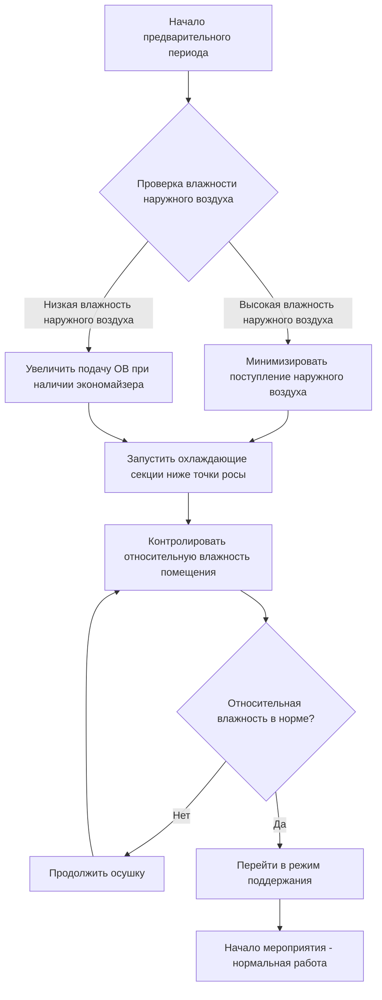
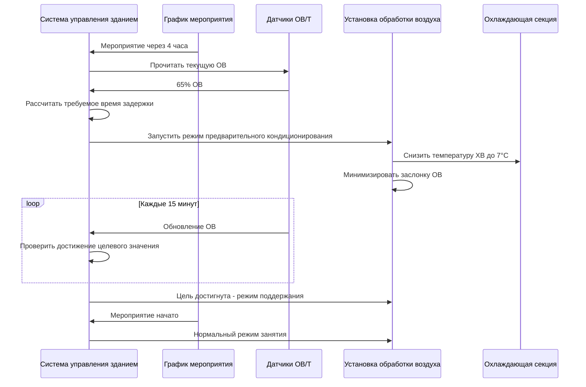

## Обзор

Предварительное управление влажностью устанавливает оптимальные условия влажности перед резким увеличением загруженности в помещениях, предотвращая конденсацию на холодных поверхностях, снижая воздействие скрытой нагрузки во время мероприятий и поддерживая комфортные условия. Эффективная осушка требует понимания психрометрических соотношений, производительности оборудования и расчетов времени достижения заданного значения.

## Физика удаления влаги

### Основы удаления влаги

Скорость удаления влаги зависит от температуры охлаждающей секции, расхода воздуха и условий поступающего воздуха:

$$\dot{m}_w = \dot{V} \cdot \rho_{воздуха} \cdot (W_1 - W_2)$$

Где:
- $\dot{m}_w$ = скорость удаления влаги (кг/ч)
- $\dot{V}$ = объемный расход воздуха (м³/с)
- $\rho_{воздуха}$ = плотность воздуха (кг/м³)
- $W_1$ = влагосодержание поступающего воздуха (кг_в/кг_сз)
- $W_2$ = влагосодержание удаляемого воздуха (кг_в/кг_сз)

### Время достижения заданного значения

Время, необходимое для снижения влажности помещения с начальных до целевых условий:

$$t_{задержка} = \frac{V_{помещения} \cdot \rho_{воздуха} \cdot (W_{начал} - W_{цель})}{\dot{m}_w \cdot 60}$$

Где:
- $t_{задержка}$ = время задержки (часы)
- $V_{помещения}$ = объем кондиционируемого помещения (м³)
- Множитель 60 преобразует минуты в часы

### Производительность скрытого охлаждения

Коэффициент явного теплообмена (SHR) определяет часть полной производительности, отведенную на удаление влаги:

$$Q_{скрытое} = Q_{полное} \cdot (1 - SHR)$$

$$Q_{скрытое} = \dot{m}_w \cdot h_{fg}$$

Где:
- $Q_{скрытое}$ = производительность скрытого охлаждения (кВ)
- $Q_{полное}$ = полная производительность охлаждения (кВ)
- $h_{fg}$ = скрытая теплота парообразования (~2,465 кДж/кг)

## Стратегия предварительного управления влажностью

## Целевые значения влажности

### Целевые значения влажности перед мероприятием по типам помещений

| Тип помещения | Целевая относительная влажность перед мероприятием | Целевая относительная влажность во время мероприятия | Время задержки | Критические поверхности |
|--------------|----------------------------------------|-------------------------------------|---------------------|------------------------|
| Ледовые арены | 30-40% | 40-50% | 3-6 часов | Ледовая поверхность, стекло |
| Концертные залы | 40-50% | 45-55% | 2-4 часа | Окна, зеркала |
| Выставочные центры | 40-50% | 45-55% | 4-8 часов | Выставочное оборудование |
| Бассейны | 50-60% | 55-65% | 2-3 часа | Стены, потолок |
| Спортивные залы | 35-45% | 40-50% | 2-4 часа | Полы, оборудование |

### Критерии управления точкой росы

Поддержание температуры поверхности выше точки росы предотвращает конденсацию:

$$T_{поверхность} > T_{точка\ росы} + \Delta T_{безопасность}$$

Где $\Delta T_{безопасность}$ = 2-3°C коэффициент безопасности.

**Таблица справочных значений точки росы:**

| Температура сухого термометра (°C) | 30% ОВ | 40% ОВ | 50% ОВ | 60% ОВ |
|----------------------------------|--------|--------|--------|--------|
| 21 | 3°C | 8°C | 11°C | 14°C |
| 22 | 4°C | 9°C | 12°C | 15°C |
| 24 | 6°C | 10°C | 13°C | 16°C |
| 26 | 8°C | 12°C | 15°C | 18°C |

## Параметры системы осушки

### Требования к производительности оборудования

**Производительность охлаждающей секции:**
- Температура поступающей воды: 6-7°C для эффективной осушки
- Температура поверхности секции должна быть ниже точки росы поступающего воздуха
- Скорость у поверхности: 2-2,5 м/с для обеспечения достаточного контакта
- Глубина рядов: минимум 6-8 рядов для глубокой осушки

**Определение размера производительности по удалению влаги:**

$$\dot{m}_{в,требуемое} = \frac{V_{помещения} \cdot \rho_{воздуха} \cdot (W_{начал} - W_{цель})}{t_{доступное} \cdot 60}$$

### Воздействие наружного воздуха

Во время предварительной осушки наружный воздух вносит дополнительную нагрузку по влаге:

$$\dot{m}_{в,ОВ} = \dot{V}_{ОВ} \cdot \rho_{воздуха} \cdot (W_{наружный} - W_{цель})$$

**Стратегия управления:**
- Снизить подачу наружного воздуха до минимума, требуемого нормами, во время осушки
- Использовать вентиляторы с рекуперацией энергии (ERV) для предварительного кондиционирования наружного воздуха
- Закрыть заслонки наружного воздуха, если это разрешено требованиями вентиляции

## Пример расчета времени задержки

Для концертного зала объемом 5,700 м³:
- Начальные условия: 24°C, 65% ОВ (W = 0,0120 кг_в/кг_сз)
- Целевые условия: 22°C, 45% ОВ (W = 0,0073 кг_в/кг_сз)
- Удаление влаги системой: 180 кг/ч

$$t_{задержка} = \frac{5700 \cdot 1,2 \cdot (0,0120 - 0,0073)}{180 \cdot 60} = 2,9 \text{ часа}$$

## Стандарты и руководства ASHRAE

**Стандарт ASHRAE 55-2020:** Тепловые условия окружающей среды для занятия людьми
- Допустимый диапазон влажности: 30-60% ОВ для комфорта
- Диапазон точки росы: 0-17°C

**Стандарт ASHRAE 62.1-2022:** Вентиляция для приемлемого качества воздуха в помещении
- Минимальные требования наружного воздуха во время занятия
- Допускает сниженную вентиляцию во время нежилого предварительного кондиционирования

**Справочник ASHRAE - Приложение HVAC:**
- Помещения общественного назначения: Глава 4
- Стратегии осушки: Глава 25
- Управление влажностью в зданиях: Глава 27

## Интеграция последовательности управления

## Стратегии предотвращения конденсации

### Защита критических поверхностей

**Определение холодных поверхностей:**
- Окна и остекленные системы
- Конструкционная сталь и металлические настилы
- Трубопроводы охлажденной воды и диффузоры
- Холодильное оборудование в буфетных зонах

**Методы предотвращения:**
1. При возможности предварительно прогреть поверхности перед осушкой
2. Поддерживать температуру поверхности > точка росы + коэффициент безопасности
3. Увеличить циркуляцию воздуха вблизи чувствительных поверхностей
4. Применить изоляцию к постоянно холодным поверхностям

### Контроль инфильтрации

Проникновение влаги во время предварительного периода:
- Загерметизировать двери и проемы погрузочных доков
- Создать небольшое избыточное давление в помещении (5-12 Па) для предотвращения инфильтрации
- Минимизировать открывание дверей во время цикла осушки

## Мониторинг и верификация

**Ключевые показатели эффективности:**
- Время достижения целевой ОВ
- Энергопотребление на килограмм удаленной влаги
- Частота возникновения конденсации на поверхностях
- Жалобы на комфорт посетителей во время мероприятий

**Размещение датчиков:**
- Несколько зон в больших помещениях
- Вблизи критических холодных поверхностей
- В потоке возвратного воздуха для управления системой
- Наружный воздух для сравнения энтальпии

## Заключение

Эффективное предварительное управление влажностью требует точных психрометрических расчетов, адекватного времени задержки и надлежащего определения размера оборудования. Понимание физики удаления влаги и реализация стратегических последовательностей управления предотвращают конденсацию, снижают скрытые нагрузки во время занятия и поддерживают приемлемые условия комфорта. Соответствие стандартам ASHRAE обеспечивает соответствие нормам при одновременной оптимизации энергоэффективности и производительности системы.
