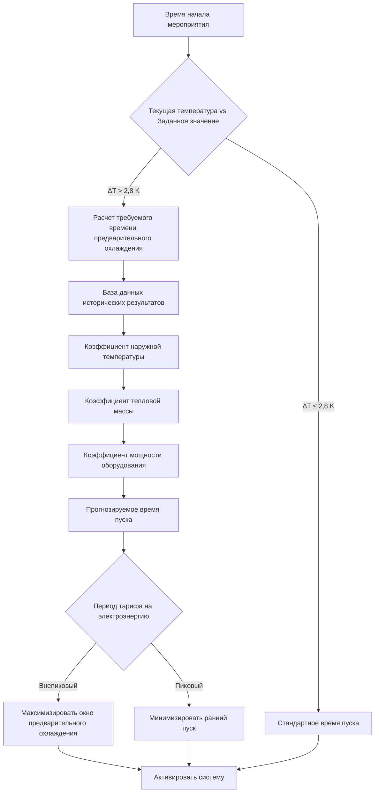

## Обзор

Время предварительного охлаждения определяет, когда системы HVAC активируются до запланированного прибытия людей для достижения целевых условий в начале мероприятия. Надлежащая оптимизация времени снижает плату за пиковую мощность, использует внепиковые тарифы на электроэнергию и обеспечивает комфорт людей благодаря стратегическому использованию тепловой массы.

## Физика предварительного охлаждения

### Требования по отводу тепла

Общая охлаждающая нагрузка во время предварительного охлаждения состоит из явного тепла, накопленного в тепловой массе здания, и продолжающихся поступлений тепла:

$$Q_{total} = Q_{mass} + Q_{gains} = mc_p\Delta T + \int_0^t (Q_{solar} + Q_{envelope} + Q_{equipment})dt$$

Где:
- $Q_{mass}$ = явное тепло, накопленное в тепловой массе (кДж)
- $m$ = эффективная масса здания (кг)
- $c_p$ = удельная теплоемкость (кДж/кг·К)
- $\Delta T$ = снижение температуры (К)
- $Q_{gains}$ = интегрированные по времени поступления тепла (кДж)

### Прогноз скорости охлаждения

Достижимая скорость охлаждения зависит от мощности оборудования и теплового сопротивления:

$$\frac{dT}{dt} = \frac{Q_{cooling} - Q_{gains}}{mc_p} = \frac{\dot{Q}_{net}}{C_{thermal}}$$

Где:
- $\dot{Q}_{net}$ = чистая охлаждающая мощность (кВ)
- $C_{thermal}$ = эффективная тепловая емкость (кДж/К)

### Расчет продолжительности предварительного охлаждения

Требуемое время предварительного охлаждения определяется путем интегрирования уравнения скорости охлаждения:

$$t_{precool} = \frac{C_{thermal} \cdot \Delta T}{\dot{Q}_{cooling} - \dot{Q}_{gains}} + t_{safety}$$

Где $t_{safety}$ представляет запас на пуск системы, стабилизацию управления и вариации погодных условий (обычно 15-30 минут).

## Алгоритм оптимального управления пуском

### Оценка времени достижения заданного значения



### Параметры адаптивного обучения

| Параметр | Начальное значение | Коэффициент обучения | Границы |
|----------|-------------------|----------------------|---------|
| Базовая скорость охлаждения | 0,56 K/ч на кВ | ±0,056 K/ч на событие | 0,28–1,11 K/ч на кВ |
| Коэффициент тепловой массы | 134 кДж/K·м² | ±2% за сезон | 80–214 кДж/K·м² |
| Коэффициент солнечного поступления | 1,0 | ±0,05 в день | 0,5–1,5 |
| Множитель теплоты от людей | 74 кВ на человека | Фиксировано | — |

## Стратегия поэтапного включения оборудования

### Последовательная активация охлаждения

```mermaid
gantt
    title Последовательность поэтапного включения оборудования предварительного охлаждения
    dateFormat HH:mm
    axisFormat %H:%M

    section Этап 1
    ВОУ-1 режим экономайзера    :active, s1a, 04:00, 1h
    Мягкий пуск чиллера       :s1b, 04:30, 30m

    section Этап 2
    ВОУ-1 полное охлаждение       :active, s2a, 05:00, 2h
    ВОУ-2 режим экономайзера    :s2b, 05:30, 30m

    section Этап 3
    ВОУ-2 полное охлаждение       :active, s3a, 06:00, 1h
    Разрядка ледяного хранилища    :crit, s3b, 06:30, 30m

    section Прибытие людей
    Начало мероприятия 07:00        :milestone, m1, 07:00, 0m
```

### Расчеты времени поэтапного включения

Для многоступенчатых систем активируйте оборудование в соответствии с приоритетом мощности:

$$t_{stage,n} = t_{event} - \sum_{i=n}^{N} \frac{\Delta Q_i}{\dot{Q}_{capacity,i}}$$

Где этап $n$ начинается в момент времени $t_{stage,n}$, отводя приращение тепла $\Delta Q_i$ с мощностью $\dot{Q}_{capacity,i}$.

## Таблицы оптимизации времени

### Время пуска предварительного охлаждения по тепловой массе здания

| Тип здания | Тепловая масса | ΔT = 2,8 K | ΔT = 5,6 K | ΔT = 8,3 K |
|------------|----------------|-----------|-----------|-----------|
| Легкая конструкция (металл, минимум мебели) | Низкая | 1,5 ч | 2,5 ч | 3,5 ч |
| Средняя конструкция (деревянный каркас, стандартная) | Средняя | 2,0 ч | 3,5 ч | 5,0 ч |
| Тяжелая конструкция (бетон, кладка) | Высокая | 3,0 ч | 5,0 ч | 7,0 ч |
| Очень тяжелая конструкция (массивный камень) | Очень высокая | 4,0 ч | 7,0 ч | 10,0 ч |

### Коэффициенты коррекции наружной температуры

| Наружная температура (°C) | Коэффициент коррекции | Скорректированное время пуска |
|---------------------------|----------------------|-------------------------------|
| < 21 | 0,85 | Базовое × 0,85 |
| 21–27 | 1,00 | Базовое × 1,00 |
| 27–32 | 1,15 | Базовое × 1,15 |
| 32–38 | 1,35 | Базовое × 1,35 |
| > 38 | 1,50 | Базовое × 1,50 |

## Стратегия снижения температурного заданного значения

### Агрессивное предварительное охлаждение

Временно снизьте заданное значение ниже целевого для ускорения охлаждения тепловой массы:

$$T_{precool} = T_{target} - \Delta T_{depression}$$

Типичное снижение: 1,7–2,8 K на 1–2 часа до прибытия людей.

### Восстановление комфортных условий

Позвольте заданному значению постепенно повышаться до целевого при начале прибытия людей:

$$T(t) = T_{precool} + \Delta T_{depression} \cdot \left(1 - e^{-\frac{t}{\tau_{recovery}}}\right)$$

Где $\tau_{recovery}$ = 30–60 минут для плавного переходного процесса.

## Преимущества снижения пиковой нагрузки

### Расчет снижения спроса мощности

Эффективное предварительное охлаждение переносит охлаждающую нагрузку из пикового в внепиковый период:

$$kW_{peak,reduction} = \frac{Q_{precool}}{3,6} \cdot \frac{t_{peak,avoided}}{t_{total}}$$

Типичное снижение пиковой мощности: 15–30% при хорошо выполненном предварительном охлаждении.

### Экономия на коммунальных услугах

$$\text{Экономия} = kW_{peak,reduction} \cdot (\text{Плата за мощность}) + kWh_{shifted} \cdot (\text{Тариф}_{peak} - \text{Тариф}_{offpeak})$$

## Ссылки на стандарты ASHRAE

**ASHRAE Standard 90.1-2019**, Раздел 6.4.3.3: Требуется оптимальное управление пуском для систем > 16 950 CFM (8 м³/с), обслуживающих помещения с тепловой массой.

**ASHRAE Guideline 36-2021**, Раздел 3.1.3.4: Последовательности предварительной очистки и предварительного охлаждения для помещений проведения мероприятий с переменным графиком.

**ASHRAE Handbook—HVAC Applications (2019)**, Глава 45: Стратегии предварительного охлаждения для объектов, ограниченных по спросу, и оптимизация тарифов в зависимости от времени использования.

## Рекомендации по внедрению

### Интеграция прогноза погоды

Адаптируйте время предварительного охлаждения на основе прогнозируемых наружных условий:
- Прогноз солнечной интенсивности влияет на поступления через ограждение
- Влажность влияет на требования по отводу скрытого тепла
- Тренд температуры влияет на точность времени пуска

### Точность прогноза численности людей

Эффективность предварительного охлаждения зависит от уверенности в событии:
- Запланированные события: полная последовательность предварительного охлаждения
- Прогнозируемая численность: консервативное время с 80% уверенностью
- Неопределенные события: минимальное предварительное охлаждение, быстрая способность к реагированию

### Требования к системе управления

- Дискретизация температуры в течение 15 минут или быстрее
- База данных исторических результатов (минимум 30 дней)
- Интеграция данных о погоде через API или датчики на месте
- Программирование расписания тарифов на электроэнергию
- Возможность ручного переопределения для менеджеров объекта

## Мониторинг производительности

Отслеживайте эти показатели для проверки времени предварительного охлаждения:
- Коэффициент достижения: процент событий, достигших целевой температуры в момент начала
- Энергетическая эффективность: кВч на градус-час предварительного охлаждения
- Снижение пиковой мощности: кВ сэкономлено в периоды пиковых нагрузок коммунальной сети
- Комфорт людей: вариация температуры в течение первых 30 минут прибытия людей

Оптимальное время предварительного охлаждения сбалансировано между обеспечением комфорта, минимизацией энергетических затрат и сохранением долговечности оборудования посредством прогнозирования на основе физики и алгоритмов непрерывного обучения.
