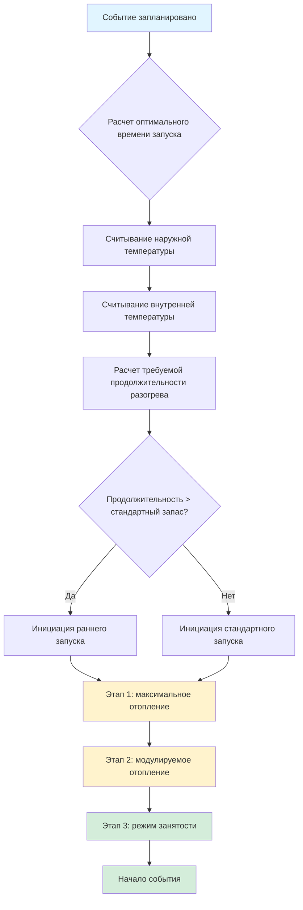

## Обзор

Разогрев перед событием для помещений с переменной занятостью требует точного расчета требований к отоплению для достижения комфортных условий перед прибытием посетителей. Крупные объекты, такие как арены, конференц-центры и аудитории, представляют уникальные проблемы из-за значительной теплоемкости, длительных периодов отсутствия людей и глубоких стратегий снижения температуры.

Фундаментальная проблема заключается в необходимости обогрева не только объема воздуха, но и строительного ограждения, конструкций сидений, бетонных плит и внутренней отделки, которые поглощают и выделяют тепловую энергию на протяжении цикла разогрева.

## Расчеты теплоемкости при разогреве

Общая тепловая энергия, необходимая во время разогрева, состоит из двух основных компонентов: чувствительного теплонагрева воздуха и восстановления теплоемкости.

### Теплонагрев объема воздуха

Чувствительное тепло, необходимое для повышения температуры воздуха от сниженной до установленной занятости:

$$Q_{air} = \rho \cdot V \cdot c_p \cdot (T_{occ} - T_{setback})$$

Где:
- $Q_{air}$ = чувствительное тепло для воздуха (кДж)
- $\rho$ = плотность воздуха (1,2 кг/м³ на уровне моря)
- $V$ = объем помещения (м³)
- $c_p$ = удельная теплоемкость воздуха (1,006 кДж/кг·°C)
- $T_{occ}$ = установленная температура при занятости (°C)
- $T_{setback}$ = пониженная температура (°C)

### Восстановление теплоемкости

Теплоемкость здания требует значительно больше энергии, чем только теплонагрев воздуха:

$$Q_{mass} = \sum_{i=1}^{n} m_i \cdot c_{p,i} \cdot (T_{final,i} - T_{initial,i})$$

Где:
- $Q_{mass}$ = требуемое тепло теплоемкости (кДж)
- $m_i$ = масса компонента $i$ (кг)
- $c_{p,i}$ = удельная теплоемкость материала $i$ (кДж/кг·°C)
- $T_{final,i}$ = финальная температура компонента (°C)
- $T_{initial,i}$ = начальная температура компонента (°C)

### Оценка времени разогрева

Теоретическое минимальное время разогрева зависит от доступной мощности отопления:

$$t_{warmup} = \frac{Q_{air} + Q_{mass} + Q_{infiltration}}{Q_{capacity} \cdot \eta}$$

Где:
- $t_{warmup}$ = время разогрева (часы)
- $Q_{capacity}$ = установленная мощность отопления (кДж/ч)
- $\eta$ = коэффициент эффективности системы отопления (0,85-0,95)
- $Q_{infiltration}$ = потери тепла из-за инфильтрации во время разогрева (кДж)

## Стратегия последовательности разогрева

## Реализация поэтапного разогрева

### Этап 1: Максимальная мощность отопления

- Все отопительные устройства активированы одновременно
- Температура подаваемого воздуха на максимуме (обычно 32-43°C)
- Вентиляционные заслонки в минимальном положении
- Системы вентиляторов на полной мощности
- Продолжительность: 60-75% от общего времени разогрева

### Этап 2: Модулируемое отопление

- Температура подачи снижена до умеренных уровней (24-29°C)
- Заслонки наружного воздуха начинают модуляцию
- Мощность отопления регулируется в зависимости от температуры помещения
- Продолжительность: 20-30% от общего времени разогрева

### Этап 3: Переход в режим занятости

- Вентиляционные нормы увеличены до уровней занятости
- Температура подачи модулируется для поддержания установленной точки
- Мощность отопления соответствует фактической нагрузке
- Продолжительность: 5-10% от времени разогрева перед занятостью

## Типовые требования к продолжительности разогрева

| Тип помещения | Объем (м³) | Снижение ΔT (°C) | Время разогрева (часы) | Примечания |
|---------------|-----------|------------------|------------------------|-----------|
| Ледовая арена | 14 150 | 11-14 | 4-6 | Включает зрительские зоны |
| Конференц-зал | 22 650 | 8-11 | 3-5 | Высокая теплоемкость |
| Аудитория | 8 500 | 8-10 | 2-3 | Умеренная теплоемкость |
| Спортивный зал | 5 650 | 7-8 | 1,5-2,5 | Низкая теплоемкость |
| Ангар | 28 300 | 10-12 | 5-8 | Большой объем, высокая теплоемкость |

*Времена предполагают, что наружная температура на 11-17°C ниже внутренней установленной точки и мощность отопления рассчитана на занятую нагрузку плюс запас 30%.*

## Алгоритм оптимального запуска

Современные системы автоматизации зданий используют адаптивные алгоритмы оптимального запуска, которые учатся характеристикам теплового отклика здания:

$$T_{start} = T_{event} - \left(k_1 \cdot \Delta T_{indoor} + k_2 \cdot \Delta T_{outdoor} + k_3 \cdot t_{unoccupied}\right)$$

Где:
- $T_{start}$ = рассчитанное время запуска
- $T_{event}$ = запланированное время события
- $k_1, k_2, k_3$ = изученные коэффициенты из исторических данных
- $\Delta T_{indoor}$ = требуемое повышение температуры (°C)
- $\Delta T_{outdoor}$ = снижение наружной температуры (°C)
- $t_{unoccupied}$ = продолжительность периода отсутствия (часы)

## Приоритизация зон последовательности

Для крупных объектов с несколькими зонами:

1. **Зоны высокого приоритета** (Входные вестибюли, бокс-ложи): запуск первыми, достижение установленной точки за 30-45 минут до события
2. **Зоны среднего приоритета** (Основные места, коридоры): запуск вторыми, достижение установленной точки за 15-30 минут до события
3. **Зоны низкого приоритета** (Хранилища, вспомогательные помещения): запуск последними, достижение установленной точки в момент начала события

Этот последовательный подход снижает пиковый спрос и предотвращает перегрузку электрической системы во время инициации разогрева.

## Справочник стандартов ASHRAE

Стандарт ASHRAE 90.1-2019, раздел 6.4.3.3.3 требует автоматических органов управления снижением с возможностями оптимального запуска для помещений размером более 930 м² обслуживаемых системами мощностью более 220 кВт. Стандарт предписывает, что периоды разогрева используют минимальные нормы наружного воздуха до 30 минут перед запланированной занятостью.

Руководство ASHRAE 36-2021 предоставляет подробные последовательности управления для алгоритмов оптимального запуска, указывая максимальные пределы продолжительности разогрева и стратегии блокировки наружного воздуха для минимизации потребления энергии во время кондиционирования перед занятостью.

## Рассмотрение мощности отопления

Достаточная мощность отопления должна учитывать:

- **Проектную тепловую нагрузку** во время условий занятости
- **Мощность восстановления после снижения** (обычно 20-35% дополнительно)
- **Нагрузки инфильтрации** во время разогрева с нагнетанием давления в здании
- **Влияние наружной температуры** на мощность оборудования

Недостаточная мощность отопления приводит к длительным периодам разогрева, повышенному потреблению энергии и потенциальному дискомфорту посетителей. Надлежащий выбор требует расчетов теплоемкости, специфичных для конструкции здания и предполагаемой стратегии снижения.

## Проверка производительности

Контролируйте и проверяйте производительность разогрева через:

- Достижение температуры помещения в сравнении с временем начала события
- Общее потребление энергии за цикл разогрева
- Часы работы оборудования и схемы поэтапного включения
- Положение заслонок наружного воздуха во время фаз разогрева
- Жалобы на дискомфорт посетителей в течение первых 30 минут события

Отрегулируйте коэффициенты оптимального запуска на основе собранных данных для минимизации потребления энергии при сохранении надежной доставки комфорта.
