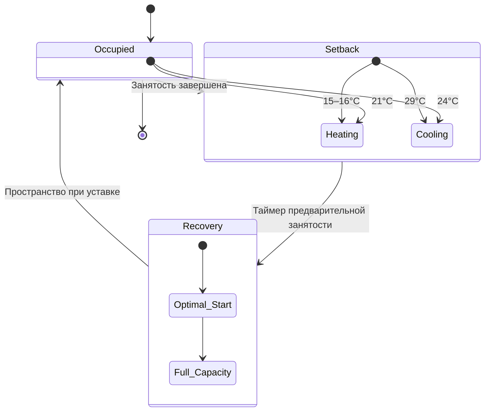

# Управление отключением режима пониженной нагрузки

Отключение режима пониженной нагрузки — фундаментальная стратегия энергосбережения, которая корректирует уставки системы HVAC в периоды, когда здания не заняты. Эта стратегия снижает нагрузки на отопление и охлаждение, позволяя внутренним температурам приближаться к наружным условиям в безопасных пределах, обеспечивая значительное энергосбережение при защите оборудования здания и сохранении конструктивной целостности.

## Физические принципы

Энергосбережение от управления отключением режима пониженной нагрузки основано на снижении температурного перепада между кондиционируемым помещением и наружной окружающей средой. Скорость теплопередачи через ограждающие конструкции здания подчиняется:

$$Q = UA\Delta T$$

где:
- $Q$ = скорость теплопередачи (кДж/ч)
- $U$ = общий коэффициент теплопередачи (кДж/ч·м²·°C)
- $A$ = площадь ограждающей конструкции (м²)
- $\Delta T$ = температурный перепад (°C)

Снижение $\Delta T$ в период отсутствия занятости напрямую уменьшает потери тепла (зимой) или поступление тепла (летом), пропорционально снижая энергопотребление HVAC.

## Стратегии отключения режима пониженной нагрузки

### Режимы понижения температуры

### Рекомендации по уставкам

Следующие уставки обеспечивают баланс между энергосбережением, защитой оборудования и требованиями к времени восстановления:

| Сезон | Занятость | Отключение | Максимальный дрейф | Время восстановления |
|--------|-----------|-----------|-----------------|------------------|
| Отопление | 21°C | 15–18°C | 13°C минимум | 1–3 часа |
| Охлаждение | 24°C | 28–29°C | 32°C максимум | 1–2 часа |
| Переходный | 22°C | Отключено (экономайзер) | 18–27°C | 30–60 мин |

**Критические пределы:**
- Минимум 13°C: предотвращает замерзание труб и повреждения от конденсации
- Максимум 32°C: защищает электронику, предотвращает деградацию материалов
- Влажность: поддерживайте 30–60% ОВ для предотвращения роста плесени и повреждения материалов

## Расчёты энергосбережения

### Энергосбережение в сезон отопления

Годовое энергосбережение отопления от ночного снижения температуры:

$$E_{saved} = \frac{24 \cdot DD \cdot \Delta T_{sb}}{T_{occ} \cdot \Delta T_{design}} \cdot E_{annual}$$

где:
- $DD$ = градусо-дни отопления (°C·дни)
- $\Delta T_{sb}$ = снижение температуры при отключении режима пониженной нагрузки (°C)
- $T_{occ}$ = часы занятости в день (ч)
- $\Delta T_{design}$ = проектный температурный перепад (°C)
- $E_{annual}$ = годовое энергопотребление отопления без снижения температуры

**Пример расчёта:**
- Климат: 2778 градусо-дней отопления
- Занятость: 10 часов/день (7:00 – 17:00)
- Отключение режима пониженной нагрузки: 21°C до 16°C (5,6°C снижение)
- Проектный ΔT: 21°C внутри – (-18°C) снаружи = 39°C

$$E_{saved} = \frac{24 \cdot 2778 \cdot 5.6}{10 \cdot 39} \cdot E_{annual} = 0.96 \cdot E_{annual}$$

Это указывает на потенциальное энергосбережение приблизительно 15–20% энергии отопления при снижении на 5,6°C на протяжении 14 часов отсутствия занятости.

### Энергосбережение в сезон охлаждения

Энергосбережение охлаждения более сложно из-за скрытой нагрузки и эффектов тепловой массы:

$$E_{saved,cooling} = \eta_{sb} \cdot \left(\frac{h_{unoccupied}}{24}\right) \cdot \left(\frac{\Delta T_{sb}}{\Delta T_{design}}\right) \cdot E_{annual,cooling}$$

где:
- $\eta_{sb}$ = коэффициент эффективности отключения режима пониженной нагрузки (0,6–0,8 с учётом тепловой массы)
- $h_{unoccupied}$ = часы отсутствия занятости в день
- остальные параметры как определены выше

Снижение температуры при охлаждении обычно достигает энергосбережения 10–15%, менее значительного, чем при отоплении, по причинам:
- поглощение теплоты тепловой массой во время отключения режима пониженной нагрузки
- требования к восстановлению скрытой нагрузки
- более высокие требования энергии при восстановлении

## Стратегии реализации

### Программирование расписания занятости

Эффективное управление отключением режима пониженной нагрузки требует точного планирования:

1. **Фиксированное расписание:** предопределённые периоды занятости/отсутствия занятости на основе характеристик использования здания
2. **Датчики занятости:** обнаружение в реальном времени для нерегулярных расписаний (конференц-залы, аудитории)
3. **Переопределение тенантом:** ручное временное продление занятости (обычно 2–4 часа)
4. **Календари праздников:** автоматическое распознание нерабочих дней

### Алгоритмы оптимального запуска

Восстановление после отключения режима пониженной нагрузки должно достичь комфорта до занятости. Оптимальный запуск вычисляет требуемое время предварительного запуска перед занятостью:

$$t_{start} = \frac{(T_{setpoint} - T_{current}) \cdot C_{thermal}}{Q_{capacity}}$$

где:
- $t_{start}$ = требуемое время запуска перед занятостью (часы)
- $C_{thermal}$ = тепловая ёмкость здания (кДж/°C)
- $Q_{capacity}$ = ёмкость отопления/охлаждения системы HVAC (кДж/ч)

Современные системы автоматизации зданий используют адаптивные алгоритмы, которые изучают тепловую реакцию здания и корректируют время запуска на основе наружной температуры и недавних показателей производительности.

## Рассмотрения защиты оборудования

### Предотвращение повреждений во время отключения режима пониженной нагрузки

Отключение режима пониженной нагрузки при отсутствии занятости должно поддерживать условия, которые защищают системы здания:

- **Защита от замерзания труб:** минимум 13°C в областях с сантехникой или использование растворов на основе гликоля
- **Электроника:** максимум 29°C для серверных комнат; рассмотрите отдельное управление температурой
- **Управление влажностью:** предотвращение конденсации (мониторинг точки росы) и роста плесени (максимум 60% ОВ)
- **Холодильное оборудование:** поддержание температуры окружающей среды в пределах спецификаций производителя

### Стратегии для конкретных зон

Различные области здания требуют индивидуального подхода к отключению режима пониженной нагрузки:

| Тип зоны | Стратегия отключения | Причина |
|----------|-----------------|--------|
| Офисные помещения | Полное отключение | Высокая вариация занятости, хорошая тепловая масса |
| Серверные комнаты | Без отключения | Генерирование теплоты оборудованием, строгие пределы температуры |
| Лаборатории | Сниженное отключение | Требования процесса, работа защитного оборудования |
| Складские помещения | Глубокое отключение | Низкая занятость, минимальная чувствительность оборудования |
| Периметральные зоны | Ограниченное отключение | Более высокие нагрузки на ограждающие конструкции, более длительное время восстановления |

## Требования ASHRAE 90.1

Стандарт ASHRAE 90.1 (Энергетический стандарт для зданий) требует автоматического управления отключением режима пониженной нагрузки:

- **Раздел 6.4.3.3:** термостатические управления зонами должны включать возможность автоматического отключения режима пониженной нагрузки/повышения
- **Требование отключения режима пониженной нагрузки:** снизьте уставку отопления ≥5,6°C или увеличьте уставку охлаждения ≥5,6°C во время периодов отсутствия занятости
- **Автоматическая способность:** только ручное отключение режима пониженной нагрузки не соответствует требованиям кода
- **Исключения:** зоны, требующие непрерывной работы по причинам безопасности или технологических требований

Проверка соответствия требует документирования:
1. Запрограммированных расписаний в системе автоматизации здания
2. Фактических уставок для режимов занятости и отсутствия занятости
3. Управления переопределением и автоматического возврата к отключению режима пониженной нагрузки

## Мониторинг производительности

Отслеживайте эти метрики для проверки эффективности отключения режима пониженной нагрузки:

- **Интенсивность использования энергии (EUI):** сравнение потребления в периоды с занятостью и без занятости (кДж/м²·день)
- **Показатель успеха восстановления:** процент дней, достигающих уставки перед занятостью
- **Выходы за пределы температуры:** случаи превышения максимальных пределов дрейфа
- **Частота переопределения:** ручные продления занятости, указывающие на несоответствие расписанию

Эффективное управление отключением режима пониженной нагрузки при отсутствии занятости обеспечивает измеримое энергосбережение при сохранении долговечности оборудования и комфорта занимающихся, представляя одну из мер энергоэффективности с наивысшей окупаемостью, доступных в операциях HVAC здания.
