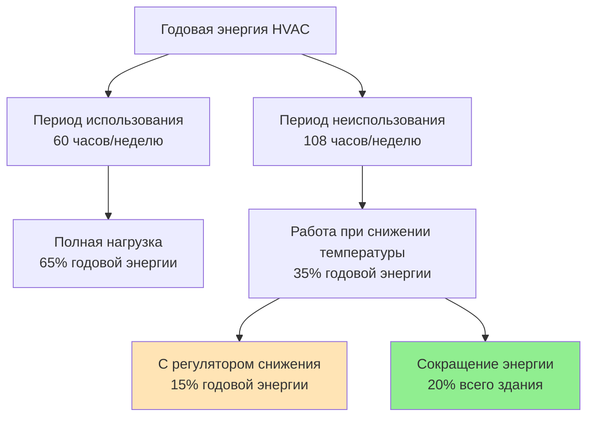

Стратегии снижения температуры при неиспользовании здания являются одной из наиболее экономически эффективных мер по энергосбережению в коммерческих системах HVAC. Путем снижения требований кондиционирования в периоды неиспользования здания можно достичь годовой экономии энергии 30-50%, одновременно сохраняя комфорт занимающихся лиц в рабочее время. ASHRAE 90.1 требует установки автоматических регуляторов снижения температуры для большинства коммерческих приложений, признавая значительные энергетические и финансовые преимущества.

## Механизмы сокращения энергии

Снижение температуры при неиспользовании здания сокращает потребление энергии четырьмя основными способами:

**Снижение перепада температур** - При допуске смещения внутренних температур в сторону внешних условий скорость передачи тепла через оболочку здания пропорционально снижается в зависимости от перепада температур.

**Сокращение времени работы оборудования** - Оборудование HVAC работает реже или полностью отключается в периоды неиспользования, исключая ненужную работу.

**Устранение дополнительных нагрузок** - Вентиляторы, насосы и другое дополнительное оборудование потребляют нулевую энергию при отключении систем, обеспечивая немедленное снижение нагрузки.

**Снижение пиковой нагрузки** - Стратегическое расписание снижения температуры смещает нагрузку от пиковых периодов поставки энергии, что сокращает платежи за спрос, которые могут составлять 30-50% коммерческих счетов за электричество.

## Расчет сокращения энергии на отопление

Сокращение энергии на отопление при ночном снижении температуры зависит от тепловой инерции здания, характеристик оболочки и продолжительности снижения температуры:

$$Q_{saved} = UA \cdot \Delta T_{reduction} \cdot t_{setback} \cdot \eta_{recovery}$$

Где:
- $Q_{saved}$ = Сохраненная энергия в период снижения температуры (кДж)
- $U$ = Общий коэффициент передачи тепла оболочкой здания (кДж/ч·м²·°C)
- $A$ = Площадь оболочки здания (м²)
- $\Delta T_{reduction}$ = Снижение перепада температур (°C)
- $t_{setback}$ = Продолжительность снижения температуры (часов)
- $\eta_{recovery}$ = Коэффициент штрафа восстановления (0,70-0,85)

Коэффициент штрафа восстановления учитывает дополнительную энергию, необходимую для восстановления температуры в периоды использования. Здания с высокой тепловой инерцией (бетон, кирпичная кладка) испытывают более высокие штрафы восстановления, но лучше извлекают выгоду от смещения нагрузки.

## Расчет сокращения энергии на охлаждение

Сокращение энергии при снижении температуры в период охлаждения включает сокращение явной и скрытой нагрузки:

$$E_{cooling} = \frac{Q_{sensible} + Q_{latent}}{COP} \cdot t_{setback} \cdot (1 - f_{runtime})$$

Где:
- $E_{cooling}$ = Сокращение электроэнергии (кВт·ч)
- $Q_{sensible}$ = Сокращение явной нагрузки охлаждения (кДж/ч)
- $Q_{latent}$ = Сокращение скрытой нагрузки (кДж/ч)
- $COP$ = Коэффициент производительности системы
- $t_{setback}$ = Часы без использования в день
- $f_{runtime}$ = Доля времени работы при снижении температуры (0,0-0,2)

Для типичных коммерческих зданий с расписанием использования 12 часов в день снижение температуры при охлаждении в оставшиеся 12 часов сокращает годовую энергию охлаждения на 35-45%.

## Анализ годовой экономии энергии

## Экономия по типам зданий и климатическим зонам

| Тип здания | Климатическая зона | Экономия на отопление | Экономия на охлаждение | Итого годовая экономия |
|---------------|--------------|-----------------|-----------------|---------------------|
| Офис | Жаркий-влажный (2A) | 15-25% | 40-50% | 35-45% |
| Офис | Холодный (6A) | 35-45% | 30-40% | 35-42% |
| Розничная торговля | Смешанный (4A) | 25-35% | 35-45% | 30-40% |
| Школа | Холодный (5A) | 40-50% | 35-45% | 38-48% |
| Складское помещение | Жаркий-сухой (3B) | 20-30% | 30-40% | 28-38% |
| Здравоохранение (не критичное) | Смешанный (4A) | 25-30% | 30-35% | 28-33% |

Процент экономии представляет сокращение потребления энергии HVAC относительно постоянной работы при заданных температурах использования.

## Снижение платежей за спрос

Снижение пиковой нагрузки обеспечивает значительную экономию затрат в коммерческих тарифных структурах:

$$Cost_{demand} = kW_{peak} \cdot Rate_{demand} \cdot 12\text{ месяцев}$$

Стратегическое расписание снижения температуры сокращает пиковую нагрузку на 20-40%, когда периоды неиспользования совпадают с пиковыми окнами поставки энергии (обычно 14:00-19:00 летом). Для системы охлаждения мощностью 3,517 кВ·т:

- Пиковая нагрузка без снижения температуры: 120 кВ
- Пиковая нагрузка со снижением температуры: 75 кВ
- Снижение нагрузки: 45 кВ
- Годовая экономия на платеже за спрос: $45 \text{ кВ} \times $15/\text{кВ} \times 12 = $8 100$

## Оптимизация тарифов в зависимости от времени использования

Тарифы в зависимости от времени использования (TOU) устанавливают разные цены на энергию в зависимости от времени суток. Оптимальные стратегии снижения температуры совмещают минимальное кондиционирование с максимальными тарифами поставщика энергии:

```mermaid
gantt
    title Ежедневная оптимизация энергетических затрат
    dateFormat HH:mm
    axisFormat %H:%M

    section Тариф поставщика
    Низкий (0,08 руб./кВт·ч)    :rate1, 00:00, 7h
    Средний (0,12 руб./кВт·ч)    :rate2, 07:00, 5h
    Высокий (0,24 руб./кВт·ч)     :rate3, 12:00, 7h
    Средний (0,12 руб./кВт·ч)    :rate4, 19:00, 3h
    Низкий (0,08 руб./кВт·ч)    :rate5, 22:00, 2h

    section Работа HVAC
    Глубокое снижение (10% нагрузки)  :hvac1, 00:00, 6h
    Нагрев (80% нагрузки)       :hvac2, 06:00, 2h
    Полная работа (100%)    :hvac3, 08:00, 10h
    Снижение (20% нагрузки)       :hvac4, 18:00, 6h
```

## Анализ рабочих затрат

Годовая экономия на коммунальных услугах объединяет сокращение энергии и платежей за спрос:

| Компонент затрат | Без снижения температуры | Со снижением температуры | Годовая экономия |
|----------------|-----------------|--------------|----------------|
| Энергия (кВт·ч) | 45 000 руб. | 27 000 руб. | 18 000 руб. (40%) |
| Спрос (кВ) | 21 600 руб. | 13 500 руб. | 8 100 руб. (38%) |
| Итого годовая стоимость | 66 600 руб. | 40 500 руб. | 26 100 руб. (39%) |

На основе офисного здания площадью 4645 м², смешанный климат, средний тариф 0,11 руб./кВт·ч, платеж за спрос 15 руб./кВ.

## Требования ASHRAE 90.1

Стандарт ASHRAE 90.1 требует установки автоматических регуляторов снижения температуры для большинства коммерческих систем HVAC:

**Раздел 6.4.3.3 - Регуляторы снижения температуры** требует автоматического снижения температуры или отключения системы в периоды неиспользования для всех систем HVAC, обслуживающих помещения с установленными графиками использования.

**Требования по установке температуры:**
- Снижение при отоплении: ≤13°C или отключение системы
- Повышение при охлаждении: ≥29°C или отключение системы
- Исключения для процессов, требующих постоянного кондиционирования

**Положения о переопределении:**
- Ручное переопределение ограничено максимум 2 часами
- Автоматическое возвращение к режиму снижения температуры после периода переопределения
- Возможность переопределения требуется для временного использования

## Оптимизация времени восстановления

Эффективное восстановление после снижения температуры минимизирует энергетические штрафы, обеспечивая комфорт в периоды использования:

$$t_{recovery} = \frac{C \cdot \Delta T}{Q_{available} - Q_{loss}}$$

Где:
- $t_{recovery}$ = Время восстановления температуры использования (часов)
- $C$ = Тепловая емкость здания (кДж/°C)
- $\Delta T$ = Требуемое изменение температуры (°C)
- $Q_{available}$ = Доступная мощность HVAC (кДж/ч)
- $Q_{loss}$ = Текущие потери оболочкой (кДж/ч)

Алгоритмы оптимального пуска рассчитывают требуемые моменты пуска перед использованием, исходя из текущей внутренней температуры, внешних условий и исторических характеристик восстановления. Это предотвращает чрезмерно ранние пуски, которые расходуют энергию, и запоздалые пуски, которые приводят к снижению комфорта.

## Передовые методы внедрения

**Точность расписания** - Проверьте, что фактические графики использования соответствуют запрограммированным расписаниям. Многие здания работают со снижением температуры на основе устаревших расписаний, упуская дополнительную экономию 10-15%.

**Сезонная корректировка** - Модифицируйте агрессивность снижения температуры в зависимости от сезона. Мягкая погода позволяет более глубокие снижения с более быстрым восстановлением.

**Управление на уровне зон** - Применяйте снижение температуры независимо для зон с разными графиками использования вместо расписания на уровне здания, которое учитывает наибольший период использования.

**Последовательность оборудования** - Отключайте оборудование последовательно при инициировании снижения температуры и запускайте его при восстановлении, чтобы минимизировать скачки нагрузки.

**Мониторинг и проверка** - Отслеживайте время работы, потребление энергии и профили нагрузки, чтобы проверить экономию и определить возможности оптимизации.

Правильно внедренные стратегии снижения температуры при неиспользовании здания обеспечивают немедленную, измеримую экономию энергии с минимальными капитальными вложениями, как правило, достигая простого периода окупаемости менее одного года для модернизационных приложений и значительно способствуя соответствию ASHRAE 90.1 при новом строительстве.
