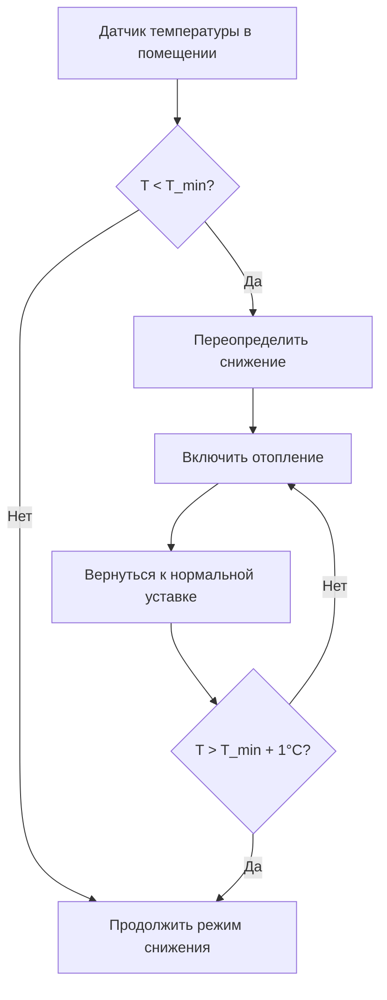
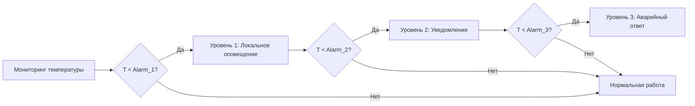

## Обзор

Защита от замерзания — это критически важная функция безопасности в системах управления HVAC неиспользуемых помещений, которая предотвращает повреждение оборудования, разрыв трубопроводов и деградацию ограждающих конструкций здания при работе отопительных систем в режиме снижения температуры. Во время неиспользуемых периодов поддержание минимальных безопасных температур защищает заполненные водой компоненты при максимальной экономии энергии.

## Минимальные уставки температуры

### Пределы температуры в помещении

Минимальная уставка отопления в неиспользуемом помещении должна обеспечивать баланс между защитой от замерзания и энергосбережением. ASHRAE Standard 90.1 разрешает снижение температуры до 13°C для большинства коммерческих приложений, но фактические требования зависят от местных условий.

**Минимальная температура в помещении:**

$$T_{min} = T_{freeze} + \Delta T_{safety}$$

Где:
- $T_{min}$ = минимальная уставка в помещении (°C)
- $T_{freeze}$ = точка замерзания защищаемой жидкости (0°C для воды)
- $\Delta T_{safety}$ = коэффициент безопасности (обычно 5-8°C)

Для систем с водой:

$$T_{min} = 0°C + 7°C = 7°C$$

### Температура защиты трубопроводов

Трубопроводы во внешних стенах, неотапливаемых помещениях или рядом с проходками здания требуют повышенной температуры защиты:

$$T_{pipe,min} = T_{freeze} + \Delta T_{wall} + \Delta T_{safety}$$

Где:
- $\Delta T_{wall}$ = градиент температуры через оболочку стены (3-6°C)

**Типичный минимум: 10°C для систем трубопроводов**

## Стратегии защиты от замерзания

### 1. Управление с ограничением минимальной температуры

Основной уровень защиты, который переопределяет снижение температуры в неиспользуемом помещении, когда температура воздуха приближается к опасным уровням.

**Логика управления:**
- Отопление включено при: $T_{space} < T_{min}$
- Отопление отключено при: $T_{space} > T_{min} + \Delta T_{differential}$
- Типичное дифференцирование: 1-2°C

### 2. Защита фростстатом

Устройство безопасности с непосредственной коммутацией, которое напрямую включает отопительное оборудование независимо от работы системы управления. ASHRAE Guideline 36 рекомендует фростстаты с ручным сбросом, установленные на 2-4°C.

**Требования к установке:**
- Фростстаты лицевой части катушки: 2°C с капиллярной трубкой по самой холодной части катушки
- Фростстаты воздуховодов: 3°C ниже по потоку охлаждающей катушки
- Фростстаты помещения: 4°C в критических зонах

### 3. Мониторинг систем с гликолем

Для систем, использующих растворы гликоля, защита от замерзания переходит от поддержания температуры к проверке концентрации.

**Точка замерзания гликоля:**

$$T_{freeze,glycol} = T_{water} - K \cdot C_{glycol}$$

Где:
- $K$ = константа депрессии (зависит от типа гликоля)
- $C_{glycol}$ = концентрация гликоля (% по объему)

Для этиленгликоля:
- Раствор 30%: точка замерзания -14°C
- Раствор 40%: точка замерзания -23°C
- Раствор 50%: точка замерзания -36°C

## Таблица уставок защиты

| Применение | Минимальная уставка | Точка сигнализации | Уставка фростстата |
|-------------|------------------|-------------|---------------------|
| Внутренние помещения | 13°C | 10°C | 4°C |
| Периметральные зоны | 14°C | 11°C | 4°C |
| Машинные помещения | 10°C | 7°C | 3°C |
| Коридоры с трубопроводами | 10°C | 7°C | 3°C |
| Водяные катушки | Н/П | 4°C | 2°C |
| Системы охлажденной воды | 6°C | 3°C | 2°C |

## Интеграция системы сигнализации

### Многоуровневый ответ сигнализации

**Иерархия сигнализации:**
1. **Предварительная сигнализация (Уровень 1):** $T_{space} < T_{setpoint} + 3°C$ — оповещение системы автоматизации здания
2. **Предупреждение (Уровень 2):** $T_{space} < 10°C$ — уведомление по электронной почте/SMS персоналу служб эксплуатации
3. **Критическое (Уровень 3):** $T_{space} < 7°C$ — аварийное реагирование, переопределение оборудования

### Требования мониторинга

ASHRAE Guideline 36, раздел 5.1.13 определяет требования мониторинга защиты от замерзания:
- Интервал выборки температуры: максимум 5 минут
- Задержка сигнализации: максимум 2 минуты
- Полномочия сброса: требуется переопределение контроллера для сброса фростстата
- Логирование тренда: непрерывное во время условий сигнализации

## Режим ожидания отопительной системы

Во время неиспользуемых периодов отопительное оборудование должно оставаться способным к быстрому ответу на условия замерзания.

**Стратегии режима ожидания:**
- Котел, поддерживающий минимальную температуру (49-60°C)
- Циркуляционные насосы, включаемые при падении температуры
- Резервные источники тепла, готовые к автоматическому включению
- Системы тепловой трассировки для открытых трубопроводов

**Требование времени ответа:**

$$t_{response} = \frac{V_{space} \cdot \rho \cdot c_p \cdot \Delta T}{Q_{heating}}$$

Где:
- $t_{response}$ = время восстановления безопасной температуры (часы)
- $V_{space}$ = объем кондиционируемого помещения (м³)
- $\rho$ = плотность воздуха (1.2 кг/м³)
- $c_p$ = удельная теплоемкость воздуха (1005 Дж/кг·°C)
- $Q_{heating}$ = доступная мощность отопления (кДж/ч)

Для адекватной защиты: $t_{response} < 2 \, часа$

## Предотвращение замерзания трубопроводов

### Системы тепловой трассировки

Саморегулирующийся кабель тепловой трассировки обеспечивает локализованную защиту уязвимых трубопроводов. Плотность мощности снижается по мере повышения температуры трубопровода, предотвращая перегрев.

**Определение размера тепловой трассировки:**

$$W_{trace} = \frac{Q_{loss}}{L_{pipe}} \cdot SF$$

Где:
- $W_{trace}$ = требуемые ватты на линейный метр
- $Q_{loss}$ = потеря тепла из трубопровода (кДж/ч·м)
- $L_{pipe}$ = защищенная длина (м)
- $SF$ = коэффициент безопасности (1.2-1.5)

### Требования к изоляции

Толщина теплоизоляции трубопровода должна учитывать воздействие неотапливаемого пространства. ASHRAE Standard 90.1, таблица 6.8.3, указывает минимальную изоляцию для защиты от замерзания: 25-51 мм для трубопроводов диаметром менее 76 мм в неотапливаемых помещениях.

## Рассмотрения при проектировании системы

**Требования к резервированию:**
- Двойные датчики температуры в критических зонах с логикой голосования
- Независимые фростстаты, отделенные от управления BAS
- Источник аварийного тепла, независимый от основной системы
- Резервное питание для управления и сигнализации (минимум 4 часа)

**Проверка при запуске:**
- Моделирование условий замерзания путем снижения уставок
- Проверка доставки оповещения сигнализации
- Тестирование процедуры ручного сброса фростстата
- Документирование времени ответа и последовательностей переопределения

**Протокол техническое обслуживания:**
- Ежемесячная проверка калибровки датчиков в период отопления
- Годовой тест функциональности фростстата
- Тестирование концентрации гликоля (дважды в год)
- Тестирование непрерывности тепловой трассировки (ежегодно)

## Ссылки на коды и стандарты

- **ASHRAE Standard 90.1:** пределы температуры энергоэффективного снижения
- **ASHRAE Guideline 36:** высокопроизводительные последовательности операций для систем HVAC
- **International Mechanical Code (IMC):** раздел 301.11 требования к защите оборудования
- **ASHRAE Standard 135 (BACnet):** протоколы управления сигнализацией и событиями

Правильная реализация защиты от замерзания обеспечивает безопасность здания во время неиспользуемых периодов при сохранении целей энергоэффективности. многослойный подход, объединяющий последовательности управления, устройства безопасности с непосредственной коммутацией и системы мониторинга, обеспечивает защиту в глубину от повреждений замерзанием.
