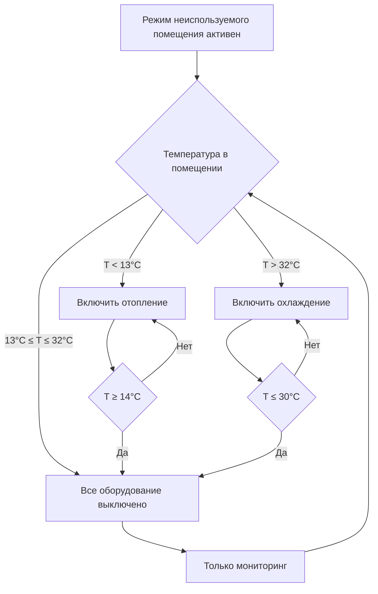
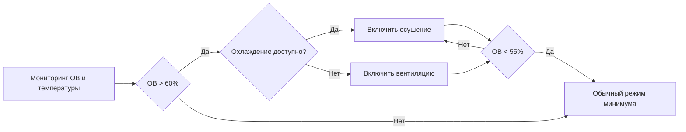

## Обзор

Минимальное кондиционирование представляет собой наиболее агрессивную стратегию энергосбережения в периоды неиспользования помещений, поддерживая только те условия окружающей среды, которые необходимы для защиты систем здания, предотвращения повреждения оборудования и избежания проблем с влажностью. Этот подход максимизирует энергосбережение, позволяя температуре в помещении колебаться в пределах широких мертвых зон, при этом оборудование циклируется только при достижении пределов защиты.

## Принципы работы минимального кондиционирования

Режим минимального кондиционирования основан на принципе, что неиспользуемые помещения могут допускать экстремальные колебания температуры без нарушения целостности здания. Стратегия сосредоточена на трех критических целях защиты:

1. **Защита оборудования**: Предотвращение повреждения чувствительных к температуре систем здания
2. **Защита оболочки здания**: Предотвращение конденсации, замерзания или конструктивного напряжения
3. **Возможность восстановления**: Поддержание достаточной тепловой стабильности для разумного прогрева утром

Широкая мертвая зона температуры между уставками нагрева и охлаждения исключает ненужное циклирование оборудования и позволяет естественному тепловому дрейфу на основе наружных условий и внутренной тепловой массы.

## Стратегия уставок и пределы температуры

### Стандартные уставки минимального кондиционирования

| Условие | Уставка отопления | Уставка охлаждения | Мертвая зона | Применение |
|-----------|------------------|------------------|----------|-------------|
| Зимний климат | 13°C | 32°C | 19°C | Холодные климаты, хорошо изолированные здания |
| Умеренный климат | 14°C | 31°C | 17°C | Смешанные климаты, стандартная конструкция |
| Проблемы влажности | 16°C | 29°C | 14°C | Высокая влажность, оборудование чувствительное к влаге |
| С большим количеством оборудования | 17°C | 28°C | 11°C | Серверные комнаты, лаборатории (вне рабочего времени) |

### Экстремальные пределы уставок снижения температуры

**Порог защиты отопления**: Минимальная уставка отопления предотвращает:
- Замерзание труб в периферийных зонах
- Конденсацию на холодных поверхностях
- Повреждение оборудования из-за низких температур
- Чрезмерное время восстановления утром

**Порог защиты охлаждения**: Максимальная уставка охлаждения предотвращает:
- Перегрев электронного оборудования
- Высокую влажность и риск конденсации
- Деградацию материалов от чрезмерного тепла
- Дискомфорт занятых при входе в здание

## Стратегия циклирования оборудования

### Логика управления минимальным временем работы

### Ступенчатое управление и дифференциальное управление

Система управления реализует гистерезис для предотвращения коротких циклов:

**Цикл отопления**:
- Начало отопления: 13°C
- Остановка отопления: 14°C (дифференциал 1°C)
- Минимальное время работы: 10 минут

**Цикл охлаждения**:
- Начало охлаждения: 32°C
- Остановка охлаждения: 30°C (дифференциал 2°C)
- Минимальное время работы: 15 минут

Этот дифференциал гарантирует, что оборудование работает в течение значимых периодов при активации, снижая износ от частых запусков, сохраняя при этом пределы защиты.

## Расчеты энергосбережения

### Сокращение энергии отопления

Энергосбережение отопления от минимального кондиционирования в сравнении с уставками занятых помещений можно оценить с помощью:

$$Q_{saved} = UA \cdot \Delta T_{sb} \cdot t_{unocc}$$

Где:
- $Q_{saved}$ = сэкономленная энергия (кДж или кВт·ч)
- $U$ = общий коэффициент теплопередачи (кДж/ч·м²·°C)
- $A$ = площадь оболочки здания (м²)
- $\Delta T_{sb}$ = разница в уставке снижения температуры (°C)
- $t_{unocc}$ = длительность неиспользования (часы)

### Процент энергосбережения

Для сезона отопления дробное экономия может быть приблизительно рассчитано как:

$$\text{Сбережения} = \left(1 - \frac{T_{indoor,sb} - T_{outdoor}}{T_{indoor,occ} - T_{outdoor}}\right) \times \frac{t_{unocc}}{t_{total}}$$

Где:
- $T_{indoor,sb}$ = уставка отопления при снижении (13°C)
- $T_{indoor,occ}$ = уставка отопления при занятости (21°C)
- $T_{outdoor}$ = средняя наружная температура в период неиспользования
- $t_{unocc}$ = доля неиспользования в неделю

**Пример расчета**:
- Уставка при занятости: 21°C
- Уставка при снижении: 13°C
- Средняя наружная температура: -1°C
- Доля неиспользования: 60% недели

$$\text{Сбережения} = \left(1 - \frac{13 - (-1)}{21 - (-1)}\right) \times 0.60 = \left(1 - \frac{14}{22}\right) \times 0.60 = 0.364 \times 0.60 = 21.8\%$$

Этот пример демонстрирует 21,8% сокращение энергии отопления от снижения уставки минимального кондиционирования.

## Управление влажностью и конденсацией

### Требования к мониторингу влажности

Минимальное кондиционирование должно включать мониторинг влажности для предотвращения:
- Поверхностной конденсации на холодных поверхностях
- Роста плесени от продолжительной высокой влажности
- Повреждения материалов в помещениях, чувствительных к влаге

**Критические пороги влажности**:
- Максимальная относительная влажность: 65% ОВ
- Сигнал тревоги точки росы: 15°C
- Температура риска конденсации: 13°C температура поверхности

### Логика предотвращения конденсации

Когда относительная влажность превышает 60%, система должна обеспечивать осушение даже если температура в помещении остается в пределах мертвой зоны минимального кондиционирования. Это переопределение защищает строительные материалы и оборудование от повреждения влагой.

## Соответствие ASHRAE 90.1

### Требования энергетического стандарта

ASHRAE 90.1 Раздел 6.4.3.3 устанавливает требования к автоматическим органам управления снижением:

**Обязательные положения**:
- Автоматический сброс температуры в период неиспользования
- Снижение до 13°C отопления или повышение до 32°C охлаждения
- Возможность переопределения для временной занятости
- Автоматическое возврат к уставкам занятости перед запланированной занятостью

**Управление на уровне зоны**: Каждая зона должна иметь независимую возможность снижения, если не обоснована конструкцией системы.

### Исключительные условия

Минимальное кондиционирование может быть неуместным для:
- Помещений с непрерывными процессами, требующими стабильных температур
- Областей с чувствительным к температуре оборудованием или материалами
- Помещений, требующих положительного избыточного давления для контроля загрязнения
- Зон, где время восстановления превышало бы период перед занятостью

## Рассмотрения при реализации

### Подготовка к восстановлению утром

Система управления зданием должна инициировать восстановление из режима минимального кондиционирования на основе:

$$t_{recovery} = \frac{C \cdot m \cdot \Delta T}{Q_{capacity}}$$

Где:
- $t_{recovery}$ = требуемое время восстановления (часы)
- $C$ = удельная теплоемкость воздуха (1,005 кДж/кг·°C)
- $m$ = масса воздуха или эффективная тепловая масса здания
- $\Delta T$ = разница температур для преодоления
- $Q_{capacity}$ = доступная мощность отопления/охлаждения

**Типичные скорости восстановления**:
- Легкая конструкция: 1,1–2,2°C в час
- Средняя тепловая масса: 0,8–1,7°C в час
- Тяжелая тепловая масса: 0,6–1,1°C в час

### Функции защиты оборудования

**Защита компрессора**: При включении охлаждения из режима минимума реализовать:
- Проверка нагревателя картера перед запуском
- Минимальное время отключения 5 минут между циклами
- Ступенчатый запуск для нескольких компрессоров

**Защита котла/печи**: При включении отопления из режима минимума:
- Завершение цикла продувки перед зажиганием
- Проверка верхнего предела температуры
- Постепенное увеличение мощности для предотвращения теплового удара

## Мониторинг производительности

### Ключевые показатели производительности

Отслеживайте эти метрики для проверки эффективности минимального кондиционирования:

| Метрика | Целевое значение | Действие при превышении |
|--------|--------|-------------------|
| Среднее время работы в неиспользуемом режиме | < 15% часов неиспользования | Проверить пределы уставок |
| Выходы температуры за пределы | < 5% показаний за пределами | Проверить калибровку датчика |
| Отказы восстановления утром | 0 в месяц | Отрегулировать время начала восстановления |
| Выходы влажности за пределы | < 2% показаний > 65% ОВ | Включить переопределение осушения |

### Сравнение с энергетическим базовым уровнем

Установите исходное потребление энергии и сравнивайте ежемесячно:
- Общая энергия отопления в неиспользуемые часы
- Общая энергия охлаждения в неиспользуемые часы
- Часы работы оборудования
- Пиковый спрос в периоды восстановления

Минимальное кондиционирование должно сократить энергию HVAC в неиспользуемом режиме на 20–35% по сравнению со стандартными стратегиями снижения в большинстве климатов.

## Заключение

Минимальное кондиционирование обеспечивает максимальное энергосбережение в периоды неиспользования, сохраняя при этом необходимую защиту здания. Успех требует правильного выбора уставок, надежного мониторинга влажности, интеллектуальной логики циклирования оборудования и достаточной емкости восстановления утром. При реализации в соответствии с требованиями ASHRAE 90.1 и ограничениями, специфичными для здания, минимальное кондиционирование обеспечивает существенное снижение операционных затрат без компромисса с целостностью здания или комфортом занятых при возврате.
