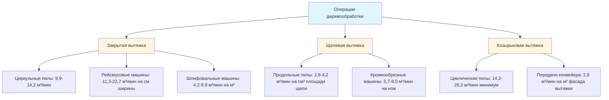
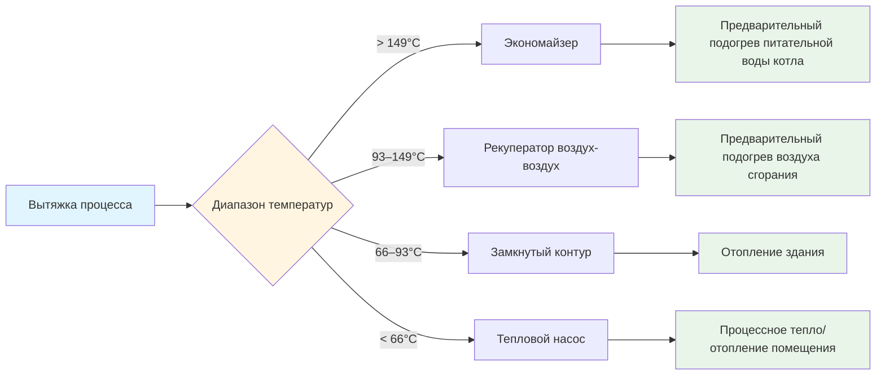
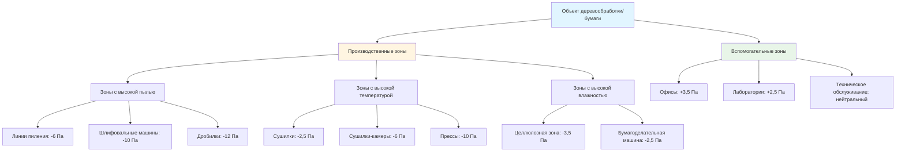

# Системы HVAC для объектов деревообработки и целлюлозно-бумажной промышленности

Объекты деревообработки и производства бумаги создают сложные требования к HVAC, характеризующиеся высокой нагрузкой твердых частиц (10–50 гран/м³ в зонах пиления), повышенными температурами процесса (82–204°C в сушилках и сушилках-камерах), экстремальными колебаниями влажности (20–90% ОВ во всех производственных зонах) и значительным выделением тепла от механического оборудования. Эффективные системы вентиляции должны захватывать древесную пыль у источника (скорости захвата 0,5–1,0 м/с), управлять рисками конденсации в зонах целлюлозного производства с высокой влажностью, интегрироваться с системами утилизации процессного тепла и поддерживать комфорт рабочих в условиях, когда производственное оборудование выделяет 5–20 кВ тепловой энергии на м² поверхности. Проектирование системы следует требованиям NFPA 664 по контролю горючей древесной пыли, руководящим принципам промышленной вентиляции ACGIH для локального вытяжного воздуха и стандартам ASHRAE по управлению тепловой средой в производственных помещениях.

## Основы контроля твердых частиц

### Характеристики образования древесной пыли

Операции пиления, строгания, шлифовки и обработки материалов генерируют взвешенные частицы древесины, охватывающие три порядка величины в распределении по размерам:

**Классификация размера частиц:**

| Источник операции | Диапазон размера частиц | Концентрация | Скорость осаждения |
|------------------|------------------------|--------------|-------------------|
| Циркульные пилы | 10–100 мкм (крупные) | 20–100 мг/м³ | 0,3–9 м/мин |
| Рейсмусовая/фуговальная машина | 20–200 мкм (стружка/опилки) | 50–200 мг/м³ | 1,5–15 м/мин |
| Ленточные шлифовальные машины | 1–50 мкм (тонкая пыль) | 10–80 мг/м³ | 0,03–1,5 м/мин |
| Пневматическая доставка | 50–500 мкм (фрагменты) | 100–500 мг/м³ | 3–30 м/мин |

**Риски для здоровья и взрывоопасность:**

Воздействие древесной пыли представляет как хронические риски для здоровья, так и острые опасности взрыва. Предельно допустимая концентрация (ПДК) OSHA для древесной пыли: 5 мг/м³ (время-взвешенное среднее за 8 часов) для западного красного кедра; 15 мг/м³ для хвойных пород и большинства твердых пород. Респируемые частицы (< 10 мкм) глубоко проникают в легкие, вызывая респираторную сенсибилизацию и повышенный риск рака.

**Минимальная взрывчатая концентрация (МВК) для распространенных пород:**
- Сосна, дугласия: 40–50 г/м³
- Дуб, клён и другие твердые породы: 35–45 г/м³
- Фанера, ДСП пыль: 30–40 г/м³

Взрывчатость облака пыли требует концентрации суспензии между МВК и верхним пределом взрывчатости (обычно 2–4 кг/м³), плюс источник зажигания, превышающий минимальную энергию зажигания (10–40 мДж для древесной пыли). NFPA 664 предписывает поддерживать накопление пыли ниже глубины 0,8 мм на 5% площади поверхности для предотвращения вторичных взрывов от переуплотненного осевшего материала во время первичной дефлаграции.

### Проектирование локальной вытяжной вентиляции

Захват частиц древесины в точке их образования до рассеивания в общую рабочую среду:

**Требования по скорости захвата вытяжки:**

$$V_{захват} = V_x \left(1 + \frac{X^2}{A}\right)$$

Где:
- $V_{захват}$ = Скорость по оси в точке образования частиц (м/мин)
- $V_x$ = Скорость у отверстия вытяжки (м/мин)
- $X$ = Расстояние от фасада вытяжки к источнику (м)
- $A$ = Площадь отверстия вытяжки (м²)

**Рекомендуемые скорости захвата ACGIH:**

| Условие | Скорость захвата |
|---------|-----------------|
| Выделение без начальной скорости (падение пыли шлифовки) | 0,25–0,5 м/с |
| Выделение с низкой скоростью (выпуск рейсмусовой машины) | 0,5–1,0 м/с |
| Выделение с высокой скоростью (выпуск пилы) | 1,0–2,5 м/с |
| Выделение с очень быстрым движением (передача конвейера) | 2,5–5,0 м/с |

**Типы вытяжек и применение:**

**Скорость транспортировки в воздуховоде:**

Поддерживайте достаточную скорость для предотвращения осаждения и накопления частиц:

**Минимальные скорости транспортировки (ACGIH):**
- Крупная стружка, топливная щепа: 20–23 м/с
- Опилки, пыль шлифовки: 18–20 м/с
- Тонкая пыль шлифовки: 15–18 м/с
- Опилки, общего назначения: 18–20 м/с

**Расчет потерь давления:**

$$\Delta P_{воздуховод} = f \times \frac{L}{D} \times \frac{\rho V^2}{2} + K \times \frac{\rho V^2}{2}$$

Где:
- $\Delta P_{воздуховод}$ = Потеря давления (Па)
- $f$ = Коэффициент трения (0,02–0,03 для воздуха с пылью)
- $L$ = Длина воздуховода (м)
- $D$ = Диаметр воздуховода (м)
- $\rho$ = Плотность воздуха (кг/м³)
- $V$ = Скорость (м/с)
- $K$ = Коэффициент потерь для фитингов

Для систем древесной пыли добавьте коэффициент безопасности 10–20% выше расчетных потерь для учета частичных закупориваний и шероховатости поверхности из-за осаждения частиц.

## Вентиляция процесса при высоких температурах

### Системы вытяжки сушилки и сушилки-камеры

Сушилки пиломатериалов, сушилки шпона и зоны прессования ДСП генерируют значительное явное и скрытое тепло, требующее выделенной вытяжки:

**Традиционная вентиляция сушилки пиломатериалов:**

Работает при 43–82°C и 40–90% ОВ на различных этапах сушки. Вентиляция служит двум функциям:
1. **Удаление влаги:** Вытяжка влажного воздуха для снижения влажностной нагрузки
2. **Контроль температуры:** Предотвращение перегрева во время фаз впрыска пара

**Расчет расхода вытяжки:**

$$Q_{вытяжка} = \frac{\dot{m}_{вода} \times 60}{\rho_{воздух} \times (W_{вход} - W_{выход})}$$

Где:
- $Q_{вытяжка}$ = Расход вытяжного воздуха (м³/мин)
- $\dot{m}_{вода}$ = Скорость удаления влаги (кг/мин)
- $\rho_{воздух}$ = Плотность воздуха в условиях сушилки (кг/м³)
- $W_{вход}$ = Влагосодержание воздуха сушилки (кг водяного пара/кг сухого воздуха)
- $W_{выход}$ = Влагосодержание наружного воздуха (кг водяного пара/кг сухого воздуха)

**Пример: сушилка на 5,66 м³ пиломатериалов, сушка досок толщиной 28 мм с влажности 30% до 8% за 10 дней:**

Удаление влаги:
- Масса пиломатериалов (абсолютно сухая основа): 5,66 м³ × 400 кг/м³ = 2,265 т
- Начальная влага: 2,265 т × 0,30 = 680 кг
- Финальная влага: 2,265 т × 0,08 = 181 кг
- Общее удаление: 499 кг за 240 часов = 2,08 кг/ч = 0,0347 кг/мин

При условиях середины программы (54°C, 60% ОВ):
- W_вход = 0,008 кг/кг (из психрометрической диаграммы)
- W_выход = 0,002 кг/кг (при условии 4°C на улице, 80% ОВ)
- ρ_воздух = 1,1 кг/м³ при 54°C

$$Q_{вытяжка} = \frac{0,0347 \times 60}{1,1 \times (0,008 - 0,002)} = 31,4 \text{ м³/мин}$$

**Фактическое проектирование:** Используйте 37–43 м³/мин для обеспечения запаса и учета пиковых скоростей удаления влаги на начальном этапе сушки.

### Вентиляция пресса для фанеры и ориентированно-стружечной плиты

Горячее прессование выделяет пар, летучие органические соединения и формальдегид из реакций отверждения смолы при температурах пресса 138–204°C:

**Выделение загрязняющих веществ:**
- Выпуск пара: 5–15% массы панели (из испарения влаги древесины)
- ЛОС (терпены, альдегиды): 0,1–0,5% массы панели
- Формальдегид: 0,01–0,05% массы панели (фенолформальдегидные смолы)

**Проектирование вытяжной вытяжки пресса:**

Захват летучих веществ немедленно при открытии пресса (пиковый выпуск в течение первых 10–30 секунд):

**Требования вытяжки:**
- Тип: Закрывающая вытяжка с вертикальными щелями по сторонам пресса
- Скорость фасада: 0,75–1,25 м/с при полностью открытой позиции пресса
- Скорость захвата: 1,7–3,4 м³/мин на м² площади прессующего плиты
- Температура: 93–149°C у фасада вытяжки во время работы пресса

**Пример: прессующий плита размером 1,2 × 2,4 м:**
- Площадь плиты: 2,88 м²
- Расход вытяжки: 2,88 м² × 1,7 м³/мин/м² = 4,89 м³/мин минимум
- Проектирование: 8,5 м³/мин для обеспечения запаса безопасности

**Интеграция термического окислителя:**

Разрушение ЛОС и формальдегида требует термического или каталитического окисления:
- Рабочая температура: 760–871°C (термический); 316–482°C (каталитический)
- Время пребывания: 0,5–1,0 секунды
- Эффективность разрушения: > 98% для ЛОС, > 95% для формальдегида

## Интеграция процесса и утилизация отходящего тепла

### Использование отходящего тепла

Объекты деревообработки генерируют значительное отходящее тепло от механических операций и оборудования процесса:

**Источники выделения тепла:**

| Оборудование | Выделение тепла | Температура | Потенциал утилизации |
|-----------|-----------------|------------|---------------------|
| Двигатели дробилки | 0,68 кВ на кВт | 66–93°C | Низкий (рассеянный) |
| Вытяжка сушилки | 5,7–14,2 кВ | 43–82°C | Средний-Высокий |
| Вытяжка сушилки | 142–568 кВ | 93–204°C | Высокий |
| Вытяжка пресса | 28–142 кВ | 121–177°C | Высокий |
| Дымовой газ котла | 0,28–1,42 МВ | 149–260°C | Средний |

**Методы утилизации тепла:**

**Применение экономайзера для вытяжки сушилки:**

Предварительный подогрев питательной воды котла с использованием вытяжки сушилки температурой 149–204°C:

**Расчет утилизированного тепла:**

$$Q_{утилизир} = \dot{m}_{вытяжка} \times c_p \times (T_{вход} - T_{выход}) \times \eta_{РВ}$$

Где:
- $Q_{утилизир}$ = Утилизированное тепло (кВ)
- $\dot{m}_{вытяжка}$ = Массовый расход вытяжки (кг/ч)
- $c_p$ = Удельная теплоёмкость воздуха (1,005 кДж/кг·°C)
- $T_{вход}$ = Температура входа (°C)
- $T_{выход}$ = Температура выхода (°C)
- $\eta_{РВ}$ = Эффективность рекуператора (0,60–0,75)

**Пример: вытяжка сушилки шпона при 177°C, 47,2 м³/мин:**

Массовый расход: 47,2 м³/мин × 60 мин/ч × 0,97 кг/м³ = 2,743 т/ч

Охлаждение до 93°C (минимум для предотвращения конденсации):
$$Q_{утилизир} = 2,743 \times 1,005 \times (177 - 93) \times 0,70 = 144 \text{ кВ}$$

При стоимости природного газа $9,40/ГДж и КПД котла 80%:
Годовая экономия = 0,144 ГДж/ч × 4,320 ч/год × $9,40/ГДж ÷ 0,80 = $7,618/год

**Анализ окупаемости:** Капитальная стоимость рекуператора $18,000–30,000; простой период возврата 2–4 года.

### Рекуперация тепла воздух-воздух для приточного воздуха

Объекты деревообработки требуют значительного приточного воздуха (1,4–14,2 м³/с) для замены вытяжки из сборки пыли и процессной вентиляции:

**Системы замкнутого контура:**

Раствор гликоля циркулирует между рекуператорами вытяжного и приточного воздуха:
- Рекуператор вытяжки: Захватывает явное тепло из вытяжки здания
- Рекуператор приточки: Предварительный подогрев наружного приточного воздуха
- Насос: Циркулирует гликоль (0,2–0,3 л/мин на 0,28 м³/мин)
- Эффективность: 45–65% утилизации явного тепла

**Экономия тепла зимой:**

Проектирование наружного воздуха: -18°C, установка подачи: 18°C

Без утилизации: $\Delta T$ = 36°C
При утилизации (55% эффективность): $T_{предогрев}$ = -18 + (21 – (-18)) × 0,55 = 3°C
Оставшийся $\Delta T$ = 18 – 3 = 15°C

**Снижение тепловой нагрузки:**
$$\frac{15}{36} = 0,417 \text{ или } 58,3\% \text{ экономия}$$

Для установки с приточным воздухом 9,4 м³/с:
$$Q_{сбережение} = 9,4 \times 1,20 \times 36 \times 0,583 = 237 \text{ кВ}$$

Годовая экономия затрат на отопление (6-месячный сезон отопления, 50% средняя нагрузка):
237 кВ × 15,552 ч × $9,40/ГДж ÷ 0,80 = $43,180/год

## Стратегии управления влажностью

### Вентиляция бумагоделательной машины

Бумагоделательные машины выделяют пар из сушки влажного полотна, создавая экстремальные условия влажности:

**Скорость выделения пара:**

$$\dot{m}_{пар} = \dot{m}_{бумага} \times (MC_{влаж} - MC_{сух})$$

Где:
- $\dot{m}_{пар}$ = Скорость выделения пара (кг/ч)
- $\dot{m}_{бумага}$ = Производительность по бумаге (т/сутки, на абсолютно сухой основе)
- $MC_{влаж}$ = Влажность на влажном конце (60–70%)
- $MC_{сух}$ = Влажность на сухом конце (4–8%)

**Пример: бумагоделательная машина производительностью 90 т/сутки:**

Производительность: 90 т/сутки ÷ 24 ч = 3,75 т/ч = 3,750 кг/ч (на абсолютно сухой основе)

Удаление влаги: 3,750 кг/ч × (0,65 – 0,06) = 2,213 кг/ч пара

**Требование вентиляции:**

Поддерживайте зону машины при 27°C, максимум 60% ОВ:

Из психрометрической диаграммы при 27°C:
- 60% ОВ: W = 0,0133 кг/кг
- 50% ОВ: W = 0,0111 кг/кг (целевой)
- 4°C на улице: W = 0,0035 кг/кг (зима)

$$Q_{вентиляция} = \frac{\dot{m}_{пар}}{\rho_{воздух} \times (W_{пространство} - W_{уличный})}$$

$$Q_{вентиляция} = \frac{2,213}{1,2 \times (0,0111 - 0,0035)} = 211 \text{ м³/мин}$$

**Фактическое проектирование:** Зонируйте вытяжку в секциях сушилки (наибольшее выделение влаги) с более низкими скоростями общей вентиляции. Типично: 6–10 воздухообменов в час в зонах сушилки; 1,5–2,0 ВОЧ в общей зоне машины.

### Предотвращение конденсации

Зоны с высокой влажностью процесса, прилегающие к холодным наружным стенам, создают риск конденсации:

**Расчет точки росы:**

При 27°C, 70% ОВ: Точка росы = 20°C

Температура внутренней поверхности теплоизолированной стены:
$$T_{поверхность} = T_{внутри} - \frac{T_{внутри} - T_{снаружи}}{R_{полная}} \times R_{внутри}$$

Для стены с R = 3,4 м²·°C/Вт при -18°C на улице, 27°C внутри:
$$T_{поверхность} = 27 - \frac{27 - (-18)}{3,4} \times 0,12 = 25°C$$

**Результат:** Без конденсации (поверхность выше точки росы).

**Для неизолированной бетонной стены (R = 0,18):**
$$T_{поверхность} = 27 - \frac{27 - (-18)}{0,18} \times 0,12 = -3°C$$

**Результат:** Сильная конденсация и ледообразование.

**Стратегии смягчения:**
1. **Теплоизоляция:** Минимум R = 2,3 м²·°C/Вт стены, R = 4,4 м²·°C/Вт кровля в зонах процесса с высокой влажностью
2. **Пароизоляция:** Барьеры на внутренней стороне предотвращают миграцию влаги в полости стен
3. **Дестратификация:** Потолочные вентиляторы предотвращают накопление теплого влажного воздуха под потолком
4. **Локальная вытяжка:** Захват влаги у источника до общего увлажнения помещения

## Конфигурация системы и зонирование

### Многозонная компоновка объекта

Объекты деревообработки и производства бумаги требуют разделенных на HVAC зон на основе характеристик процесса:

**Соотношения давлений:**

Поддерживайте отрицательное давление в производственных зонах относительно вспомогательных помещений предотвращает миграцию пыли и запахов:
- Производственные зоны с высокой пылью: -6 до -12 Па относительно наружного воздуха
- Зоны с высокой температурой/влажностью: -2,5 до -6 Па
- Коридоры и циркуляция: -1,25 до +1,25 Па (буферная зона)
- Офисы и помещения управления: +2,5 до +6 Па (положительное давление)

**Каскадный поток воздуха:** Чистый → Умеренно загрязненный → Загрязненный обеспечивает движение загрязнения к точкам вытяжки.

### Интеграция центральной системы сборки пыли

Центральные системы сборки пыли обслуживают несколько машин через сеть воздуховодов:

**Расчет размера сборщика:**

Общий расход = Сумма требований подключенного оборудования × Коэффициент одновременности

Коэффициент одновременности учитывает неодновременную работу:
- Малые мастерские (< 10 машин): 0,8–1,0 (ограниченная одновременность)
- Средние объекты (10–30 машин): 0,6–0,8
- Крупные заводы (> 30 машин): 0,5–0,7

**Выбор сборщика:**

| Тип сборщика | Эффективность | Потеря давления | Применение |
|-----------|------------|-----------------|-----------|
| Циклон | 85–95% (> 10 мкм) | 250–600 Па | Предварительная очистка, крупная стружка |
| Фильтр ткани (рукавный фильтр) | 99,5–99,9% (> 1 мкм) | 400–800 Па | Финальная фильтрация, тонкая пыль |
| Картридж | 99–99,9% (> 1 мкм) | 300–600 Па | Компактные установки |

**Параметры проектирования рукавного фильтра для древесной пыли:**
- Соотношение воздух-ткань: 2,5–4,0 м³/(мин·м²) (зависит от размера частиц, влажности)
- Фильтрующий материал: Полиэстер (стандартный); огнестойкий для операций, выделяющих искры
- Метод очистки: Импульсная обратная тяга (8–12 импульсов/минуту за ряд)
- Проектирование корпуса: Минимум 60° уклон, ротационный затвор на выпуске

**Защита от пожара:**

Требования NFPA 664 для сборщиков пыли:
- Обнаружение искр у входа воздуховода (инфракрасные датчики, отклик 50–100 мс)
- Автоматическое водяное пожаротушение (срабатывает при обнаружении искры)
- Вентиляция взрыва (площадь вентиляции по расчетам NFPA 68)
- Затворы прерывания (отводят загрязненный воздух в безопасное место)
- Изоляция дефлаграции (быстродействующие клапаны предотвращают распространение пламени)

---

*Системы HVAC для объектов деревообработки и целлюлозно-бумажной промышленности решают уникальные проблемы высоких нагрузок твердых частиц, повышенных температур процесса и экстремальных условий влажности благодаря специализированной локальной вытяжной вентиляции, интегрированной утилизации тепла и многозонным стратегиям создания давления, которые защищают здоровье рабочих, предотвращают опасности горючей пыли и поддерживают требования процесса, одновременно минимизируя потребление энергии в этих энергоемких производственных операциях.*
