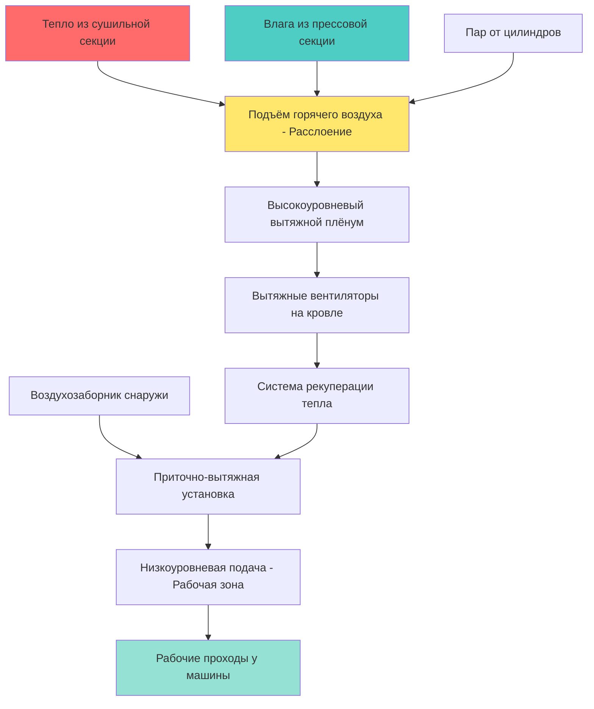

# Системы HVAC для цехов с бумагоделательными машинами

Цехи с бумагоделательными машинами создают уникальные и сложные задачи для HVAC из-за экстремальных тепловых нагрузок, высокого выделения влаги и необходимости точного управления окружающей средой на различных участках бумагоделательной машины. Система HVAC должна управлять тепловыми условиями, колеблющимися от окружающей температуры до более 93°C, при этом обеспечивая комфорт рабочих и стабильность процесса.

## Характеристики тепловых нагрузок

Бумагоделательные машины генерируют огромные тепловые нагрузки из множественных источников, требующих осторожного управления:

**Основные источники тепла:**
- Сушильные цилиндры, работающие при температурах поверхности 149–176°C
- Системы конденсации пара, выделяющие скрытое тепло
- Электродвигатели и гидравлические системы, рассеивающие механическую энергию
- Технологическое освещение и электрооборудование
- Солнечное излучение через обширные площади кровли

Интенсивность тепловой нагрузки резко варьируется по длине машины:

| Участок машины | Тепловой поток | Выделение влаги |
|---|---|---|
| Формирующая секция | 57–114 Вт/м² | Умеренное |
| Прессовая секция | 171–284 Вт/м² | Высокое |
| Сушильная секция | 908–1705 Вт/м² | Очень высокое |
| Каландровая секция | 114–227 Вт/м² | Низкое |
| Намоточная секция | 57–114 Вт/м² | Минимальное |

Сушильная секция представляет наиболее сложную тепловую среду с сосредоточенным выделением тепла, требующим специальных стратегий вентиляции.

## Проектирование системы вентиляции

### Подход со стратифицированной вентиляцией

Цехи с бумагоделательными машинами выигрывают от стратифицированной вентиляции, которая использует естественное тепловое расслоение вместо борьбы с ним:

### Стратегия зонированной вентиляции

Различные участки машины требуют подходящих стратегий вентиляции:

**Формирующая секция:**
- Приточный воздух при 16–21°C для комфорта оператора
- Общая вытяжка для удаления брызг воды из отливного сита
- Отрицательное давление относительно смежных помещений
- 4–6 воздухообменов в час

**Прессовая секция:**
- Усиленная вытяжка над зонами прессования
- Вытяжные колпаки для улавливания паров пара
- Умеренное охлаждение для гидравлических систем
- 6–8 воздухообменов в час

**Сушильная секция:**
- Высокопроизводительная вытяжка непосредственно над участками цилиндров
- Системы кармановой вентиляции для пространств между цилиндрами
- Приточный воздух, подаваемый на позиции операторов машины
- 15–25 воздухообменов в час в зонах теплового факела

**Каландра и намотка:**
- Общая вентиляция для охлаждения оборудования
- Локальная вытяжка для контроля пыли у намоточных устройств
- Умеренная подача воздуха для комфорта
- 4–6 воздухообменов в час

## Системы извлечения влаги

Бумагоделательные машины испаряют 1–3 т воды на тонну производимой бумаги, требуя прочных систем удаления влаги:

### Карманная вентиляция

Наиболее критичная система управления влажностью удаляет влажный воздух из пространств между сушильными цилиндрами:

**Параметры проектирования карманной вентиляции:**
- Температура вытяжного воздуха: 82–104°C
- Относительная влажность: 80–95%
- Скорость воздуха: 10.2–20.3 м/с у входа колпака
- Общая вытяжка: 7.1–14.2 м³/с на сушильную секцию

### Системы колпаков

Вытяжные колпаки улавливают пар и тепло у источника:

- **Балдахинные колпаки:** Над сушильными участками, рассчитаны на 0.9–1.8 м за пределы оборудования
- **Щелевые колпаки:** По рядам цилиндров с непрерывными щелевыми отверстиями
- **Нисходящие колпаки:** Для зон кондиционирования сукна
- **Паровые кожухи:** Полные или частичные кожухи для прессовых участков

## Системы распределения воздуха

### Стратегия приточного воздуха

Приточный воздух должен достигать рабочие зоны без чрезмерного нагрева:

**Низкоуровневая подача:**
- Диффузоры на полу или низкие настенные диффузоры
- Температура подачи 18–24°C летом
- Высокие скорости выброса (7.6–12.7 м/с) для проникновения через тепловые факелы
- Направлен к позициям операторов и проходам

**Точечное охлаждение:**
- Портативные или стационарные испарительные охладители у позиций операторов
- Радиационные охлаждающие панели над критичными рабочими местами
- Станции личного охлаждения с высокоскоростными вентиляторами
- Охлаждающие жилеты для рабочих в зонах экстремального тепла

### Сбор вытяжного воздуха

**Высокоуровневая вытяжка:**
- Непрерывные щелевые или решётчатые системы в конструкции потолка/кровли
- Расположены непосредственно над источниками тепла
- Рассчитаны на температуру вытяжного воздуха 49–82°C
- Естественная тяга, дополняемая механической вытяжкой

**Системы кровельных мониторов:**
- Непрерывные кровельные мониторы, идущие вдоль всей длины машины
- Естественная вентиляция в мягкую погоду
- Механическая вытяжка при пиковых нагрузках
- Интеграция с требованиями удаления дыма

## Возможности рекуперации энергии

Огромные объёмы воздуха и высокие температуры вытяжного воздуха создают значительный потенциал рекуперации энергии:

**Технологии рекуперации тепла:**

| Тип системы | Диапазон температур | Эффективность | Применение |
|---|---|---|---|
| Циркуляционные петли | 60–104°C | 50–60% | Карманная вентиляция |
| Пластинчатый теплообменник воздух-воздух | 49–93°C | 60–75% | Общая вытяжка |
| Тепловые трубки | 66–104°C | 55–70% | Высокотемпературные зоны |
| Ротационные теплообменники | 38–82°C | 70–80% | Умеренные температуры |

**Применение рекуперированного тепла:**
- Предварительный нагрев поступающего воздуха горения
- Обогрев помещений в холодную погоду
- Предварительный нагрев технологической воды
- Отопление смежных зданий

## Стратегии управления

Современная вентиляция бумагоделательных машин использует сложные системы управления:

**Управление переменным объёмом:**
- Приточные и вытяжные вентиляторы модулируют в зависимости от температуры зон
- Минимальные скорости вентиляции поддерживаются в соответствии с нормативными требованиями
- Сезонная оптимизация баланса подачи/вытяжки

**Температурное управление последовательностью:**
- Прогрессивная активация вытяжной мощности при увеличении тепловых нагрузок
- Объём приточного воздуха отслеживает вытяжку для поддержания незначительного отрицательного давления
- Интеграция со скоростью машины для адаптации к нагрузке

**Управление давлением:**
- Давление в здании поддерживается на уровне 7.5–20 Па в отрицательном диапазоне
- Предотвращает миграцию влаги в смежные помещения
- Снижает инфильтрационные тепловые нагрузки

## Проектные соображения

**Интеграция со строительной конструкцией:**
- Согласование воздуховодов с подвесными кранами и конвейерами
- Системы поддержки должны учитывать расширение при высокой температуре
- Доступность для обслуживания в загруженных помещениях

**Выбор материалов:**
- Нержавеющая сталь или защищённая углеродистая сталь для высокологих областей
- Системы изоляции, рассчитанные на минимум 121°C
- Коррозионностойкие крепежи и подвески

**Защита от пожара:**
- Противопожарные заслонки согласно NFPA 90A на противопожарных барьерах
- Обнаружение дыма, интегрированное с системой пожарной сигнализации здания
- Экстренная вытяжка для очистки помещения от дыма

**Требования безопасности:**
- Блокировки вентиляции с экстренной остановкой машины
- Мониторинг монооксида углерода при наличии газового оборудования
- Достаточный приток воздуха для предотвращения опасностей отрицательного давления

## Проверка производительности

Введение в эксплуатацию и постоянная проверка обеспечивают эффективность системы:

- Температурные съёмки во всех рабочих зонах во время пиковой производства
- Измерения расхода воздуха в основных точках подачи и вытяжки
- Мониторинг относительной влажности в критичных областях
- Оценки теплового комфорта рабочих
- Сравнительный анализ потребления энергии с аналогичными объектами

Правильно спроектированные системы HVAC для цехов с бумагоделательными машинами поддерживают приемлемые условия работы в одной из наиболее термически сложных производственных сред, одновременно рекуперируя значительную энергию из потоков отходящего тепла. Инвестиции в сложную инфраструктуру вентиляции окупаются повышением производительности рабочих, снижением затрат на охлаждение и улучшением стабильности процесса.

---

*Связанные темы: [Бумажные фабрики](../../../../../specialty-applications-testing/specialty-hvac-applications/wood-paper-facilities/paper-mills/_index.md), [Промышленная локальная вытяжка](../../../../../specialty-applications-testing/specialty-hvac-applications/industrial-local-exhaust/_index.md), [Рекуперация тепла](../../../../../specialty-applications-testing/specialty-hvac-applications/wood-paper-facilities/paper-mills/heat-recovery/_index.md)*
