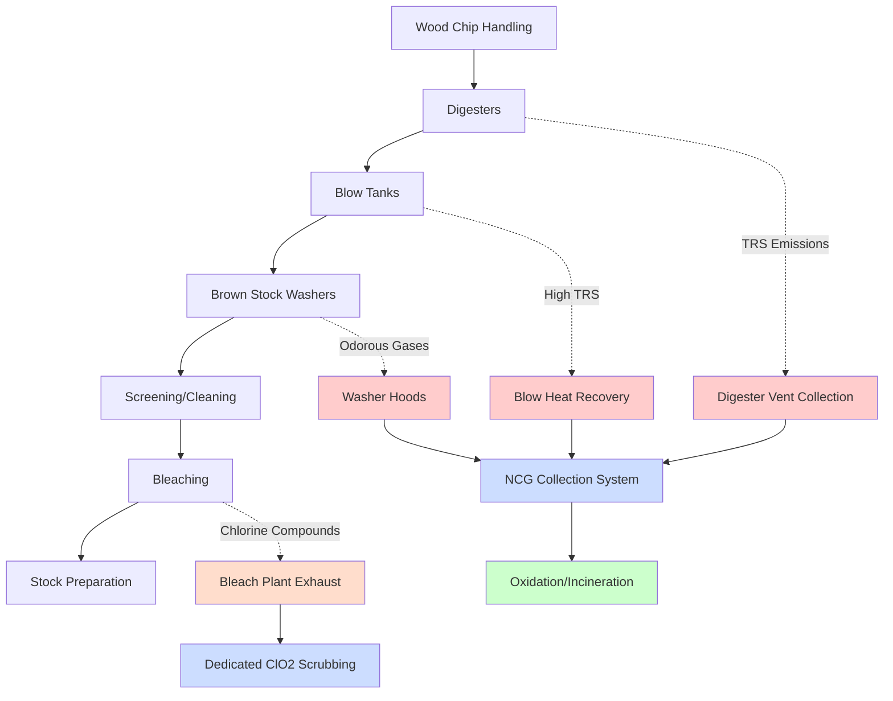
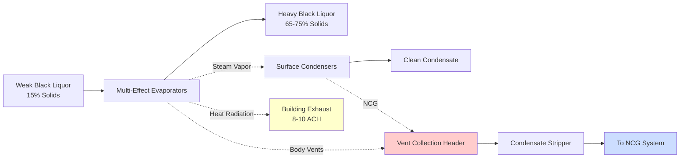
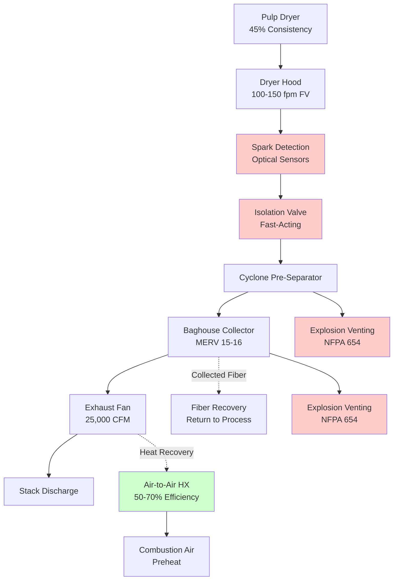

Целлюлозные производства представляют уникальные вызовы вентиляции из-за химических выбросов, высоких влажностных нагрузок, коррозионных атмосфер и строгих требований к контролю запахов. Эффективные системы вентиляции должны улавливать восстановленные соединения серы, диоксид хлора, органические пары и твёрдые частицы, обеспечивая при этом безопасные условия работы и соответствие нормативным требованиям.

## Обзор вентиляции целлюлозного производства

Операции целлюлозного производства преобразуют щепу в целлюлозные волокна посредством механических или химических процессов, каждый из которых генерирует отдельные загрязнители, требующие специализированных систем выброса. Основные проблемы вентиляции касаются соединений с восстановленной серой (TRS) в крафт-целлюлозе и диоксида серы в сульфитных процессах.

## Вентиляция крафт-целлюлозного производства

Крафт-целлюлоза использует гидроксид натрия и сульфид натрия для расщепления лигнина при повышенных температурах (160-175°C) и давлениях (7-10 бар). Процесс выделяет метилмеркаптан, сероводород, диметилсульфид и диметилдисульфид—в совокупности называемые соединениями TRS.

**Вентиляция помещений варок:**

Непрерывные и периодические варки требуют выделенной вентиляции, улавливающей выбросы при нормальной работе и событиях сброса. Критерии проектирования включают:

- **Общая скорость вентиляции:** минимум 10-15 ACH для помещений варок
- **Локальный выброс у предохранительных клапанов:** 500-1000 CFM (847-1699 м³/ч) на точку сброса
- **Выброс из резервуара сброса:** 2000-4000 CFM (3396-6792 м³/ч) с улавливанием пара вспышки и TRS
- **Высокоуровневые воздухозаборники выброса:** размещение на высоте 3-4,5 м над полом для улавливания плавучих газов TRS

Конструкция, устойчивая к коррозии, с использованием FRP, нержавеющей стали (минимум 316L) или покрытой углеродистой стали выдерживает воздействие кислотного конденсата и соединений серы. Скорость в воздуховодах 900-1200 м/с предотвращает конденсацию и обеспечивает самоочищающиеся характеристики.

**Сбор некондензируемых газов (NCG):**

Системы сбора NCG собирают выбросы из множественных источников в централизованную систему обработки. Основные источники NCG включают:

| Источник | Типичный расход | Концентрация TRS |
|----------|------------------|-------------------|
| Сброс и вентиляция варки | 1700-5100 м³/ч | 5000-15000 ppmv |
| Вентиляция резервуара сброса | 3400-8500 м³/ч | 2000-8000 ppmv |
| Прачки коричневого щёлока | 5100-10200 м³/ч | 500-2000 ppmv |
| Вентиляция испарителя | 3400-6800 м³/ч | 1000-3000 ppmv |

Системы NCG работают при небольшом отрицательном давлении (25-75 Па) для предотвращения выбросов летучих соединений при избежании чрезмерной инфильтрации воздуха, которая разбавляет газовый поток. Вентиляторы с переменной скоростью с индуцированной тягой приспосабливаются к колебаниям потока в производственном цикле.

## Вентиляция участка химического извлечения

Извлечение чёрного щёлока включает испарение, горение, каустификацию и операции известковой печи, каждая требует специфические стратегии вентиляции.

**Участок котла химического извлечения:**

Котёл извлечения сжигает концентрированный чёрный щёлок, восстанавливая соединения натрия и серы при генерировании технологического пара. Требования к вентиляции учитывают:

- **Выброс резервуара растворения плавленого вещества:** 8500-17000 м³/ч с улавливанием TRS и пара
- **Помещение котла извлечения:** 6-8 ACH для управления температурой окружающей среды
- **Ёмкость аварийного сброса:** в 3-4 раза выше нормальной вентиляции для условий нарушения
- **Предогрев воздуха горения:** восстановление тепла из дымовых газов котла с использованием воздухо-воздушных теплообменников

Резервуары растворения плавленого вещества представляют наивысший источник выбросов TRS в участках извлечения, требуя выделенного выброса, подключённого к системе сбора NCG. Анализ взрывчатых опасностей согласно NFPA 69 определяет, необходима ли непрерывная продувочная вентиляция или требуются положения для взрывного сброса.

**Вентиляция помещения испарителя:**

Многокорпусные испарители концентрируют чёрный щёлок с 15-18% твёрдого вещества до 65-75% перед сжиганием. Вентиляции корпусов испарителя выделяют водяной пар, загрязнённый органическими соединениями и TRS:

- **Вентиляция аппаратов отдува конденсата:** прямой выброс в систему сбора NCG
- **Вентиляция резервуаров вспышки:** скубберование или сжигание из-за высоких уровней TRS
- **Вентиляция помещения:** 8-10 ACH, учитывающая теплопритоки от корпусов испарителя
- **Кондиционирование приточного воздуха:** поддерживание окружающей среды 21-27°C несмотря на технологическое тепло

Конденсаторы паров отделяют чистый конденсат от некондензируемых газов, при надлежащей вентиляции предотвращающие перенос TRS в системы сбора грязного конденсата.

## Вентиляция отбеливающего растения

Современное отбеливание целлюлозы использует последовательности без элементарного хлора (ECF), применяя диоксид хлора, перекись водорода, кислород и озон. Вентиляция отбеливающего растения управляет высокореактивными окисляющими газами, требующими отдельных систем выброса от потоков, содержащих TRS.

**Вентиляция генератора диоксида хлора:**

Генераторы ClO₂ производят взрывоопасные смеси при концентрациях выше 10% по объёму в воздухе, требуя надёжную вентиляцию:

- **Выделенная система выброса:** отдельно от всех остальных выбросов завода
- **Ёмкость аварийной вентиляции:** минимум 60 ACH для помещений генератора
- **Непрерывная работа:** без прерывания даже во время остановки генератора
- **Взрывозащищённое оборудование:** электрическая классификация Класс I, Отделение 2
- **Щелочное скубберование:** нейтрализация ClO₂ в потоке выброса перед выпуском

Блокировки вентиляции предотвращают работу генератора, если расход выброса падает ниже уставки. Резервное питание для вентиляторов выброса обеспечивает непрерывную работу при перебоях питания.

**Вентиляция отбеливающей башни:**

Каждый этап отбеливания генерирует пары, требующие улавливания в вентиляции башни, уплотняющих резервуарах и точках передачи:

- **Вентиляция верхней части башни:** 340-850 м³/ч на башню с улавливанием выделяемых газов
- **Вентиляция уплотняющего резервуара:** 170-510 м³/ч предотвращение выбросов летучих соединений
- **Вентиляция трубопровода передачи:** соответствие прогнозируемым скачкам потока
- **Вентиляция резервуара фильтрата:** улавливание аэрозолей и паров из операций промывки

Системы сбора паров поддерживают отрицательное давление 12-50 Па в подпространстве оборудования. FRP или PVC воздуховоды устойчивы к коррозии диоксидом хлора, со скоростью, поддерживаемой на уровне 760-1070 м/с.

**Скубберование диоксида хлора:**

В отличие от соединений TRS, поддающихся термическому окислению, диоксид хлора требует химической нейтрализации. Параметры проектирования щелочного аппарата:

- **Крепость щелочи:** раствор NaOH 1-2%
- **Отношение жидкость-газ:** 19-38 л на 1000 м³/ч
- **Тип аппарата:** набивная башня или распылительная камера
- **Время контакта:** минимум 2-4 секунды
- **Эффективность удаления:** >99% разрушение ClO₂

Насосы рециркуляции аппарата и контроли уровня жидкости обеспечивают непрерывную доступность щелочи. Мониторинг pH подтверждает адекватную крепость щелочи для полной нейтрализации ClO₂.

## Вентиляция сушилки целлюлозы

Производство рыночной целлюлозы требует высушивания листов целлюлозы с 45-50% консистенции до 8-10% содержания влаги. Вентиляция сушилки учитывает генерирование пыли, опасности пожара и удаление влаги.

**Выброс вытяжного кожуха сушилки:**

Сушилки Янки, сушилки с кипящим слоем или импульсные сушилки выделяют влажный воздух, содержащий целлюлозные волокна:

- **Объём выброса:** 25500-51000 м³/ч на сушилку в зависимости от скорости испарения
- **Скорость поверхности кожуха:** 0,5-0,75 м/с для содержания без нарушения полотна
- **Удаление влаги:** 900-1800 кг/ч водяного пара на сушилку
- **Температура:** 93-121°C в точке выброса

Восстановление энергии из выброса сушилки предогревает воздух горения или вентиляционный воздух здания. Пластинчатые теплообменники или ротационные тепловые колёса восстанавливают 50-70% доступной тепловой энергии.

**Сбор пыли и защита от пожара:**

Целлюлозная пыль представляет опасность горючей пыли, требующая защиты согласно NFPA 654:

- **Сборщик пыли:** багфильтр или циклон, удаляющие частицы перед вентилятором выброса
- **Взрывной выброс:** размер согласно значению Kst для целлюлозы (150-200 бар·м/с)
- **Изоляция дефлаграции:** механическая или химическая изоляция между сушилкой и сборщиком
- **Обнаружение искр:** оптические датчики, активирующие подавление водным распылом
- **Заземление:** весь воздуховод и оборудование надлежащим образом соединены

Минимальная скорость транспортировки 1220-1370 м/с в воздуховоде предотвращает накопление волокна. Регулярная проверка и очистка поддерживают целостность противопожарной защиты.

## Технологии контроля запахов

Выбросы TRS требуют обработки перед атмосферным выпуском для соответствия пороговым значениям запаха (типично 5-10 ppb эквивалента сероводорода).

**Термическое окисление:**

Высокотемпературное окисление преобразует соединения TRS в диоксид серы, впоследствии скубберованный в химических абсорберах:

- **Температура окисления:** 648-760°C для полного преобразования
- **Время пребывания:** минимум 0,5-1,0 секунды
- **Эффективность разрушения:** >99% для соединений TRS
- **Восстановление тепла:** генерирование пара или предогрев воздуха горения

Термические окислители работают непрерывно из-за долгих времён стабилизации тепловой массы. Вспомогательное топливо поддерживает температуру в периоды низкого поколения NCG.

**Каталитическое окисление:**

Низкотемпературное окисление (260-370°C) с использованием катализаторов из благородных металлов снижает потребление топлива:

- **Тип катализатора:** платина или палладий на керамической подложке
- **Объёмная скорость:** 10000-20000 ч⁻¹
- **Долговечность катализатора:** 3-5 лет при надлежащей работе
- **Требуется предогрев:** подвести газовый поток к температуре реакции

Отравление катализатора соединениями серы требует периодической регенерации или замены. Мониторинг перепада давления указывает на засорение катализатора, требующее техническое обслуживание.

**Влажное скубберование:**

Химическое скубберование с использованием гидроксида натрия или гипохлорита натрия окисляет соединения TRS в сульфат:

- **Тип аппарата:** набивная башня или вентури-скруббер
- **Дозирование химикатов:** поддерживание pH 9-11 для оптимального окисления
- **Отношение L/G:** 57-114 л на 1000 м³/ч в зависимости от входной концентрации
- **Эффективность удаления:** 95-99% для сероводорода, переменная для органических сульфидов

Продувка скруббера требует обработки перед выпуском из-за содержания сульфата и остаточного сульфида. Ионный обмен или биологическая обработка снижает экологическое воздействие.

## Материалы системы вентиляции

Коррозионные атмосферы в целлюлозном производстве требуют надлежащего выбора материала:

**Материалы воздуховодов:**

- **FRP (стеклопластик):** отличная устойчивость к кислотам и TRS, лёгкий вес
- **Нержавеющая сталь 316L:** высокая коррозионная стойкость, подходит для горячих, кислых условий
- **PVC или CPVC:** диоксид хлора в отбеливающих растениях
- **Покрытая углеродистая сталь:** экономична для менее агрессивных приложений

**Конструкция вентилятора:**

- **FRP конструкция:** крыльчатка, корпус и вал для коррозионных газовых потоков
- **Покрытый чугун:** тяжелые приложения с надлежащим уходом за покрытием
- **Нержавеющая сталь:** высокотемпературная или высокая нагрузка твёрдыми частицами
- **Взрывозащищённые двигатели:** классифицированные установки согласно NEC Статья 500

## Мониторинг и управление

Непрерывный мониторинг выбросов обеспечивает соответствие нормативным требованиям и производительность системы:

- **Анализаторы TRS:** мониторинг общей восстановленной серы в выпуске дымовой трубы
- **Мониторы ClO₂:** мониторы участка отбеливающего растения с уставками тревоги 0,1 ppm
- **Мониторы SO₂:** мониторинг выпуска котла извлечения и окислителя
- **Мониторинг воздушного потока:** измеритель трубки Пито или тепловой массовый расход на ключевых точках
- **Дифференциальное давление здания:** обеспечение отрицательного давления относительно наружного

Системы управления интегрируют вентиляцию с операциями процесса, регулируя объёмы выброса на основе графиков варки варок, нагрузок испарителя и скоростей производства отбеливающего растения. Вентиляторы с переменной скоростью оптимизируют потребление энергии при поддерживании эффективности улавливания.

## Нормативные соображения

Системы вентиляции целлюлозного завода должны соответствовать множественным нормативным рамкам:

- **EPA Maximum Achievable Control Technology (MACT):** Пределы выбросов Подраздела S и MM
- **Разрешения на качество воздуха штата:** пределы выбросов, специфичные для объекта и требования мониторинга
- **OSHA 29 CFR 1910.1000:** Пределы профессионального воздействия для H₂S (10 ppm TWA, 15 ppm STTL)
- **Коды NFPA:** Противопожарная защита (NFPA 654) и опасные местоположения (NFPA 497)

Определения Best Available Control Technology (BACT) всё более требуют термического окисления или эквивалентного контроля запахов для выбросов TRS. Моделирование качества окружающего воздуха демонстрирует соответствие критериям воздействия запаха на месте.

## Интеграция восстановления энергии

Системы вентиляции целлюлозного производства предлагают существенные возможности восстановления энергии:

**Приложения восстановления тепла:**

| Источник | Температура | Потенциал восстановления | Конечное использование |
|----------|-------------|-------------------|---------|
| Выброс сушилки | 93-121°C | 140-210 ГДж/ч | Предогрев воздуха горения, отопление здания |
| Пар сброса варки | 138-160°C | 280-420 ГДж/ч | Испарители чёрного щёлока, технологическое тепло |
| Дымовые газы котла извлечения | 149-204°C | 350-525 ГДж/ч | Предогрев воздуха горения, нагрев воды |

Системы восстановления тепла интегрируются с распределением пара и горячей воды по всему заводу. Периоды окупаемости 1-3 года обосновывают капитальные инвестиции в оборудование восстановления.

## Заключение

Системы вентиляции целлюлозного производства представляют сложные, интегрированные конструкции, уравновешивающие безопасность работников, соответствие окружающей среде и энергетическую эффективность. Эффективное улавливание выбросов TRS, надлежащая обработка соединений хлора и надёжный контроль запахов требуют специализированных знаний в области инженерии и выбора материалов. Современные системы включают непрерывный мониторинг, автоматизированное управление и восстановление энергии для оптимизации производительности при соответствии всё более строгим нормативным требованиям. Успех требует понимания как химии целлюлозного производства, так и основ промышленной вентиляции, применяемых посредством строгой методологии проектирования согласно руководящим принципам ACGIH, EPA и отраслевым.
