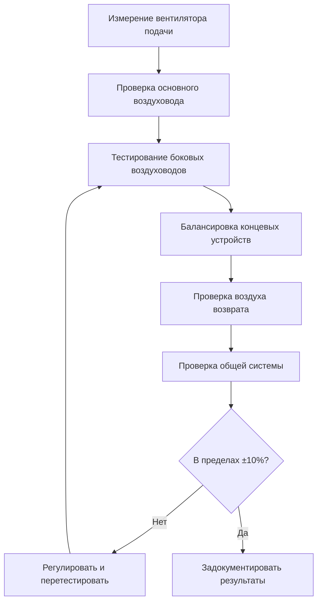

# Процесс тестирования, регулировки и балансировки

Тестирование, регулировка и балансировка (ТРБ) представляет собой систематический процесс проверки и документирования производительности системы HVAC для обеспечения достижения спроектированных условий. Этот критический этап устраняет разрыв между проектным замыслом и эксплуатационной реальностью, устанавливая показатели базовой производительности, необходимые для долгосрочной эффективности системы.

## Основы ТРБ

Процесс ТРБ включает три отдельных этапа:

**Тестирование** включает измерение и документирование параметров системы с использованием откалиброванных приборов. Воздушные системы требуют измерения расходов потока, статических давлений и перепадов температур. Гидронные системы требуют проверки расходов потока, измерения дифференциального давления и анализа температур в теплообменниках и оборудовании.

**Регулировка** модифицирует компоненты системы для достижения проектных спецификаций. Регулировки на стороне воздуха включают позиционирование заслонок, изменение скорости вентилятора и оптимизацию статического давления в воздуховодах. Регулировки на стороне воды включают манипуляцию балансировочными клапанами, регулировку скорости насоса и регулирование давления в системе.

**Балансировка** достигает пропорционального распределения воздуха или воды по всей системе в соответствии с проектными требованиями. Процесс следует систематическому подходу от источника распределения к концевым устройствам, обеспечивая, чтобы каждая ветвь получала свой назначенный расход.

## Процедуры балансировки воздушных систем

Балансировка воздуха следует методу пропорциональной балансировки, работая от воздухоприемного узла наружу к концевым устройствам.

### Иерархия измерений

**Требования к начальной установке:**

- Проверить доступность и функциональность всех заслонок
- Подтвердить установку и чистоту фильтров
- Проверить вращение вентилятора и ток двигателя
- Измерить статическое давление системы в местах проектирования
- Проверить работу системы управления в режиме занятости

**Последовательность балансировки:**

1. Измерить общий расход воздуха в воздухоприемном узле, используя пересечение трубки Пито или откалиброванные станции потока
2. Установить правильную рабочую точку вентилятора, отрегулировав скорость или впускные жалюзи для достижения проектного статического давления
3. Измерить и записать все расходы боковых воздуховодов, определяя условия высокого и низкого потока
4. Начать пропорциональную балансировку с ветви, наиболее удаленной от вентилятора, установив заслонки для снижения потока до проектных значений
5. Продвигаться систематически через все ветви, поддерживая постоянную работу вентилятора
6. Проверить расходы концевых устройств соответствуют спецификациям в пределах ±10% допуска
7. Перепроверить общий расход воздуха и отрегулировать вентилятор при необходимости

Процесс требует множественных итераций, так как регулировки в одной ветви влияют на потоки по всей системе. Показания статического давления в ключевых местах направляют процесс балансировки и выявляют точки сопротивления.

## Балансировка гидронных систем

Балансировка воды требует точного измерения расхода потока и тщательного анализа давления для предотвращения кавитации насоса и обеспечения надлежащей теплопередачи.

**Критические точки измерения:**

- Давления нагнетания и всасывания насоса
- Расходы потока на станциях балансировочных клапанов
- Перепад температур через теплообменники
- Давление заполнения системы и предварительное давление расширительного бака
- Дифференциальное давление через теплообменники и оборудование теплопередачи

**Позиционирование балансировочного клапана** следует кривым Cv производителя, рассчитывая расход на основе измеренных перепадов давления. Соотношение Q = Cv√(ΔP/SG) определяет расход потока, где Q представляет расход в л/ч, Cv является коэффициентом клапана, ΔP равен дифференциальному давлению в кПа, а SG обозначает удельный вес.

**Проверка на основе температуры** подтверждает надлежащий расход через теплообменники. Проектный перепад температур (ΔT) связан с расходом через Q = (кДж/ч) / (1860 × ΔT) для водяных систем. Измеренный ΔT значительно ниже проектного указывает на избыточный расход; более высокий ΔT указывает на недостаточный расход.

## Интеграция наладки

ТРБ формирует этап функциональной проверки производительности при наладке здания, предоставляя количественные данные, подтверждающие, что работа системы соответствует проектному замыслу.

**Предварительные контрольные списки** завершенные перед ТРБ, включают:

- Проверку установки оборудования в соответствии со спецификациями
- Тестирование электрических соединений и защитных блокировок
- Последовательности управления запрограммированы и предварительно протестированы
- Испытания давления в системе воздуховодов и труб завершены
- Промывка и очистка системы проверены

**Функциональное тестирование производительности** развивает результаты ТРБ, проверяя:

- Реакцию системы на различные нагрузки
- Работу последовательности управления в фактических условиях
- Производительность систем восстановления энергии
- Функциональность экономайзера и точки переключения
- Работу системы безопасности и верификацию сигналов тревоги

## Требования к документации

Полные отчеты ТРБ документируют производительность системы и предоставляют операционные базовые показатели. Стандарт ASHRAE 111 и отраслевые стандарты (NEBB, AABC, TABB) определяют минимальные требования к документации.

**Основные компоненты отчета:**

- Сертификаты калибровки приборов (ежегодная сертификация требуется)
- Сводки проектного расхода воздуха и воды
- Измеренные значения с процентом отклонения от проектного
- Данные табличного знака оборудования и операционные параметры
- Отчеты о дефектах, определяющие проблемы несоответствия
- Рекомендуемые корректирующие действия
- Модификации системы по факту, влияющие на производительность

**Полевые листы данных** записывают:

- Обозначение концевого устройства и местоположение
- Проектные против измеренных расходов
- Положения заслонок и клапанов
- Показания статического давления в точках измерения
- Температуры воды и перепады давления

## Стандарты сертификации

Три основные организации устанавливают стандарты сертификации ТРБ:

**NEBB (National Environmental Balancing Bureau)** подчеркивает стандартизацию процедур и сертификацию техников через комплексное тестирование и требования опыта. Процедурные стандарты NEBB предоставляют подробные методологии тестирования.

**AABC (Associated Air Balance Council)** сосредоточены на сертификации организации, требуя компанию на уровне систем качества и программ обучения персонала. Национальные стандарты AABC устанавливают минимальные критерии производительности.

**TABB (Testing, Adjusting and Balancing Bureau)** связан с SMACNA, предоставляет сертификацию, объединяющую квалификацию индивидуальных техников с аккредитацией компании.

Все органы сертификации требуют ежегодной калибровки приборов согласно стандартам, прослеживаемым к NIST, поддерживая точность измерений в пределах установленных допусков (обычно ±2% для расхода воздуха, ±0,5% для температуры).

## Допуски проверки производительности

Отраслевые стандарты устанавливают приемлемое отклонение между проектными и измеренными значениями:

| Компонент системы | Допустимый допуск |
|-----------------|---------------------|
| Общий расход воздуха системы | ±10% |
| Расход воздуха боковой ветви | ±10% |
| Расход воздуха концевого устройства | ±10% |
| Расход гидронной системы (отдельные контуры) | ±10% |
| Перепад температур | ±0,6°C |
| Статическое давление | ±7,5 Па |

Значения, превышающие допуски, требуют расследования и коррекции. Частые причины включают недостаточный размер воздуховодов, чрезмерное сопротивление системы, неправильный выбор оборудования или дефекты при установке.

Процесс ТРБ обеспечивает необходимую проверку того, что спроектированные системы работают, как предусмотрено, устанавливая операционные базовые показатели для будущего устранения неполадок и оптимизации. Надлежащее выполнение требует обученного персонала, откалиброванного оборудования и систематического соответствия установленным процедурам, обеспечивая, что системы здания достигают своих объективов производительности эффективно и надежно.
