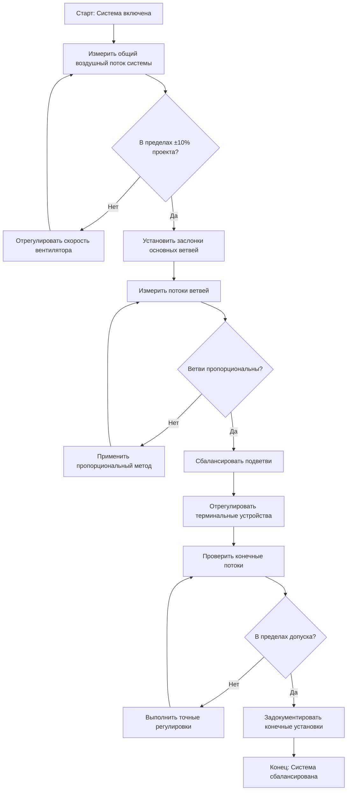
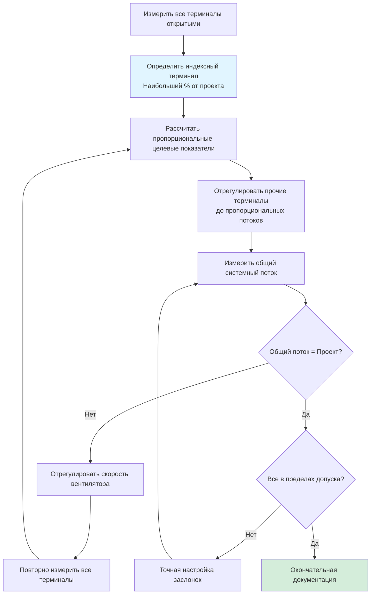

## Обзор

Регулировка систем представляет собой основной этап выполнения испытаний и балансировки воздушных систем. Этот процесс включает систематическое управление заслонками, скоростью вентилятора и распределением воздушного потока для достижения проектных условий в пределах приемлемых допусков. Надлежащие процедуры регулировки обеспечивают энергоэффективную работу при соблюдении требований вентиляции и комфорта.

## Основная стратегия балансировки

Процесс регулировки следует иерархическому подходу, работая от оборудования обработки воздуха наружу к терминальным устройствам. Эта стратегия минимизирует повторяющиеся регулировки и сокращает общее время балансировки.

**Последовательность регулировки:**
1. Проверить и установить общий воздушный поток системы на вентиляторе
2. Сбалансировать основные ветви воздуховодов в соответствии с проектными пропорциями
3. Отрегулировать подветви в соответствии с установленными соотношениями
4. Точная настройка терминальных устройств до конечных установок
5. Проверить стабильность системы и задокументировать конечные условия

## Регулировка скорости вентилятора

Регулировка скорости вентилятора устанавливает общую емкость воздушного потока системы. Эта первичная регулировка должна быть завершена перед любой балансировкой заслонок.

**Регулировка привода с переменной частотой (VFD):**
- Отрегулировать частоту с шагом 2-5 Гц
- Допустить стабилизацию системы (30-60 секунд) между изменениями
- Задокументировать Гц, силу тока и статическое давление при конечной установке
- Проверить, что ток двигателя остается в пределах паспортного значения

**Регулировка шкива (системы с ременным приводом):**
- Рассчитать требуемое изменение об/мин: об/мин₂ = об/мин₁ × (CFM₂/CFM₁)
- Измерить и записать существующие установки шкива перед регулировкой
- Поддерживать надлежащее натяжение ремня после смещения шкива
- Проверить выравнивание ремня и состояние подшипников

**Проверка производительности:**
- Общий воздушный поток должен быть установлен на уровне 100-105% от проекта, чтобы обеспечить авторитет заслонки
- Измерить статическое давление в нескольких точках для проверки кривой системы
- Подтвердить отсутствие помпажа или срыва потока в рабочей точке

## Принципы регулировки заслонок

Заслонки обеспечивают основное средство управления распределением воздушного потока. Надлежащий выбор и позиционирование заслонок критичны для достижения сбалансированных условий без чрезмерной потери давления.

**Авторитет заслонки:**

Отношение перепада давления на заслонке к общему давлению в системе определяет эффективность управления. Минимальный авторитет заслонки 0,25 (25%) требуется для адекватного управления.

Авторитет = ΔP_заслонка / ΔP_общее

**Рекомендации по регулировке:**
- Начать со всех балансировочных заслонок полностью открытыми
- Использовать заслонки, наиболее близкие к терминалам, для окончательной регулировки
- Избегать закрывания заслонок более чем на 75% (чрезмерная потеря давления)
- Позиционировать противолежащие заслонки для лучшей линейности управления
- Задокументировать позиции заслонок как процент открытия или количество оборотов

## Пошаговый метод пропорциональной балансировки

Пошаговый пропорциональный метод представляет наиболее эффективный подход для систем с несколькими выходами. Эта техника минимизирует количество итераций регулировки, необходимых для достижения сбалансированных условий.

### Процедура пропорциональной балансировки

**Первоначальные измерения:**
1. Записать воздушный поток на всех терминалах с полностью открытыми заслонками
2. Рассчитать общий измеренный поток
3. Определить пропорциональные соотношения потоков для каждого терминала

**Первая итерация балансировки:**
1. Определить терминал с наибольшим процентом проектного потока
2. Оставить заслонку этого терминала полностью открытой (индексный терминал)
3. Рассчитать целевые потоки для остальных терминалов пропорционально индексному терминалу
4. Отрегулировать все остальные заслонки для достижения пропорциональных целевых показателей

**Последующие итерации:**
1. Повторно измерить все потоки терминалов
2. Рассчитать новые пропорциональные целевые показатели, если общий системный поток изменился
3. Отрегулировать заслонки, поддерживая пропорциональные взаимосвязи
4. Повторять до тех пор, пока все терминалы не будут в пределах допуска

### Пример пропорционального расчета

Для системы с тремя терминалами:

| Терминал | Проект м³/ч | Измерено м³/ч (открыто) | % от проекта |
|----------|------------|---------------------------|-------------|
| A        | 236        | 271                       | 115%        |
| B        | 189        | 200                       | 106%        |
| C        | 141        | 132                       | 93%         |

**Анализ:**
- Терминал A имеет наибольший процент (115%) → становится индексным терминалом
- Общий проект = 566 м³/ч; Общее измерено = 603 м³/ч
- Система доставляет 107% от проекта (приемлемо перед регулировкой заслонок)

**Пропорциональные целевые показатели:**
- Терминал A: 271 м³/ч (заслонка остается полностью открытой)
- Терминал B: 271 × (189/236) = 217 м³/ч
- Терминал C: 271 × (141/236) = 163 м³/ч

После регулировки B и C до пропорциональных целевых показателей повторно измерить общий поток. Если общий поток превышает проект, уменьшить скорость вентилятора и повторить пропорциональные регулировки.

## Допуски балансировки

Стандарты промышленности устанавливают приемлемые диапазоны отклонений для балансировки воздушных систем. Эти допуски признают практические ограничения точности измерений и стабильности системы.

**Стандарты допусков AABC:**
- Общий системный воздушный поток: ±10% от проекта
- Отдельные терминальные устройства ≥100 CFM (47,2 м³/ч): ±10% от проекта
- Отдельные терминальные устройства <100 CFM (47,2 м³/ч): ±0,01 CFM/м² обслуживаемой площади
- Основные вентиляторы подачи и возврата: ±5% от проекта
- Системы разнообразия: ±5% от расчетного потока разнообразия

**Стандарты допусков NEBB:**
- Вентиляторы подачи, возврата и вытяжки: ±10% от проекта CFM
- Воздушные выходы и входы: ±10% от проекта CFM для потока ≥100 CFM (47,2 м³/ч)
- Воздушные выходы и входы: ±10 CFM (4,7 м³/ч) для потока <100 CFM (47,2 м³/ч)
- Ветви воздуховодов: ±10% от проекта CFM
- Общий наружный воздух: ±10% от проекта CFM

**Соображения по допускам:**
- Более жесткие допуски могут быть указаны для критичных приложений (лаборатории, здравоохранение)
- Задокументировать превышения и получить одобрение проектировщика для отклонений
- Рассмотреть кумулятивный эффект нескольких терминалов в пределах допусков
- Показания статического давления обычно имеют точность ±0,05 дюйма вод. ст.

## Последовательная балансировка для сложных систем

Крупные системы с несколькими воздухообрабатывающими агрегатами требуют согласованных последовательностей балансировки для поддержания надлежащих взаимосвязей давления.

**Подход для многозонной системы:**
1. Сбалансировать первичный воздухообрабатывающий агрегат до проектного общего потока
2. Установить надлежащие потоки зонной подачи с заслонками зон
3. Сбалансировать терминалы в каждой зоне в соответствии с проектным распределением
4. Проверить, что системы возврата и вытяжки поддерживают надлежащее давление в здании
5. Проверить последовательности разнообразия и экономайзера в различных условиях

**Зависящие от давления в сравнении с независимыми от давления:**
- Терминалы, зависящие от давления, требуют итеративной балансировки при изменении условий системы
- Терминалы, независимые от давления (VAV с измерением потока), самокомпенсируются
- Гибридные системы требуют балансировки при проектных условиях с проверкой при неполной нагрузке

## Требования к документации

Комплексная документация обеспечивает проверку выполненной работы и исходные данные для будущей оценки производительности системы.

**Требуемая документация согласно AABC/NEBB:**
- Полные записи калибровки приборов
- Начальные и конечные показания для всех точек измерения
- Позиции заслонок и установки скорости вентилятора
- Рассчитанные результаты и процентное значение проектных значений
- Отчеты о дефектах и документация их разрешения
- Схемные диаграммы с местами измерений
- Подпись сертификации тестирования и балансировки и печать

## Проверка стабильности системы

Окончательная проверка обеспечивает поддержание сбалансированной системой стабильной работы во всем диапазоне ожидаемых условий эксплуатации.

**Тесты стабильности:**
- Работать с системой непрерывно в течение минимум 15 минут при проектных условиях
- Проверить, что потоки остаются в пределах допуска во время периода стабилизации
- Проверить управляющие последовательности (занятые/незанятые режимы, режимы экономайзера)
- Задокументировать любое дрейфование или охотящееся поведение, требующее регулировки управления

**Проверка после балансировки:**
- Проверить, что все панели доступа закреплены и изоляция восстановлена
- Подтвердить, что механизмы фиксации заслонок задействованы
- Проверить и задокументировать все управляющие последовательности
- Предоставить предварительные данные производительности команде пуска

## Заключение

Систематическое применение методов пропорциональной балансировки в сочетании с надлежащей регулировкой скорости вентилятора создает эффективные, стабильные системы распределения воздуха. Соблюдение процедурных стандартов AABC и NEBB обеспечивает последовательные, проверяемые результаты, которые соответствуют проектному замыслу при поддержании энергоэффективности. Надлежащая документация предоставляет важные исходные данные для текущей проверки производительности системы и оптимизации на протяжении жизненного цикла здания.
