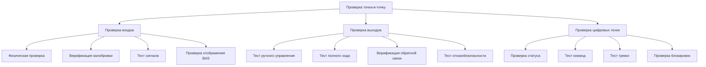
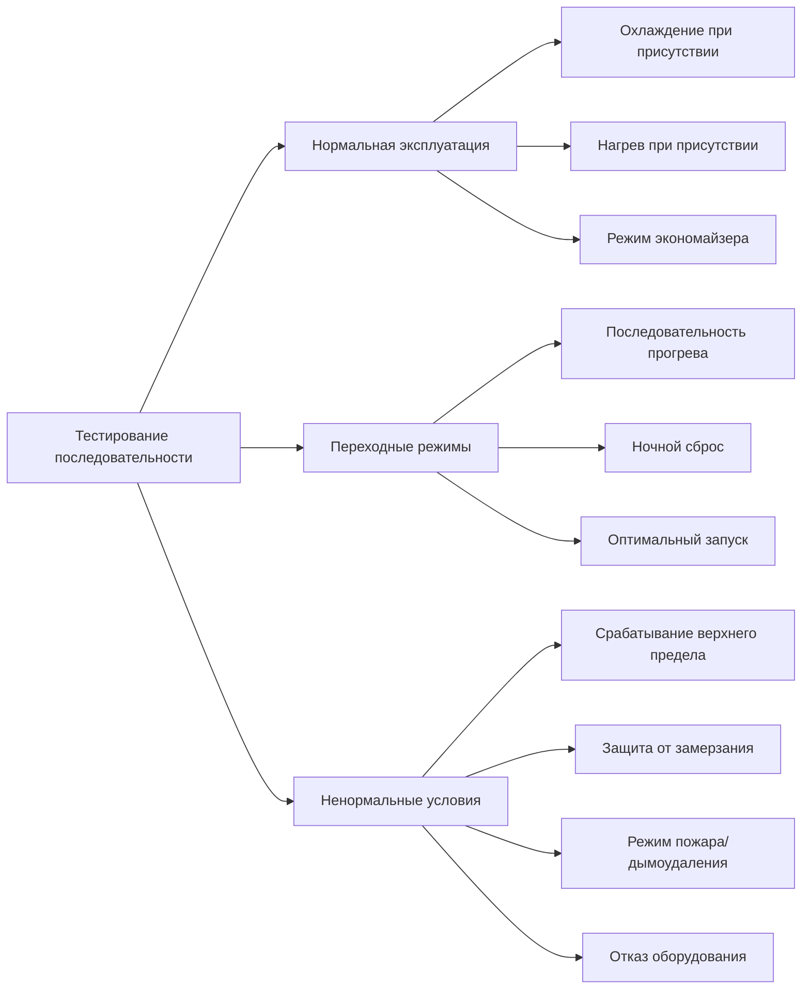

Проверка системы управления является критической фазой комиссионирования HVAC, обеспечивающей правильное функционирование систем автоматизации зданий (BAS) и прямого цифрового управления (DDC) в соответствии с проектным замыслом и последовательностью операций. Этот процесс включает проверку оборудования, проверку программного обеспечения, тестирование соединений точка-в-точку и валидацию функциональной производительности.

## Проверка соединений точка-в-точку

Проверка соединения точка-в-точку подтверждает физические и логические соединения между полевыми устройствами и интерфейсами системы управления. Этот систематический процесс валидирует каждую входную и выходную точку в системе управления.

### Процедуры проверки оборудования

**Проверка входных точек:**
- Проверить физическое размещение датчика и его местоположение
- Подтвердить соответствие калибровки и диапазона установленным значениям
- Подать известный сигнал или физический раздражитель на датчик
- Проверить правильное отображение сигнала на контроллере и рабочей станции BAS
- Документировать адрес точки, местоположение и данные калибровки

**Проверка выходных точек:**
- Вручную управлять исполнительными механизмами по всему диапазону перемещения
- Проверить соответствие ответа исполнительного механизма управляемому положению
- Подтвердить сигналы обратной связи где применимо
- Протестировать отказобезопасные положения при потере сигнала управления
- Проверить, что блокировки предотвращают конфликтующие операции

**Проверка цифровых точек:**
- Проверить соответствие статусных точек фактическому состоянию полевого устройства
- Протестировать, что бинарные команды вызывают ожидаемый ответ полевого устройства
- Подтвердить активацию сигналов тревоги при правильных уставках
- Валидировать правильное функционирование функций включения/отключения

## Тестирование последовательности операций

Тестирование последовательности валидирует выполнение логики управления в соответствии с проектной документацией. ASHRAE Guideline 36 предоставляет стандартизованные последовательности для высокопроизводительных систем HVAC.

### Методология тестирования

**Проверка режимов:**
- Эксплуатация в режиме присутствия людей и уставки
- Температуры снижения/повышения в режиме отсутствия
- Последовательности оптимизации прогрева и охлаждения
- Расчеты времени утреннего запуска
- Расписание праздников и специальных событий

**Тестирование контрольных контуров:**
- Верификация настройки пропорционально-интегрально-производной (PID)
- Отслеживание уставки и время отклика
- Подтверждение мертвой зоны и диапазона управления
- Расписания сброса (подающего воздуха, охлажденной воды, горячей воды)
- Координация каскадных контрольных контуров

**Защита и предельные устройства управления:**
- Реакции на превышение высокой/низкой температуры
- Последовательности защиты от замерзания
- Активация режима дымоудаления
- Последовательности аварийного отключения
- Блокировка оборудования и временные задержки

### Соответствие ASHRAE Guideline 36

Последовательности Guideline 36 подчеркивают:
- Отдельное управление минимальным наружным воздухом и экономайзером
- Логику "обрезки и ответа" для сброса температуры подающего воздуха
- Двойную логику максимума для зонального нагрева/охлаждения
- Вентиляцию, управляемую спросом с мониторингом CO₂
- Алгоритмы оптимального запуска/остановки

## Логирование тенденций и верификация производительности

Сбор данных тенденций предоставляет эмпирические доказательства производительности системы во времени, выявляя проблемы эксплуатации, не видимые при точечных проверках.

### Критические точки логирования

**Тенденции блока обработки воздуха:**
- Температуры смешанного, подающего и возвратного воздуха
- Температура и энтальпия наружного воздуха
- Уставка температуры выходящего воздуха и сброс
- Положения заслонок (наружной, возвратной, выводной)
- Положения клапанов нагрева и охлаждения
- Статус вентиляторов подачи и возврата, скорость, ток
- Уставки статического давления и фактические значения
- Дифференциальное давление фильтра

**Тенденции гидравлической системы:**
- Температуры подающей и возвратной воды
- Расходы и дифференциальное давление
- Положения клапанов в представительных зонах
- Статус насоса, скорость и энергопотребление
- Давление системы и расход подпиточной воды

**Тенденции на уровне зоны:**
- Температура помещения и уставка
- Температура выходящего воздуха (VAV терминалы)
- Положение заслонки/клапана
- Статус занятости
- Концентрация CO₂ (вентиляция, управляемая спросом)

### Методология анализа тенденций

Установить надлежащие интервалы логирования:
- Быстро меняющиеся точки (заслонки, положения клапанов): интервалы 1–5 минут
- Точки среднего темпа изменения (температуры, давления): интервалы 5–15 минут
- Медленно меняющиеся точки (энергетические итоги): интервалы 15–60 минут

Минимальная длительность логирования: 72 часа непрерывной эксплуатации включая периоды присутствия и отсутствия людей, предпочтительно при расчетных условиях нагрузки.

## Функциональное тестирование производительности

Функциональные тесты имитируют фактические условия эксплуатации для верификации интегрированной производительности системы.

### Протокол выполнения теста

1. **Предварительные проверки:** Верифицировать завершение всех тестов точка-в-точку, правильное программирование последовательностей
2. **Начальные условия:** Документировать начальное состояние системы, условия погоды, занятость здания
3. **Смоделированные условия:** Имитировать условия расчетного дня где возможно (изменить уставки, модифицировать входные данные)
4. **Измерение ответа:** Записать ответ системы на изменяющиеся условия
5. **Оценка производительности:** Сравнить фактическую производительность с критериями проектного замысла
6. **Документирование дефектов:** Записать отказы, расхождения или недостатки производительности

### Типичные функциональные тесты

**Эксплуатация экономайзера:**
- Верифицировать интегрированное управление экономайзером по пороговым значениям температуры и энтальпии
- Подтвердить правильное модулирование заслонок и блокировки
- Протестировать функциональность отключения по верхнему пределу

**Управление температурой в зоне:**
- Верифицировать поддержание температуры помещения в пределах мертвой зоны
- Подтвердить правильное каскадирование нагрева и охлаждения
- Протестировать расписания сброса при различных нагрузках

**Отклик на спрос:**
- Верифицировать правильное выполнение стратегий снижения нагрузки
- Подтвердить поддержание обслуживания критических нагрузок
- Протестировать автоматическое восстановление после события спроса

## Требования к документации

Комплексная документация включает:
- Листы проверки точка-в-точку с найденными и установленными значениями
- Результаты тестов последовательности с критериями прохождения/отказа
- Логи тенденций с анализом и результатами
- Отчеты функциональных тестов с данными производительности
- Логи дефектов и отслеживание разрешения
- Финальный отчет о комиссионировании согласно ASHRAE Guideline 0 или Guideline 1.1

Надлежащая проверка системы управления обеспечивает, что системы HVAC обеспечивают проектную производительность, энергоэффективность и комфорт жильцов на протяжении всего жизненного цикла здания.
