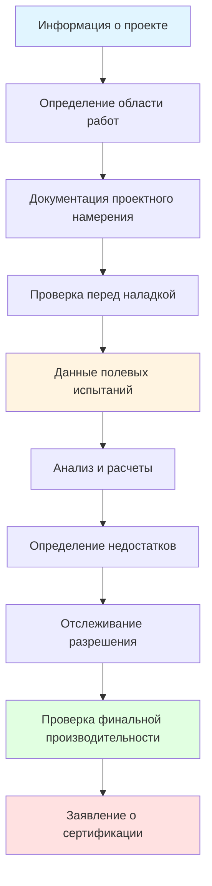
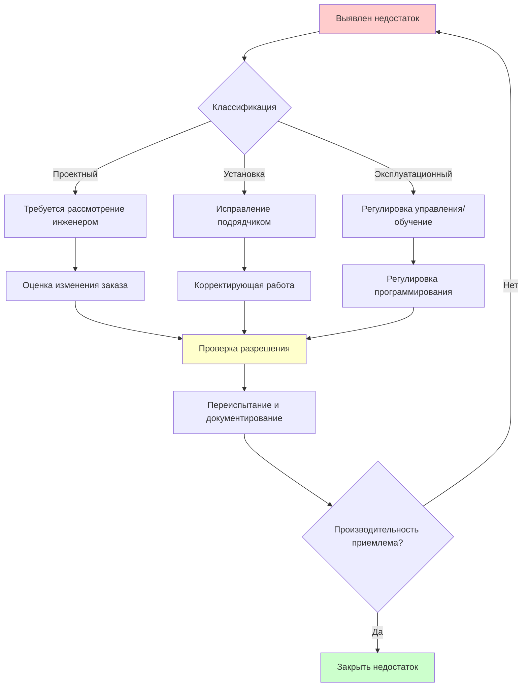

Документация при испытании, наладке и балансировке HVAC систем служит постоянным записям о проверке производительности системы HVAC, устанавливая исходные эксплуатационные параметры, необходимые для управления объектом, поиска неисправностей и будущих модификаций системы. Надлежащая документация подтверждает, что установленные системы соответствуют проектным спецификациям, и обеспечивает основу для результатов ввода в эксплуатацию.

## Структура и компоненты отчета о наладке

Стандарты отрасли, установленные AABC, NEBB и TABB, определяют комплексные требования к отчетности, обеспечивающие согласованность, отслеживаемость и профессиональную ответственность. Полные отчеты о наладке содержат стандартизированные разделы, охватывающие данные оборудования, процедуры испытаний, измеренные результаты и недостатки системы.

**Существенные разделы отчета:**

**Резюме руководства** предоставляет обзор проекта, область работ, дату завершения и заявление о сертификации. Этот раздел определяет сертифицирующую организацию, перечисляет сертифицированный персонал, выполнивший работу, и подтверждает статус калибровки инструмента.

**Документация калибровки инструмента** включает сертификаты для всех измерительных приборов, используемых при испытании. Калибровка, отслеживаемая NIST, проведенная в течение 12 месяцев до даты испытания, является обязательной. Документация указывает производителя инструмента, модель, серийный номер, дату калибровки и допуски точности.

**Сводка проектных данных** представляет предполагаемые рабочие параметры из механических чертежей и спецификаций. Таблицы перечисляют проектные расходы воздуха, расходы воды, температуры, давления и мощности оборудования для сравнения с измеренными значениями.

**Данные полевых измерений** составляют основное техническое содержание, документируя все показания, полученные во время процесса балансировки. Таблицы данных записывают расходы конечных устройств, измерения траверса воздуховода, производительность насоса, системные давления, температуры и условия работы оборудования.

**Отчеты о недостатках** определяют условия, препятствующие достижению проектной производительности. Каждый недостаток включает описание, местоположение, ответственную сторону, рекомендуемые корректирующие действия и статус разрешения.

**Диаграммы системы** с отмеченными финальными позициями заслонок, установками клапанов и рабочими точками оборудования обеспечивают визуальную документацию конфигурации сбалансированной системы.

## Стандарты документации AABC

Национальные стандарты Associated Air Balance Council определяют требования документации, подчеркивая системы качества и сертификацию организации. Отчеты AABC следуют стандартизированным форматам, обеспечивающим однородность на всех сертифицированных предприятиях.

**Требования отчета AABC:**

- **Спецификации оборудования:** Полные данные производителя для всего проверенного оборудования, включая номера моделей, серийные номера, электрические характеристики и номиналы на шильдике
- **Данные системы обработки воздуха:** Кривые производительности вентилятора, показывающие фактическую рабочую точку, данные шильдика двигателя, информацию о приводе и измеренные электрические значения
- **Сводка конечных устройств:** Проектные и измеренные расходы для всех диффузоров, решеток, регистров и терминалов VAV с процентом отклонения
- **Данные гидравлической системы:** Кривые насоса с рабочей точкой, расходы, перепады давления и измерения температуры
- **Уровни звука и вибрации:** При необходимости документирование измеренных уровней шума и амплитуд вибрации

**Заявление о сертификации AABC**, подписанное сертифицированным специалистом и представителем компании, подтверждает выполнение работ в соответствии с Национальными стандартами и подтверждает балансировку систем в соответствии с указанными допусками.

## Документация стандартов процедур NEBB

Процедурные стандарты National Environmental Balancing Bureau подчеркивают подробную документацию методологии и индивидуальную сертификацию специалистов. Отчеты NEBB демонстрируют техническую строгость благодаря комплексным описаниям процедур испытаний.

**框架документации NEBB:**



**Специфические требования NEBB:**

- **Описание процедур испытаний:** Подробное объяснение методов, используемых для каждого типа системы, включая схемы траверса, места измерения и процедуры расчета
- **Коэффициенты коррекции:** Документирование коррекций высоты, температуры и плотности, применяемых к измерениям
- **Документация эффекта системы:** Анализ условий входа и выхода, влияющих на производительность вентилятора, включая коэффициенты эффекта системы
- **Расчеты разнообразия:** Для систем VAV документирование нагрузок пиковых зон, коэффициентов разнообразия и проверка размеров системы

**Сертификация руководителя NEBB** требует рассмотрения и подписи сертифицированным руководителем, подтверждающей, что работа соответствует требованиям Процедурных стандартов.

## Протокол документации TABB

Testing, Adjusting and Balancing Bureau, связанное с SMACNA, сочетает индивидуальную и корпоративную сертификацию с упором на практическую полевую документацию.

**Элементы отчета TABB:**

- **Описание здания:** Тип объекта, валовая площадь, классификация занятости и типы HVAC систем
- **Инвентаризация оборудования:** Полный список всего протестированного оборудования, включая местоположение и теги оборудования, соответствующие чертежам управления
- **Сводка последовательности операций:** Документирование программирования системы управления, влияющего на процедуры наладки
- **Ограничения испытаний:** Определение сезонных ограничений, незавершенного строительства или других факторов, влияющих на область испытаний

Стандарты TABB требуют документирования предварительных условий испытаний, включая состояние фильтра, режим работы системы управления и занятость здания во время испытаний.

## Интеграция ASHRAE Guideline 1.4

ASHRAE Guideline 1.4, "Процедуры подготовки документации по эксплуатации и техническому обслуживанию систем зданий", устанавливает основу для интеграции отчетов о наладке в комплексные результаты ввода в эксплуатацию.

**Иерархия документации ввода в эксплуатацию:**

```mermaid
graph LR
    A[Проектное намерение] --> B[Предоставление оборудования]
    B --> C[Проверка установки]
    C --> D[Предварительные контрольные списки]
    D --> E[Отчеты о наладке]
    E --> F[Функциональные испытания производительности]
    F --> G[Руководство систем]
    G --> H[Документация обучения]
    H --> I[Чертежи "как построено"]

    style E fill:#ffd700
    style G fill:#98fb98
```

**Точки интеграции отчета о наладке:**

Данные наладки обеспечивают метрики базовой производительности, на которые ссылаются при функциональных испытаниях производительности. Измеренные расходы воздуха, расходы воды и системные давления устанавливают ожидаемые диапазоны эксплуатации для последовательностей управления. Отслеживание разрешения недостатков связывает результаты наладки с завершением списка выполняемых работ и окончательным принятием ввода в эксплуатацию.

**Содержание руководства систем, полученное из отчета о наладке:**

- Данные эксплуатации оборудования при проектных условиях
- Диаграммы распределения воздуха и воды системы
- Документация позиций балансировочных клапанов и заслонок
- Рекомендации по сезонной регулировке на основе проектных дневных условий
- Эталоны производительности для будущей переналадки

## Стандарты таблиц полевых данных

Стандартизированные таблицы данных обеспечивают согласованную документацию в проектах и облегчают проверку данных. Организации отрасли предоставляют шаблонные формы, адаптированные для конкретных типов оборудования.

**Таблицы данных системы воздуха включают:**

| Элемент данных | Требование записи |
|---|---|
| Идентификатор терминала | По документам контракта |
| Обозначение помещения/зоны | Местоположение здания |
| Проектный расход воздуха | Из спецификаций |
| Измеренный расход воздуха (начальный) | До балансировки |
| Измеренный расход воздуха (финальный) | После балансировки |
| Процент отклонения | Рассчитанное значение |
| Позиция заслонки | Открыто/закрыто/процент |
| Статическое давление | В точке измерения |

**Таблицы данных гидравлической системы включают:**

| Элемент данных | Требование записи |
|---|---|
| Тег оборудования | По P&ID |
| Проектный расход | л/мин из чертежей |
| Измеренный расход | л/мин рассчитанный |
| Проектный ΔT | Из спецификаций |
| Измеренный ΔT | Температура подачи-возврата |
| Перепад давления | Через балансировочный клапан |
| Позиция клапана | Число оборотов открыто |
| Температуры подачи/возврата | Действительно измеренные |

**Сбор электронных данных** с использованием приложений на планшетах оптимизирует полевую документацию, позволяя расчеты в реальном времени, автоматическое определение отклонений и немедленное выявление недостатков. Цифровые системы поддерживают целостность данных и облегчают быстрое создание отчетов.

## Документация недостатков и разрешение

Систематическое определение и отслеживание недостатков обеспечивает устранение всех условий, ограничивающих производительность, перед окончательным принятием.

**Классификация недостатков:**

**Проектные недостатки** связаны со спецификациями, недостаточными для достижения желаемой производительности. Примеры включают недостаточный размер воздуховода, недостаточные возможности системного давления или недостатки мощности оборудования. Разрешение требует рассмотрения проектной команмой и возможной авторизации модификации.

**Недостатки установки** являются результатом конструкции, не соответствующей одобренным документам. Отсутствие заслонок, неправильная установка оборудования или неправильное изготовление воздуховода требуют исправления подрядчиком перед финальной балансировкой.

**Эксплуатационные недостатки** включают программирование управления, установки оборудования или процедуры эксплуатации, препятствующие достижению проектной производительности. Разрешение включает регулировку контроллеров или обучение владельца.

**Формат отчета о недостатках:**



Каждая запись о недостатке документирует дату выявления, описание, уведомленную ответственную сторону, предложенное разрешение, дату завершения и результаты проверки.

## Качество и сертификация

Органы сертификации обязывают процедуры обеспечения качества, обеспечивающие точность отчета и соответствие профессиональным стандартам.

**Требуемые элементы QA:**

- **Рецензирование:** Второй сертифицированный специалист проверяет расчеты и рассматривает согласованность данных
- **Одобрение руководителем:** Сертифицированный руководитель подтверждает соответствие методологии и обоснованность результатов
- **Проверка калибровки инструмента:** Менеджер по качеству подтверждает, что все инструменты имеют действительные сертификаты калибровки
- **Проверка полноты:** Административный обзор обеспечивает включение всех требуемых разделов, подписей и таблиц данных

**Компоненты заявления о сертификации:**

Заявление о сертификации представляет профессиональное подтверждение того, что испытание было проведено в соответствии с отраслевыми стандартами и системы соответствуют указанным допускам. Заявление определяет:

- Сертифицирующую организацию (AABC, NEBB или TABB)
- Номер сертификации и дату истечения
- Сертифицированный персонал, выполнивший работу
- Стандарты, следующие при испытании
- Подтверждение приемки системы или исключения

## Цифровая документация и интеграция BIM

Современная документация о наладке все чаще взаимодействует с платформами информационного моделирования зданий и компьютеризованными системами управления техническим обслуживанием.

**Преимущества интеграции BIM:**

- Теги оборудования, связанные между 3D моделью и отчетами о наладке
- Документирование пространственного местоположения для будущего доступа
- Данные производительности, встроенные в объекты оборудования
- Диаграммы систем, созданные из скоординированных моделей

**Передача данных CMMS** позволяет системам управления объектом импортировать данные базовой производительности, создавая автоматические пороги оповещений при отклонении измеренных параметров от установленных нормативов наладки.

**Долгосрочная ценность:** Надлежащо выполненная документация о наладке предоставляет операторам объектов необходимые базовые показатели производительности системы, справочные материалы для поиска неисправностей и начальные точки для переналадки. Отчеты служат основными техническими справочниками на протяжении всей оперативной жизни здания, оправдывая инвестиции в тщательную, соответствующую стандартам документацию.

Совершенство документации о наладке требует технической компетентности, внимания к деталям и соблюдения установленных отраслевых стандартов. Отчеты должны выдерживать проверку со стороны инженеров, органов по вводу в эксплуатацию и менеджеров объектов, при этом служа постоянными записями о проверке производительности. Профессиональная сертификация и стандартизированные форматы обеспечивают качество документации и согласованность в отрасли.
