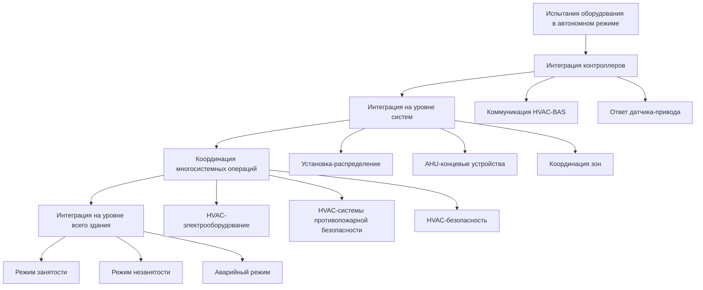
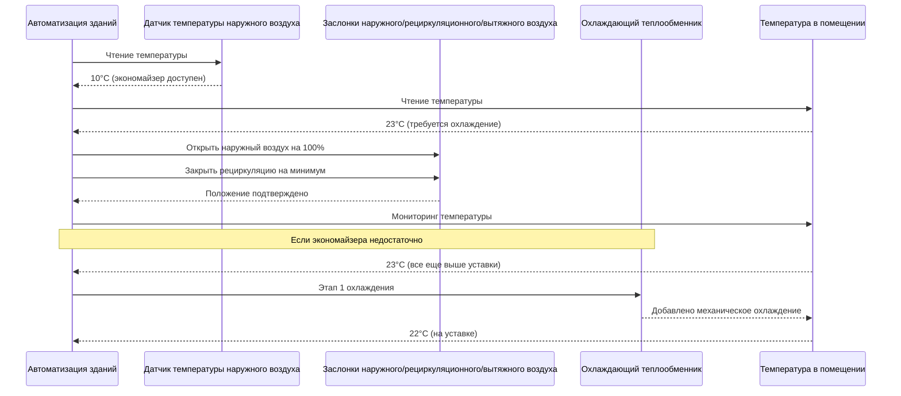
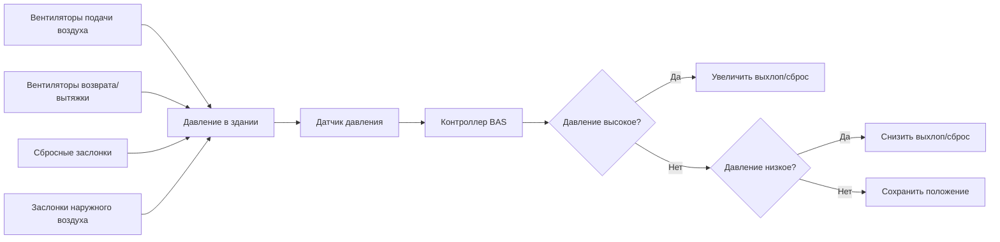
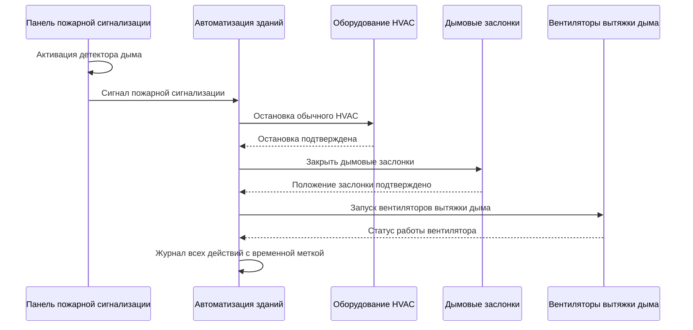

Испытания интеграции систем проверяют скоординированную работу оборудования HVAC, средств автоматизации управления зданием, систем электроснабжения и компонентов безопасности жизнедеятельности. Испытания интеграции отличаются от испытаний отдельного оборудования тем, что они оценивают реакции систем уровня здания, взаимодействия элементов управления и производительность в динамичных условиях здания в соответствии с протоколами наладки ASHRAE Guideline 0.

## Иерархия испытаний интеграции

Испытания интеграции следуют структурированной последовательности от проверки уровня компонентов до полной координации систем здания:

## Испытание функциональности экономайзера

Испытания интеграции экономайзера проверяют правильную координацию модуляции заслонки наружного воздуха с этапами механического охлаждения, требованиями минимальной вентиляции и управлением температурой в помещении.

### Протокол последовательности испытания

**Процедура испытания экономайзера:**

1. Установить моделирование температуры наружного воздуха на 7°C, помещение в режим охлаждения при занятости
2. Задать уставку температуры в помещении 20°C
3. Проверить модуляцию заслонки наружного воздуха в положение 100% открытия
4. Подтвердить закрытие заслонки рециркуляционного воздуха на минимум (никогда полностью не закрывается)
5. Контролировать температуру смешанного воздуха, равную температуре наружного воздуха ±1°C
6. Пошагово увеличивать температуру наружного воздуха: 10°C, 13°C, 16°C, 18°C, 21°C
7. Записать положения заслонок на каждом этапе
8. Проверить этапы механического охлаждения только после достижения максимальной производительности экономайзера
9. Испытать отключение по верхнему пределу: увеличить температуру наружного воздуха на 24°C, подтвердить блокировку экономайзера
10. Проверить возврат в положение минимума наружного воздуха при блокировке экономайзера

**Критерии приемки:**

- Положение заслонки коррелирует с температурой наружного воздуха согласно последовательности управления
- Отсутствие одновременного охлаждения экономайзером и охлаждения первого этапа механическое
- Минимальный наружный воздух поддерживается при всех условиях эксплуатации
- Температура смешанного воздуха контролируется для предотвращения обледенения теплообменника

## Испытание вентиляции с управлением по требованию

Испытание интеграции управления по требованию проверяет модуляцию заслонок наружного воздуха датчиками CO₂ при сохранении минимальной требуемой кодексом вентиляции и координации с работой экономайзера.

### Реализация испытания

1. Установить базовый уровень: режим занятости с проектной нагрузкой по числу занятых
2. Записать уровни CO₂ при проектных условиях (обычно 800–1000 ppm)
3. Снизить число занятых или смоделировать снижение генерации CO₂
4. Проверить модуляцию заслонки наружного воздуха в направлении минимального положения
5. Подтвердить недопущение нарушения минимума наружного воздуха (согласно расчетам ASHRAE 62.1)
6. Увеличить число занятых или введение CO₂ для моделирования высокой занятости
7. Проверить открытие заслонки наружного воздуха для увеличения вентиляции
8. Испытать взаимодействие: активировать режим экономайзера во время работы управления по требованию
9. Подтвердить приоритет экономайзера над позиционированием заслонки управления по требованию

**Критическая координация:**

- Минимальное положение управления по требованию должно равняться требуемому минимуму наружного воздуха ASHRAE 62.1
- Работа экономайзера имеет приоритет над позиционированием заслонки управления по требованию
- Несколько зон требуют расчетов эффективности вентиляции согласно ASHRAE 62.1-2019 Приложение A

## Испытание герметизации здания

Испытание герметизации проверяет скоординированное управление системами подачи воздуха, возврата воздуха и сбросного воздуха для поддержания проектных соотношений давления в здании.

### Интеграция управления давлением

**Процедура испытания:**

1. Проверить функционирование всех систем воздуха в режиме занятости
2. Измерить давление в здании в репрезентативных местах (обычно 5–10 точек)
3. Записать базовый перепад давления: обычно +5–12 Па положительного давления
4. Закрыть входные двери, отключить сбросные заслонки (по одной модификации за раз)
5. Контролировать отклик давления, проверить модуляцию сбросной заслонки для управления давлением
6. Смоделировать условие высокого выхлопа: включить все вытяжные вентиляторы одновременно
7. Проверить сохранение давления в здании в приемлемом диапазоне
8. Испытать отклик давления во время работы экономайзера
9. Подтвердить сохранение управлением давлением уставки во время модуляции наружного воздуха

**Критерии приемки:**

- Здание поддерживает положительное давление относительно наружного воздуха (предотвращает инфильтрацию)
- Давление остается в пределах ±7 Па от уставки во время нормальной работы
- Переходные процессы давления при запуске системы ограничены ±12 Па
- Критические области (лестничные клетки, шахты лифтов) поддерживают проектные соотношения давления

## Испытание интеграции систем дымоудаления

Испытание систем дымоудаления проверяет интеграцию между системами пожарной сигнализации, средствами управления HVAC и оборудованием управления дымом. Эти испытания требуют координации с органом пожарного надзора и должны соответствовать протоколам NFPA 92.

### Последовательность управления дымом

**Протокол испытания (моделирование без аварийных ситуаций):**

1. Координировать с техником пожарной сигнализации и органами управления зданием
2. Перевести пожарную сигнализацию в режим тестирования
3. Активировать детектор дыма в обозначенной зоне
4. Проверить остановку HVAC в течение проектного времени (обычно 30–90 секунд)
5. Подтвердить закрытие и защелкивание дымовых заслонок
6. Проверить запуск вентиляторов вытяжки дыма и достижение проектного перепада давления
7. Испытать герметизацию лестничной клетки: измерить давление в лестничной клетке относительно этажа
8. Подтвердить координацию отзыва лифта и остановки HVAC
9. Сбросить пожарную сигнализацию, проверить правильный перезапуск систем HVAC

**Критические точки координации:**

- Остановка HVAC должна произойти до закрытия дымовой заслонки для предотвращения повреждения от давления
- Вентиляторы герметизации лестничной клетки переопределяют обычное управление HVAC
- Переключение на аварийное питание должно поддерживать функционирование системы дымоудаления

## Испытание автоматического переключателя аварийного питания

Испытание аварийного питания проверяет работу автоматического переключателя источника питания и последовательность перезапуска оборудования HVAC при отказе напряжения в сети.

### Последовательность переключения

1. Уведомить занимающих здание и энергоснабжающую организацию о планируемом испытании
2. Проверить включение генератора в автоматический режим, адекватный уровень топлива
3. Записать статус эксплуатации всего оборудования HVAC перед испытанием
4. Смоделировать отказ напряжения сети (открыть выключатель нормального питания)
5. Проверить переключение автоматического переключателя на аварийное питание
6. Подтвердить перезапуск оборудования HVAC на аварийных цепях согласно последовательности нагрузок
7. Контролировать стабильность напряжения и частоты во время запуска
8. Разрешить 15 минут аварийной работы
9. Переключиться обратно на питание сети
10. Проверить возврат всего оборудования к нормальной работе

**Проверка последовательности нагрузок:**

Нагрузки HVAC аварийного питания должны запускаться последовательно для предотвращения перегрузки генератора. Типичная последовательность с 5-секундными интервалами:

1. Критические вытяжные вентиляторы (вытяжные шкафы, опасные зоны)
2. Оборудование управления дымом
3. Первичные насосы охлажденной воды
4. Критические установки приточно-вытяжные
5. Насосы конденсаторной воды
6. Вентиляторы градирни

## Испытание интеграции оптимального запуска

Алгоритмы оптимального запуска предсказывают требуемое время работы HVAC до занятости для достижения комфортных условий в момент занятости при минимизации потребления энергии.

### Процедура испытания оптимизации

1. Активировать функцию оптимального запуска в BAS
2. Установить время занятости на известное значение (например, 8:00)
3. Разрешить зданию дрейфовать к уставкам режима незанятости ночью
4. Контролировать фактическое время запуска, выбранное алгоритмом оптимального запуска
5. Записать температуры помещения во время занятости
6. Оценить точность: помещения должны достичь уставки в течение 15 минут после начала занятости
7. Повторить испытание в течение нескольких дней при различных наружных условиях
8. Проверить адаптацию алгоритма к изученному тепловому отклику здания

**Проверка интеграции:**

- Оптимальный запуск переопределяет обычное запланированное время запуска
- Все связанное оборудование (котлы, холодильные машины, насосы) запускается с AHU
- Восстановление уставки происходит без чрезмерного циклирования оборудования
- Алгоритм адаптируется к сезонным изменениям и картам использования здания

## Испытание работы ночного понижения уставки

Испытание ночного понижения проверяет дрейф температуры в режиме незанятости, последовательность отключения оборудования и снижение энергии в сравнении с режимом занятости.

**Требования испытания:**

1. Конфигурировать уставки режима незанятости (обычно 13°C отопление, 29°C охлаждение)
2. Проверить переход расписания в режим незанятости
3. Подтвердить дрейф температур в помещении в направлении уставок понижения
4. Контролировать статус оборудования: некритичное оборудование должно отключиться
5. Проверить минимальную работу оборудования для сохранения пределов понижения
6. Измерить потребление энергии в течение периода незанятости
7. Сравнить с потреблением энергии при занятости (ожидается снижение на 40–60%)

Испытания интеграции представляют сходимость отдельных возможностей оборудования в скоординированные системы зданий. Систематическая проверка последовательности экономайзера, управления вентиляцией по требованию, герметизации здания, управления дымом, аварийного питания и алгоритмов оптимизации обеспечивает, что установки HVAC обеспечивают проектную производительность во всех режимах работы при сохранении безопасности и целей эффективности на протяжении всего жизненного цикла здания.
