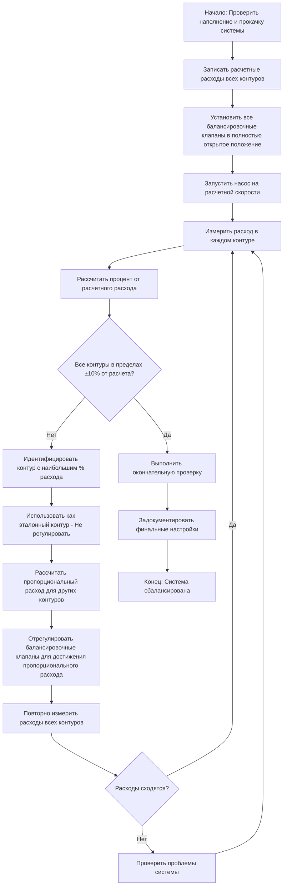
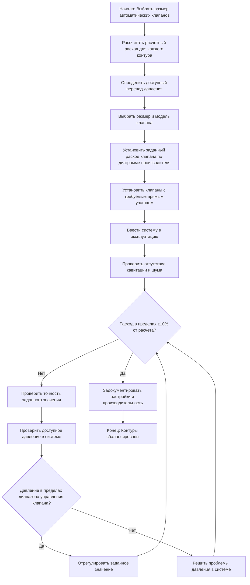

## Основы балансировки гидравлических систем

Балансировка гидравлической системы обеспечивает, что каждый конечный элемент получает расчетные расходы при расчетных перепадах давления. Правильная балансировка максимизирует эффективность теплообмена, минимизирует потребление энергии насосом и устраняет жалобы на комфортность. Процесс требует систематического измерения, регулировки и проверки в соответствии с установленными протоколами.

Стандарт ASHRAE 111 определяет процедуры испытания, регулировки и балансировки (TAB) гидравлических систем. Балансировка должна учитывать разнообразие системы, авторитет регулирующего клапана и характеристики производительности насоса для достижения стабильной работы при всех условиях нагрузки.

## Метод пропорциональной балансировки

Метод пропорциональной балансировки последовательно регулирует расходы от насоса наружу, устанавливая надлежащие соотношения потоков между параллельными контурами. Такой подход минимизирует количество итераций и сокращает время балансировки по сравнению с методами номинальных расходов.

### Последовательность пропорциональной балансировки

**Расчет пропорции**

Для каждого контура, требующего регулировки:

**Целевой расход (итерация N) = Расчетный расход × (Фактический эталонный расход / Расчетный эталонный расход)**

Это поддерживает соотношения потоков во время сходимости системы к расчетным условиям. Обычно достигается баланс за 3–5 итераций.

### Преимущества пропорциональной балансировки

- Требуется меньше итераций измерения
- Менее чувствительна к вариациям характеристики насоса
- Сохраняет соотношения контуров на протяжении всего процесса
- Подходит для сложных многозонных систем
- Естественно учитывает коэффициенты разнообразия

## Автоматические балансировочные клапаны

Автоматические (независимые от давления) балансировочные клапаны объединяют регулирование расхода с компенсацией давления, поддерживая постоянный расход независимо от колебаний давления в системе. Эти клапаны сокращают трудозатраты на балансировку и улучшают производительность регулирующих клапанов.

### Принципы работы автоматических клапанов

Автоматические балансировочные клапаны содержат встроенный регулятор дифференциального давления, который регулирует положение клапана для поддержания постоянного давления ниже по потоку. Фиксированное отверстие или регулируемый патрон устанавливает расход. Регулятор давления поглощает колебания давления в системе, обеспечивая стабильное распределение расхода.

**Ключевые параметры производительности:**

| Параметр | Типичный диапазон | Влияние на приложение |
|-----------|---------------|-------------------|
| Диапазон управления | 34–345 кПа | Максимальный перепад давления, который может регулировать клапан |
| Диапазон расхода | 0,6–126 л/мин | Диапазон регулируемой установки расхода |
| Точность | ±5% до ±10% | Отклонение расхода от заданного значения |
| Авторитет | 0,3–0,5 минимум | Авторитет регулирующего клапана с ABV |
| Перепад давления | 21–69 кПа | Потеря рабочего давления при расчетном расходе |

### Выбор автоматического балансировочного клапана

Выбирайте автоматические балансировочные клапаны на основе:

1. **Пропускная способность** - Клапан должен вмещать расчетный расход в пределах регулируемого диапазона
2. **Перепад давления** - Доступный ΔP должен находиться в пределах диапазона управления клапана
3. **Совместимость с регулирующим клапаном** - Обеспечить надлежащий авторитет для регулирующего клапана конечного элемента
4. **Требования по точности** - Критические приложения могут требовать точность ±5%
5. **Ограничения по установке** - Требования к прямому участку трубопровода, доступность

### Балансировка контура с автоматическими клапанами

**Определение заданного значения:**

Производители предоставляют диаграммы коэффициентов расхода или шкалы настройки, откалиброванные для определенных расходов. Точная регулировка заданного значения требует:

- Проверки ориентации клапана (направления потока)
- Использования инструмента настройки производителя или диаграммы
- Подтверждения портов давления выше и ниже по потоку
- Документирования положения патрона или показаний шкалы

## Стратегии балансировки контура

### Балансировка последовательного контура

Для контуров с несколькими катушками последовательно (каскадные расположения) выполняйте балансировку от самого дальнего элемента обратно к насосу. Каждый балансировочный клапан компенсирует сопротивление выше по потоку, обеспечивая надлежащее распределение расхода.

### Балансировка параллельного контура

Параллельные контуры требуют одновременного рассмотрения всех ветвей. Идентифицируйте эталонный контур (путь с наибольшим сопротивлением) и используйте пропорциональную балансировку для регулировки остальных контуров относительно эталонного.

### Обратный возврат в сравнении с прямым возвратом

**Системы с обратным возвратом** теоретически саморегулируются, если размеры труб правильные. Проверьте расходы, но ожидайте минимальной регулировки балансировочного клапана. Проверьте ошибки установки, если требуется значительное дросселирование.

**Системы прямого возврата** демонстрируют врожденный дисбаланс, благоприятствующий контурам, расположенным ближайшим к насосу. Они требуют более агрессивного дросселирования балансировочного клапана на близких контурах и минимальной регулировки на дальних контурах.

## Оптимизация системы

### Регулировка скорости насоса

После достижения пропорционального баланса расхода оптимизируйте скорость насоса для минимизации потребления энергии. Если балансировочный клапан эталонного контура закрыт более чем на 50%, уменьшите скорость насоса и повторно проверьте расходы. Целевой перепад давления на балансировочном клапане эталонного контура составляет 21–48 кПа для надлежащего авторитета управления и точности измерения.

### Авторитет регулирующего клапана

Проверьте авторитет регулирующего клапана для каждого конечного элемента:

**Авторитет (N) = ΔP_клапана_полностью_открыт / ΔP_всего_контура**

Минимальный авторитет 0,25–0,30 обеспечивает стабильное управление. Низкий авторитет вызывает плохую управляемость и колебания. При необходимости отрегулируйте балансировочные клапаны для увеличения сопротивления контура.

### Учет разнообразия

Системы, спроектированные с коэффициентами разнообразия (не все терминалы одновременно с полной нагрузкой), могут показывать общий расход ниже суммы отдельных расчетных расходов. Проверьте предположения о разнообразии с владельцем и проектировщиком перед регулировкой выхода насоса.

## Методы полевых измерений

**Методы измерения расхода:**

- **Показания балансировочного клапана** - Наиболее точно при правильной калибровке
- **Пластины Вентури/дросселя** - Устройства с фиксированным перепадом давления
- **Ультразвуковые расходомеры** - Неинтрузивное измерение с зажимом
- **Дифференциальная температура** - Расчет теплопередачи (Q = 88,9 × л/мин × ΔT в кДж/ч)

**Измерение перепада давления:**

Используйте откалиброванные датчики дифференциального давления или манометры с точностью ±0,25%. Убедитесь, что порты испытаний правильно установлены в соответствии с требованиями производителя — обычно 5–10 диаметров трубы прямого участка выше по потоку.

## Требования к документированию

Полная документация по балансировке включает:

- Начальные и окончательные измерения расхода для всех контуров
- Положения балансировочных клапанов (обороты от закрытия или установки заданного значения)
- Условия работы насоса (скорость, мощность, давление)
- Положения регулирующего клапана при балансировке
- Показания давления системы в ключевых местах
- Рассчитанное разнообразие системы
- Недостатки, выявленные при балансировке
- Окончательный анализ характеристики системы

Стандарт ASHRAE 111 определяет форматы отчетности и допуски. Приемлемый окончательный допуск обычно составляет ±10% расчетного расхода для отдельных контуров, при этом общий расход системы должен быть в пределах ±5% от расчетного.

## Распространенные проблемы балансировки

**Недостаточное давление насоса** - Эталонный контур не может достичь расчетный расход даже при полностью открытом балансировочном клапане. Требуется модификация насоса или переделка системы.

**Избыточное давление насоса** - Все балансировочные клапаны значительно дроссельные. Уменьшите скорость насоса или диаметр рабочего колеса для улучшения эффективности.

**Взаимодействие регулирующего клапана** - Автоматические регулирующие клапаны, модулирующие во время балансировки, вызывают нестабильные показания. Заблокируйте клапаны в фиксированном положении или координируйте с подрядчиком управления.

**Воздух в системе** - Помешает измерению расхода и вызывает нестабильные показания. Повторно прокачайте систему перед продолжением балансировки.

**Кавитация** - Чрезмерное дросселирование вызывает шум и повреждение клапана. Увеличьте размер клапана или уменьшите давление выше по потоку.

---

**Ссылки:**
- Стандарт ASHRAE 111: Измерение, испытание, регулировка и балансировка систем HVAC зданий
- Справочник ASHRAE—Системы и оборудование HVAC, глава по гидравлическому отоплению и охлаждению
- Стандарты и руководства по балансировке Hydronic Institute
