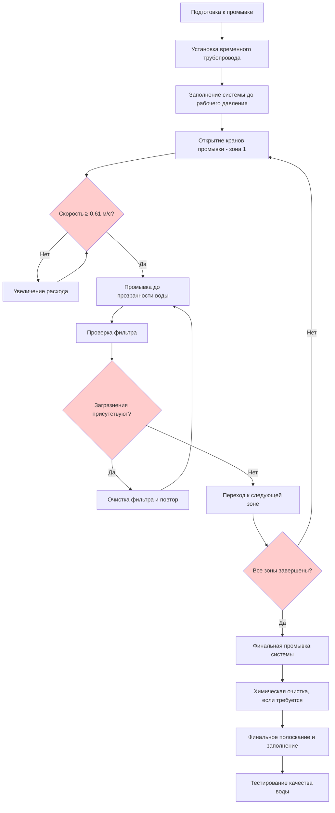
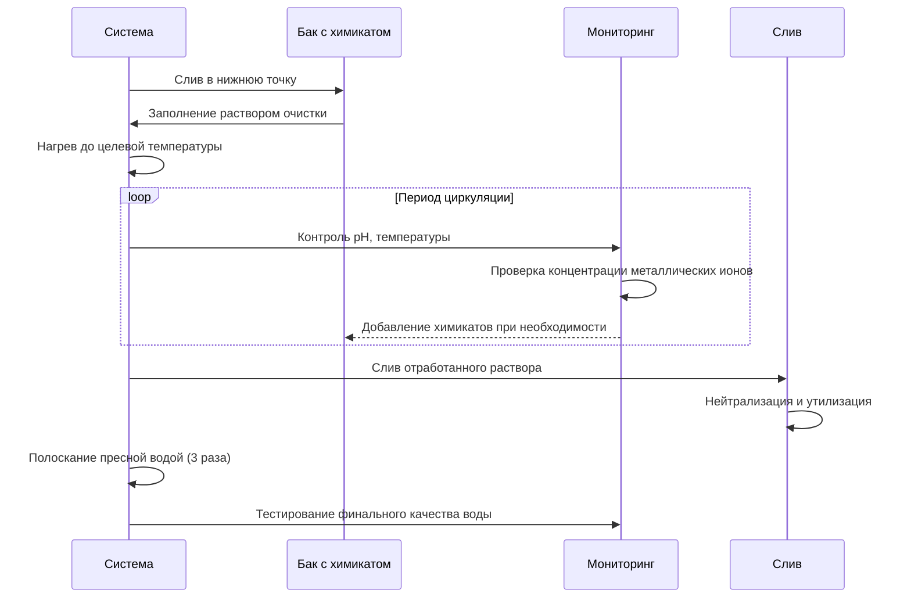

## Требования к промывке системы

Надлежащая промывка гидравлических систем удаляет строительные загрязнения, окалину труб, сварочные брызги, остатки флюса и другие загрязнители, которые могут повредить оборудование, снизить эффективность теплопередачи и нарушить производительность системы. Промывка системы — это критически важное мероприятие при вводе в эксплуатацию, которое должно быть выполнено перед запуском оборудования и финальной балансировкой.

## Критерии скорости промывки

### Требования минимальной скорости

Основное требование для эффективной промывки системы — достижение достаточной скорости воды для мобилизации и транспортировки загрязнений:

| Тип системы | Минимальная скорость промывки | Целевая скорость |
|-------------|---------------------------|-----------------|
| Охлажденная вода | 0,61 м/с | 0,91–1,22 м/с |
| Горячая вода | 0,61 м/с | 0,91–1,22 м/с |
| Вода конденсатора | 0,76 м/с | 1,22–1,52 м/с |
| Магистральные трубопроводы большого диаметра (>152 мм) | 0,76 м/с | 1,22 м/с |

**Физическая основа:** Требование минимальной скорости 0,61–0,91 м/с основано на силе сопротивления, необходимой для мобилизации типичных строительных загрязнений. При скоростях ниже 0,61 м/с частицы оседают в горизонтальных трубопроводах и зонах с низкой скоростью, а при скоростях выше 0,91 м/с обеспечивается турбулентный поток (Re > 4000 для типичных размеров труб), который очищает стенки трубопровода и поддерживает частицы во взвешенном состоянии.

### Расчеты расхода

Для достижения целевых скоростей промывки рассчитайте требуемые расходы:

**Q = V × A × 449 (преобразование для галлонов/ч)**

Где:
- Q = расход (л/ч)
- V = скорость (м/с)
- A = площадь поперечного сечения трубопровода (м²)
- Коэффициент пересчета для л/ч: 3600

Для круглых труб: A = π × (D/2)², где D — внутренний диаметр трубопровода в миллиметрах.

**Пример:** Для трубопровода 152 мм (ID = 154 мм):
- A = 0,01863 м²
- Для 0,91 м/с: Q = 0,91 × 0,01863 × 3600 ≈ 61 л/ч

## Процедуры промывки

### Подготовка к промывке

**Меры по защите оборудования:**

1. Изолируйте все конечное оборудование, включая змеевики, теплообменники, регулирующие клапаны и насосы
2. Снимите или перемкните рабочие колеса насоса (при необходимости установите временные катушки)
3. Закройте автоматические регулирующие клапаны или снимите приводы
4. Отключите линии датчиков дифференциального давления или закройте клапаны изоляции
5. Установите временные шунты через клапаны изоляции при необходимости
6. Убедитесь, что все фильтры чистые с установленными сетками запуска (20 меш)

### Последовательность промывки

### Систематический процесс промывки

**Подход по зонам:**

1. **Разделение системы на промываемые зоны** в соответствии с доступной пропускной способностью и расположением клапанов изоляции
2. **Начало с магистралей и стояков** — промывка от наиболее высокой отметки к точкам слива
3. **Переход к ветвям контуров** — последовательная промывка отдельных контуров
4. **Поддержание минимальной скорости** постоянно во время операций промывки
5. **Контроль прозрачности сточных вод** в точках выхода с визуальной проверкой
6. **Документирование каждой зоны** включая расходы, продолжительность и наблюдаемые условия

### Продолжительность промывки

Продолжайте промывку каждой зоны до:
- Видимо прозрачной воды на выходе в течение минимум 15 минут
- Минимального накопления загрязнений на сетках фильтра
- Стабилизации показаний мутности ниже 10 NTU
- Отсутствия видимых частиц в собранных образцах

Типичная продолжительность: 30–90 минут на зону в зависимости от размера трубопровода и начального уровня загрязнения.

## Процедуры химической очистки

### Когда требуется химическая очистка

Химическая очистка становится необходимой при:
- Системах с чрезмерными отложениями окалины, ржавчины или продуктов коррозии
- Невозможности достижения приемлемой чистоты только механической промывкой
- Требованиях производителей оборудования к химической очистке
- Системах, бывших в эксплуатации и требующих восстановления

### Выбор очищающего средства

| Тип загрязнения | Рекомендуемый очиститель | Концентрация | Температура |
|------------------|---------------------|---------------|-------------|
| Окалина, ржавчина | Кислота с ингибитором | 5–15% | 49–66°C |
| Смазка, масло | Щелочной моющий раствор | 2–5% | 60–82°C |
| Биологические отложения | Биоцид + диспергатор | По рекомендации производителя | 21–32°C |
| Смешанные отложения | Последовательная обработка | Варьируется | Варьируется |

**Критические соображения:**

1. **Совместимость материалов:** Проверьте совместимость очистителя со всеми материалами системы, включая металлы, прокладки и покрытия
2. **Требования ингибиторов:** Используйте ингибиторы коррозии в составах кислотной очистки для предотвращения атаки на основные металлы
3. **Нейтрализация:** Спланируйте надлежащую нейтрализацию и утилизацию отработанных растворов очистки
4. **Время контакта:** Следуйте рекомендациям производителя по времени циркуляции (обычно 4–24 часа)

### Протокол химической очистки

**Требования после очистки:**

1. Тщательное полоскание системы пресной водой до возврата pH к значению 7,0–8,5
2. Финальная промывка при проектных скоростях потока
3. Тестирование химического состава воды на остатки очищающих средств
4. Добавление ингибиторов коррозии и химикатов обработки
5. Документирование всех операций очистки и результатов испытаний

## Проверка и очистка фильтра

### Частота проверок

**Во время операций промывки:**
- Первоначальная проверка: после первых 15 минут промывки
- Последующие проверки: каждые 30 минут до прекращения накопления загрязнений
- Финальная проверка: после достижения прозрачного выхода

**После запуска системы:**
- Ежедневные проверки в течение первой недели
- Еженедельные проверки в течение первого месяца
- Ежемесячные проверки до стабилизации загрязнений

### Анализ фильтра

Изучите собранные загрязнения на:

1. **Идентификация типа:** Сварочные брызги, окалина, песок, металлические стружки, герметик для резьбы
2. **Оценка количества:** Документируйте объем и распределение
3. **Определение источника:** Проследите происхождение загрязнений для выявления проблемных зон
4. **Характеристика размера:** Крупные частицы указывают на неадекватную предварительную фильтрацию

**Корректирующие действия в зависимости от результатов:**

- Массивное накопление сварочных брызг: Дополнительная промывка сварных участков
- Непрерывное накопление тонких частиц: Временная установка сеток меньшего размера
- Определенные типы загрязнений: Целевая очистка выявленных проблемных зон
- Постоянное накопление: Продленный период промывки или химическая очистка

### Установка постоянного фильтра

После завершения промывки системы:

1. Замените коarse стартовые сетки (20 меш) на постоянные сетки (40–60 меш)
2. Установите сборки продувки на крупные фильтры для очистки в рабочем режиме
3. Проверьте функциональность датчиков дифференциального давления
4. Установите точки сигнализации при 35–48 кПа для автоматического уведомления
5. Создайте план регулярной проверки и очистки

## Тестирование качества воды

### Анализ воды после промывки

Проверьте чистоту системы с помощью лабораторного анализа:

| Параметр | Критерии приемки | Метод испытания |
|-----------|---------------------|-------------|
| Мутность | < 10 NTU | Нефелометрический |
| Общие взвешенные твердые вещества | < 25 мг/л | Гравиметрический |
| pH | 7,0–9,5 | Электродный |
| Железо | < 1,0 мг/л | Колориметрический |
| Медь | < 0,5 мг/л | Колориметрический |
| Хлориды | < 100 мг/л | Титрование |

### Добавление химикатов обработки

После достижения приемлемого качества воды:

1. Добавьте ингибиторы коррозии в соответствии с рекомендациями производителя
2. Отрегулируйте pH до оптимального диапазона (обычно 8,0–9,0 для систем со стальными компонентами)
3. Создайте программу биоцидной обработки для открытых систем
4. Добавьте гликоль при необходимости защиты от замерзания
5. Документируйте исходную химию воды для последующего мониторинга

## Требования к документации

**Полная документация промывки должна включать:**

- Схему системы, показывающую зоны и последовательность промывки
- Расходы и рассчитанные скорости для каждой зоны
- Продолжительность промывки и общий объем использованной воды
- Результаты проверки фильтра с фотографиями
- Результаты анализа качества воды (до и после промывки)
- Процедуры химической очистки и информационные листки о безопасности материалов
- Процедуры изоляции оборудования и восстановления
- Подписание уполномоченным лицом при вводе в эксплуатацию и представителем собственника

Эта документация становится частью постоянного руководства по эксплуатации и техническому обслуживанию объекта и предоставляет исходные данные для будущего обслуживания системы.

## Стандарты и справочные материалы

- **ASHRAE Handbook - HVAC Systems and Equipment, Chapter 43:** Содержит подробное руководство по водоподготовке и подготовке системы
- **ASHRAE Guideline 0-2019:** Требования процесса ввода в эксплуатацию, включая проверку промывки системы
- **ASHRAE Guideline 3-2012:** Проверка качества установки HVAC систем
- **NEBB Procedural Standards:** Тестирование, регулировка и балансировка систем управления окружающей средой
- **ASTM D2777:** Стандартная практика отложений, образованных водой в закрытых системах охлаждающей воды

---

**Связанные темы:**
- Обзор тестирования гидравлических систем
- Тестирование производительности насосов
- Процедуры измерения расхода
- Программы обработки воды
