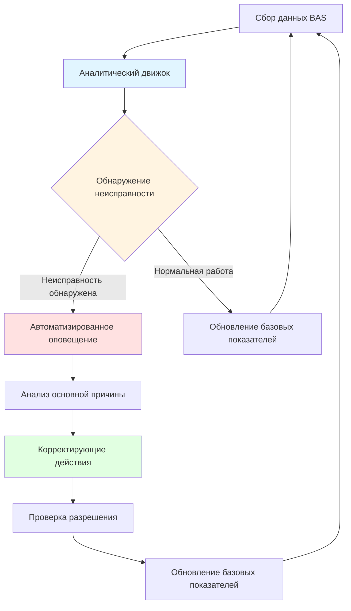
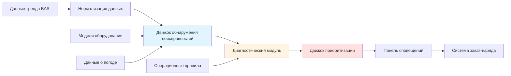
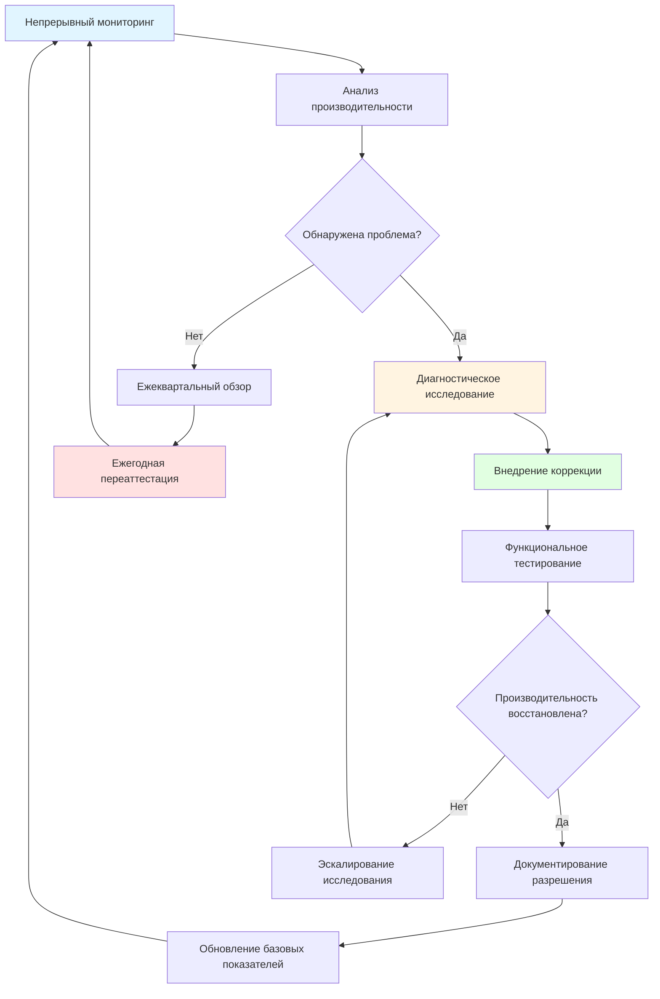

# Постоянный комиссионинг и производительность здания

Постоянный комиссионинг (OCx) представляет собой систематический процесс поддержания, улучшения и оптимизации производительности систем здания на протяжении всего операционного периода жизни объекта. В отличие от первоначального комиссионинга, который проверяет соответствие новых или модернизированных систем проектным намерениям, постоянный комиссионинг решает проблемы деградации производительности, операционного дрейфа и меняющихся требований зданий, которые возникают с течением времени.

## Структура непрерывного комиссионинга

Непрерывный комиссионинг выходит за рамки реактивного устранения неполадок и переходит к проактивной оптимизации производительности. ASHRAE Guideline 0.2 определяет постоянный комиссионинг как "процесс, который поддерживает и улучшает производительность здания с течением времени путем выявления и исправления дефицитов систем и оптимизации работы систем".

**Основные виды деятельности OCx:**

- Систематические тренды производительности и анализ
- Периодическое функциональное тестирование критических последовательностей
- Бенчмаркинг потребления энергии в сравнении с базовыми показателями
- Обучение операторов и передача знаний
- Обновление документации, отражающей операционные изменения
- Измерение и проверка улучшений энергоэффективности

Непрерывный характер отличает OCx от периодических событий переаттестации. Мониторинг производительности происходит непрерывно через системы автоматизации зданий, с формальными проверками, проводимыми ежеквартально или ежегодно в зависимости от сложности и критичности объекта.

## Мониторинговый комиссионинг

Мониторинговый комиссионинг (MBCx) использует автоматизированный сбор данных из систем управления зданием для выявления проблем производительности без ручного тестирования. Этот подход преобразует комиссионинг из периодических событийных деятельностей в непрерывную оптимизацию, управляемую данными.

**Этапы внедрения MBCx:**

1. **Идентификация точек данных** - Выбор критических параметров системы, представляющих показатели производительности (температура воздуха на выходе, эффективность чиллера, температуры в зонах, положения заслонок)

2. **Установление базовых показателей** - Сбор данных производительности во время проверенной оптимальной работы, установление ожидаемых диапазонов для сравнения

3. **Разработка правил** - Создание правил обнаружения неисправностей на основе физических соотношений, последовательностей управления и характеристик оборудования

4. **Автоматизированный мониторинг** - Непрерывное сравнение данных в реальном времени с базовыми показателями и физическими ограничениями

5. **Генерирование оповещений** - Уведомление операторов при отклонениях, превышающих пороги, с приоритизацией проблем по влиянию на энергию и последствиям для комфорта

## Обнаружение неисправностей и диагностика

Системы обнаружения неисправностей и диагностики (FDD) автоматизируют выявление и диагностику проблем оборудования и систем управления. FDD представляет аналитическое ядро мониторингового комиссионинга, применяя алгоритмы для выявления операционных отклонений.

### Методологии FDD

**Обнаружение на основе правил** применяет знания эксперта, кодифицированные как логические правила. Примеры правил включают:

- Если температура наружного воздуха < 13°C и положение заслонки экономайзера > 50%, то неисправность застрявшей заслонки экономайзера
- Если температура воздуха на выходе - уставка температуры в зоне > 1,7°C в течение > 30 минут, то неисправность холодопроизводительности
- Если мощность чиллера (кВт)/холодопроизводительность (кВ) > базовое на 15%, то загрязнение конденсатора или проблема с заправкой хладагентом

**Статистические методы** выявляют отклонения от ожидаемой производительности с использованием регрессионных моделей, статистического управления процессом или алгоритмов машинного обучения, обученных на исторических данных.

**Подходы на основе физической модели** сравнивают измеренную производительность с термодинамическими моделями первого принципа, выявляя деградацию в коэффициентах теплопередачи, эффективности насосов или производительности вентиляторов.

### Распространенные категории неисправностей

| Тип неисправности | Метод обнаружения | Влияние |
|---|---|---|
| Застрявшие заслонки/клапаны | Отклонение положения от команды | Потери энергии, проблемы с комфортом |
| Дрейф датчика/отказ | Кросс-корреляция, ограничения диапазона | Ложные тревоги, неправильное управление |
| Одновременное отопление/охлаждение | Анализ энергетических потоков | Потери энергии |
| Блокировка экономайзера | Доля наружного воздуха в сравнении с условиями | Упущенное свободное охлаждение |
| Переопределение расписания | Время работы в сравнении с расписанием занятости | Ненужная работа |
| Охота контура управления | Обнаружение высокочастотных колебаний | Износ оборудования, нестабильность |

### Архитектура системы FDD

Эффективное внедрение FDD требует откалиброванных входных данных, проверенных правил обнаружения неисправностей и интеграции с рабочими процессами обслуживания. Показатели ложных срабатываний должны оставаться низкими для сохранения доверия оператора и предотвращения усталости от оповещений.

## Процесс постоянного комиссионинга

Систематический процесс OCx следует циклической схеме мониторинга, анализа, коррекции и проверки:

**Ежемесячные виды деятельности:**
- Проверка оповещений и тенденций FDD
- Проверка калибровки датчиков на критических точках
- Проверка работы последовательности управления
- Анализ моделей потребления энергии

**Ежеквартальные виды деятельности:**
- Проведение функциональных тестов производительности критических систем
- Обновление сезонных уставок и расписаний
- Проверка логов оператора на предмет повторяющихся проблем
- Бенчмаркинг производительности энергии в сравнении с целевыми показателями

**Ежегодные виды деятельности:**
- Комплексное функциональное тестирование системы
- Переквалибровка датчиков и счетчиков
- Обновление последовательностей управления для повышения эффективности
- Переподготовка операторов
- Обновление документации

## Аналитика зданий и показатели производительности

Платформы аналитики зданий агрегируют данные из нескольких источников, обеспечивая комплексное понимание производительности сверх мониторинга отдельных систем.

**Ключевые показатели производительности:**

- Интенсивность потребления энергии (EUI) - кДж/м²/год в сравнении с базовыми показателями и подобными зданиями
- Показатели эффективности системы - кВ/кВ холодопроизводительности для чиллеров, мощность вентилятора на м³/ч, эффективность котла
- Показатели комфорта - процент занятых часов, соответствующих уставкам температуры и влажности
- Часы работы оборудования - отслеживание интервалов обслуживания и планирования жизненного цикла
- Способность реагирования на спрос - доступная емкость сброса нагрузки во время пиковых событий

Передовая аналитика выявляет возможности оптимизации через:

- Анализ профилей нагрузки, выявляющий неэффективность расписания
- Оптимизацию ступенчатости оборудования, снижающую потери переключения
- Стратегии сброса уставок на основе фактических нагрузок
- Прогнозное обслуживание с использованием тенденций деградации производительности

## Сезонная переаттестация

Сезонные переходы требуют систематической проверки того, что последовательности управления надлежащим образом реагируют на изменение наружных условий и профилей нагрузок.

**Контрольный список весеннего перехода:**
- Проверка активации экономайзера при надлежащих температурах наружного воздуха
- Тестирование запуска и ступенчатости системы холодной воды
- Регулировка расходов вентиляции для увеличения использования наружного воздуха
- Отключение систем отопления и проверка блокирующих элементов управления
- Проверка переключения управления влажностью на режим осушки

**Контрольный список осеннего перехода:**
- Проверка работы системы отопления и предохранительных блокировок
- Тестирование ступенчатости котла и управления наружным сбросом
- Снижение наружного воздуха до минимальных расходов вентиляции
- Активация систем увлажнения, где применимо
- Проверка последовательностей защиты от замерзания для оборудования с воздушным охлаждением

## Рассмотрения по внедрению

Успешный постоянный комиссионинг требует организационной приверженности сверх технических инструментов.

**Требования к персоналу:**
- Выделенная комиссионинговая авторитет или менеджер энергии
- Обучение операторов здания принципам OCx
- Доступ к специалистам управления для модификаций последовательностей
- Интеграция с командами обслуживания и капитального планирования

**Инфраструктура технологии:**
- Система автоматизации здания с возможностью комплексного отслеживания (минимум 15-минутные интервалы)
- Программное обеспечение FDD, интегрированное с данными BAS
- Измерение энергии на уровне системы и всего здания
- Облачная аналитика для портфелей многозданий

**Анализ затрат и выгод:**

Исследования документируют, что OCx обеспечивает экономию энергии в размере 5-20% с периодами окупаемости 1-3 года. Помимо прямой экономии энергии, преимущества включают продление срока службы оборудования, снижение экстренного ремонта, улучшение комфорта и сохранение эффективности системы с течением времени.

ASHRAE Guideline 0.2 предоставляет подробные процедуры внедрения, устанавливая отраслевые стандарты для программ постоянного комиссионинга. Аналитика зданий и автоматизированные системы FDD снижают требования к рабочей силе, одновременно улучшая скорость обнаружения и точность, что делает непрерывную оптимизацию экономически жизнеспособной для объектов всех размеров.

Постоянный комиссионинг трансформирует операцию зданий из реактивного обслуживания в проактивное управление производительностью, обеспечивая сохранение проектных намерений систем и адаптацию к развивающимся операционным требованиям на протяжении всего срока их полезной жизни.
