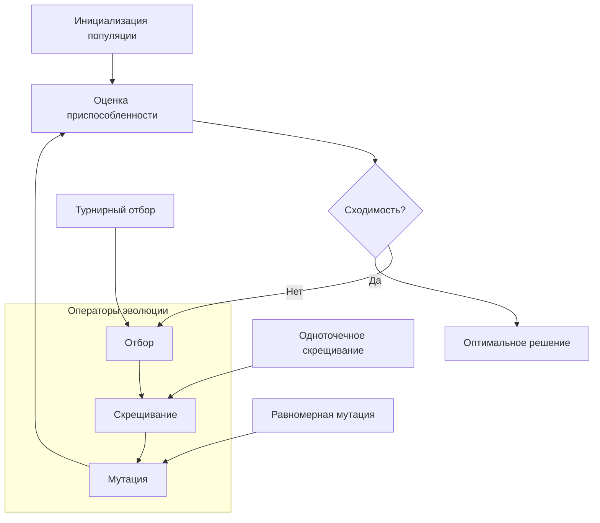
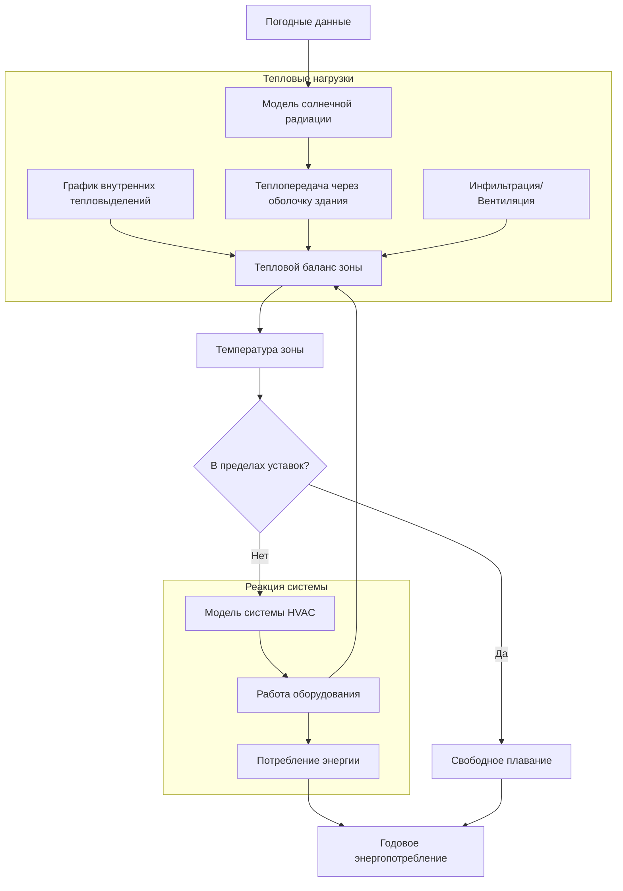

# Вычислительные методы в исследованиях HVAC

Вычислительные методы трансформируют инженерное дело HVAC из эмпирической практики в количественную науку. Численные методы решают управляющие уравнения теплопередачи, течения жидкости и переноса массы, определяющие поведение систем. Продвинутые алгоритмы оптимизируют конструкции, прогнозируют производительность и позволяют проводить виртуальное прототипирование до физического строительства. Эти методы ускоряют инновации, снижая затраты на разработку и повышая энергоэффективность.

## Фундаментальные управляющие уравнения

Системы HVAC подчиняются законам сохранения массы, импульса, энергии и видовых веществ. Вычислительные методы дискретизируют и решают эти дифференциальные уравнения в частных производных в пространственных и временных доменах.

### Сохранение массы

Для сжимаемого потока с переносом видовых веществ:

$$
\frac{\partial \rho}{\partial t} + \nabla \cdot (\rho \mathbf{u}) = S_m
$$

Где $\rho$ — плотность (кг/м³), $\mathbf{u}$ — вектор скорости (м/с), а $S_m$ представляет собой источники, обусловленные инфильтрацией, вентиляцией или выделением влаги.

### Сохранение импульса

Уравнения Навье-Стокса управляют движением жидкости:

$$
\frac{\partial (\rho \mathbf{u})}{\partial t} + \nabla \cdot (\rho \mathbf{u} \mathbf{u}) = -\nabla p + \nabla \cdot \boldsymbol{\tau} + \rho \mathbf{g} + \mathbf{F}
$$

Где $p$ — давление (Па), $\boldsymbol{\tau}$ — тензор вязких напряжений, $\mathbf{g}$ — ускорение свободного падения (9.81 м/с²), а $\mathbf{F}$ представляет собой объемные силы.

### Сохранение энергии

Уравнение энергии связывает тепловые и потоковые поля:

$$
\frac{\partial (\rho h)}{\partial t} + \nabla \cdot (\rho \mathbf{u} h) = \nabla \cdot (k \nabla T) + \nabla \cdot (\mathbf{u} \cdot \boldsymbol{\tau}) + S_h
$$

Где $h$ — энтальпия (Дж/кг), $k$ — теплопроводность (Вт/(м·К)), $T$ — температура (К), а $S_h$ включает излучение, вязкую диссипацию и внутреннее тепловыделение.

### Сохранение видовых веществ

Перенос влаги и загрязняющих веществ описывается уравнением:

$$
\frac{\partial (\rho Y_i)}{\partial t} + \nabla \cdot (\rho \mathbf{u} Y_i) = \nabla \cdot (D_i \nabla Y_i) + S_i
$$

Где $Y_i$ — массовая доля вида i, $D_i$ — коэффициент диффузии (м²/с), а $S_i$ представляет собой скорости генерации или удаления.

## Методы численной дискретизации

### Метод конечных разностей (FDM)

FDM аппроксимирует производные на структурированных сетках. Для переходного теплопроводности в строительных материалах неявная схема Кранка-Никольсона обеспечивает безусловную устойчивость:

$$
\frac{T_i^{n+1} - T_i^n}{\Delta t} = \frac{\alpha}{2} \left[ \frac{T_{i+1}^{n+1} - 2T_i^{n+1} + T_{i-1}^{n+1}}{\Delta x^2} + \frac{T_{i+1}^n - 2T_i^n + T_{i-1}^n}{\Delta x^2} \right]
$$

Где $\alpha$ — температуропроводность (м²/с), индекс n обозначает временной уровень, а индекс i представляет пространственную узел.

**Применение:**
- Расчет теплового отклика стен
- Генерация коэффициентов отклика для расчета нагрузок
- Анализ теплопотерь в воздуховодах и трубах
- Моделирование грунтовых теплообменников

### Метод конечных объемов (FVM)

FVM обеспечивает сохранение величин в контрольных объемах. Дискретизированное уравнение энергии интегрируется по объему ячейки V:

$$
\int_V \frac{\partial (\rho h)}{\partial t} dV + \int_S (\rho \mathbf{u} h) \cdot d\mathbf{A} = \int_S (k \nabla T) \cdot d\mathbf{A} + \int_V S_h dV
$$

FVM естественным образом обрабатывает сложные геометрии и нестационарные сетки, сохраняя свойства сохранения.

**Применение:**
- Вычислительная гидродинамика (CFD) симуляции
- Анализ систем распределения воздуха
- Моделирование производительности теплообменников
- Системы горения и химические реакции

### Метод конечных элементов (FEM)

FEM использует вариационные принципы и функции формы для аппроксимации решений. Слабая форма минимизирует невязки в пространствах пробных функций. Для структурно-теплового сопряжения в воздуховодах:

$$
[K_{th}]\{T\} + [C_{th}]\{\dot{T}\} = \{F_{th}\} + [K_{ts}]\{u\}
$$

Где $[K_{th}]$ — теплопроводность, $[C_{th}]$ — теплоемкость, $\{F_{th}\}$ представляет тепловые нагрузки, а $[K_{ts}]\{u\}$ связывает температуру с структурным перемещением.

**Области применения:**
- Анализ тепловых мостов в ограждающих конструкциях зданий
- Проектирование панелей лучистого отопления/охлаждения
- Тепловые напряжения в компонентах оборудования
- Интеграция материалов с фазовым переходом (PCM)

## Моделирование турбулентности

Потоки в системах HVAC характеризуются турбулентностью, при этом числа Рейнольдса для внутренних потоков превышают 2300. Прямое численное моделирование (DNS) разрешает все масштабы, но требует вычислительных ресурсов, масштабирующихся как Re³. Практическая инженерия опирается на модели турбулентности.

### Усредненные по Рейнольдсу уравнения Навье-Стокса (RANS)

RANS разлагает переменные потока на средние и пульсационные компоненты. Модель k-ε решает уравнения переноса для турбулентной кинетической энергии k и скорости диссипации ε:

$$
\frac{\partial (\rho k)}{\partial t} + \nabla \cdot (\rho \mathbf{u} k) = \nabla \cdot \left[ \left( \mu + \frac{\mu_t}{\sigma_k} \right) \nabla k \right] + P_k - \rho \varepsilon
$$

$$
\frac{\partial (\rho \varepsilon)}{\partial t} + \nabla \cdot (\rho \mathbf{u} \varepsilon) = \nabla \cdot \left[ \left( \mu + \frac{\mu_t}{\sigma_\varepsilon} \right) \nabla \varepsilon \right] + C_{1\varepsilon} \frac{\varepsilon}{k} P_k - C_{2\varepsilon} \rho \frac{\varepsilon^2}{k}
$$

Где $\mu_t = \rho C_\mu k^2 / \varepsilon$ — турбулентная вязкость, а $P_k$ представляет собой генерацию турбулентности.

**Сравнение моделей:**

| Модель | Вычислительная стоимость | Точность | Лучшее применение |
|-------|-------|------|----------|
| k-ε Standard | Низкая | Средняя | Общий воздушный поток в помещении |
| k-ε RNG | Низкая | Хорошая | Зоны рециркуляции |
| k-ω SST | Средняя | Отличная | Пограничные слои, струи |
| Reynolds Stress (RSM) | Высокая | Отличная | Вихревые потоки, вращение |
| Large Eddy Simulation (LES) | Очень высокая | Максимальная | Нестационарные явления |

### Функции стенки против разрешения вблизи стенки

Обработка стенки существенно влияет на точность решения. Модели с низким числом Рейнольдса разрешают вязкий подслой (y⁺ < 5), но требуют мелких сеток. Функции стенки связывают вязкий слой с использованием логарифмических профилей (30 < y⁺ < 300), что снижает вычислительные требования.

Безразмерное расстояние до стенки определяется как:

$$
y^+ = \frac{\rho u_\tau y}{\mu}
$$

Где $u_\tau = \sqrt{\tau_w / \rho}$ — скорость трения, а $\tau_w$ — напряжение сдвига на стенке.

## Алгоритмы оптимизации

Проектирование систем HVAC включает многокритериальную оптимизацию, балансирующую энергопотребление, тепловой комфорт, качество воздуха в помещении и стоимость.

### Градиентные методы оптимизации

Для дифференцируемых целевых функций градиентные методы эффективно находят локальные оптимумы. Алгоритм последовательного квадратичного программирования (SQP) решает задачу:

$$
\min_{x} f(x) \quad \text{при условиях} \quad g_i(x) \leq 0, \quad h_j(x) = 0
$$

Путем итеративного решения квадратичных подзадач с использованием аппроксимаций гессиана.

**Области применения:**
- Оптимизация подбора оборудования
- Настройка параметров управления
- Проектирование воздуховодов и трубопроводных сетей
- Оптимизация геометрии теплообменников

### Генетические алгоритмы (GA)

Стохастический поиск на основе популяции исследует пространство проектирования без использования градиентной информации. GA имитирует биологическую эволюцию через операции отбора, скрещивания и мутации.

**Области применения:**
- Оптимизация систем VAV с несколькими зонами
- Планирование работы оборудования станции
- Подбор оборудования для систем возобновляемой энергии
- Выбор стратегии модернизации

### Оптимизация роем частиц (PSO)

PSO обновляет позиции и скорости частиц на основе индивидуальных и глобальных лучших решений:

$$
v_i^{k+1} = w v_i^k + c_1 r_1 (p_i - x_i^k) + c_2 r_2 (p_g - x_i^k)
$$

$$
x_i^{k+1} = x_i^k + v_i^{k+1}
$$

Где $w$ — вес инерции, $c_1$ и $c_2$ — когнитивные и социальные параметры, $r_1$ и $r_2$ — случайные числа, $p_i$ — лучший результат частицы, а $p_g$ — глобальный лучший результат.

**Области применения:**
- Оптимизация стратегии управления
- Планирование работы систем накопления энергии
- Конфигурация тепловых зон здания
- Проектирование топологии систем HVAC

## Моделирование энергопотребления здания

Модели энергопотребления всего здания интегрируют тепловой отклик оболочки здания, системы HVAC, внутренние тепловыделения и погодные данные посредством связанных дифференциально-алгебраических уравнений.

### Метод теплового баланса зоны

Тепловой баланс воздуха зоны учитывает все потоки энергии:

$$
\rho V c_p \frac{dT_{zone}}{dt} = \sum Q_{surf} + Q_{inf} + Q_{vent} + Q_{int} + Q_{HVAC}
$$

Где:
- $\rho V c_p \frac{dT_{zone}}{dt}$ = тепловая ёмкость зоны (Вт)
- $\sum Q_{surf}$ = конвективный теплообмен со всех поверхностей (Вт)
- $Q_{inf}$ = теплопритоки/теплопотери от инфильтрации (Вт)
- $Q_{vent}$ = теплопритоки/теплопотери от вентиляции (Вт)
- $Q_{int}$ = внутренние тепловыделения от людей, освещения и оборудования (Вт)
- $Q_{HVAC}$ = отопление/охлаждение системой HVAC (Вт)

### Метод временных рядов излучения (RTS)

Метод RTS от ASHRAE преобразует мгновенные тепловыделения в нагрузки охлаждения с помощью коэффициентов отклика временных рядов. Лучистая составляющая внутренних тепловыделений распределяется по поверхностям, а затем с временной задержкой выделяется в воздух зоны:

$$
Q_{load,t} = \sum_{i=0}^{23} Q_{gain,t-i} \cdot r_i
$$

Где $r_i$ — коэффициенты временных рядов излучения, основанные на конструкции здания и мебели.

### Рабочий процесс моделирования

## Применение машинного обучения

Алгоритмы машинного обучения дополняют модели на основе физики, выявляя закономерности в эксплуатационных данных и ускоряя вычислительно сложные симуляции.

### Обучение с учителем для прогнозирования производительности

Искусственные нейронные сети (ANN) аппроксимируют сложные взаимосвязи «вход-выход». Для прогнозирования производительности чиллеров:

$$
\text{COP} = f_{ANN}(T_{chw,out}, T_{cw,in}, \dot{Q}_{cooling}, PLR)
$$

Где сеть обучается на данных производителя или эксплуатационных измерениях для прогнозирования коэффициента производительности (COP) на основе рабочих условий.

**Области применения:**
- Кривые производительности оборудования
- Обнаружение неисправностей и диагностика
- Прогнозирование энергопотребления
- Прогнозирование теплового комфорта

### Обучение с подкреплением для управления

Q-learning и глубокое обучение с подкреплением (DRL) оптимизируют политики управления посредством взаимодействия методом проб и ошибок со средой здания. Агент обучает оптимальную политику $\pi^*$, максимизирующую совокупную награду:

$$
Q^*(s,a) = \max_\pi \mathbb{E} \left[ \sum_{t=0}^\infty \gamma^t r_t \mid s_0=s, a_0=a \right]
$$

Где $s$ — состояние (температуры зон, внешние условия), $a$ — действие (включение/выключение оборудования, уставки), $r_t$ — награда (отрицательная величина стоимости энергии и штрафа за дискомфорт), а $\gamma$ — коэффициент дисконтирования.

**Области применения:**
- Управление на основе модели (MPC)
- Оптимизация реагирования на спрос
- Управление температурой в нескольких зонах
- Диспетчеризация систем накопления энергии

### Суррогатное моделирование

Высокоточные симуляции CFD и FEM требуют от нескольких часов до дней на одну итерацию проектирования. Суррогатные модели, обученные на данных планирования экспериментов (DOE), обеспечивают оптимизацию в реальном времени. Регрессия гауссовских процессов обеспечивает количественную оценку неопределенности:

$$
y(x) = \mathcal{GP}(\mu(x), k(x,x'))
$$

Где $\mu(x)$ — функция среднего значения, а $k(x,x')$ — функция ядра, определяющая пространственную корреляцию.

**Области применения:**
- Оптимизация проектирования на основе CFD
- Калибровка моделей энергопотребления зданий
- Количественная оценка неопределенности
- Анализ чувствительности параметров

## Валидация и верификация

Руководство ASHRAE 14 и Стандарт ASHRAE 140 устанавливают протоколы для валидации моделей.

### Проверочные испытания

Верификация кода обеспечивает корректную реализацию управляющих уравнений:

1. **Баланс массы**: Проверка сохранения для замкнутых систем
2. **Баланс энергии**: Проверка соблюдения первого закона в пределах допустимой погрешности
3. **Аналитические решения**: Сравнение с точными решениями для упрощенных случаев
4. **Независимость от сетки**: Демонстрация сходимости решения при измельчении сетки
5. **Независимость от шага по времени**: Проверка адекватности временной дискретизации

### Метрики валидации

Прогнозы модели сравниваются с измеренными данными с использованием статистических метрик:

**Средняя ошибка смещения (MBE):**

$$
\text{MBE} = \frac{\sum_{i=1}^n (y_{sim,i} - y_{meas,i})}{\sum_{i=1}^n y_{meas,i}} \times 100\%
$$

Руководство ASHRAE 14 требует, чтобы MBE находилась в пределах ±10% для почасовой калибровки и ±5% для месячной.

**Коэффициент вариации среднеквадратичной ошибки (CV-RMSE):**

$$
\text{CV-RMSE} = \frac{\sqrt{\frac{1}{n}\sum_{i=1}^n (y_{sim,i} - y_{meas,i})^2}}{\bar{y}_{meas}} \times 100\%
$$

Руководство ASHRAe 14 требует, чтобы CV-RMSE находилась в пределах 30% для почасовой и 15% для месячной калибровки.

## Вычислительные ресурсы и производительность

### Аппаратные требования

| Тип анализа | Типичный размер сетки | Требуемая ОЗУ | Время работы ЦП | Рекомендуемое оборудование |
|------|---------------|----------|------|-----------------|
| Энергопотребление здания (годовое) | Уровень зоны | 1–4 ГБ | Минуты | Настольный ЦП |
| CFD, установившийся RANS | 10⁵–10⁶ ячеек | 8–32 ГБ | Часы | Рабочая станция |
| CFD, переходный RANS | 10⁶–10⁷ ячеек | 32–128 ГБ | Дни | Многопроцессорный сервер |
| LES | 10⁷–10⁸ ячеек | 128–512 ГБ | Недели | Кластер HPC |
| Оптимизация (ГА 100 поколений) | Переменная | 4–16 ГБ | Часы–Дни | Параллельный кластер |

### Параллельные вычисления

Декомпозиция области позволяет выполнять параллельные решения на системах с распределенной памятью. Ускорение следует закону Амдала:

$$
S(p) = \frac{1}{(1-f) + \frac{f}{p}}
$$

Где $p$ — количество процессоров, а $f$ — доля кода, которая может быть распараллелена. Типичные CFD-расчеты достигают 70–90% параллельной эффективности для хорошо декомпозированных задач.

## Экосистема программного обеспечения

### Коммерческие платформы

- **EnergyPlus**: Флагманский движок моделирования энергопотребления зданий от DOE
- **ANSYS Fluent/CFX**: Отраслевые стандартные пакеты CFD
- **COMSOL Multiphysics**: Связанное МКЭ для задач мультифизики
- **IES-VE**: Интегрированное моделирование производительности зданий
- **TRNSYS**: Моделирование переходных процессов с обширными библиотеками

### Инструменты с открытым исходным кодом

- **OpenFOAM**: Универсальный фреймворк CFD
- **FreeCAD + CfdOF**: Параметрическое САПР с интеграцией CFD
- **Modelica/OpenModelica**: Язык моделирования на основе уравнений
- **Python (SciPy, NumPy, TensorFlow)**: Разработка пользовательских алгоритмов
- **Julia**: Высокоскоростные технические вычисления

## Лучшие практики

**Разработка модели:**
1. Начинать с простого, постепенно добавлять сложность
2. Верифицировать каждый компонент перед связыванием
3. Документировать все допущения и упрощения
4. Ведение контроля версий для файлов модели

**Выполнение симуляции:**
1. Проводить анализ чувствительности по ключевым параметрам
2. Строго проверять критерии сходимости
3. Мониторить невязки и ошибки сохранения
4. Сохранять промежуточные результаты для отладки

**Интерпретация результатов:**
1. Валидировать по аналитическим решениям или измерениям
2. Оценивать физическую правдоподобность всех результатов
3. Количественно оценивать неопределенность в прогнозах
4. Отчитываться о вычислительных затратах и эффективности

## Перспективные направления

Развивающиеся вычислительные методы интегрируют подходы, основанные на физике, и методы, основанные на данных. Гибридные модели объединяют уравнения первого принципа с машинным обучением для повышения точности и снижения вычислительных затрат. Облачные платформы симуляции демократизируют доступ к высокопроизводительным вычислениям. Цифровые двойники непрерывно обновляют модели операционными данными, обеспечивая оптимизацию в реальном времени и прогнозирующее обслуживание.

Интеграция вычислительных методов с информационным моделированием зданий (BIM) создает бесшовные рабочие процессы от проектирования до эксплуатации. Автоматическая генерация моделей, параметрические исследования и циклы оптимизации ускоряют проектирование устойчивых зданий, обеспечивая при этом соответствие энергетическим нормам и целевым показателям производительности.

---

**Ссылки:**
- Справочник ASHRAE — Основы, Глава 19: Методы оценки и моделирования энергопотребления
- Руководство ASHRAE 14: Измерение экономии энергии, спроса и воды
- Стандарт ASHRAE 140: Стандартный метод испытаний для оценки компьютерных программ анализа энергопотребления зданий
- Патанкар, С.В. (1980). Численный теплообмен и течение жидкости. Издательство Hemisphere Publishing Corporation.
