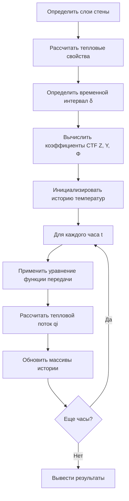

## Обзор

Функции передачи представляют собой фундаментальный вычислительный метод для расчета переходной теплопроводности через строительные конструкции и компоненты HVAC. Разработанная и стандартизированная ASHRAE, эта методика преобразует сложные дифференциальные уравнения в частных производных, управляющие тепловым потоком, в алгебраические соотношения, которые обеспечивают эффективный расчет изменяющегося во времени теплопередачи через многослойные конструкции.

Метод функции передачи учитывает эффекты теплового накопления в строительных материалах, обеспечивая точные прогнозы теплопритоков и теплопотерь, которые отражают демпфирующие характеристики и временную задержку термической массы.

## Математическая основа

### Управляющее уравнение теплопроводности

Одномерная переходная теплопроводность через плоскую стену подчиняется закону Фурье:

$$\frac{\partial^2 T}{\partial x^2} = \frac{1}{\alpha} \frac{\partial T}{\partial t}$$

Где:
- T = температура (°C)
- x = расстояние через материал (м)
- t = время (ч)
- α = тепловая диффузивность = k/(ρcp) (м²/ч)
- k = теплопроводность
- ρ = плотность
- cp = удельная теплоемкость

### Форма функции передачи

Методология функции передачи ASHRAE выражает тепловой поток на внутренней поверхности следующим образом:

$$q_i(t) = \sum_{j=0}^{n_z} Z_j \cdot T_{o,t-j\delta} - \sum_{j=1}^{n_z} Y_j \cdot T_{i,t-j\delta} - \sum_{j=1}^{n_q} \Phi_j \cdot q_{i,t-j\delta}$$

Где:
- qi(t) = текущий тепловой поток на внутренней поверхности (Вт/м²)
- Zj = коэффициенты функции передачи теплопроводности наружной поверхности
- Yj = коэффициенты перекрестной функции передачи
- Φj = коэффициенты функции передачи потока
- To,t-jδ = температура наружной поверхности j часов назад
- Ti,t-jδ = температура внутренней поверхности j часов назад
- qi,t-jδ = тепловой поток внутренней поверхности j часов назад
- δ = временной интервал (обычно 1 час)

## Коэффициенты функции передачи теплопроводности

### Свойства CTF

Коэффициенты функции передачи демонстрируют определенные математические свойства:

| Свойство | Соотношение | Физический смысл |
|----------|------------|------------------|
| Установившееся состояние | ΣZj - ΣYj = U | Общий коэффициент теплопередачи U |
| Сумма Φ | ΣΦj = 1.0 | Сохранение энергии |
| Затухание коэффициента | Φj → 0 при j → ∞ | Конечная тепловая память |
| Временная задержка | Пик Zj при j > 0 | Задержка теплового накопления |

### Расчет коэффициентов

ASHRAE предоставляет коэффициенты через:

1. **Метод поиска корней** - Решение характеристического уравнения конструкции стены
2. **Матричный подход** - Матричная формулировка тепловой сети
3. **Преобразование Лапласа** - Решение в частотной области с численной инверсией
4. **Табулированные значения** - Предварительно рассчитанные коэффициенты в Справочнике ASHRAE «Основы», Глава 18

## Метод функций отклика

### Определение функции отклика

Функции отклика представляют единичный отклик на внутренней поверхности на треугольное импульсное возбуждение на наружной поверхности:

$$q_i(t) = \sum_{j=0}^{\infty} X_j \cdot T_{o,t-j\delta} - \sum_{j=0}^{\infty} Y_j \cdot T_{i,t-j\delta}$$

Функции отклика (Xj, Yj) связаны с коэффициентами функции передачи, но распространяются на бесконечное количество членов. На практике коэффициенты, превышающие 30-50 часов, становятся пренебрежимо малыми.

### Типичные постоянные времени

Характеристики теплового отклика по типам конструкции:

| Конструкция | Постоянная времени | Задержка пикового отклика |
|-------------|-------------------|--------------------------|
| Легкий деревянный каркас | 2-4 часа | 1-2 часа |
| Кирпичный слой | 4-8 часов | 3-5 часов |
| Бетонный блок | 6-12 часов | 4-8 часов |
| Тяжелый бетон | 10-20 часов | 8-15 часов |
| В контакте с землей | 30+ часов | 20+ часов |

## Процедура реализации

### Этапы расчета

### Управление членами истории

Функции передачи требуют сохранения предыдущих значений:

- **История температур**: Ti,t-1, Ti,t-2, ..., Ti,t-nz
- **История потока**: qi,t-1, qi,t-2, ..., qi,t-nq
- **Температура наружного воздуха**: To,t, To,t-1, ..., To,t-nz

Надлежащая инициализация предотвращает влияние переходных процессов при запуске на результаты.

## Применение к расчетам холодильных нагрузок HVAC

### Метод температурного разности охлаждающей нагрузки

Значения CLTD (Cooling Load Temperature Difference) ASHRAE выводятся из расчетов функции передачи:

$$q_{roof} = U \cdot A \cdot CLTD$$

Где CLTD включает:
- Поглощение солнечного излучения
- Временная задержка термической массы
- Разность температур внутри и снаружи
- Вариации в течение суток

### Метод радиационного временного ряда

Современные процедуры расчета нагрузок (ASHRAE Handbook Fundamentals, Глава 18) используют функции передачи для:

1. Расчета мгновенных конденсационных теплопритоков
2. Преобразования радиационных теплопритоков в холодильные нагрузки с использованием функций передачи помещения
3. Учета теплового накопления в строительной массе и содержимом

## Сравнение с другими методами

| Метод | Точность | Скорость | Термическая масса | Применение |
|-------|----------|----------|-------------------|-----------|
| Функции передачи | Высокая | Быстро | Полная | Детальные нагрузки |
| Конечная разность | Очень высокая | Очень медленно | Полная | Исследования |
| Конечный элемент | Очень высокая | Очень медленно | Полная | Сложная геометрия |
| Установившееся состояние | Низкая | Очень быстро | Отсутствует | Предварительное определение размеров |
| CLTD/CLF | Средняя | Быстро | Упрощенная | Ручные расчеты |

## Преимущества и ограничения

### Преимущества

- Вычислительная эффективность для повторяющихся расчетов
- Точное решение одномерного уравнения теплопроводности для многослойных конструкций
- Точный учет эффектов термической массы
- Стандартизированная методология во всей отрасли
- Пригодность для программ почасового энергетического моделирования

### Ограничения

- Требует линейных граничных условий (постоянные коэффициенты)
- Ограничена одномерным тепловым потоком
- Многомерные эффекты (тепловые мосты) требуют отдельной обработки
- Сложность расчета коэффициентов для необычных конструкций
- Допущение постоянства свойств материалов с температурой

## Стандарты и источники

### Стандарты ASHRAE

- **ASHRAE Handbook - Fundamentals, Chapter 18**: Теплопередача - Методология функций передачи и коэффициенты
- **ASHRAE Standard 140**: Метод испытания моделирования энергии зданий - Процедуры проверки
- **ASHRAE Handbook - Fundamentals, Chapter 19**: Методы оценки энергии - Применение к расчетам нагрузок

### Реализация программного обеспечения

Основные пакеты программного обеспечения HVAC, реализующие функции передачи:

- DOE-2 и eQUEST - Подход функции отклика
- EnergyPlus - Модуль функции передачи теплопроводности
- TRACE 700 - Модифицированный метод функции передачи
- Carrier HAP - Метод радиационного временного ряда с функциями передачи

## Практические соображения

### Точность коэффициентов

Проверьте, что коэффициенты функции передачи удовлетворяют:

$$U = \frac{\sum Z_j - \sum Y_j}{1 - \sum \Phi_j}$$

Эта проверка гарантирует, что коэффициенты надлежащим образом представляют установившееся тепловое сопротивление конструкции.

### Выбор временного шага

Временные шаги один час хорошо работают для большинства строительных приложений. Более короткие временные шаги (15 минут) повышают точность для:

- Высокочастотных колебаний температуры
- Легких конструкций с короткими постоянными времени
- Определение пиковой нагрузки в критических приложениях

Функции передачи остаются вычислительной основой современных методов расчета холодильных нагрузок HVAC, обеспечивая необходимую связь между физикой зданий и практическими инженерными расчетами.
