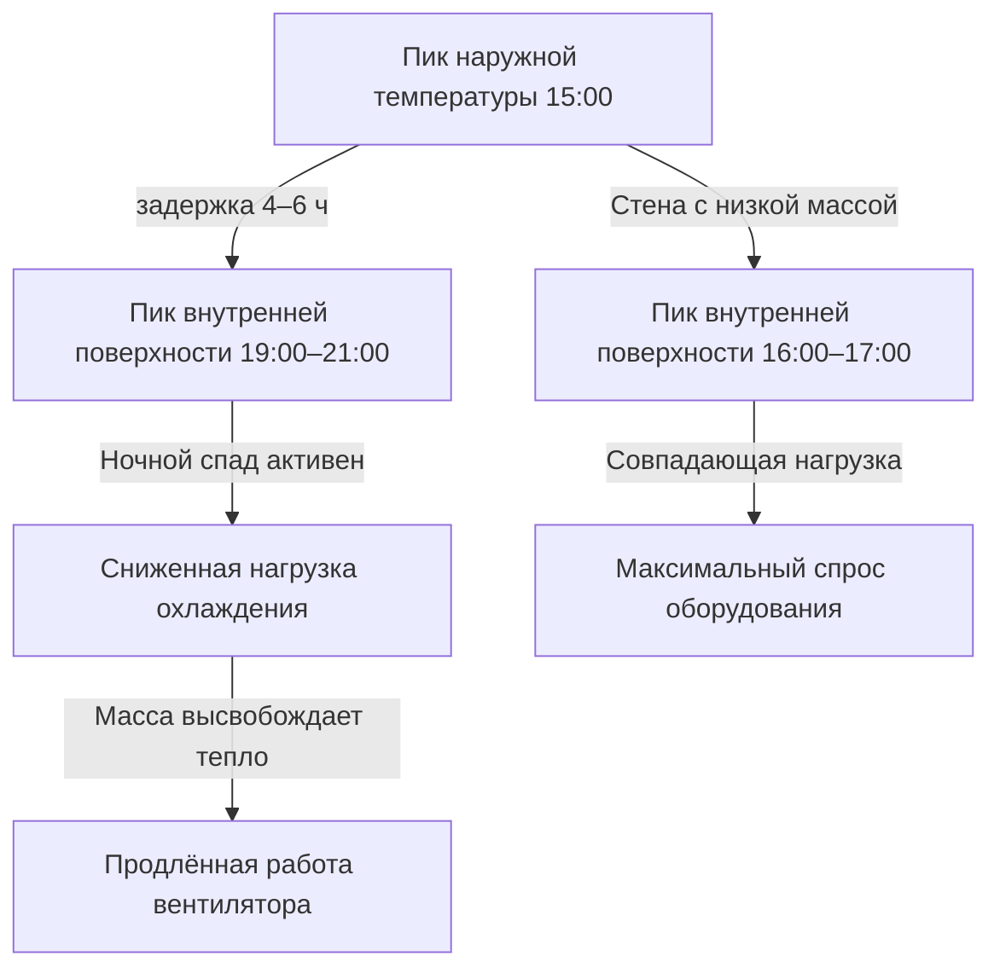

## Обзор

Методология передаточных функций ASHRAE представляет стандартный подход для динамических расчётов тепловых нагрузок зданий в инженерной практике. Метод преобразует переходный теплообмен через элементы ограждающей конструкции здания в дискретные расчёты во временной области, подходящие для анализа нагрузок с часовым шагом и определения размеров оборудования.

Фундаментальное уравнение передаточной функции связывает тепловой поток на внутренней поверхности с историей температур на обеих поверхностях:

$$q_i(\theta) = \sum_{j=0}^{n_z} Z_j \cdot T_{o,\theta-j\delta} - \sum_{j=1}^{n_z} Z_j \cdot T_{i,\theta-j\delta}$$

Где $q_i(\theta)$ представляет тепловой поток внутренней поверхности в момент времени $\theta$, $Z_j$ — коэффициенты передаточной функции, а $T_{o}$ и $T_{i}$ обозначают температуры наружной и внутренней поверхностей в интервалы времени $\delta$ (обычно 1 час).

## Приложения в жилых зданиях

Передаточные функции обеспечивают точные прогнозы нагрузок охлаждения для жилых конструкций с различными характеристиками тепловой массы. Методология учитывает:

**Лёгкие конструкции**
- Деревянные каркасные стены с минимальной тепловой массой
- Быстрый тепловой отклик на колебания наружной температуры
- Ограниченные эффекты накопления тепла, требующие меньше членов передаточной функции
- Типовая длина серии коэффициентов: 4–6 членов

**Средняя тепловая масса**
- Кирпичные облицовки или системы каменных стен
- Умеренная ёмкость накопления тепла
- Временной сдвиг между пиком солнечного прироста и внутренней теплопередачей: 2–4 часа
- Длина серии коэффициентов: 8–12 членов

Процедура расчёта нагрузки охлаждения объединяет передаточные функции проводимости с коэффициентами рядов радиационного времени (RTS):

$$Q_{cool}(\theta) = Q_{cond}(\theta) + Q_{sol}(\theta) + Q_{int}(\theta) + Q_{inf}(\theta)$$

Каждый компонент включает зависящие от времени передаточные функции, которые фиксируют эффекты теплового накопления в тепловой массе здания.

## Анализ коммерческих зданий

Коммерческие здания представляют сложные требования к расчёту нагрузок из-за переменной занятости, разнообразных внутренних источников тепла и сложных конструкций ограждения.

| Тип здания | Тепловая масса | Типовые Z-члены | Задержка пика (ч) |
|------------|----------------|-----------------|-------------------|
| Офис - Лёгкий | Низкая | 6–8 | 1–2 |
| Офис - Тяжёлый | Высокая | 12–18 | 4–6 |
| Розница | Низко-средняя | 8–10 | 2–3 |
| Учреждение | Высокая | 14–20 | 5–8 |
| Центр обработки данных | Очень низкая | 4–6 | 0–1 |

**Распределение внутренних источников тепла**

Передаточные функции распределяют мгновенные внутренние источники тепла на несколько временных шагов на основе разделения лучистого-конвективного потока и тепловой массы поверхности:

$$Q_{rad,\theta} = \sum_{j=0}^{n_r} r_j \cdot q_{int,\theta-j\delta}$$

Где $r_j$ представляет коэффициенты рядов радиационного времени, выведенные из характеристик тепловой массы здания. Здания с высокой тепловой массой проявляют значительное накопление тепла, снижая мгновенные нагрузки охлаждения и продлевая длительность нагрузки.

## Реализации для конкретных климатических зон

### Жаркие сухие климаты

Пустынная окружающая среда создаёт экстремальные суточные колебания температур (11–17°C), делая эффекты тепловой массы критическими:

- Высокие наружные температуры (35–46°C) в дневные часы
- Быстрое ночное охлаждение (18–24°C)
- Значительный теплоприраст проводимостью в часы пика
- Отложенное высвобождение тепла из тепловой массы после заката

Анализ передаточной функции выявляет оптимальные конструкции стен для этих условий:

Временной сдвиг, обеспечиваемый конструкцией с высокой тепловой массой, смещает пики нагрузок охлаждения от часов пикового спроса оборудования, снижая требуемую мощность на 15–25% в сравнении с лёгкой конструкцией.

## Здания с переменной занятостью

Образовательные учреждения, сборочные помещения и коммерческие здания с прерывистым использованием требуют специализированного применения передаточной функции:

**Анализ теплового вытягивания**

После периодов неoccupancy со снижением температуры система охлаждения должна удалить тепло, накопленное в тепловой массе здания:

$$Q_{pulldown} = Q_{steady} + \frac{C_{mass} \cdot \Delta T}{\Delta \theta}$$

Где $C_{mass}$ представляет эффективную тепловую ёмкость поверхностей помещения, а $\Delta T$ — требование по восстановлению температуры. Передаточные функции вычисляют зависящие от времени скорости удаления тепла во время вытягивания.

**Стратегии предварительного охлаждения**

Здания с высокой тепловой массой извлекают выгоду из предварительного охлаждения в часы вне пика:

1. Снизить внутреннюю температуру на 2–3°C ниже установки
2. Накопить «холодильность» в конструктивной массе
3. Позволить температуре дрейфовать в часы занятости
4. Снизить пиковую нагрузку охлаждения на 20–30%

Анализ передаточной функции определяет оптимальную длительность предварительного охлаждения и корректировку установки на основе тепловой массы стен, полов и потолков.

## Здания с высокой тепловой массой

Конструкции со значительным количеством бетона, каменной кладки или элементов, связанных с землёй, требуют расширенной серии передаточных функций:

**Определение коэффициентов**

Тяжёлая конструкция генерирует передаточные функции с 18–24 членами, охватывающими 24 часа тепловой истории. Передаточная функция для бетонной стены толщиной 30 см демонстрирует эту сложность:

$$Z = [0.189, 0.143, 0.098, 0.067, 0.045, 0.031, ..., 0.002]$$

Каждый коэффициент представляет долю прироста тепла в определённый прошлый час, который вносит вклад в текущий тепловой поток внутренней поверхности.

**Приложения**

- Подземные конструкции и здания, защищённые от земли
- Исторические здания из каменной кладки
- Системы накопления тепловой энергии
- Лучистые системы отопления/охлаждения с конструктивной массой

Методология точно прогнозирует тепловое поведение для условий проектирования и обеспечивает оптимизацию стратегий управления, которые используют тепловую массу для сдвига нагрузок и снижения спроса.

## Соображения по определению размеров оборудования

Результаты передаточной функции информируют выбор оборудования HVAC посредством:

**Определение пиковой нагрузки**
- Профили почасовых нагрузок выявляют истинный совпадающий пик
- Коэффициенты разнообразия между зонами рассчитаны правильно
- Коэффициенты безопасности применены к прогнозам передаточной функции: 1,10–1,15

**Производительность при частичной нагрузке**
- Распределение нагрузки на протяжении часов работы
- Анализ цикличности оборудования для систем переменной производительности
- Потенциал рекуперации энергии из заряда/разряда тепловой массы

Стандарт ASHRAE 183 обеспечивает руководство по применению методологии передаточной функции к решениям по определению размеров оборудования, гарантируя адекватную мощность и избегая избыточного размера, который деградирует эффективность при частичной нагрузке и управление влажностью.

## Стандарты реализации

ASHRAE Handbook—Fundamentals, Глава 18 устанавливает процедуры расчёта передаточной функции и базы данных коэффициентов для стандартных конструктивных сборок. Программные реализации должны проходить проверку на соответствие примерам ручного расчёта для обеспечения числовой стабильности и точности во всём диапазоне конфигураций зданий и климатических условий.
