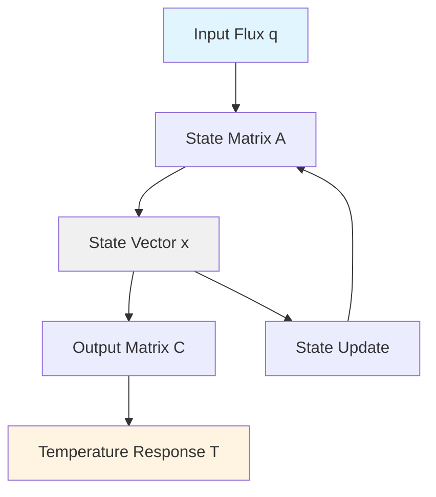
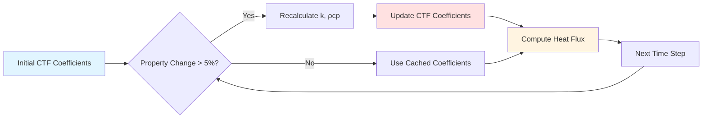

## Обзор

Методы передаточных функций, определённые в исследованиях ASHRAE, прошли значительное совершенствование с момента их введения в 1970-х годах. Современные улучшения устраняют проблемы численной устойчивости, вычислительной эффективности и ограничения точности, присущие ранним реализациям. Эти улучшения обеспечивают более надёжное энергетическое моделирование зданий в различных климатических условиях и конструктивных сборках.

## Улучшения численной устойчивости

### Анализ геометрического места корней

Ранние реализации передаточных функций проявляли неустойчивость, когда коэффициенты приближались к единице или полюсы выходили за пределы единичного круга в z-области. Современные методы применяют анализ геометрического места корней для обеспечения остаются внутри устойчивой области.

Критерий устойчивости требует:

$|z_i| < 1 \quad \text{для всех полюсов } z_i$

где полюсы являются корнями характеристического полинома:

$D(z) = d_0 + d_1 z^{-1} + d_2 z^{-2} + \cdots + d_n z^{-n}$

### Нормализация коэффициентов

Методы нормализации предотвращают переполнение коэффициентов в высокомассовых сборках. Улучшенный метод масштабирует коэффициенты по доминирующему члену:

$b_i' = \frac{b_i}{|b_0|} \quad c_i' = \frac{c_i}{|b_0|} \quad d_i' = \frac{d_i}{|b_0|}$

Это сохраняет численную точность при сохранении амплитудно-частотной характеристики передаточной функции.

## Переформулировка в пространстве состояний

Современные реализации преобразуют традиционные передаточные функции в представление пространства состояний, обеспечивая превосходные численные свойства и вычислительную эффективность.

### Преобразование в пространство состояний

Преобразование из формы передаточной функции в пространство состояний:

$\mathbf{x}(k+1) = \mathbf{A}\mathbf{x}(k) + \mathbf{B}u(k)$

$y(k) = \mathbf{C}\mathbf{x}(k) + Du(k)$

где матрица состояния **A** содержит отношения коэффициентов, **B** представляет отображение входа, а **C** определяет отношения выхода.

### Вычислительные преимущества

Формулировка пространства состояний обеспечивает:

- Прямой доступ к промежуточным тепловым состояниям
- Упрощённую обработку многовходовых многовыходовых систем
- Сокращение операций с плавающей точкой на временной шаг
- Естественную интеграцию с современными алгоритмами управления

## Адаптивные методы с переменным шагом времени

Фиксированные часовые шаги ограничивают точность при быстро изменяющихся граничных условиях. Адаптивные методы изменяют размер шага на основе градиента решения.

### Управление размером шага

Оценка локальной ошибки усечения определяет надлежащий выбор размера шага:

$\epsilon_{local} = ||y_{n+1} - \hat{y}_{n+1}||$

где $\hat{y}_{n+1}$ представляет аппроксимацию более низкого порядка. Когда $\epsilon_{local}$ превышает допуск, алгоритм уменьшает размер шага на множитель $\beta$:

$\Delta t_{new} = \beta \Delta t \left(\frac{\epsilon_{tol}}{\epsilon_{local}}\right)^{1/(p+1)}$

где $p$ представляет порядок метода.

## Методы оптимизации коэффициентов

| Метод оптимизации | Улучшение точности | Вычислительные затраты | Улучшение устойчивости |
|---------------------|---------------------|------------------------|----------------------|
| Подгонка наименьших квадратов | ±3-5% | Низкие | Умеренные |
| Метод Прони | ±1-2% | Умеренные | Высокие |
| Стейглиц-МакБрайд | ±0,5-1% | Высокие | Очень высокие |
| Полные наименьшие квадраты | ±2-3% | Умеренные | Высокие |

### Подгонка в частотной области

Современное создание коэффициентов использует оптимизацию в частотной области вместо подгонки кривых во временной области. Этот подход:

- Сохраняет фазовые соотношения через слои тепловой массы
- Минимизирует ошибки на критических частотах (суточные, недельные циклы)
- Автоматически обеспечивает ограничения причинности

Целевая функция минимизирует взвешенную ошибку:

$J = \sum_{k=1}^{N} W_k |H(j\omega_k) - H_{model}(j\omega_k)|^2$

где $W_k$ представляет частотно-зависимое взвешивание, подчёркивающее суточные и полусуточные периоды.

## Управление членами высокого порядка

Сборки с несколькими высокомассовыми слоями генерируют передаточные функции с коэффициентами 20+. Стратегии усечения сокращают вычислительную нагрузку при сохранении точности.

### Снижение порядка модели

Сбалансированное усечение сохраняет поведение вход-выход при исключении слабо управляемых или наблюдаемых состояний. Сингулярные значения Ханкеля $\sigma_i$ указывают на важность состояния:

$\sigma_1 \geq \sigma_2 \geq \cdots \geq \sigma_n$

Состояния с $\sigma_i < \epsilon_{threshold}$ подлежат исключению без значительных потерь точности.

## Гибридные аналитико-численные методы

Чистые подходы с передаточными функциями испытывают затруднения с нелинейными явлениями (материалы с фазовым переходом, перенос влаги). Гибридные методы объединяют передаточные функции для линейной теплопроводности с численными методами для нелинейных эффектов.

### Расщепление оператора

Гибридный подход разделяет линейные и нелинейные компоненты:

$\frac{\partial T}{\partial t} = \alpha \nabla^2 T + f_{nonlinear}(T)$

Передаточные функции обрабатывают член диффузии $\alpha \nabla^2 T$, а явная интеграция решает $f_{nonlinear}(T)$.

## Расширенный диапазон действительности

Исходные передаточные функции ASHRAE предполагали постоянные свойства и линейный перенос тепла. Современные расширения включают:

### Свойства, зависящие от температуры

Полиномиальные модели свойств обновляют коэффициенты на каждом временном шаге:

$k(T) = k_0 + k_1 T + k_2 T^2$

$\rho c_p(T) = (\rho c_p)_0 + (\rho c_p)_1 T$

Коэффициенты передаточной функции пересчитываются динамически, когда вариации свойств превышают 5%.

### Радиационное взаимодействие

Улучшенные методы включают линеаризованный обмен излучением в рамках передаточной функции:

$q_{rad} = h_r(T_s - T_{ref})$

где коэффициент излучения:

$h_r = 4\epsilon\sigma T_{mean}^3$

обновляется на основе средней абсолютной температуры $T_{mean}$.

## Реализация параллельной обработки

Современные многоядерные процессоры позволяют параллельно вычислять передаточные функции зон. Декомпозиция области разделяет здание на термически изолированные области, обрабатываемые одновременно.

### Балансировка нагрузки

Адаптивная балансировка нагрузки распределяет зоны между процессорами на основе вычислительной сложности:

$W_{zone} = n_{coeff} \cdot n_{surfaces} \cdot n_{timesteps}$

Эта метрика направляет отображение зона-процессор, минимизируя общее реальное время.

## Валидация против детальных численных методов

Улучшенные передаточные функции достигают согласия в пределах 2-5% решений методом конечных элементов для стандартных конструктивных сборок при условиях испытаний ASHRAE Standard 140. Отклонения превышают 10% только для сборок с:

- Материалами с фазовым переходом с латентной теплотой >94,8 кДж/кг
- Вариациями содержания влаги >5% по массе
- Внутренним тепловыделением >157,5 Вт/м³

Эти случаи требуют гибридных численных подходов или полного моделирования гидродинамики вычислительных жидкостей.

## Интеграция с современным энергетическим моделированием зданий

Современное программное обеспечение для энергетического моделирования зданий (EnergyPlus, TRNSYS) прозрачно включает эти улучшения. Пользователи извлекают выгоду из улучшенной точности без изменения процедур ввода. Ключевые точки интеграции включают:

- Автоматическую проверку устойчивости при создании коэффициентов
- Динамический выбор порядка модели на основе сложности сборки
- Параллельные вычисления зон с балансировкой нагрузки
- Обновление свойств в реальном времени для материалов с температурной зависимостью

Результат - 30-50% более быстрое моделирование с улучшенной точностью по сравнению с унаследованными реализациями передаточных функций.

---

*Связанные темы: [Тепловое моделирование](../../heat-transfer-modeling/), [Передаточные функции ASHRAE](../_index.md), [Вычислительная гидродинамика](../../cfd-methods/)*
