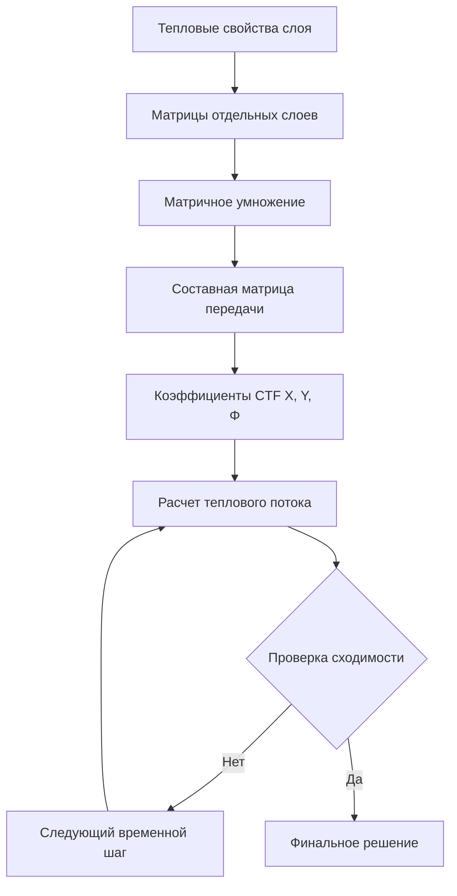

# Методология передаточных функций для теплопередачи

Метод передаточных функций ASHRAE представляет собой фундаментальный подход к расчету нестационарной теплопередачи через многослойные строительные конструкции. Эта методология преобразует дифференциальные уравнения в частных производных, управляющие теплопроводностью, в алгебраические уравнения, решаемые посредством дискретного анализа временных рядов.

## Физическая основа

Теплопроводность через ограждающие конструкции следует закону Фурье в одномерном случае:

$$q_x = -k \frac{\partial T}{\partial x}$$

Для нестационарных условий с тепловой аккумуляцией уравнение теплопроводности принимает вид:

$$\frac{\partial T}{\partial t} = \alpha \frac{\partial^2 T}{\partial x^2}$$

где тепловая диффузивность α = k/(ρc). Прямое решение этого уравнения для многослойных конструкций с временно-переменными граничными условиями требует интенсивных вычислений. Передаточные функции предоставляют эффективную альтернативу.

## Основа z-преобразования

Метод передаточных функций использует обозначение z-преобразования для представления связи между температурами поверхностей и тепловым потоком в виде отношения полиномов:

$$\frac{q(z)}{T(z)} = \frac{b_0 + b_1 z^{-1} + b_2 z^{-2} + ... + b_n z^{-n}}{1 + a_1 z^{-1} + a_2 z^{-2} + ... + a_m z^{-m}}$$

Оператор z^{-1} представляет временную задержку на один расчетный интервал (обычно 1 час для расчетов нагрузок). Эта формулировка преобразует непрерывную задачу теплопередачи в дискретное рекурсивное уравнение.

## Функции передачи теплопроводности

Для многослойной стены тепловой поток на внутренней поверхности связан с текущей и прошлой историей температур посредством функций передачи теплопроводности (CTF):

$$q_{ki} = \sum_{j=0}^{n_z} X_j T_{o,k-j\delta} - \sum_{j=0}^{n_z} Y_j T_{i,k-j\delta} + \sum_{j=1}^{n_q} \Phi_j q_{i,k-j\delta}$$

где:
- q_{ki} = тепловой поток теплопроводности на внутренней поверхности в момент времени k
- T_o = температура наружной поверхности
- T_i = температура внутренней поверхности
- X_j, Y_j = коэффициенты CTF кросс- и внутренние
- Φ_j = коэффициенты CTF потока
- δ = временной интервал

## Расчет коэффициентов CTF

Коэффициенты X, Y и Φ вычисляются на основе тепловых свойств каждого слоя методом пространства состояний или инверсией преобразования Лапласа. Для однородного слоя толщиной L:

$$X_0 = Y_0 = \frac{k}{L} \cdot \frac{2\gamma}{1+\gamma^2}$$

$$\Phi_1 = \frac{1-\gamma^2}{1+\gamma^2}$$

где γ представляет тепловой спад:

$$\gamma = \exp\left(-\sqrt{\frac{\omega \rho c}{k}} \cdot L\right)$$

Для многослойных конструкций матричное умножение матриц передачи отдельных слоев дает составные коэффициенты.

## Свойства коэффициентов

Физические требования ограничивают коэффициенты CTF:

| Свойство | Требование | Физический смысл |
|----------|-------------|------------------|
| Сумма X | Равна U-значению | Установившаяся теплопроводность |
| Сумма Y | Равна U-значению | Сохранение энергии |
| Сумма Φ | Равна нулю | Отсутствие создания энергии |
| Устойчивость | \|Φ_j\| < 1 | Ограниченный отклик |

Эти ограничения обеспечивают термодинамическую согласованность и численную стабильность.

## Интеграция серии радиационного времени

Процедуры расчета нагрузок ASHRAE объединяют CTF с факторами серии радиационного времени (RTS) для учета разделения излучательной и конвективной составляющих. Солнечное излучение, поглощаемое на внутренних поверхностях, не сразу становится охлаждающей нагрузкой; тепловая аккумуляция задерживает преобразование:

$$q_{load,k} = \sum_{j=0}^{n} r_j q_{rad,k-j\delta}$$

Коэффициенты r_j зависят от класса конструкции помещения (легкая, средняя, тяжелая) и представляют долю лучистой энергии со времени j часов назад, которая становится нагрузкой в текущем часу.

## Вычислительная реализация

Рекурсивный характер обеспечивает эффективное вычисление:

1. **Инициализация**: Сохранить историю температур и потоков для требуемых временных шагов
2. **Обновление**: Расчет текущего теплового потока с использованием уравнения CTF
3. **Сохранение**: Сохранить текущие значения для последующих итераций
4. **Продвижение**: Увеличить временной шаг и повторить

Требования к памяти масштабируются с количеством членов (обычно 3–6 для стен, больше для сильной тепловой аккумуляции).

## Требования к валидации

ASHRAE Standard 140 предоставляет тестовые случаи для валидации реализаций передаточных функций. Приемлемые методы должны соответствовать аналитическим решениям для простых случаев в пределах 1% и согласованности между моделями в пределах определенных полос допусков для сложных геометрий.

## Преимущества над альтернативными методами

**Передаточные функции против метода конечных разностей:**

| Аспект | Передаточные функции | Метод конечных разностей |
|--------|-------------------|-------------------|
| Скорость вычислений | Быстро (предварительно рассчитано) | Медленнее (расчет во время выполнения) |
| Точность | Точная для линейных систем | Зависит от сетки |
| Память | Низкая (несколько коэффициентов) | Высокая (полный массив узлов) |
| Гибкость | Фиксированная геометрия | Переменная геометрия |

**Передаточные функции против факторов отклика:**

Факторы отклика требуют интегралов свертки на каждом временном шаге, в то время как передаточные функции используют прямой рекурсивный расчет, снижая вычисления на несколько порядков для длительных симуляций.

## Ограничения и расширения

Классический метод CTF предполагает:
- Одномерную теплопередачу
- Линейные свойства материалов (постоянные k, ρ, c)
- Однородные слои
- Отсутствие переноса влаги
- Отсутствие фазового перехода

Расширения, решающие эти ограничения, включают коэффициенты, зависящие от температуры, двумерные поправочные коэффициенты и связанные модели тепло-влаги, которые изменяют эффективные тепловые свойства на основе локальных условий.

## Реализация в стандартах ASHRAE

ASHRAE Handbook—Fundamentals Глава 18 предоставляет подробные таблицы коэффициентов CTF для обычных конструкций. Метод теплового баланса (HBM) в Приложении G Standard 90.1 использует передаточные функции как основной механизм расчета теплопроводности, демонстрируя их постоянную актуальность в современном анализе энергии зданий.

Методология сбалансирована между вычислительной эффективностью и физической точностью, что делает ее основой для почасовых процедур расчета нагрузок, используемых во всем мире при проектировании систем HVAC.
