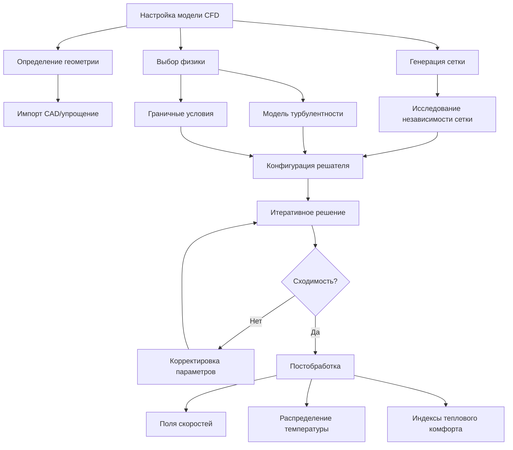
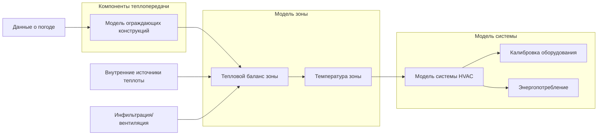

# Моделирование теплопередачи в системах HVAC

Моделирование теплопередачи формирует вычислительную основу современного проектирования HVAC, позволяя инженерам предсказывать тепловое поведение, оптимизировать производительность системы и валидировать проекты до физической реализации. Эти численные методы решают фундаментальные уравнения теплопередачи, которые управляют теплопроводностью, конвекцией и излучением в зданиях и механических системах.

## Основные режимы теплопередачи

### Теплопроводность

Теплопроводность через твердые материалы следует закону Фурье:

$$q = -kA\frac{dT}{dx}$$

Где:
- $q$ = скорость теплопередачи (Вт)
- $k$ = теплопроводность (Вт/м·К)
- $A$ = площадь сечения (м²)
- $\frac{dT}{dx}$ = градиент температуры (К/м)

Для нестационарной теплопроводности уравнение теплопроводности управляет распределением температуры во времени и пространстве:

$$\frac{\partial T}{\partial t} = \alpha \nabla^2 T$$

Где $\alpha = \frac{k}{\rho c_p}$ — коэффициент температуропроводности (м²/с).

### Конвекция

Конвективная теплопередача на границах жидкость-твердое тело выражается законом охлаждения Ньютона:

$$q = hA(T_s - T_\infty)$$

Где:
- $h$ = коэффициент конвективной теплопередачи (Вт/м²·К)
- $T_s$ = температура поверхности (К)
- $T_\infty$ = средняя температура жидкости (К)

Коэффициент конвекции зависит от режима течения, свойств жидкости и геометрии, типично характеризуется безразмерными числами (Нуссельта, Рейнольдса, Прандтля).

### Излучение

Тепловое излучение между поверхностями следует закону Стефана-Больцмана:

$$q = \varepsilon \sigma A (T_1^4 - T_2^4)$$

Где:
- $\varepsilon$ = степень черноты
- $\sigma$ = постоянная Стефана-Больцмана (5,67×10⁻⁸ Вт/м²·К⁴)
- $T$ = абсолютная температура (К)

Для сложных замкнутых пространств обмен излучением между несколькими поверхностями требует численного решения.

## Метод конечных разностей (FDM)

Метод конечных разностей дискретизирует пространственную область в сетку и аппроксимирует производные алгебраическими выражениями. Для одномерной нестационарной теплопроводности явная схема FTCS (Forward-Time Central-Space) дает:

$$\frac{T_i^{n+1} - T_i^n}{\Delta t} = \alpha \frac{T_{i+1}^n - 2T_i^n + T_{i-1}^n}{\Delta x^2}$$

Где верхний индекс $n$ обозначает временной уровень, а нижний индекс $i$ обозначает пространственное расположение.

**Преимущества:**
- Простая реализация
- Вычислительно эффективен для правильных геометрий
- Прямое решение для явных схем

**Ограничения:**
- Ограничения на устойчивость (число Фурье $Fo = \alpha \Delta t / \Delta x^2 \leq 0,5$ для явных схем)
- Трудность работы с неправильными геометриями
- Более низкая точность на грубых сетках

**Приложения HVAC:**
- Анализ теплового отклика стен
- Моделирование накопления тепловой энергии
- Переходные характеристики теплообменников
- Моделирование тепловых насосов, связанных с грунтом

## Метод конечных элементов (FEM)

FEM делит область на элементы и использует вариационные принципы для минимизации функционалов энергии. Слабая форма уравнения теплопроводности решается над каждым элементом, что дает глобальную систему уравнений:

$$[K]\{T\} + [C]\{\dot{T}\} = \{F\}$$

Где $[K]$ — матрица проводимости, $[C]$ — матрица емкости и $\{F\}$ — вектор нагрузки.

**Преимущества:**
- Обрабатывает сложные геометрии с неправильными границами
- Повышенная точность за счет функций формы
- Естественная обработка граничных условий

**Приложения HVAC:**
- Анализ тепловых мостиков в ограждающих конструкциях зданий
- Проектирование излучающих панелей отопления/охлаждения
- Анализ теплового напряжения в оборудовании
- Исследования интеграции материалов с переходом фазы (PCM)

## Вычислительная гидродинамика (CFD)

CFD решает связанные уравнения Навье-Стокса для течения жидкости и переноса энергии. Уравнения сохранения массы, импульса и энергии составляют основу:

**Непрерывность:**
$$\frac{\partial \rho}{\partial t} + \nabla \cdot (\rho \mathbf{u}) = 0$$

**Импульс:**
$$\frac{\partial (\rho \mathbf{u})}{\partial t} + \nabla \cdot (\rho \mathbf{u} \mathbf{u}) = -\nabla p + \nabla \cdot \boldsymbol{\tau} + \rho \mathbf{g}$$

**Энергия:**
$$\frac{\partial (\rho h)}{\partial t} + \nabla \cdot (\rho \mathbf{u} h) = \nabla \cdot (k \nabla T) + S_h$$

Моделирование турбулентности (k-ε, k-ω SST, LES) улавливает турбулентный перенос, критический для потоков HVAC.

**Приложения HVAC:**
- Анализ распределения воздуха в помещении
- Оценка теплового комфорта (PMV/PPD)
- Оценка эффективности вентиляции
- Оптимизация воздушного потока в оборудовании
- Моделирование переноса загрязнений

## Тепловое моделирование зданий

Моделирование энергии всего здания интегрирует множественные режимы теплопередачи с моделями систем HVAC и данными о погоде. Энергетический баланс для зоны здания:

$$\sum Q_{conduct} + \sum Q_{convect} + \sum Q_{radiant} + Q_{infiltration} + Q_{internal} = Q_{HVAC} + \frac{dU}{dt}$$

**Основные подходы моделирования:**

| Метод | Временной шаг | Пространственное разрешение | Типичное применение |
|--------|-----------|-------------------|-------------|
| Функция отклика | 1 час | На уровне зоны | Годовой анализ энергии |
| CTF (функция передачи теплопроводности) | 15 мин - 1 час | На уровне поверхности | Расчет нагрузок |
| Конечные разности | 1 мин - 1 час | Многослойные стены | Нестационарный анализ |
| FEM | Переменный | Высокая детализация | Тепловые мостики |
| CFD | Секунды - минуты | На уровне ячейки | Модели воздушного потока |

## Валидация и проверка

ASHRAE Standard 140 (Standard Method of Test for the Evaluation of Building Energy Analysis Computer Programs) предоставляет тестовые случаи для валидации инструментов моделирования. Проверка обеспечивает:

- Сохранение массы и энергии
- Независимость от сетки
- Независимость от временного шага
- Реализацию граничных условий

Экспериментальная валидация против измеренных данных из испытательных камер или контролируемых зданий устанавливает точность модели для реальных приложений.

## Инструменты программного обеспечения

Общие платформы, реализующие эти методы:

- **EnergyPlus/DOE-2**: Моделирование зданий методом конечных разностей
- **TRNSYS**: Модульное моделирование переходных систем
- **IDA ICE**: Детальное динамическое моделирование на основе уравнений
- **ANSYS Fluent/CFX**: Универсальное программное обеспечение CFD
- **COMSOL Multiphysics**: Связанное моделирование FEM
- **OpenFOAM**: Фреймворк CFD с открытым исходным кодом

## Практические соображения

**Сложность модели в сравнении с точностью:**
- Упрощенные модели достаточны для многих расчетов проектирования
- Детальное CFD требуется для критических зон комфорта или сложных геометрий
- Данные валидации определяют подходящий уровень детализации

**Вычислительные ресурсы:**
- Моделирование зданий FDM/FEM: минуты-часы
- Установившееся CFD: часы-дни
- Нестационарное CFD: дни-недели
- Высокопроизводительные вычисления позволяют параметрические исследования

**Чувствительность к граничным условиям:**
- Коэффициенты конвекции существенно влияют на результаты
- ASHRAE Fundamentals Chapter 25 предоставляет корреляции
- Измеренные данные улучшают точность для критических приложений

## Заключение

Моделирование теплопередачи предоставляет количественные инструменты для проектирования и оптимизации систем HVAC. Выбор надлежащих численных методов зависит от физики задачи, требуемой точности и вычислительных ресурсов. Интеграция этих методов с экспериментальной валидацией обеспечивает надежные прогнозы, поддерживающие энергоэффективные и комфортные условия в зданиях.

---

**Источники:**
- ASHRAE Handbook—Fundamentals, Chapter 4: Heat Transfer
- ASHRAE Handbook—Fundamentals, Chapter 19: Energy Estimating and Modeling Methods
- ASHRAE Standard 140: Standard Method of Test for the Evaluation of Building Energy Analysis Computer Programs
