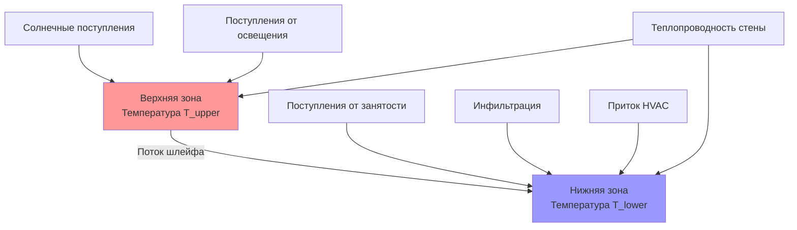
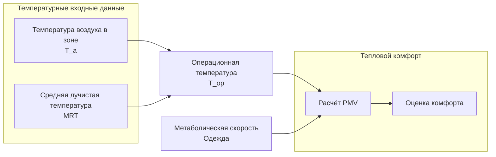

# Температурное моделирование систем HVAC

Температурное моделирование предсказывает пространственное и временное распределение температуры в кондиционируемых помещениях, позволяя выполнять точные расчеты нагрузок, анализ комфорта и проектирование систем управления. Эти модели варьируются от упрощённых одноузловых представлений до детальных многомерных распределений, учитывающих стратификацию, тепловую массу и локальные эффекты.

## Зональные температурные модели

### Одноузловая модель

Фундаментальная зональная модель рассматривает всё пространство как единый узел с равномерной температурой. Уравнение баланса энергии имеет вид:

$$m c_p \frac{dT_z}{dt} = \sum Q_{walls} + Q_{infiltration} + Q_{internal} + Q_{solar} - Q_{HVAC}$$

Где:
- $m$ = массовый расход воздуха в зоне (кг)
- $c_p$ = удельная теплоёмкость воздуха (1006 Дж/кг·К)
- $T_z$ = температура воздуха в зоне (°C)
- $Q$ = скорости теплопередачи (Вт)

Эта модель предполагает мгновенное перемешивание и равномерную температуру по всей зоне. Хотя модель упрощена, она обеспечивает точные прогнозы для хорошо перемешиваемых пространств и служит основой для большинства программ энергетического моделирования зданий.

**Применимость:**
- Коммерческие помещения с системами принудительной циркуляции воздуха
- Жилые помещения с центральным HVAC
- Предварительные расчеты проектирования
- Анализ годовой энергии

**Ограничения:**
- Не может предсказывать градиенты температуры
- Переоценивает перемешивание в стратифицированных пространствах
- Занижает пиковые нагрузки в помещениях с высокими потолками

### Двухузловая модель стратификации

Для пространств со значительной высотой или слабым перемешиванием двухузловая модель захватывает вертикальную стратификацию:

$$m_{upper} c_p \frac{dT_{upper}}{dt} = Q_{upper} + \dot{m}_{plume} c_p (T_{lower} - T_{upper})$$

$$m_{lower} c_p \frac{dT_{lower}}{dt} = Q_{lower} - \dot{m}_{plume} c_p (T_{lower} - T_{upper})$$

Массовый расход шлейфа $\dot{m}_{plume}$ зависит от мощности источника тепла и геометрии. Для точечного источника:

$$\dot{m}_{plume} = 0.071 Q^{1/3} z^{5/3}$$

Где $Q$ — конвективная тепловая мощность (Вт), а $z$ — высота над источником (м).

**Применение:**
- Складские и высокие промышленные помещения
- Атриумы и многоуровневые пространства
- Системы вытяжной вентиляции
- Подпольное распределение воздуха (UFAD)

### Многоузловые сетевые модели

Сложная геометрия требует нескольких взаимосвязанных узлов с воздушным потоком между зонами:

$$m_i c_p \frac{dT_i}{dt} = \sum Q_{conduct,i} + \sum_{j} \dot{m}_{ij} c_p (T_j - T_i) + Q_{internal,i} + Q_{HVAC,i}$$

Расходы воздуха $\dot{m}_{ij}$ между узлами рассчитываются с использованием анализа сетевого давления или указываются на основе проектирования вентиляции.

## Временная динамика температуры

### Анализ постоянной времени

Тепловая постоянная времени характеризует, как быстро зональная температура реагирует на возмущения:

$$\tau = \frac{m c_p}{UA}$$

Где:
- $UA$ = общая теплопроводность (Вт/К)
- $\tau$ = постоянная времени (секунды)

При скачкообразном изменении теплового ввода температура изменяется как:

$$T_z(t) = T_{ss} + (T_0 - T_{ss}) e^{-t/\tau}$$

**Типичные постоянные времени:**

| Тип здания | Изоляция | Постоянная времени |
|------------|----------|-------------------|
| Лёгкое жилое | Умеренная | 1–3 часа |
| Тяжёлая кирпичная | Высокая | 6–12 часов |
| Современный офис | Хорошая | 3–6 часов |
| Промышленный склад | Плохая | 0,5–2 часа |

Эти значения определяют стратегии отступления термостата и размеры оборудования при условиях быстрого охлаждения.

### Метод функции отклика

Для периодических нагрузок ответ температуры моделируется с использованием передаточных функций. Периодическая функция передачи помещения (PRTF) связывает охлаждающую нагрузку с колебанием температуры:

$$\Delta T_z = \frac{q_{periodic}}{\text{PRTF}}$$

PRTF зависит от:
- Тепловой массы ограждения
- Скорости вентиляции
- Внутренней массы
- Постоянной времени зоны

ASHRAE предоставляет табулированные значения PRTF для распространённых типов конструкций (Справочник ASHRAE — Основы, Глава 18).

## Пространственное распределение температуры

### Вертикальный градиент температуры

Стратификация температуры в занятых зонах влияет как на комфорт, так и на энергопотребление. Градиент можно аппроксимировать как:

$$\frac{dT}{dz} = \frac{q_h}{k_h A_f}$$

Где:
- $q_h$ = общее конвективное тепловое поступление в верхнюю зону (Вт)
- $k_h$ = эффективная вертикальная теплопроводность (Вт/К)
- $A_f$ = площадь пола (м²)

Системы вытяжной вентиляции преднамеренно создают градиенты 2–4°C от пола до потолка. Системы перемешивания стремятся к градиентам менее 1°C на метр высоты.

**Метрики стратификации:**

Коэффициент стратификации количественно определяет степень вертикального изменения температуры:

$$SF = \frac{T_{1.7m} - T_{0.1m}}{T_{exhaust} - T_{supply}}$$

Значения, близкие к 1,0, указывают на сильную стратификацию (вытяжной поток), а значения, близкие к 0, указывают на полное перемешивание.

### Радиальное распределение температуры

Вблизи диффузоров и источников тепла возникают радиальные вариации температуры. Дальность струи определяется как расстояние, на котором осевая скорость падает до 0,5 м/с. На расстоянии, определяемом дальностью, температурный спад следует формуле:

$$\frac{T - T_\infty}{T_0 - T_\infty} = K \frac{A_0^{0.5}}{x}$$

Где $K$ — постоянная, зависящая от диффузора, $A_0$ — эффективная площадь выхода, а $x$ — расстояние от диффузора.

## Тепловые модели комфорта температуры

### Операционная температура

Операционная температура объединяет температуру воздуха и среднюю лучистую температуру:

$$T_{op} = \frac{h_c T_a + h_r \overline{T_r}}{h_c + h_r}$$

Для типичных условий в помещении с скоростями воздуха ниже 0,2 м/с это упрощается до:

$$T_{op} \approx \frac{T_a + \overline{T_r}}{2}$$

Модели комфорта на основе стандарта ASHRAE 55 используют операционную температуру в качестве основной тепловой переменной.

### Связь температуры PMV/PPD

Прогнозируемое среднее голосование (PMV) зависит от операционной температуры через уравнение теплового баланса:

$$PMV = f(M, I_{cl}, T_{op}, v_a, RH)$$

Для сидячих офисных условий (1,2 мет, 0,5 clo):
- PMV = 0 (нейтральное) происходит при $T_{op} \approx 23,5°C$
- Приемлемый диапазон (|PMV| < 0,5): 22,5–25,5°C
- Скорость дрейфа температуры: ΔT/Δt < 2°C/час

## Модели температуры поверхности

### Температура внутренней поверхности

Температуры внутренней поверхности определяют лучистый обмен и риск конденсации. Для многослойной стены при квазиустановившихся условиях температура внутренней поверхности имеет вид:

$$T_{si} = T_z - \frac{q_{wall}}{h_i}$$

Где $h_i$ — коэффициент теплопередачи внутренней поверхности (Вт/м²·К). Стандартные значения ASHRAE:

| Ориентация поверхности | Естественная конвекция | Принудительная конвекция |
|------------------------|----------------------|-------------------------|
| Вертикальная стена | 3,1 | 8,3 |
| Горизонтальная (поток вверх) | 4,1 | 9,3 |
| Горизонтальная (поток вниз) | 0,9 | 6,1 |

Для лучистых систем температура поверхности напрямую определяет теплопередачу:

$$q_{radiant} = h_r A (T_{surface} - T_a) + h_c A (T_{surface} - T_a)$$

Радиантные потолочные панели обычно работают при 15–20°C для охлаждения и 30–40°C для отопления.

### Температура наружной поверхности

Температура наружной поверхности зависит от солнечной радиации, конвекции и длинноволнового излучения:

$$T_{so} = T_{outdoor} + \frac{\alpha I_{solar} - \varepsilon \sigma (T_{so}^4 - T_{sky}^4)}{h_o}$$

Концепция эквивалентной солнечной температуры упрощает это до:

$$T_{sol-air} = T_{outdoor} + \frac{\alpha I_{solar}}{h_o} - \frac{\varepsilon \Delta R}{h_o}$$

Где $\Delta R$ — поправка на длинноволновое излучение (обычно 3,9 Вт/м² для горизонтальных поверхностей).

## Связанные модели температуры-влажности

Температура и влажность взаимодействуют через эффекты скрытой теплоты и психрометрические процессы. Связанные балансы энергии и влаги таковы:

$$m c_p \frac{dT_z}{dt} = Q_{sensible} + \dot{m}_v h_{fg}$$

$$V \frac{d(\rho_v)}{dt} = \dot{m}_{v,sources} - \dot{m}_{v,removal}$$

Где $\dot{m}_v$ — скорость добавления/удаления влаги, а $h_{fg}$ — скрытая теплота парообразования (2501 кДж/кг при 0°C).

Коэффициент явной теплоты (SHR) характеризует связь температуры-влажности:

$$SHR = \frac{Q_{sensible}}{Q_{sensible} + Q_{latent}}$$

## Рекомендации по выбору модели

| Применение | Рекомендуемая модель | Пространственное разрешение | Временной шаг |
|------------|-------------------|---------------------------|--------------|
| Анализ годовой энергии | Одноузловая | На уровне зоны | 1 час |
| Оценка комфорта | Многоузловая или CFD | Подзональный | 15 мин |
| Расчёты нагрузок | Одноузловая + PRTF | На уровне зоны | 1 час |
| Стратифицированные пространства | Двухузловая минимум | Верхняя/нижняя | 5–15 мин |
| Лучистые системы | Многоповерхностная модель | На уровне поверхности | 5–15 мин |
| Подпольное распределение воздуха | Многоузловая вертикальная | Пол, занятая, потолок | 5–15 мин |
| Анализ теплового аккумулирования | Многоузловая + масса | Слои материала | 5–60 мин |

## Валидация и неопределённость

Валидация температурной модели требует сравнения с измеренными данными. Ключевые соображения при измерении:

**Размещение датчиков:**
- Температура воздуха: высота дыхания (1,1–1,7 м), вдали от прямого излучения
- Температура поверхности: термопары или инфракрасное измерение
- Несколько датчиков необходимы для стратифицированных пространств (пол, 1,1 м, 1,7 м, потолок)

**Источники неопределённости:**
- Скорости инфильтрации: ±50% без тестирования газ-трассер
- Внутренние поступления: ±20% для занятости и подключённых нагрузок
- Свойства материалов: ±10–30% для тепловой массы
- Коэффициенты конвекции: ±30–50% для естественной конвекции

Анализ Монте-Карло количественно определяет неопределённость прогноза путём выборки распределений параметров. Типичная неопределённость прогноза зональной температуры составляет ±1–2°C для калибровочных моделей и ±2–4°C для некалибровочных проектных моделей.

## Внедрение в моделирование зданий

Современные программы энергетического моделирования зданий реализуют эти температурные модели с различной степенью детализации:

- **EnergyPlus**: Одноузловая с опциональными моделями воздуха помещения (перекрёстная вентиляция, вытяжной поток, UFAD)
- **TRNSYS**: Настраиваемые многоузловые сетевые модели
- **IDA ICE**: Многоузловая с детальным моделированием стратификации
- **ESP-r**: Интегрированный CFD для детального распределения температуры

Выбор зависит от требуемой точности, имеющихся вычислительных ресурсов и доступных данных валидации.

## Заключение

Температурное моделирование охватывает спектр подходов от простых одноузловых представлений до детальных пространственных распределений. Надлежащая сложность модели зависит от требований приложения, характеристик пространства и имеющихся вычислительных ресурсов. Правильное применение этих моделей, валидированных относительно измеренных данных, позволяет точно прогнозировать тепловой комфорт, энергопотребление и производительность системы на протяжении всего жизненного цикла проектирования и эксплуатации.

---

**Ссылки:**
- Справочник ASHRAE — Основы, Глава 18: Расчёты нетто-охлаждения и нетто-отопления для нежилых помещений
- Стандарт ASHRAE 55: Тепловые условия окружающей среды для занятости человека
- Стандарт ASHRAE 140: Стандартный метод тестирования для оценки программ компьютерного анализа энергии зданий
