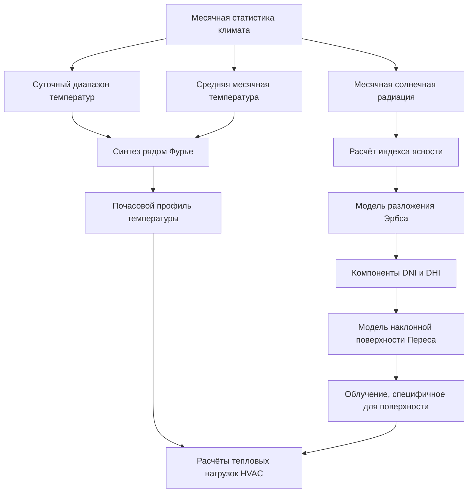

## Фундаментальные принципы

Моделирование климатических данных преобразует долгосрочные метеорологические наблюдения в параметры проектирования для определения размера систем HVAC и анализа энергопотребления. Процесс синтезирует почасовые профили из месячной статистики, позволяя инженерам прогнозировать тепловые нагрузки в репрезентативных погодных условиях.

Научный проект ASHRAE RP-1453 установил стандартизированные методы для генерации наборов данных Типичного метеорологического года (TMY), которые составляют основу современного моделирования энергопотребления зданий. Эти наборы данных комбинируют физические модели радиации со статистическими методами выборки для представления климатических закономерностей многолетних наблюдений в одной годовой последовательности.

## Генерация профиля температуры

Синтез почасовой температуры сухого термометра использует аппроксимации рядом Фурье, которые захватывают суточные колебания:

$$
T(h) = T_{avg} + \Delta T_{daily} \cdot \cos\left(\frac{2\pi(h - h_{max})}{24}\right)
$$

где $T_{avg}$ представляет среднесуточную температуру, $\Delta T_{daily}$ обозначает суточный диапазон температур, $h$ указывает час суток, и $h_{max}$ определяет час максимальной температуры (обычно 15:00 по локальному солнечному времени).

Для повышенной точности высшие гармоники исправляют упрощённую косинусную аппроксимацию:

$$
T(h) = T_{avg} + \sum_{n=1}^{N} A_n \cos\left(\frac{2\pi n(h - \phi_n)}{24}\right)
$$

Коэффициенты амплитуды $A_n$ и углы фазы $\phi_n$ выводятся из регрессионного анализа многолетних почасовых наблюдений. Три гармоники обычно обеспечивают 95% точность для среднеширотных местоположений.

## Моделирование солнечной радиации

Расчёты солнечной радиации требуют разложения глобального горизонтального облучения (GHI) на компоненты прямого нормального облучения (DNI) и диффузного горизонтального облучения (DHI). Индекс ясности $K_t$ количественно определяет прозрачность атмосферы:

$$
K_t = \frac{GHI}{I_0 \cos\theta_z}
$$

где $I_0$ представляет внеатмосферное нормальное облучение (1367 Вт/м²) и $\theta_z$ обозначает угол зенита Солнца, рассчитанный из широты, склонения и часового угла.

### Модели разложения

Корреляция Эрбса разделяет прямую и диффузную радиацию на основе индекса ясности:

**Для $K_t \leq 0.22$:**

$$
\frac{DHI}{GHI} = 1.0 - 0.09K_t
$$

**Для $0.22 < K_t \leq 0.80$:**

$$
\frac{DHI}{GHI} = 0.9511 - 0.1604K_t + 4.388K_t^2 - 16.638K_t^3 + 12.336K_t^4
$$

**Для $K_t > 0.80$:**

$$
\frac{DHI}{GHI} = 0.165
$$

Прямое нормальное облучение следует из геометрических соотношений:

$$
DNI = \frac{GHI - DHI}{\cos\theta_z}
$$

## Радиация на наклонных поверхностях

Анизотропная диффузная модель Переса вычисляет облучение на наклонных поверхностях, учитывая эффекты околосолнечного яркого пятна и горизонтного яркого свечения:

$$
I_{tilt} = DNI \cos\theta + DHI \left[(1-F_1)\frac{1+\cos\beta}{2} + F_1\frac{a}{b} + F_2\sin\beta\right] + GHI \rho_g\frac{1-\cos\beta}{2}
$$

где:
- $\theta$ = угол падения на наклонную поверхность
- $\beta$ = угол наклона поверхности от горизонтали
- $\rho_g$ = отражательная способность земной поверхности (обычно 0.2)
- $F_1$, $F_2$ = эмпирические коэффициенты из таблиц поиска Переса
- $a/b$ = коэффициент телесного угла для области около Солнца

## Моделирование влажности

Относительная влажность демонстрирует обратную корреляцию с температурой во время суточных циклов. Психрометрическое соотношение сохраняет постоянную температуру точки росы во время сухих периодов:

$$
RH(h) = 100 \cdot \frac{P_{ws}(T_{dp})}{P_{ws}(T(h))}
$$

где $P_{ws}$ представляет давление насыщенного пара, рассчитанное с использованием аппроксимации Магнуса-Тетенса:

$$
P_{ws}(T) = 610.78 \exp\left(\frac{17.27T}{T + 237.3}\right)
$$

Температура $T$ и точка росы $T_{dp}$ выражаются в градусах Цельсия, что даёт давление насыщения в Паскалях.

## Разработка расчётного дня

Стандарт ASHRAE 169 определяет климатические зоны на основе градусо-дней отопления и охлаждения, устанавливая тепловые критерии проектирования. Расчётные дни представляют экстремальные условия для определения размера оборудования:

| Условие проектирования | Персентиль | Применение |
|-----------------|-----------|-------------|
| Охлаждение 0,4% | 99,6-й | Пиковая нагрузка охлаждения |
| Охлаждение 1,0% | 99,0-й | Стандартное проектирование |
| Охлаждение 2,0% | 98,0-й | Анализ энергопотребления |
| Отопление 99,6% | 0,4-й | Пиковая нагрузка отопления |
| Отопление 99,0% | 1,0-й | Стандартное проектирование |

Значения персентилей указывают на частоту, с которой фактические условия превышают параметры проектирования в течение многолетнего периода.

## Построение типичного метеорологического года

Наборы данных TMY используют статистический метод Финкельштейна-Шефера для выбора репрезентативных месяцев из долгосрочных записей. Процесс выбора минимизирует различия функций накопленного распределения для ключевых параметров:

$$
FS = \frac{1}{N}\sum_{i=1}^{N}\left|\delta_i\right|
$$

где $\delta_i$ представляет разницу в накопленном распределении в точке данных $i$ между кандидатом месяца и долгосрочной статистикой. Весовые коэффициенты подчёркивают переменные, критичные для производительности HVAC: температура сухого термометра (50%), точка росы (15%) и глобальное горизонтальное облучение (35%).

## Метрики валидации модели

Оценка точности климатической модели использует стандартизированные статистические меры. Средняя смещённая ошибка (MBE) количественно определяет систематическое отклонение:

$$
MBE = \frac{1}{N}\sum_{i=1}^{N}(M_i - O_i)
$$

Среднеквадратическая ошибка (RMSE) отражает общую точность прогноза:

$$
RMSE = \sqrt{\frac{1}{N}\sum_{i=1}^{N}(M_i - O_i)^2}
$$

где $M_i$ обозначает модельные значения и $O_i$ представляет наблюдаемые измерения. Руководство ASHRAE 14 указывает приемлемые допуски калибровки: MBE в пределах ±10% и RMSE ниже 30% для месячных прогнозов энергопотребления.

## Сравнение источников климатических данных

| Источник данных | Временное разрешение | Пространственное разрешение | Частота обновления | Основное применение |
|-------------|-------------------|-------------------|------------------|---------------------|
| TMY3 | Почасовое | Специфично для станции | Статичные (1991-2005) | Стандартное проектирование |
| CWEC | Почасовое | 145 канадских местоположений | Декадное | Канадские здания |
| IGDG | Почасовое | Глобальная сетка (0,1°) | Годовое | Международные проекты |
| AMY | Почасовое | Специфично для станции | Годовое | Анализ фактического года |
| Будущее TMY | Почасовое | Выход климатической модели | На основе сценариев | Адаптация к изменению климата |

## Адаптация к изменению климата

Проекции будущего климата модифицируют исторические наборы данных, используя методы дельта или техники трансформации. Подход трансформации сдвига регулирует среднемесячные температуры:

$$
T_{future}(h) = T_{TMY}(h) + \Delta T_{monthly}
$$

где $\Delta T_{monthly}$ выводится из общих моделей циркуляции под определёнными сценариями концентрации парниковых газов (RCP 4,5, RCP 8,5).

Растяжная трансформация сохраняет статистику экстремальных значений путём масштабирования относительно среднемесячного значения:

$$
T_{future}(h) = T_{monthly,mean} + \alpha(T_{TMY}(h) - T_{monthly,mean})
$$

Коэффициент масштабирования $\alpha$ регулирует дисперсию, чтобы соответствовать прогнозируемым климатическим условиям, сохраняя физическую согласованность суточных паттернов при отражении ожидаемых климатических тенденций.

Моделирование климатических данных позволяет осуществлять основанное на фактических данных проектирование систем HVAC путём преобразования сложных метеорологических явлений в параметры проектирования. Надлежащее применение этих вычислительных методов обеспечивает эффективную работу оборудования во всём диапазоне ожидаемых условий окружающей среды.
