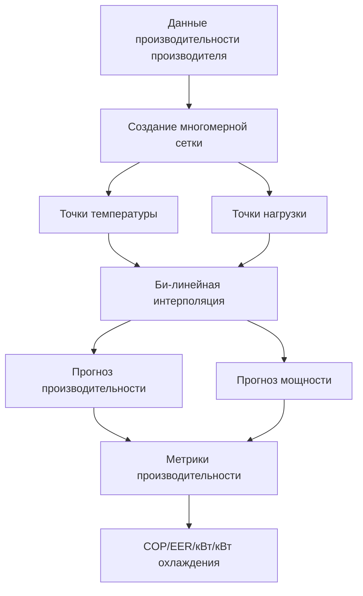

## Обзор

Эмпирические модели оборудования представляют производительность компонентов HVAC через корреляции на основе регрессии, полученные из данных производителя или экспериментальных измерений. Эти модели приоритизируют скорость вычислений и простоту внедрения над точностью из первых принципов, что делает их необходимыми для годовых энергетических моделирований, оптимизации управления и быстрых итераций проектирования.

Фундаментальный подход заключается в подгонке полиномиальных уравнений или таблиц поиска к измеренным данным производительности, захватывающих поведение оборудования во всех диапазонах эксплуатации без решения уравнений сохранения.

## Полиномиальные модели производительности

### Модели производительности и мощности чиллеров

Производители предоставляют производительность охлаждения и потребление электроэнергии как функции температуры воды испарителя, температуры воды конденсатора и коэффициента частичной нагрузки. Стандартная форма би-квадратического полинома моделирует полнонагрузочную производительность:

$$Q_{available} = Q_{rated} \cdot \left( a_0 + a_1 T_{chw,leaving} + a_2 T_{chw,leaving}^2 + a_3 T_{cw,entering} + a_4 T_{cw,entering}^2 + a_5 T_{chw,leaving} T_{cw,entering} \right)$$

Где:
- $Q_{available}$ = Доступная мощность охлаждения при рабочих условиях (кВт)
- $Q_{rated}$ = Номинальная мощность при условиях ARI (6,7°C/29,4°C)
- $T_{chw,leaving}$ = Температура охлажденной воды на выходе (°C)
- $T_{cw,entering}$ = Температура воды конденсатора на входе (°C)
- $a_0...a_5$ = Коэффициенты регрессии из данных производителя

Потребление мощности следует аналогичному би-квадратическому соотношению, умноженному на коэффициент частичной нагрузки:

$$P = P_{rated} \cdot f_{cap}(T_{chw}, T_{cw}) \cdot f_{PLR}(PLR)$$

Функция коэффициента частичной нагрузки обычно использует кубический полином:

$$f_{PLR}(PLR) = b_0 + b_1 PLR + b_2 PLR^2 + b_3 PLR^3$$

### Определение коэффициентов

Коэффициенты регрессии получены из подгонки наименьших квадратов к данным каталога производителя. ASHRAE Standard 205 определяет стандартизированные форматы карт производительности, которые облегчают извлечение коэффициентов. Процесс включает:

1. **Сбор данных** - Извлечение данных производительности и мощности во всех диапазонах температуры и нагрузки
2. **Нормализация** - Преобразование абсолютных значений в отношения относительно номинальных условий
3. **Регрессионный анализ** - Подгонка полиномиальных коэффициентов путем минимизации суммы квадратов ошибок
4. **Валидация** - Проверка прогнозов модели против зарезервированных точек данных

Точность коэффициентов напрямую влияет на прогнозы годовой энергии. Подгонка высокого качества достигает R² > 0,995 по всему диапазону эксплуатации.

## Модели оборудования, зависящие от типа

### Модели чиллеров с воздушным охлаждением

Оборудование с воздушным охлаждением требует температуры наружного воздуха по сухому термометру в качестве независимой переменной вместо температуры воды конденсатора. Модификатор производительности становится:

$$Q_{available} = Q_{rated} \cdot f_{cap}(T_{chw,leaving}, T_{odb})$$

Температура наружного воздуха влияет как на теплоотвод, так и на эффективность компрессора. Многие модели используют отдельные кривые для различных условий окружающей среды, чтобы захватить нелинейное снижение производительности при экстремальных температурах.

### Кривые эффективности котла

Тепловая эффективность котла зависит от скорости горения и температуры возвратной воды. Эмпирическое соотношение:

$$\eta = c_0 + c_1 PLR + c_2 PLR^2 + c_3 T_{hw,return}$$

Современные конденсационные котлы демонстрируют сильную зависимость от температуры, требуя температуру возвратной воды в качестве явной переменной. Неконденсационные котлы показывают более слабую зависимость от температуры, но более сильные штрафы при частичной нагрузке.

### Карты производительности тепловых насосов

Тепловые насосы требуют четырех отдельных корреляций для захвата режимов отопления и охлаждения при различных температурах:

| Режим эксплуатации | Функция производительности | Функция мощности |
|-------------------|--------------------------|------------------|
| Охлаждение | $f(T_{db,indoor}, T_{db,outdoor})$ | $f(T_{db,indoor}, T_{db,outdoor}, PLR)$ |
| Отопление | $f(T_{db,indoor}, T_{db,outdoor})$ | $f(T_{db,indoor}, T_{db,outdoor}, PLR)$ |

Циклы размораживания вносят дополнительную сложность в режиме отопления. Продвинутые модели включают частоту и длительность размораживания как функции температуры и влажности наружного воздуха.

## Интерполяция карт производительности

Когда полиномиальная подгонка вводит неприемлемые ошибки, таблицы поиска с интерполяцией обеспечивают более высокую точность. Би-линейная или три-линейная интерполяция между табулированными точками сохраняет точность данных производителя при обеспечении оценки непрерывных рабочих точек.

## Валидация модели и неопределенность

### Сравнение эмпирических подходов

| Тип модели | Скорость вычисления | Точность | Требования к данным | Риск экстраполяции |
|-----------|-------------------|----------|-------------------|-------------------|
| Би-квадратический полином | Самая быстрая | ±3-5% | Умеренные | Высокий |
| Кубический полином | Быстрая | ±2-4% | Умеренные | Очень высокий |
| Таблица поиска + интерполяция | Умеренная | ±1-2% | Высокие | Экстремальный |
| Нейронная сеть | Медленная | ±1-3% | Очень высокие | Умеренный |

### Ограничения экстраполяции

Эмпирические модели дают ошибочные результаты, когда условия эксплуатации превышают диапазон обучающих данных. Экстраполяция за пределы условий, протестированных производителем, дает нефизические результаты. Консервативная практика ограничивает применение:

- Охлажденная вода: 3-10°C на выходе
- Вода конденсатора: 15,6-35°C на входе
- Коэффициент частичной нагрузки: 0,10-1,00 (ниже минимального предела устойчивости)

Эксплуатация вне этих пределов требует моделей на основе первых принципов или консультации с инженерно-техническим отделом производителя.

## Интеграция с моделированием зданий

Программы энергетического анализа зданий (EnergyPlus, TRACE, eQuest) реализуют библиотеки оборудования с использованием эмпирических кривых. Пользователи выбирают типы оборудования и предоставляют:

- Номинальная мощность при стандартных условиях
- Коэффициенты кривых производителя (или кривые по умолчанию)
- Минимальный коэффициент частичной нагрузки
- Вспомогательная мощность (насосы, вентиляторы, управление)

Механизм моделирования вызывает функции производительности на каждом временном шаге, передавая текущие температуры и требуемые нагрузки. Возвращаемые значения производительности и мощности интегрируются в энергетический баланс системы.

ASHRAE Standard 140 (Building Energy Simulation Test - Тест энергетического моделирования зданий) валидирует реализации эмпирических моделей посредством сравнительного тестирования относительно аналитических решений и измеренных данных.

## Продвинутые методы калибровки

Измеренные данные здания позволяют калибровать эмпирические коэффициенты в соответствии с фактической производительностью установленного оборудования. Процесс настраивает кривые по умолчанию в соответствии с наблюдаемым энергопотреблением:

$$\min \sum_{i=1}^{n} \left( P_{measured,i} - P_{model,i}(\mathbf{c}) \right)^2$$

Где $\mathbf{c}$ представляет вектор коэффициентов. Ограничения обеспечивают физическую корректность (положительная мощность, снижение эффективности с увеличением нагрузки для большинства оборудования).

Калиброванные модели снижают ошибки прогнозирования с 15-25% (кривые по умолчанию) до 5-10% (кривые, специфичные для площадки), улучшая приложения оптимизации и обнаружения неисправностей.

## Ограничения и альтернативные подходы

Эмпирические модели не могут предсказать производительность при новых стратегиях эксплуатации или модификациях оборудования. Они интерполируют существующие данные без понимания основных термодинамических процессов. Приложения, требующие экстраполяции, оптимизации проектирования оборудования или оценки альтернативных хладагентов, требуют подходов на основе физики или гибридных подходов.

Компромисс между вычислительной эффективностью и физической точностью определяет выбор модели для каждого приложения. Годовой анергетический анализ благоприятствует эмпирической скорости, в то время как детальное проектирование и исследовательские приложения оправдывают сложность первых принципов.
