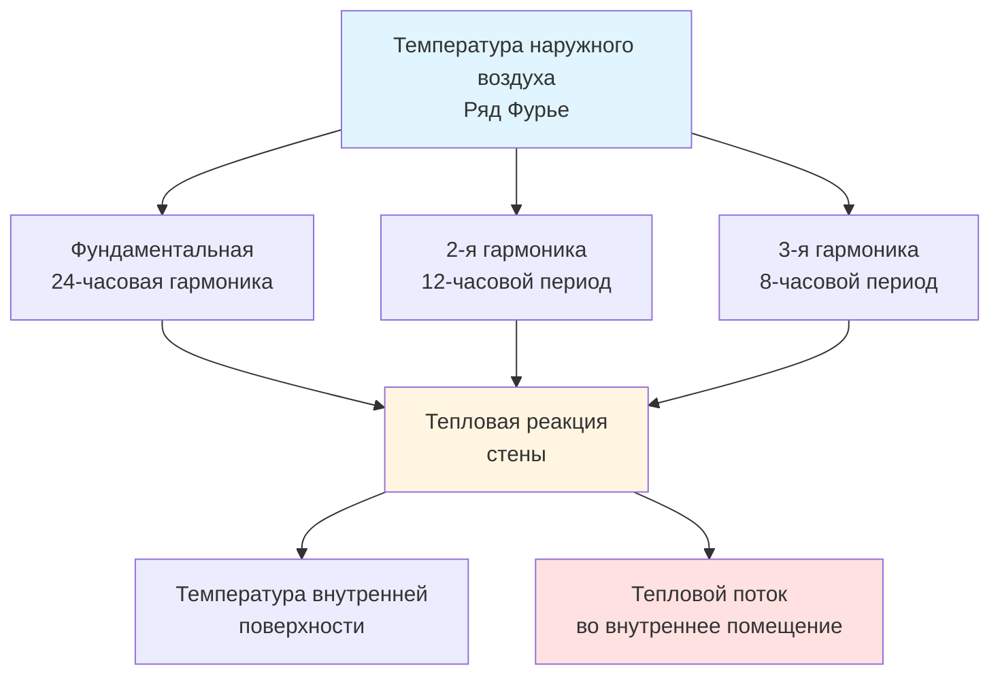
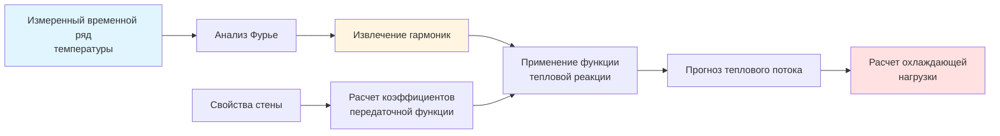

## Основы анализа температуры по Фурье

Разложение рядом Фурье преобразует периодические колебания температуры в составляющие гармонические компоненты, обеспечивая аналитические решения для тепловой реакции зданий. Этот математический подход преобразует сложные суточные и сезонные циклы температуры в управляемые функции синуса и косинуса, которые напрямую связаны с физикой теплопередачи.

Этот метод особенно ценен для моделирования колебаний температуры наружного воздуха, вариаций температуры грунта и циклических внутренних нагрузок. Анализ Фурье выявляет частотное содержание температурного сигнала, определяя, какие временные масштабы доминируют в тепловом поведении и, следовательно, какие тепловые массы наиболее важны для реакции системы.

## Математическая база

### Основное выражение ряда Фурье

Любая периодическая функция температуры T(t) с периодом P может быть представлена как:

$$T(t) = T_{mean} + \sum_{n=1}^{\infty} [A_n \cos(n\omega t) + B_n \sin(n\omega t)]$$

где:
- $T_{mean}$ = средняя по времени температура
- $\omega = 2\pi/P$ = фундаментальная угловая частота (рад/ч)
- $A_n$, $B_n$ = коэффициенты Фурье для n-й гармоники

Коэффициенты Фурье вычисляются из данных температуры:

$$A_n = \frac{2}{P} \int_0^P T(t) \cos(n\omega t) \, dt$$

$$B_n = \frac{2}{P} \int_0^P T(t) \sin(n\omega t) \, dt$$

Для дискретных почасовых данных температуры интегралы становятся суммами за период измерения.

### Альтернативная форма амплитуда-фаза

Ряд Фурье можно переписать в нотации амплитуда-фаза:

$$T(t) = T_{mean} + \sum_{n=1}^{\infty} C_n \cos(n\omega t - \phi_n)$$

где:
- $C_n = \sqrt{A_n^2 + B_n^2}$ = амплитуда n-й гармоники
- $\phi_n = \arctan(B_n/A_n)$ = угол фазы n-й гармоники

Эта форма напрямую выявляет амплитуды и сроки температурных колебаний, критические для расчета пиковых нагрузок.

## Применение в системах HVAC

### Моделирование температуры солнечного воздуха

ASHRAE Fundamentals использует ряд Фурье для представления температуры солнечного воздуха, которая объединяет температуру наружного воздуха с эффектами солнечной радиации:

$$T_{sol-air}(t) = T_{oa,mean} + \sum_{n=1}^{N} C_n \cos(n\omega t - \phi_n)$$

Как правило, 3-4 гармоники (N=3 или 4) охватывают 95% энергии колебаний температуры для суточных циклов. Первая гармоника представляет фундаментальный 24-часовой цикл, а более высокие гармоники отражают асимметрии скоростей утреннего нагрева и вечернего охлаждения.

### Реакция теплопередачи через стену

Для стены, подверженной периодическим колебаниям температуры наружного воздуха, тепловой поток через стену также становится периодическим. Функция тепловой реакции связывает входные температурные гармоники с выходным тепловым потоком:

$$q(t) = \sum_{n=1}^{N} |Y_n| C_n \cos(n\omega t - \phi_n - \psi_n)$$

где:
- $|Y_n|$ = величина тепловой проводимости на частоте $n\omega$
- $\psi_n$ = временная задержка, введенная тепловой массой стены

Каждая гармоника испытывает различное затухание и временную задержку, с высокочастотными компонентами (быстрые изменения температуры), затухающими более сильно, чем низкочастотные компоненты (медленный дрейф температуры).

## Сравнение гармоник для суточных циклов

| Гармоника | Период (ч) | Физический смысл | Типичная амплитуда | Коэффициент затухания* |
|-----------|------------|------------------|-------------------|-----------------------|
| n=1 | 24 | Суточный цикл | 4.4-6.7°C | 0.3-0.5 |
| n=2 | 12 | Асимметрия день/ночь | 1.1-2.2°C | 0.1-0.2 |
| n=3 | 8 | Скорость утреннего прогрева | 0.6-1.1°C | 0.05-0.1 |
| n=4 | 6 | Солнечные скачки | 0.3-0.6°C | 0.02-0.05 |

*Через бетонную стену толщиной 20 см

## Моделирование температуры грунта

Годовое изменение температуры грунта следует затухающей синусоиде с глубиной. Анализ Фурье температуры поверхности распространяется в грунт в соответствии с:

$$T(z,t) = T_{mean} + C_1 e^{-z/d} \cos(\omega t - z/d)$$

где:
- $z$ = глубина ниже поверхности (м)
- $d = \sqrt{2\alpha/\omega}$ = глубина затухания (м)
- $\alpha$ = коэффициент температуропроводности грунта (м²/ч)

На глубине $z = d$ амплитуда температуры снижается до 37% амплитуды поверхности. На глубине $z = 3d$ (примерно 3-4,5 м для годовых циклов) температура остается практически постоянной на уровне $T_{mean}$.

## Практическая реализация

### Критерии выбора гармоник

Количество требуемых гармоник зависит от требуемой точности применения:

- **Упрощенные расчеты проектирования**: 1-2 гармоники (только фундаментальный суточный цикл)
- **Стандартные расчеты охлаждающей нагрузки**: 3-4 гармоники согласно рекомендациям ASHRAE
- **Детальный анализ теплового комфорта**: 5-8 гармоник для отражения переходных эффектов
- **Исследовательское моделирование**: 10+ гармоник до достижения критериев сходимости

### Анализ ошибок усечения

Среднеквадратичная ошибка между фактической температурой T(t) и аппроксимацией N членов:

$$RMSE = \sqrt{\frac{1}{P} \int_0^P [T(t) - T_N(t)]^2 \, dt}$$

Для температуры наружного воздуха в умеренном климате N=4 обычно дает RMSE < 0.6°C.

## Преимущества и ограничения

**Преимущества:**
- Аналитические решения периодических задач исключают численное временное пошаговое интегрирование
- Физическое понимание тепловой реакции в различных временных масштабах
- Эффективное вычисление для систем с линейными тепловыми свойствами
- Естественная связь с частотно-зависимыми передаточными функциями

**Ограничения:**
- Применимо только к периодическим или квазипериодическим явлениям
- Предполагает линейные тепловые свойства (постоянная теплопроводность, без фазовых переходов)
- Требует достаточных исторических данных для определения коэффициентов
- Непериодические переходные процессы (фронты атмосферного давления, циклирование оборудования) требуют других методов

## Интеграция с методами ASHRAE

ASHRAE Standard 140 включает тестовые случаи с синусоидальными граничными условиями специально для валидации методов расчета на основе Фурье. Метод временного ряда излучения (RTSM) в главе 18 ASHRAE Fundamentals использует концепции Фурье через периодические функции ответа.

Методы передаточных функций для расчета охлаждающей нагрузки используют z-трансформационные представления, которые напрямую связаны с рядом Фурье через дискретный частотный анализ. Современные инструменты энергетического моделирования зданий включают методы Фурье в свои алгоритмы функций проводимости.

## Валидация и сходимость

Валидация модели сравнивает прогнозы ряда Фурье с измеренными данными или детальными решениями методом конечных разностей. Ключевые метрики включают:

- Ошибка прогноза пиковой температуры (должна быть < 1.1°C для N ≥ 3)
- Точность фазового сдвига (в пределах 30 минут для суточных циклов)
- Замыкание энергетического баланса за полные периоды (< 1% ошибки)

Тестирование сходимости увеличивает N до тех пор, пока дополнительные гармоники вносят менее определенного порога в общую теплопередачу, обычно 1% вклада фундаментальной гармоники.

---

*Этот материал предоставляет базовые знания для инженеров HVAC, внедряющих аналитические модели температуры. Методы рядов Фурье остаются ценными инструментами для понимания периодических тепловых явлений и валидации результатов численного моделирования.*
