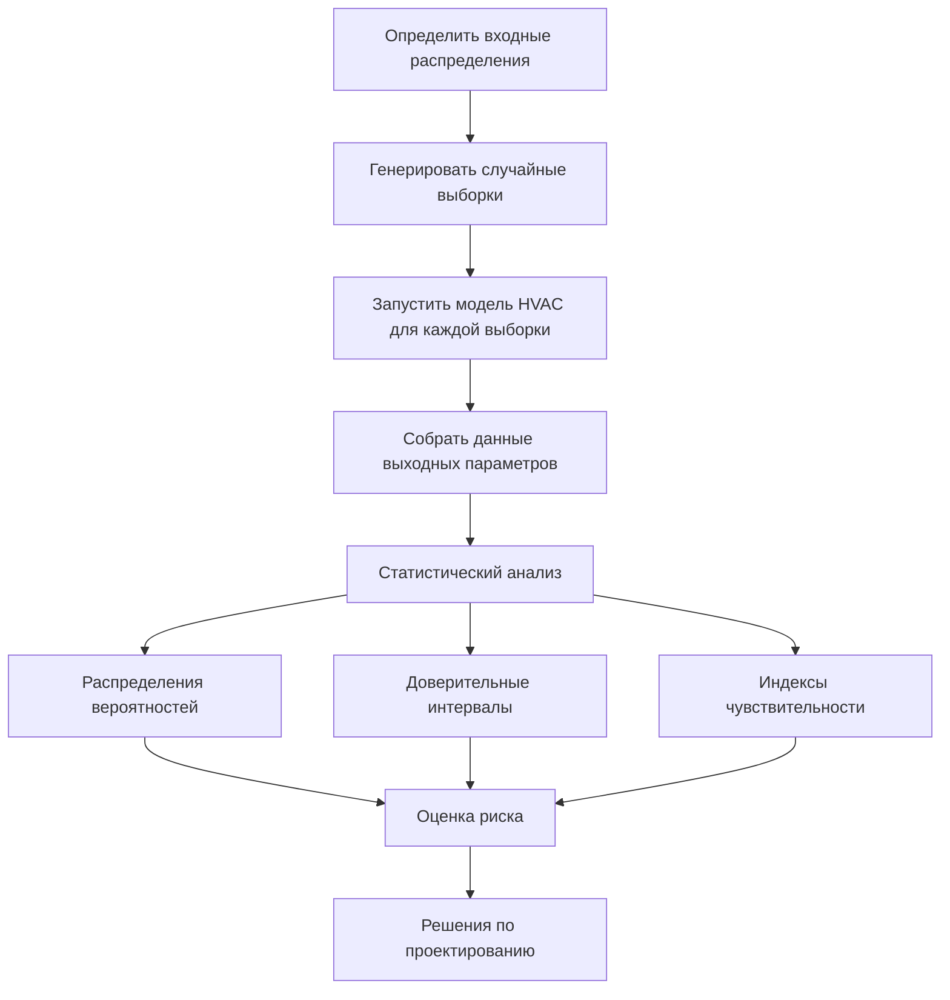
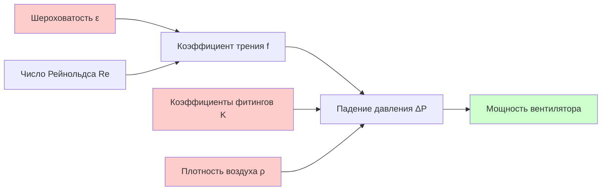

## Основы неопределённости в системах HVAC

Количественная оценка неопределённости (UQ) учитывает изменчивость и неточность, присущие моделированию, проектированию и прогнозированию производительности систем HVAC. Источники неопределённости включают ошибки измерений, вариации свойств материалов, графики занятости, данные о погоде и упрощения моделей. Количественная оценка этих неопределённостей позволяет принимать решения с учётом риска и обеспечивает надёжное проектирование систем.

Неопределённость HVAC подразделяется на две категории:

- **Aleatory неопределённость**: Неотъемлемая случайность (изменчивость погоды, графики занятости, деградация оборудования)
- **Epistemic неопределённость**: Недостаток знаний (ошибка формы модели, ошибка оценки параметров, ограничения измерений)

Научный проект ASHRAE RP-1051 установил рамки для анализа неопределённости в приложениях HVAC, подчеркивая важность распространения входных неопределённостей через модели симуляции для характеристики распределений выходных данных.

## Математическая база

### Распространение неопределённости

Для общей модели HVAC $y = f(x_1, x_2, ..., x_n)$, где $x_i$ — входные параметры с неопределённостями, неопределённость выходных данных распространяется через:

$$
\sigma_y^2 = \sum_{i=1}^{n} \left(\frac{\partial f}{\partial x_i}\right)^2 \sigma_{x_i}^2 + 2\sum_{i=1}^{n-1}\sum_{j=i+1}^{n} \frac{\partial f}{\partial x_i}\frac{\partial f}{\partial x_j}\rho_{ij}\sigma_{x_i}\sigma_{x_j}
$$

где $\sigma_y$ — стандартное отклонение выходных данных, $\sigma_{x_i}$ — стандартные отклонения входных данных, а $\rho_{ij}$ — коэффициенты корреляции между входными данными.

### Метод первого порядка второго момента

Для линейных или слегка нелинейных систем аппроксимация первого порядка даёт эффективные оценки неопределённости:

$$
\mu_y \approx f(\mu_{x_1}, \mu_{x_2}, ..., \mu_{x_n})
$$

$$
\sigma_y^2 \approx \sum_{i=1}^{n} \left(\frac{\partial f}{\partial x_i}\bigg|_{\mu_x}\right)^2 \sigma_{x_i}^2
$$

Этот метод применяется к расчётам теплопередачи, где $Q = UA\Delta T$ с неопределённостями в $U$, $A$ и $\Delta T$.

## Методы симуляции Монте-Карло

Симуляция Монте-Карло генерирует случайные выборки из распределений вероятностей входных данных, оценивает модель для каждой выборки и строит распределения вероятностей выходных данных посредством статистического анализа.

### Этапы реализации

1. **Идентификация параметров**: Определить неопределённые входные данные (нагрузки от занятости, скорости инфильтрации, эффективность оборудования)
2. **Назначение распределений**: Назначить распределения вероятностей (нормальное, равномерное, логнормальное) на основе данных или экспертного суждения
3. **Генерация выборок**: Использовать стратифицированную выборку латинского гиперкуба (LHS) для эффективной выборки
4. **Выполнение модели**: Запустить симуляцию энергии здания или модель оборудования для каждой выборки
5. **Статистическая обработка**: Вычислить среднее значение, стандартное отклонение, перцентили и доверительные интервалы

### Критерии сходимости

Количество выборок $N$, необходимое для сходимости, зависит от желаемого уровня доверия и допустимой ошибки:

$$
N \geq \left(\frac{z_{\alpha/2} \cdot \sigma}{\epsilon \cdot \mu}\right)^2
$$

где $z_{\alpha/2}$ — критическое значение (1,96 для 95%-го доверия), $\epsilon$ — допустимая относительная ошибка, а $\mu$, $\sigma$ — оценённые среднее значение и стандартное отклонение.

## Методы анализа чувствительности

### Локальный анализ чувствительности

Коэффициенты локальной чувствительности характеризуют скорость изменения выходных данных в отношении входных данных в номинальной точке эксплуатации:

$$
S_i = \frac{\partial y}{\partial x_i}\bigg|_{x_0} \cdot \frac{x_{i,0}}{y_0}
$$

Этот нормализованный коэффициент указывает процентное изменение выходных данных на процентное изменение входных данных $i$.

### Глобальный анализ чувствительности

Методы, основанные на дисперсии, разлагают дисперсию выходных данных на вклады от каждого входного параметра:

$$
V(Y) = \sum_{i} V_i + \sum_{i} \sum_{j>i} V_{ij} + ... + V_{1,2,...,n}
$$

Индексы Соболя первого порядка измеряют основные эффекты:

$$
S_i = \frac{V_{X_i}(E_{X_{\sim i}}(Y|X_i))}{V(Y)}
$$

Индексы полного эффекта охватывают основные эффекты плюс все взаимодействия:

$$
S_{T_i} = \frac{E_{X_{\sim i}}(V_{X_i}(Y|X_{\sim i}))}{V(Y)} = 1 - \frac{V_{X_{\sim i}}(E_{X_i}(Y|X_{\sim i}))}{V(Y)}
$$

## Сравнение методов UQ

| Метод | Вычислительные затраты | Точность | Применимость | Ключевое преимущество |
|--------|-------------------|----------|---------------|---------------|
| Аналитическое распространение | Очень низкие | Низкая-средняя | Линейные модели | Решения в замкнутой форме |
| Метод первого порядка второго момента | Низкие | Средняя | Слегка нелинейные | Быстрые оценки |
| Монте-Карло | Высокие | Высокая | Универсальная | Простая реализация |
| Стратифицированная выборка латинского гиперкуба | Средние | Высокая | Универсальная | Эффективная выборка |
| Полиномиальное разложение хаоса | Средние-высокие | Очень высокая | Гладкие модели | Создание суррогатной модели |
| Кригинг/Гауссовский процесс | Высокие | Очень высокая | Дорогостоящие модели | Адаптивная выборка |

## Специфические приложения HVAC

### Неопределённость холодильной нагрузки

Холодильные нагрузки зданий имеют значительную неопределённость от:
- Внутренние источники тепла (плотность занятости ±30%, нагрузки оборудования ±20%)
- Скорости инфильтрации (вариация 0,1–0,5 ACH)
- Коэффициенты теплопоглощения солнечного излучения (±10% допуск производства)
- U-значения стен (±15% от качества монтажа)

Пример распространения для пиковой холодильной нагрузки $Q_{peak}$:

$$
Q_{peak} = Q_{solar} + Q_{internal} + Q_{infiltration} + Q_{conduction}
$$

Анализ Монте-Карло обычно показывает стандартное отклонение пиковой нагрузки 12–18% номинального значения, что приводит к коэффициентам размера 1,10–1,25 для 90%-го доверия того, что мощность превышает нагрузку.

### Неопределённость производительности оборудования

Коэффициент производительности тепловых насосов зависит от:
- Измерения температуры окружающей среды (±0,5°C)
- Зарядка хладагента (±5% влияет на COP на ±3%)
- Скорость воздушного потока (±10% типичная, воздействие COP ±5%)
- Коэффициенты fouling (неопределённость 0,00009–0,00018 м²·K/W)

Комбинированная неопределённость годового энергопотребления обычно составляет 8–15% для жилых систем и 6–10% для коммерческих систем с лучшим мониторингом.

### Неопределённость сети воздушных каналов

Расчёты падения давления через воздуховоды включают неопределённости в:
- Шероховатость воздуховода (вариация коэффициента трения 15–20%)
- Коэффициенты потерь на фитингах (±25% от вариаций геометрии)
- Плотность воздуха (±2% от температуры/влажности)

## Стандарты неопределённости измерений

Серия стандартов ASHRAE 41 предоставляет рекомендации по неопределённости измерений:

- **Standard 41.1**: Измерение температуры (±0,2°C для калибровочных датчиков)
- **Standard 41.2**: Измерение влажности (±2% RH)
- **Standard 41.5**: Измерение воздушного потока (±2–5% при надлежащей инструментации)
- **Standard 41.6**: Измерение массового расхода (±1–3% для расхода хладагента)

Комбинированная неопределённость измерений энергетических потоков обычно достигает ±5–8% при соблюдении стандартных протоколов.

## Практические руководящие принципы реализации

### Моделирование энергии здания

Для годовых энергетических симуляций:
1. Определить 10–15 ключевых неопределённых параметров (инфильтрация, внутренние источники тепла, графики, эффективность HVAC)
2. Использовать стратифицированную выборку латинского гиперкуба с 500–1000 выборками
3. Представить медиану, 25-й/75-й перцентили и 90%-е доверительные интервалы
4. Выполнить анализ чувствительности для определения доминирующих параметров
5. Сосредоточить калибровочные усилия на параметрах с высокой чувствительностью

### Решения по размеру оборудования

Проектирование с учётом риска учитывает неопределённость нагрузки:
- Проектирование для 80-й перцентили нагрузки (20% вероятность превышения)
- Добавить резерв мощности на основе последствий недостаточного размера
- Критические приложения: 90–95-я перцентиль точка проектирования
- Стандартное охлаждение для комфорта: 75–85-я перцентиль приемлемо

### Калибровка и обновление модели

Байесовские методы обновляют распределения параметров по мере поступления данных измерений:

$$
p(\theta|D) = \frac{p(D|\theta)p(\theta)}{p(D)}
$$

где $p(\theta|D)$ — апостериорное распределение, $p(D|\theta)$ — функция правдоподобия, $p(\theta)$ — априорное распределение и $p(D)$ — свидетельство.

Эта методология уменьшает epistemic неопределённость по мере того, как операционные данные уточняют параметры модели, улучшая точность прогнозов для анализа модернизации и оптимизации эксплуатации.

## Программные средства и реализация

Современные платформы симуляции зданий включают количественную оценку неопределённости:

- **EnergyPlus с jEPlus**: Параметрический анализ и симуляция Монте-Карло
- **TRNSYS с TRNOPT**: Оптимизация с неопределённостью
- **IDA-ICE**: Встроенные модули неопределённости и чувствительности
- **Инструменты на Python**: SALib для анализа чувствительности, PyMC для Байесовского вывода

Эти инструменты позволяют практикующим специалистам перейти от детерминированных прогнозов к вероятностной оценке производительности, согласовав решения по проектированию с допустимым уровнем риска проекта и требованиями к производительности.
