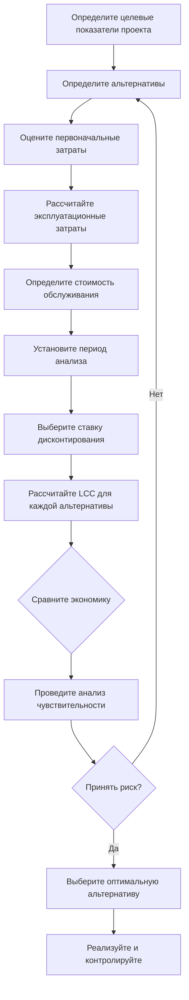
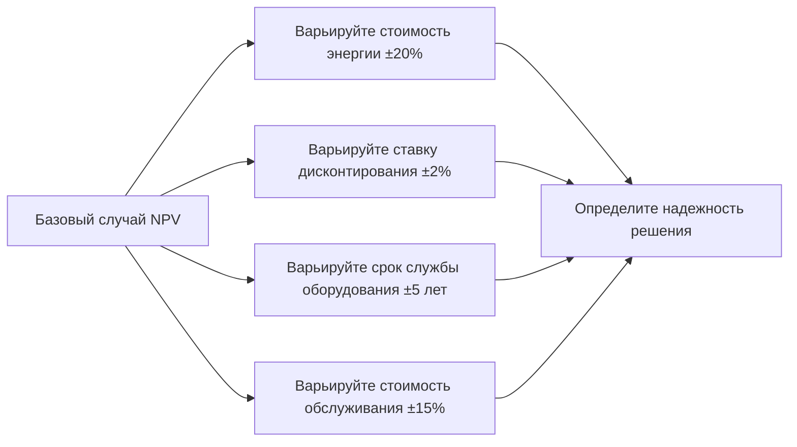

# Экономический анализ систем HVAC

Экономический анализ обеспечивает количественную базу для оценки инвестиций в системы HVAC, сравнения альтернатив и оптимизации проектных решений. Надлежащая экономическая оценка учитывает первоначальные капитальные затраты, эксплуатационные расходы, требования к техническому обслуживанию и ожидаемый срок службы оборудования для определения наиболее экономичного решения в течение всего периода эксплуатации системы.

## Основные экономические показатели

### Анализ жизненного цикла (LCCA)

Стоимость жизненного цикла представляет собой общую стоимость владения и эксплуатации системы HVAC от установки до конца срока службы. Фундаментальное уравнение LCCA объединяет все денежные потоки за период анализа:

$$LCC = C_i + \sum_{t=1}^{N} \frac{C_{o,t} + C_{m,t} + C_{r,t}}{(1+d)^t} - \frac{S}{(1+d)^N}$$

Где:
- $C_i$ = Первоначальная стоимость капитала (тыс. руб.)
- $C_{o,t}$ = Эксплуатационные расходы в год $t$ (тыс. руб./год)
- $C_{m,t}$ = Стоимость обслуживания в год $t$ (тыс. руб./год)
- $C_{r,t}$ = Стоимость замены в год $t$ (тыс. руб.)
- $S$ = Ликвидационная стоимость (тыс. руб.)
- $d$ = Ставка дисконтирования (десятичное число)
- $N$ = Период анализа (лет)

ASHRAE 90.1 Приложение G содержит рекомендации по экономическому анализу мер повышения энергоэффективности, рекомендуя периоды анализа 15–25 лет для коммерческих систем HVAC.

### Чистая приведенная стоимость (NPV)

NPV количественно определяет текущую стоимость будущих денежных потоков, позволяя прямо сравнивать альтернативы с различными профилями затрат:

$$NPV = -C_i + \sum_{t=1}^{N} \frac{CF_t}{(1+d)^t}$$

Где $CF_t$ представляет чистый денежный поток (экономия минус затраты) в год $t$. Положительное NPV указывает на экономическую целесообразность; более высокое NPV определяет лучшую альтернативу среди конкурирующих вариантов.

### Простой и дисконтированный период окупаемости

Простой период окупаемости (SPP) рассчитывает годы для возврата первоначальных инвестиций без учета временной стоимости денег:

$$SPP = \frac{C_i}{S_{annual}}$$

Где $S_{annual}$ = годовая экономия затрат (тыс. руб./год).

Дисконтированный период окупаемости (DPP) учитывает ставку дисконтирования, обеспечивая более реалистичный график возврата:

$$\sum_{t=1}^{DPP} \frac{S_t}{(1+d)^t} = C_i$$

## Расчеты стоимости энергии

Затраты на энергию обычно доминируют в эксплуатационных расходах HVAC. Годовая стоимость энергии зависит от потребления электроэнергии оборудованием, количества часов работы и тарифов на электроэнергию:

$$C_{energy} = P \times h \times r \times (1 - \eta_{recovery})$$

Где:
- $P$ = Средняя потребляемая мощность (кВ)
- $h$ = Годовое количество часов работы (ч/год)
- $r$ = Средний тариф на электроэнергию (тыс. руб./кВч)
- $\eta_{recovery}$ = Коэффициент рекуперации энергии (десятичное число)

**Пример расчета:**

Сравните две приточно-вытяжные установки, обслуживающие офисное здание площадью 4 645 м²:

| Параметр | Стандартная АГУ | Высокоэффективная АГУ |
|----------|-----------------|----------------------|
| Первоначальная стоимость | 125 000 тыс. руб. | 185 000 тыс. руб. |
| Мощность вентилятора | 45 кВ | 32 кВ |
| Холодопроизводительность | 528 кВ | 528 кВ |
| Годовое количество часов работы | 4 380 ч | 4 380 ч |
| Тариф на электроэнергию | 0,11 тыс. руб./кВч | 0,11 тыс. руб./кВч |
| Ожидаемый срок службы | 20 лет | 20 лет |

Годовая стоимость энергии (стандартная): $45 \text{ кВ} \times 4 380 \text{ ч} \times 0,11 \text{ тыс. руб./кВч} = 21 681 \text{ тыс. руб.}$

Годовая стоимость энергии (высокоэффективная): $32 \text{ кВ} \times 4 380 \text{ ч} \times 0,11 \text{ тыс. руб./кВч} = 15 410 \text{ тыс. руб.}$

Годовая экономия: $21 681 - 15 410 = 6 271 \text{ тыс. руб.}$

Простой период окупаемости: $(185 000 - 125 000) / 6 271 = 9,6 \text{ лет}$

## Экономическая схема принятия решений

## Плата за спрос и структуры тарифов на коммунальные услуги

Коммерческие тарифы на электроэнергию обычно включают плату за спрос на основе пикового потребления в кВ за период выставления счета. Общая ежемесячная стоимость электроэнергии:

$$C_{total} = C_{energy} + C_{demand} + C_{fixed}$$

$$C_{total} = (кВч \times r_e) + (кВ_{peak} \times r_d) + C_f$$

Где:
- $r_e$ = Тариф на энергию (тыс. руб./кВч)
- $r_d$ = Тариф на спрос (тыс. руб./кВ)
- $C_f$ = Фиксированный ежемесячный платеж (тыс. руб./месяц)

Снижение пикового спроса посредством смещения нагрузки, теплового аккумулирования или управления вентиляцией по требованию обеспечивает значительную экономическую выгоду. Снижение пикового спроса на 10 кВ при тарифе 15 тыс. руб./кВ экономит 1 800 тыс. руб. в год.

## Моделирование затрат на техническое обслуживание

Стоимость обслуживания возрастает с возрастом оборудования. Реалистичное моделирование включает коэффициенты эскалации:

$$C_{m,t} = C_{m,0} \times (1 + e)^t$$

Где:
- $C_{m,0}$ = Первоначальная стоимость обслуживания (тыс. руб./год)
- $e$ = Коэффициент эскалации (обычно 2–4% в год)
- $t$ = Годы с момента установки

## Сравнение методов экономического анализа

| Метод | Преимущества | Ограничения | Лучшее применение |
|-------|-------------|------------|-------------------|
| Простая окупаемость | Легко рассчитать и понять | Игнорирует временную стоимость денег | Быстрый отбор альтернатив |
| Дисконтированная окупаемость | Учитывает ставку дисконтирования | Игнорирует денежные потоки после окупаемости | Проекты с проблемами ликвидности |
| NPV | Учитывает все денежные потоки, временную стоимость | Требует точной ставки дисконтирования | Сравнение взаимоисключающих проектов |
| Внутренняя норма прибыли (IRR) | Независима от ставки дисконтирования | Возможны множественные решения | Решения "да/нет" по отдельному проекту |
| Коэффициент экономии к инвестициям (SIR) | Показывает отдачу на доллар инвестиций | Не указывает на масштаб проекта | Распределение ограниченного бюджета |

## Выбор ставки дисконтирования

Ставка дисконтирования отражает альтернативную стоимость капитала и риск проекта. ASHRAE рекомендует:

- **Государственные проекты**: Используйте ставки Office of Management and Budget (OMB) (исторически 3–7%)
- **Частный сектор**: Средневзвешенная стоимость капитала (WACC), обычно 8–12%
- **Высокорисковые проекты**: Добавьте рисковую премию 2–5%

Реальная ставка дисконтирования (скорректированная на инфляцию):

$$d_{real} = \frac{d_{nominal} - i}{1 + i}$$

Где $i$ = уровень инфляции (десятичное число).

## Анализ чувствительности

Экономические решения включают неопределенные будущие параметры. Анализ чувствительности количественно определяет влияние изменения параметров на результаты решений:

Параметры с наибольшим влиянием на решение заслуживают дополнительного исследования или стратегий смягчения рисков.

## Стимулы повышения энергоэффективности

Многие коммунальные предприятия и государственные программы предлагают скидки, налоговые льготы или ускоренную амортизацию высокоэффективного оборудования HVAC:

- **Скидки коммунальных предприятий**: 50–500 тыс. руб. за кВ холодопроизводительности
- **Федеральные налоговые льготы**: До 30% от стоимости установки (в зависимости от законодательных изменений)
- **Ускоренная амортизация**: Modified Accelerated Cost Recovery System (MACRS) позволяет более быстрый амортизационный вычет

Включите стимулы в LCCA как сокращение первоначальной стоимости:

$$C_{i,net} = C_i - R_{utility} - T_{credit}$$

## Практическое применение: анализ замены холодильного агрегата

Объект оценивает замену холодильного агрегата мощностью 528 кВ, потребляющего 0,85 кВ/кВ, на высокоэффективную модель, потребляющую 0,52 кВ/кВ:

**Годовое потребление энергии текущим холодильным агрегатом:**
$$E = 528 \text{ кВ} \times 0,85 \text{ кВ/кВ} \times 2 500 \text{ ч/год} = 1 224 000 \text{ кВч/год}$$

**Годовое потребление энергии предложенным холодильным агрегатом:**
$$E = 528 \text{ кВ} \times 0,52 \text{ кВ/кВ} \times 2 500 \text{ ч/год} = 745 200 \text{ кВч/год}$$

**Годовая экономия:** $478 800 \text{ кВч} \times 0,10 \text{ тыс. руб./кВч} = 47 880 \text{ тыс. руб./год}$

**Расчет NPV** (15-летний период анализа, 6% ставка дисконтирования, стоимость установки 180 000 тыс. руб.):

$$NPV = -180 000 + \sum_{t=1}^{15} \frac{47 880}{(1,06)^t} = -180 000 + 459 375 = 279 375 \text{ тыс. руб.}$$

Положительное NPV указывает на то, что проект экономически обоснован, и дополнительные выгоды от скидок коммунальных предприятий, снижения платежей за спрос или других преимуществ еще больше улучшат финансовые результаты.

## Заключение

Тщательный экономический анализ преобразует выбор системы HVAC из субъективного предпочтения в принятие решений, основанное на данных. Анализ жизненного цикла при надлежащем выполнении с реалистичными исходными данными и надлежащими ставками дисконтирования определяет оптимальный баланс между первоначальными инвестициями и долгосрочными эксплуатационными затратами. Инженеры должны учитывать все компоненты затрат—энергию, платежи за спрос, техническое обслуживание и замены—в течение всего периода анализа, одновременно учитывая неопределенность посредством анализа чувствительности. ASHRAE 90.1 и строительные энергетические кодексы все чаще требуют экономического анализа для демонстрации альтернативных путей соответствия кодексу, что делает эти навыки важными для современной практики проектирования HVAC.
