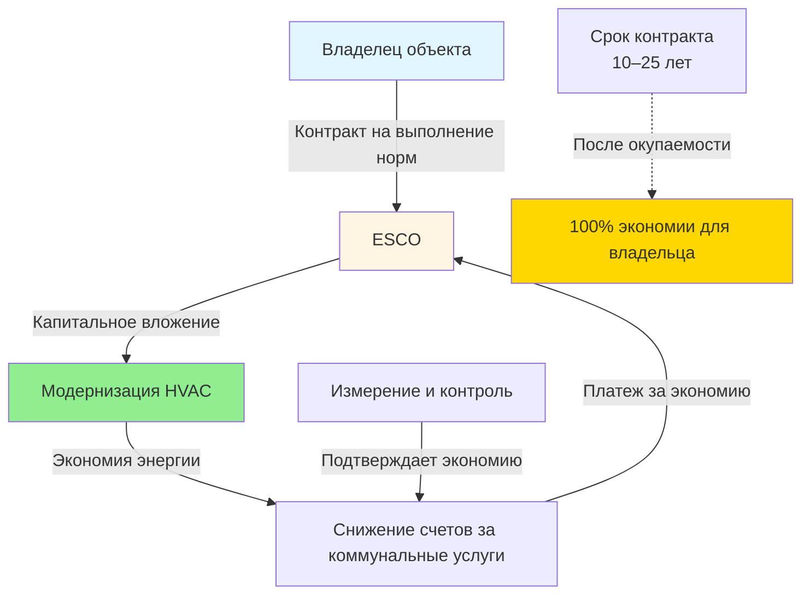
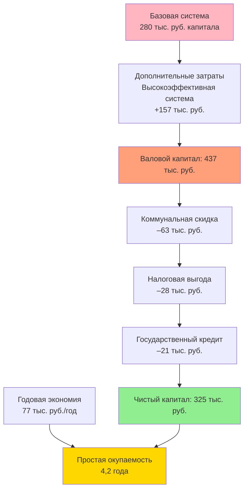

## Рамочная структура экономических стимулов

Экономические стимулы снижают эффективную стоимость капитальных затрат на высокоэффективное оборудование HVAC, улучшая экономику проектов и сокращая периоды окупаемости. Эти механизмы решают проблему начальной стоимости, препятствующую внедрению энергоэффективных технологий несмотря на благоприятные экономические показатели за жизненный цикл.

Чистые капитальные инвестиции после применения стимулов становятся:

$$C_{net} = C_{capital} - R_{utility} - T_{credit} - D_{accel} - G_{grant}$$

где $C_{capital}$ представляет валовую стоимость капитала, $R_{utility}$ коммунальные скидки, $T_{credit}$ налоговые льготы, $D_{accel}$ приведенную стоимость выгод ускоренной амортизации и $G_{grant}$ финансирование грантов.

Эффективный период окупаемости с учетом стимулов:

$$PBP_{eff} = \frac{C_{net}}{S_{annual}} = \frac{C_{capital} - \sum I_i}{\Delta E \times c_e + \Delta M}$$

где $I_i$ представляет отдельные стимулы, $\Delta E$ годовую экономию энергии (кВтч/год), $c_e$ стоимость энергии ($/кВтч) и $\Delta M$ годовую экономию на техническом обслуживании.

## Программы коммунальных скидок

Электрические и газовые коммунальные предприятия предлагают скидки для снижения пикового спроса, отсрочки инвестиций в генерирующие мощности и соответствия нормативным требованиям по экономии энергии. Структуры скидок варьируются в зависимости от территории обслуживания коммунального предприятия и нормативно-правовой базы.

### Предписанные скидки

Предписывающие программы предоставляют фиксированные стимулы для установки квалифицирующего оборудования, отвечающего минимальным пороговым показателям эффективности:

**Типичные скидки на оборудование охлаждения:**

| Тип оборудования | Порог эффективности | Размер скидки |
|---------------|---------------------|--------------|
| Крышные блочные установки | IEER ≥ 16,0 | 525–1 050 руб./кВт |
| Воздухоохлаждаемые холодильные машины | IPLV ≥ 14,0 EER | 700–1 400 руб./кВт |
| Водоохлаждаемые холодильные машины | IPLV ≥ 0,60 кВт/кВт | 1 050–2 100 руб./кВт |
| Системы VRF | IEER ≥ 14,0 | 700–1 225 руб./кВт |
| Премиум-класса электродвигатели | Высокоэффективность NEMA | 35–87 руб./кВт |

Предписанные скидки обеспечивают административную простоту, но могут не отражать фактическую экономию энергии в конкретных приложениях.

### Пользовательские скидки на основе производительности

Индивидуальные программы компенсируют фактическую измеренную или смоделированную экономию энергии, как правило, от 0,08–0,25 руб./кВтч экономии за первый год. Расчет стимула:

$$R_{custom} = \Delta E_{annual} \times r_{kwh} \times f_{cap}$$

где $r_{kwh}$ – размер скидки (руб./кВтч), а $f_{cap}$ представляет коэффициент лимита программы (как правило, 0,3–0,5 от стоимости проекта).

Экономия энергии требует инженерного анализа согласно протоколам, таким как ASHRAE Guideline 14 или International Performance Measurement and Verification Protocol (IPMVP).

## Федеральные налоговые стимулы

### Налоговый вычет на энергоэффективность коммерческих зданий согласно разделу 179D

Раздел 179D предоставляет налоговые вычеты на энергоэффективные системы коммерческих зданий. Для улучшений HVAC, соответствующих установленным пороговым показателям экономии энергии:

**Структура вычета (после Закона об инфляционном снижении 2023 года):**

- Базовый вычет: $0,50–$1,00/м² при снижении затрат на энергию на 25%
- Максимальный вычет: $5,00/м² при снижении затрат на энергию на 50%

Размер вычета масштабируется линейно между пороговыми значениями:

$$D_{179D} = A_{floor} \times \left(\$2,50 + \$0,10 \times \left(\frac{E_{save} - 25\%}{1\%}\right)\right)$$

для процентов экономии между 25% и 50%, где $A_{floor}$ – площадь пола здания (м²) и $E_{save}$ – процент снижения затрат на энергию по сравнению с базовым уровнем ASHRAE 90.1.

### Инвестиционный налоговый кредит (ITC)

ITC применяется к квалифицирующему энергетическому имуществу, включая системы солнечного теплоснабжения, геотермальные тепловые насосы и комбинированные системы выработки тепла и электроэнергии (CHP):

$$T_{ITC} = C_{qualified} \times r_{credit}$$

где $C_{qualified}$ – стоимость основных средств квалифицирующегося имущества, а $r_{credit}$ варьируется от 6% до 30% в зависимости от типа системы, мощности и требований в отношении преобладающей заработной платы.

## Ускоренная амортизация

### Модифицированная система ускоренного восстановления стоимости (MACRS)

Стандартное оборудование HVAC амортизируется в течение 39 лет для недвижимого имущества или 5–7 лет для движимого имущества. Положения о бонусной амортизации допускают немедленное списание квалифицирующихся улучшений.

Приведенная стоимость выгоды ускоренной амортизации:

$$D_{accel} = C_{capital} \times \tau_{corp} \times \left(\sum_{t=1}^{n_1} \frac{d_t^{accel}}{(1+r)^t} - \sum_{t=1}^{n_2} \frac{d_t^{standard}}{(1+r)^t}\right)$$

где $\tau_{corp}$ – налоговая ставка корпорации, $d_t$ представляет долю амортизации в году $t$, а $r$ – коэффициент дисконтирования.

При 100% бонусной амортизации немедленная выгода равна $C_{capital} \times \tau_{corp}$, что эффективно снижает чистую стоимость капитала на 21% для корпораций при текущих федеральных ставках.

## Государственные и местные стимулы

### Государственные налоговые льготы

Стимулы на уровне штатов варьируются широко. Общие структуры включают:

- **Налоговые кредиты на доход** – 10–25% от стоимости оборудования для высокоэффективных систем
- **Льготы по налогу на продажи** – освобождение от налога на продажи штата на квалифицирующее оборудование
- **Снижение налога на имущество** – сниженная оценочная стоимость для экологичных улучшений зданий

### Местные программы коммунальных предприятий

Муниципальные коммунальные предприятия и кооперативы часто предоставляют повышенные размеры стимулов, превышающие программы инвестиционных коммунальных предприятий. Некоторые программы покрывают 40–60% дополнительных затрат на оборудование премиум-класса эффективности.

## Контракты на гарантированную экономию энергии (ESPC)

ESPC позволяют модернизировать инфраструктуру без авансовых капитальных вложений. Компании энергетических услуг (ESCO) финансируют, устанавливают и обслуживают оборудование, возмещая расходы за счет гарантированной экономии энергии.

### Экономика ESPC

Поток платежей ESCO вытекает из договорно гарантированной экономии:

$$P_{ESCO,t} = \min(S_{guaranteed,t}, S_{actual,t})$$

где $S_{guaranteed,t}$ представляет гарантированную экономию и $S_{actual,t}$ фактическую измеренную экономию в году $t$. ESCO несет риск производительности; дефициты требуют денежных платежей компенсации владельцу.

Типичная структура ESPC выделяет 70–90% прогнозируемой экономии на обслуживание долга и сборы ESCO в течение срока контракта. После заключения контракта 100% экономии приходится на владельца объекта.

## Измерение и контроль

Программы стимулов, требующие проверки производительности, обычно ссылаются на протоколы IPMVP. Четыре основных варианта М&V обменивают строгость измерений против затрат:

| Вариант | Метод | Применение | Стоимость |
|--------|--------|-------------|------|
| A | Изоляция модернизации – ключевые параметры измеряются | Отдельное оборудование с измеримой экономией | Низкая |
| B | Изоляция модернизации – все параметры измеряются | Системы с раздельным учетом | Средняя |
| C | По всему объекту | Небольшие проекты в простых зданиях | Низкая |
| D | Калиброванное моделирование | Сложные системы, множественные мероприятия по энергоэффективности | Высокая |

Неопределенность измерений распространяется через расчеты экономии:

$$U_{savings} = \sqrt{U_{baseline}^2 + U_{post}^2 + U_{adjustment}^2}$$

где $U$ представляет неопределенность в использовании энергии по базовому плану, энергопотреблении после модернизации и несрочных корректировках.

## Укладка стимулов и ограничения

### Правила комбинируемости

Несколько стимулов часто можно комбинировать, но координация требует тщательного анализа:

- Коммунальные скидки + федеральные налоговые вычеты: Обычно комбинируются
- Налоговые кредиты + ускоренная амортизация: Кредит может снизить амортизируемую базу
- Государственные кредиты + федеральные кредиты: Обычно комбинируются с корректировками базы

### Пределы программ

Общие ограничения включают:

- Максимальный стимул в процентах от стоимости проекта (типично 30–50%)
- Годовые пределы на одного клиента (для коммерческих типично 1,75–17,5 млн руб.)
- Технологические выделения и списки ожидания
- Истощение бюджета в середине года программы

## Влияние стимулов на экономику проекта

## Стратегическая оптимизация стимулов

Максимизация стоимости стимулов требует:

1. **Координация расписания** – согласование проектов с годами программ и циклами бюджета
2. **Предварительное одобрение** – получение обязательств коммунального предприятия и грантов перед закупками
3. **Документирование** – ведение строгой документации для проверки соответствия
4. **Профессиональная помощь** – привлечение специалистов по стимулам для сложных приложений
5. **Портфельный подход** – объединение проектов для достижения минимальных пороговых значений или максимизации уровней

Эффективная послестимульная стоимость мероприятий по повышению энергоэффективности часто достигает периода окупаемости менее 3 лет, трансформируя проекты из маржинальных в весьма привлекательные инвестиции.

## Ссылки

- ASHRAE Guideline 14: Measurement of Energy, Demand, and Water Savings
- International Performance Measurement and Verification Protocol (IPMVP)
- Database of State Incentives for Renewables & Efficiency (DSIRE)
- Internal Revenue Code Section 179D
- Energy Policy Act (EPAct) provisions for commercial buildings
