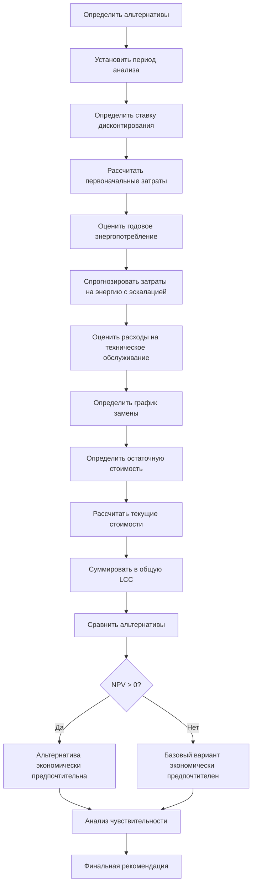

# Анализ стоимости жизненного цикла (LCCA) систем HVAC

Анализ стоимости жизненного цикла (LCCA) предоставляет систематическую методологию для оценки общего экономического воздействия альтернативных вариантов системы HVAC на протяжении всего периода их эксплуатации. Этот подход выходит за рамки первоначальных капитальных затрат и включает энергопотребление, расходы на техническое обслуживание, замену компонентов и остаточную стоимость, что позволяет объективно сравнивать варианты проектирования с различными структурами затрат.

## Основное уравнение LCCA

Общая стоимость жизненного цикла представляет собой текущую стоимость всех затрат, понесённых в течение периода анализа:

$$LCC = C_i + \sum_{t=1}^{N} \frac{C_{o,t} + C_{m,t} + C_{r,t}}{(1+d)^t} - \frac{S_N}{(1+d)^N}$$

Где:
- $C_i$ = Первоначальная капитальная стоимость (оборудование, установка, ввод в эксплуатацию)
- $C_{o,t}$ = Эксплуатационные расходы в году $t$ (в основном энергия)
- $C_{m,t}$ = Расходы на техническое обслуживание и ремонт в году $t$
- $C_{r,t}$ = Расходы на замену в году $t$
- $S_N$ = Остаточная стоимость в конце периода анализа
- $d$ = Ставка дисконтирования (реальная или номинальная)
- $N$ = Период анализа (лет)
- $t$ = Индекс года

## Выбор ставки дисконтирования

Ставка дисконтирования отражает временную стоимость денег и альтернативную стоимость капитала. ASHRAE Standard 90.1 Приложение G ссылается на федеральные руководящие принципы, предлагающие реальные ставки дисконтирования 3-7% для энергозависимых инвестиций.

**Реальные и номинальные ставки:**

Реальная ставка дисконтирования исключает влияние инфляции:

$$d_{real} = \frac{1 + d_{nominal}}{1 + i} - 1$$

Где $i$ = уровень инфляции.

Для анализа в постоянных долларах (рекомендуется для HVAC) используйте реальные ставки дисконтирования и выражайте все затраты в долларах базового года.

## Коэффициенты текущей стоимости

### Коэффициент текущей стоимости единичного платежа (SPPWF)

Преобразует будущую единовременную стоимость в текущую стоимость:

$$SPPWF = \frac{1}{(1+d)^t}$$

### Коэффициент текущей стоимости равномерного ряда (USPWF)

Преобразует ежегодные повторяющиеся расходы в текущую стоимость:

$$USPWF = \frac{(1+d)^N - 1}{d(1+d)^N}$$

Применяется, когда расходы на техническое обслуживание или энергию остаются постоянными ежегодно.

## Эскалация затрат на энергию

Затраты на энергию, как правило, растут по-другому, чем общая инфляция. Модифицированный коэффициент текущей стоимости равномерного ряда учитывает дифференциальную эскалацию:

$$USPWF_{mod} = \frac{1}{d-e} \left[1 - \left(\frac{1+e}{1+d}\right)^N\right]$$

Где $e$ = реальная ставка эскалации энергии (энергетическая инфляция минус общая инфляция).

Когда $e = d$, коэффициент упрощается до $N$.

## Анализ компонентов

### Первоначальные капитальные затраты

Включают все первоначальные расходы:
- Закупка оборудования (холодильные машины, котлы, приточно-вытяжные установки, системы управления)
- Трудозатраты и материалы на установку
- Электрические и трубопроводные соединения
- Структурные модификации
- Ввод в эксплуатацию и пусконаладка
- Сборы за проектирование и инженерные работы
- Разрешения и нормативное соответствие

### Эксплуатационные расходы

Доминируются энергопотреблением:

$$C_{energy,annual} = \sum_{i} E_i \times UC_i$$

Где:
- $E_i$ = Ежегодное энергопотребление по энергоносителю $i$ (кВч, термы)
- $UC_i$ = Удельная стоимость энергоносителя $i$ (€/кВч, €/терма)

Учитывайте плату за мощность для электрических систем:

$$C_{electric} = \sum_{month} (кВч \times E_{rate} + кВ_{peak} \times D_{rate})$$

### Расходы на техническое обслуживание и ремонт

Различайте между:
- **Плановое техническое обслуживание**: Периодическое обслуживание (фильтры, ремни, смазка)
- **Диагностическое техническое обслуживание**: Вмешательства на основе состояния
- **Ремонты**: Незапланированные отказы компонентов
- **Капитальные ремонты**: Плановая модернизация (перестройка компрессоров, замена теплообменников)

Оцените как процент от первоначальной стоимости (обычно 2-6% ежегодно для HVAC) или детальный анализ по видам работ.

### Расходы на замену

Компоненты с меньшим сроком эксплуатации, чем период анализа, требуют замены:

| Компонент | Типичный срок эксплуатации | Цикл замены |
|-----------|---------------------|-------------------|
| Фильтры | 3-12 месяцев | Ежегодно |
| Ремни | 2-5 лет | В середине периода |
| Компрессоры | 15-20 лет | Один раз в 25-летний анализ |
| Теплообменники | 20-30 лет | Рассмотрение в конце срока |
| Системы управления | 10-15 лет | В середине периода |
| Частотные преобразователи | 10-15 лет | В середине периода |

Текущая стоимость замены:

$$PV_{replacement} = C_{replacement} \times \frac{1}{(1+d)^{t_{replace}}}$$

## Метрики сравнения

### Чистая текущая стоимость (NPV)

Разница в LCC между альтернативами:

$$NPV = LCC_{baseline} - LCC_{alternative}$$

Положительное NPV указывает на то, что альтернатива экономит деньги в течение периода анализа.

### Коэффициент экономии к инвестициям (SIR)

$$SIR = \frac{\Delta PV_{savings}}{\Delta C_i}$$

Где:
- $\Delta PV_{savings}$ = Текущая стоимость экономии эксплуатационных расходов
- $\Delta C_i$ = Дополнительные первоначальные инвестиции

SIR > 1,0 указывает на экономически обоснованные инвестиции.

### Простой период окупаемости (SPP)

$$SPP = \frac{\Delta C_i}{Annual\ Savings}$$

Быстрая метрика скрининга; игнорирует временную стоимость денег и расходы после окупаемости.

### Дисконтированный период окупаемости (DPP)

Год, когда кумулятивные дисконтированные экономии равны дополнительным инвестициям. Более точно, чем SPP, но все ещё игнорирует выгоды после окупаемости.

## Процесс LCCA

## Анализ чувствительности

Результаты LCCA зависят от предположений о будущих условиях. Проверьте чувствительность к:

- **Ставка дисконтирования**: вариация ±2%
- **Ставка эскалации энергии**: вариация ±1-2%
- **Срок эксплуатации оборудования**: вариация ±20%
- **Расходы на техническое обслуживание**: вариация ±25%
- **Энергопотребление**: вариация ±10% (неопределённость калиброванной модели)

Представьте результаты, показывающие точки безубыточности, где меняется предпочтение альтернативы.

## Стандарты и руководящие принципы

**Ссылки ASHRAE:**
- ASHRAE Guideline 0: Процесс ввода в эксплуатацию (экономическое обоснование)
- ASHRAE Standard 90.1: Энергетический стандарт для зданий (методология рентабельности)
- ASHRAE Handbook—HVAC Applications, Глава 37: Тестирование, регулировка и уравновешивание

**Федеральные стандарты:**
- NIST Handbook 135: Руководство по расчёту затрат жизненного цикла для Федеральной программы управления энергией
- Руководящие принципы FEMP по ставкам дисконтирования (ежегодно обновляются)
- 10 CFR 436: Федеральные стандарты энергоэффективности зданий

## Практические соображения

**Выбор периода анализа:**
- Соответствует горизонту владения зданием или сроку эксплуатации оборудования
- Федеральные учреждения: типично 25 лет
- Коммерческие здания: обычно 15-20 лет
- Ситуации с арендой: Срок аренды

**Распространённые ошибки:**
- Несогласованная основа затрат (смешивание текущих и будущих долларов)
- Пропуск основных затрат на замену
- Недооценка требований по техническому обслуживанию
- Игнорирование влияния платы за мощность
- Пренебрежение затратами на ввод в эксплуатацию
- Невнимание к влиянию на комфорт и производительность

**Требования к документированию:**
Ведите чёткие записи:
- Всех источников данных по затратам и датах
- Предполагаемых ставок эскалации с обоснованием
- Спецификаций производительности оборудования
- Обоснования периода анализа
- Основания выбора ставки дисконтирования

LCCA предоставляет строгую экономическую базу, необходимую для обоснованного выбора системы HVAC, обеспечивая, чтобы преимущества первоначальных затрат не скрывали долгосрочные экономические недостатки, и позволяет оптимизировать общую стоимость владения.
