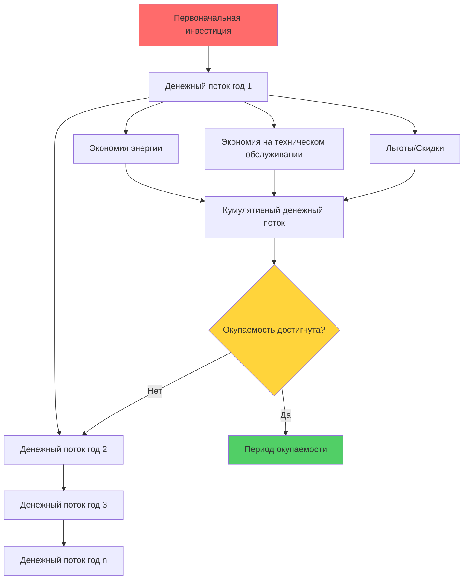
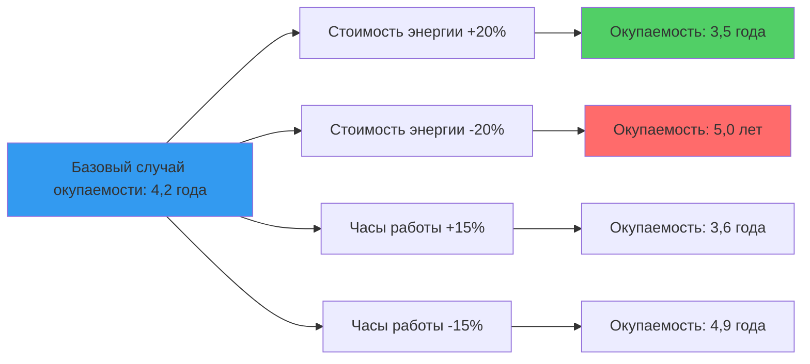

## Фундаментальные метрики периода окупаемости

Анализ периода окупаемости количественно определяет время, необходимое для возмещения первоначальной инвестиции в систему HVAC за счет операционной экономии. Этот экономический показатель напрямую влияет на выбор оборудования, решения о модернизации и стратегии распределения капитала.

### Простой период окупаемости

Простой период окупаемости (SPP) представляет наиболее прямолинейный метод оценки инвестиций:

$$SPP = \frac{Первоначальная\ инвестиция}{Годовая\ экономия}$$

Где годовая экономия складывается из снижения потребления энергии, расходов на техническое обслуживание и операционных расходов. Этот расчет игнорирует временную стоимость денег и предполагает равномерную годовую экономию.

**Пример расчета:**
- Инвестиция в охладитель высокой эффективности: 125 000 USD
- Годовая экономия энергии: 28 000 USD
- Снижение затрат на техническое обслуживание: 4 500 USD
- Общая годовая экономия: 32 500 USD
- Простая окупаемость: 125 000 ÷ 32 500 = 3,85 года

### Дисконтированный период окупаемости

Дисконтированный период окупаемости (DPP) учитывает временную стоимость денег путем дисконтирования будущих денежных потоков к приведенной стоимости:

$$DPP = Год\ когда\ \sum_{t=1}^{n} \frac{Денежный\ поток_t}{(1+r)^t} \geq Первоначальная\ инвестиция$$

Где:
- r = дисконтная ставка (средневзвешенная стоимость капитала)
- t = период времени (годы)
- n = срок службы оборудования

Этот метод обеспечивает более точную экономическую оценку капиталоемких проектов HVAC, где стоимость капитала существенно влияет на принятие решений.

## Методология расчета экономии энергии

Точный анализ окупаемости требует точного количественного определения экономии энергии на основе термодинамических принципов и операционных данных.

### Улучшения эффективности систем охлаждения

Для замены или модернизации охладителя расчеты экономии энергии вытекают из дифференциала эффективности:

$$Экономия\ энергии = \frac{Холодопроизводительность}{EER_{новое}} \times Часы - \frac{Холодопроизводительность}{EER_{существующее}} \times Часы$$

$$Годовая\ экономия\ затрат = Экономия\ энергии \times Тариф\ электроэнергии$$

Где EER (Energy Efficiency Ratio) представляет выходную холодопроизводительность (кДж/ч) на единицу входной мощности (кВт).

### Анализ эффективности систем отопления

Экономия при замене котла или печи:

$$Экономия\ топлива = Годовая\ нагрузка\ на\ отопление \times \left(\frac{1}{\eta_{существующее}} - \frac{1}{\eta_{новое}}\right)$$

Где η представляет тепловой КПД (десятичное значение). Расчет нагрузки на отопление следует методологии ASHRAE Standard 90.1, учитывая потери тепла через оболочку здания, инфильтрацию и требования вентиляции.

## Рамка анализа денежных потоков

## Сравнительный анализ окупаемости

| Тип модернизации HVAC | Типовые инвестиции | Годовая экономия | Простая окупаемость | Дисконтированная окупаемость (6%) |
|-------------------|-------------------|----------------|----------------|------------------------|
| Замена охладителя (1758 кВт) | 450 000 USD | 75 000 USD | 6,0 лет | 7,2 года |
| Приводы переменной скорости (приточно-вытяжные установки) | 35 000 USD | 12 500 USD | 2,8 года | 3,1 года |
| Установка экономайзера | 18 000 USD | 8 200 USD | 2,2 года | 2,4 года |
| Обновление системы автоматизации зданий | 125 000 USD | 32 000 USD | 3,9 года | 4,5 года |
| Высокоэффективный котел | 85 000 USD | 22 000 USD | 3,9 года | 4,4 года |
| Вентилятор с рекуперацией энергии | 65 000 USD | 18 500 USD | 3,5 года | 4,0 года |

## Факторы, влияющие на период окупаемости

### Эскалация стоимости энергии

Будущее увеличение цен на энергию сокращает фактические периоды окупаемости. Расчет экономии с учетом эскалации:

$$Экономия_t = Базовая\ экономия \times (1 + e)^t$$

Где e представляет ежегодный темп роста стоимости энергии. ASHRAE Advanced Energy Design Guides рекомендует использовать прогнозы тарифов коммунальных услуг по регионам для долгосрочных прогнозов.

### Дифференциал затрат на техническое обслуживание

Современное высокоэффективное оборудование часто требует меньше обслуживания, чем старые системы. Количественно определите экономию на техническом обслуживании через:

- Сниженная частота обслуживания
- Меньшие требования к заправке хладагентом
- Увеличенный срок службы компонентов
- Снижение количества аварийных ремонтов

### Программы стимулирования коммунальных служб

Многие компании коммунального хозяйства предлагают скидки на высокоэффективное оборудование HVAC. Эти стимулы напрямую снижают первоначальную инвестицию:

$$Скорректированная\ инвестиция = Первоначальная\ стоимость - Скидка\ коммунальной\ службы - Налоговые\ льготы$$

## Анализ чувствительности

Расчеты периода окупаемости содержат неотъемлемую неопределенность. Проведите анализ чувствительности, варьируя:

1. **Цены на энергию**: диапазон ±20% охватывает волатильность цен
2. **Часы работы**: учитывайте вариации в зависимости от занятости
3. **Производительность оборудования**: рассмотрите деградацию во времени
4. **Дисконтная ставка**: оцените при различных затратах на капитал

## Критерии принятия решений и пороги

ASHRAE Standard 90.1 предоставляет минимальные требования эффективности, но экономический анализ определяет оптимальный выбор оборудования. Типичные критерии приемлемости организации:

- **Приемлемая окупаемость**: < 5 лет для конкурентных проектов
- **Предпочтительная окупаемость**: < 3 лет для приоритетного финансирования
- **Стратегическая окупаемость**: < 10 лет для модернизации инфраструктуры

## Интеграция с анализом стоимости жизненного цикла

Период окупаемости служит начальным инструментом скрининга, но должен интегрироваться с комплексным анализом стоимости жизненного цикла в соответствии с ASHRAE Standard 189.1. Оборудование с более длительным периодом окупаемости может обеспечить превосходную стоимость жизненного цикла благодаря увеличенному сроку службы и превосходным характеристикам производительности.

Метод чистой приведенной стоимости (NPV) оценивает полное экономическое воздействие:

$$NPV = \sum_{t=1}^{n} \frac{Экономия_t}{(1+r)^t} - Первоначальная\ инвестиция$$

Положительная NPV указывает на экономически жизнеспособную инвестицию независимо от продолжительности периода окупаемости.

## Практические соображения применения

Для точного анализа окупаемости:

1. **Базовое измерение**: установите текущее потребление энергии на основе анализа данных коммунальных услуг или суб-учета
2. **Анализ профиля нагрузки**: учитывайте сезонные и операционные вариации
3. **Проверка производительности**: реализуйте протоколы измерения и верификации (M&V) в соответствии с ASHRAE Guideline 14
4. **Документирование**: ведите записи предположений, расчетов и источников данных для будущих аудитов

Анализ периода окупаемости обеспечивает необходимое финансовое обоснование капитальных инвестиций в HVAC, позволяя принимать решения на основе данных, которые уравновешивают первоначальную стоимость с долгосрочной операционной эффективностью.
