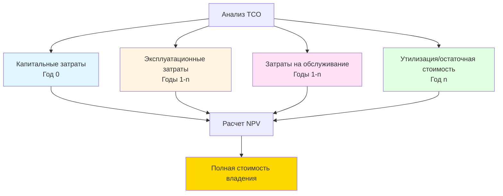
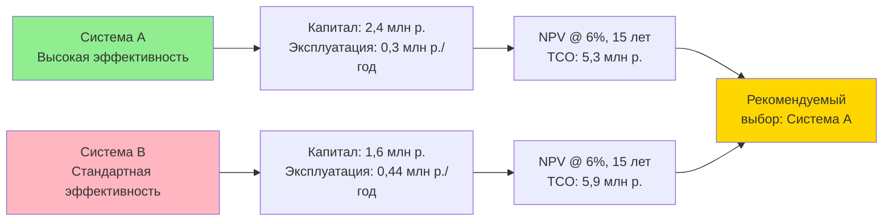

## Структура анализа полной стоимости владения

Анализ полной стоимости владения (Total Cost of Ownership, TCO) обеспечивает комплексную экономическую оценку оборудования HVAC на протяжении всего периода его эксплуатации. В отличие от простых сравнений первоначальной стоимости, TCO учитывает все денежные потоки от приобретения до утилизации, что позволяет принимать обоснованные решения по распределению капиталовложений.

Полное уравнение TCO интегрирует все категории затрат на протяжении срока службы системы:

$$TCO = C_{acq} + C_{inst} + \sum_{t=1}^{n} \frac{C_{op,t} + C_{maint,t}}{(1+r)^t} + \frac{C_{disp} - V_{resid}}{(1+r)^n}$$

где $C_{acq}$ – затраты на приобретение, $C_{inst}$ – затраты на монтаж, $C_{op,t}$ – годовые эксплуатационные затраты, $C_{maint,t}$ – затраты на техническое обслуживание, $C_{disp}$ – затраты на утилизацию, $V_{resid}$ – остаточная стоимость, $r$ – ставка дисконтирования, $n$ – срок службы системы в годах.

## Затраты на приобретение и монтаж

### Приобретение оборудования

Затраты на приобретение включают все расходы по закупке оборудования, готового к монтажу:

- **Базовая стоимость оборудования** – рекомендуемая розничная цена производителя с учетом скидок на объем
- **Вспомогательные компоненты** – системы управления, датчики, приборы, оборудование интеграции
- **Доставка и обработка** – фрахт, стыковка, хранение
- **Накладные расходы на закупку** – сметные расходы отдела закупок, квалификация поставщиков

Для комплектных систем затраты на приобретение обычно составляют 6000–12000 руб./кВт мощности охлаждения. Для специализированных центральных установок требуется детальная смета на уровне компонентов.

### Расходы на монтаж

Трудозатраты и материалы на монтаж зачастую превышают стоимость оборудования для сложных систем:

- **Стоимость труда** – полевой монтаж, подключение трубопроводов/воздуховодов, электромонтажные работы
- **Материалы** – холодильные трубопроводы, фитинги, опоры, теплоизоляция, электропроводка
- **Кран и такелажные работы** – размещение оборудования, подъемы на крышу
- **Подготовка площадки** – основания для оборудования, усиление конструкций, проемы в кровле
- **Испытания и наладка** – функциональное тестирование производительности в соответствии с ASHRAE Guideline 1.1
- **Обучение** – инструктаж операторов, разработка документации

Стоимость монтажа как процент от стоимости оборудования варьируется в широких пределах:

| Тип системы | Соотношение затрат на монтаж/оборудование |
|-------------|---------------------------------------------|
| Компактные кровельные блоки | 0,4 – 0,8 |
| Раздельные DX системы | 0,6 – 1,2 |
| Центральная установка охлажденной воды | 1,5 – 3,0 |
| Системы VRF | 0,8 – 1,4 |

## Затраты на эксплуатационную энергию

Потребление энергии определяет долгосрочный TCO для большинства систем HVAC. Годовая стоимость эксплуатации следует из термодинамической эффективности и профиля работы:

$$C_{op} = \frac{Q_{annual}}{EER} \times c_e \times \frac{1}{3.412}$$

где $Q_{annual}$ – годовая нагрузка охлаждения (кДж/год), $EER$ – коэффициент энергоэффективности (кДж/Вт·ч), $c_e$ – стоимость электроэнергии (руб./кВт·ч). Коэффициент 3,412 преобразует кВт в кДж/ч.

### Влияние коэффициента нагрузки

Фактическое потребление энергии критически зависит от работы при частичной нагрузке. Системы работают с расчетной нагрузкой менее 1% годовых часов. Интегрированное значение при частичной нагрузке (IPLV) или сезонный коэффициент энергоэффективности (SEER) обеспечивают более реалистичное предсказание энергопотребления:

$$E_{annual} = \sum_{i=1}^{8760} \frac{Q_{load,i}}{EER_{part}(PLR_i)}$$

где $PLR_i$ представляет коэффициент частичной нагрузки для часа $i$, а $EER_{part}(PLR)$ – функция эффективности при частичной нагрузке.

Высокоэффективное оборудование требует премиальных затрат на приобретение, но обеспечивает сниженные эксплуатационные расходы. Экономическое равновесие зависит от стоимости энергии, часов работы и характеристик нагрузки.

## Затраты на техническое обслуживание и ремонт

### Профилактическое обслуживание

Регулярное техническое обслуживание сохраняет эффективность и продлевает срок службы оборудования. ASHRAE рекомендует частоту на основе типа оборудования и условий работы:

**Приблизительный расчет годовых затрат на техническое обслуживание:**

$$C_{maint} = C_{labor} + C_{materials} + C_{overhead}$$

Типовые затраты на техническое обслуживание составляют 2–4% от стоимости замены оборудования в год для механических систем, 1–2% для компонентов управления и электрооборудования.

### Ремонт и замена

Внеплановые ремонты следуют вероятностным закономерностям отказов. Ожидаемая стоимость ремонта интегрирует вероятность отказа с расходами на ремонт:

$$C_{repair,expected} = \sum_{j=1}^{m} P_{fail,j} \times C_{repair,j}$$

где $P_{fail,j}$ – вероятность отказа компонента $j$, а $C_{repair,j}$ – связанная стоимость ремонта.

## Анализ текущей стоимости

Временная стоимость денег требует дисконтирования будущих затрат на текущую стоимость. Чистая текущая стоимость (NPV) всех затрат определяет TCO:

### Выбор ставки дисконтирования

Выбор ставки дисконтирования принципиально влияет на расчеты TCO. Общепринятые подходы:

- **Средневзвешенная стоимость капитала (WACC)** – отражает стоимость финансирования организации
- **Внутренняя пороговая ставка** – пороговое значение инвестиций организации
- **Скорректированная на риск ставка** – добавляет премию за риск к безрисковой ставке

Более высокие ставки дисконтирования отдают предпочтение оборудованию с низкой первоначальной стоимостью; более низкие ставки отдают предпочтение высокоэффективным альтернативам.

## Анализ чувствительности

Расчеты TCO содержат множество неопределенных параметров. Анализ чувствительности определяет критические переменные:

$$\frac{\partial TCO}{\partial x_i} = \text{чувствительность к параметру } x_i$$

Параметры, требующие анализа чувствительности:

- Темп роста стоимости энергии
- Срок службы оборудования
- Ставка дисконтирования
- Тенденции затрат на техническое обслуживание
- Часы работы

## Сравнительная система TCO

## Утилизация и остаточная стоимость

Затраты на конец срока службы включают:

- **Трудозатраты на демонтаж** – отключение, такелажные работы, демонтаж
- **Восстановление хладагента** – обязательное извлечение в соответствии с требованиями EPA
- **Сборы за утилизацию** – захоронение на полигон, переработка, обработка опасных материалов
- **Восстановление площадки** – заделка, герметизация проемов

Остаточная стоимость снижает затраты на утилизацию для оборудования с остающимся сроком полезного использования или стоимостью лома. Типовая остаточная стоимость составляет 5–15% от первоначальной стоимости стандартного оборудования HVAC.

## Список источников

- ASHRAE Guideline 1.1-2007: HVAC&R Technical Requirements for The Commissioning Process
- ASHRAE Standard 90.1: Energy Standard for Buildings Except Low-Rise Residential Buildings
- NIST Handbook 135: Life-Cycle Costing Manual for the Federal Energy Management Program
