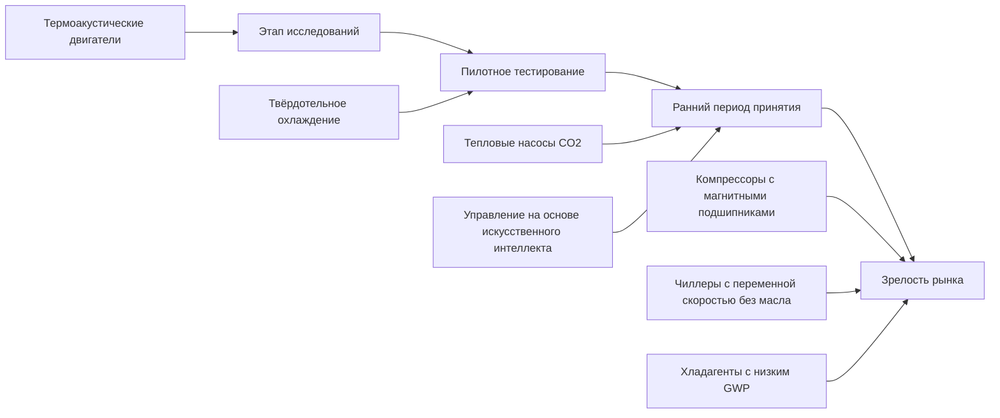

# Новые технологии систем вентиляции и кондиционирования

Индустрия HVAC находится в постоянном развитии, стимулируемом нормативными требованиями, мандатами на энергоэффективность и технологическими достижениями. Новые технологии решают фундаментальные термодинамические задачи, снижая при этом экологическое воздействие и операционные расходы. В этом разделе рассматриваются передовые разработки, которые трансформируют инженерию климатического контроля.

## Термодинамические драйверы инноваций

Инновации в системах HVAC вытекают из трёх основных термодинамических императивов:

1. **Повышение эффективности Карно**: Уменьшение температурного напора между тепловым источником и стоком
2. **Минимизация деструкции эксергии**: Устранение необратимостей в теплопередаче и потоке жидкости
3. **Снижение генерации энтропии**: Оптимизация процессов для приближения к обратимости

Коэффициент производительности (COP) для систем отопления и охлаждения следует фундаментальным пределам:

$$
\text{COP}_{\text{отопление}} = \frac{T_{\text{горячее}}}{T_{\text{горячее}} - T_{\text{холодное}}}
$$

$$
\text{COP}_{\text{охлаждение}} = \frac{T_{\text{холодное}}}{T_{\text{горячее}} - T_{\text{холодное}}}
$$

Где температуры указаны в абсолютных единицах (Кельвин). Новые технологии приближаются к этим теоретическим пределам посредством передовых модификаций цикла, улучшенных теплообменников и интеллектуальных систем управления.

## Ландшафт технологий

### Инновации в тепловых насосах

Передовые технологии тепловых насосов используют низкотемпературные тепловые источники и достигают большего температурного напора посредством многоступенчатого сжатия, впрыска пара и новых рабочих веществ. Трансритические циклы с CO₂ работают выше критической точки (31,1°C, 7,38 МПа), обеспечивая высокотемпературное отопление при сохранении благоприятных экологических характеристик (GWP = 1, ODP = 0).

Компрессоры с переменной скоростью вращения с магнитными подшипниками исключают механическое трение, снижая потребление энергии при частичной нагрузке на 30–50% по сравнению с альтернативами с фиксированной скоростью. Требуемая мощность при частичной нагрузке описывается:

$$
P = P_{\text{номин}} \left(\frac{Q}{Q_{\text{номин}}}\right)^n
$$

Где n колеблется от 2,5–3,0 для систем с переменной скоростью в сравнении с 1,0 для управления с включением/отключением.

### Хладагенты нового поколения

Переход от гидрофторуглеродов (ГФУ) с высоким потенциалом глобального потепления к альтернативам с низким GWP следует нормативным графикам, установленным Кигалийской поправкой. Ландшафт технологий включает:

| Класс хладагента | Диапазон GWP | Основное применение | Ключевые характеристики |
|------------------|--------------|-------------------|------------------------|
| ГФО (R-1234yf, R-1234ze) | < 10 | Чиллеры, тепловые насосы | Слабо воспламеняемы (A2L) |
| Природные хладагенты (R-744, R-717) | 1–0 | Коммерческое холодоснабжение, промышленность | Нетоксичны или токсичны, разная воспламеняемость |
| Смеси углеводородов (R-290, R-600a) | 3–20 | Малые системы | Легко воспламеняемы (A3) |
| Смеси ГФО/ГФУ (R-454B, R-32) | 148–675 | Жилое кондиционирование, тепловые насосы | Меньше воспламеняемости, чем чистые углеводороды |

Совместимость материалов, выбор смазочного масла и конструкция систем безопасности представляют критические инженерные аспекты при переходе на новые хладагенты.

### Интеллектуальные системы управления и интеграция искусственного интеллекта

Алгоритмы машинного обучения оптимизируют работу HVAC путём выявления закономерностей в тепловой реакции здания, занятости и метеорологических данных. Прогнозное управление моделью (MPC) постоянно решает задачи оптимизации:

$$
\min_{u(t)} \int_{t_0}^{t_f} \left[ w_1 E(t) + w_2 |T_{\text{зона}} - T_{\text{уставка}}|^2 \right] dt
$$

При условии ограничений теплового баланса, пределов мощности оборудования и сигналов управления спросом. Нейронные сети аппроксимируют сложную тепловую динамику здания быстрее, чем физические модели, обеспечивая оптимизацию в реальном времени.

### Передовое тепловое аккумулирование

Материалы с фазовым переходом (МФП) аккумулируют скрытое тепло при постоянной температуре во время переходов плавления/отвердевания. Плотность энергии аккумулирования для МФП с скрытой теплотой h_fg выражается как:

$$
q = \rho \left[ c_p \Delta T + h_{fg} \right]
$$

Соляные гидраты (Na₂SO₄·10H₂O) достигают температуры плавления вблизи 32°C с скрытой теплотой 254 кДж/кг, пригодные для увеличения тепловой инерции здания. Системы ледяного аккумулирования смещают охлаждающие нагрузки на внепиковые часы, снижая пиковые платежи при одновременном повышении стабильности сети.

### Технология десикантного осушения воздуха

Твёрдые и жидкие десикантные системы разделяют явное и скрытое охлаждение, повышая эффективность в климатах с высокой влажностью. Скорость удаления влаги следует принципам массопередачи:

$$
\dot{m}_w = h_m A \rho_{\text{воздух}} (W_{\text{воздух}} - W_{\text{десикант}})
$$

Где h_m — коэффициент массопередачи, а W представляет коэффициент влажности. Регенерация с использованием низкотемпературного тепла (60–80°C) из солнечных тепловых коллекторов или утилизации тепловых потерь обеспечивает рентабельное осушение воздуха.

## Оценка зрелости технологий

## Интеграция с системами здания

Эффективное развёртывание новых технологий требует интеграции на уровне систем, учитывающей:

- **Электрическая инфраструктура**: Преобразователи частоты (ПЧ) создают гармонические искажения, требующие смягчения качества электроснабжения
- **Сети управления**: BACnet, Modbus и закрытые протоколы обеспечивают обмен данными, но создают уязвимости кибербезопасности
- **Гидравлические системы**: Переменный расход насоса, низкотемпературное распределение и стратегии развязки оптимизируют теплопередачу
- **Управление энергией**: Интеграция с системами управления зданием (BMS) обеспечивает управление спросом и обнаружение неисправностей

## Стандарты валидации производительности

Стандарт ASHRAE 90.1 устанавливает минимальные требования к эффективности коммерческого оборудования. Процедуры испытания, определённые стандартами ANSI/AHRI, обеспечивают согласованность рейтингов производительности:

- **AHRI 550/590**: Блоки охлаждения воды и тепловые насосы с нагревом воды
- **AHRI 340/360**: Коммерческое и промышленное холодоснабжение
- **AHRI 210/240**: Унитарные установки кондиционирования и тепловые насосы

Полевая проверка посредством протоколов измерения и валидации (M&V) (ASHRAE Guideline 14, IPMVP) количественно оценивает фактическую экономию энергии в сравнении с базовыми прогнозами.

## Экономические и экологические аспекты

Принятие технологий зависит от анализа полной стоимости владения (TCO), включающего:

1. Первоначальную стоимость (оборудование, монтаж, пусконаладка)
2. Операционные расходы (энергия, обслуживание, хладагент)
3. Продолжительность жизненного цикла и сроки замены
4. Соответствие экологическим требованиям (углеродное ценообразование, налоги на хладагенты)

Выравниваемая стоимость энергии (LCOE) обеспечивает сравнение конкурирующих технологий:

$$
\text{LCOE} = \frac{\sum_{t=1}^{n} \frac{C_t + O_t}{(1+r)^t}}{\sum_{t=1}^{n} \frac{E_t}{(1+r)^t}}
$$

Где C_t представляет капитальные расходы, O_t — операционные расходы, E_t — доставленную энергию, а r — ставку дисконтирования в течение n лет.

## Прогноз на будущее

Конвергенция электрификации, декарбонизации и цифровизации ускоряет разработку технологий HVAC. Устройства твёрдотельного охлаждения на основе термоэлектрических, магнитокалорических и электрокалорических эффектов приближаются к коммерциализации для специальных приложений. Интерактивные с сетью энергоэффективные здания (GEBs) координируют работу HVAC с производством возобновляемой энергии и хранением, трансформируя здания из пассивных потребителей в активные ресурсы сети.

Нормативные рамки все чаще требуют хладагентов с низким GWP, высокоэффективного оборудования и декарбонизации зданий. Инженеры должны ориентироваться в этом развивающемся ландшафте, сохраняя фундаментальные приоритеты: тепловой комфорт, качество внутреннего воздуха, надёжность и экономичность.
