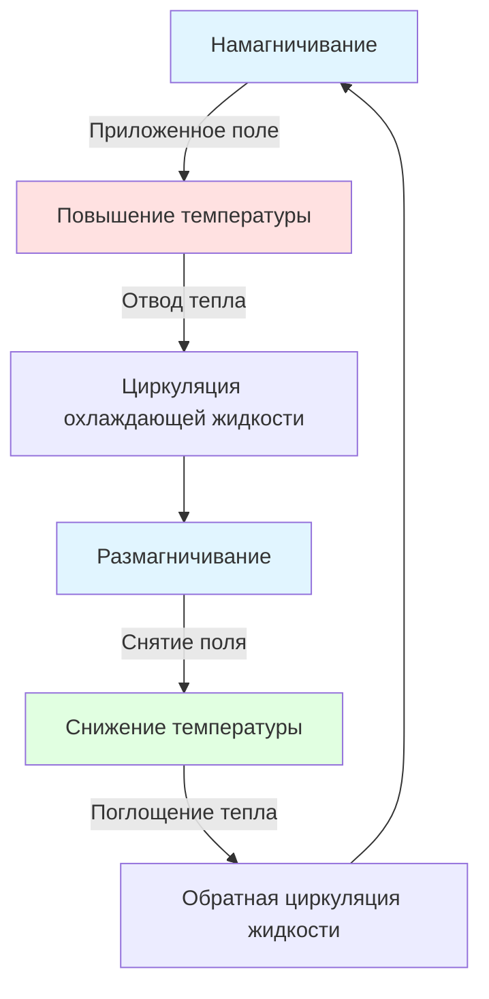

## Обзор

Передовые технологии охлаждения представляют эволюционные и революционные улучшения по сравнению с традиционными системами паровой компрессии. Эти инновации решают задачи энергоэффективности, воздействия на окружающую среду и производительности для конкретных приложений через новые термодинамические циклы, альтернативные принципы работы и оптимизированные архитектуры системы.

## Трансритическое охлаждение CO2

Трансритические циклы работают выше критической точки холодильного агента, принципиально изменяя характеристики отвода тепла. Для CO2 (R-744) критическая точка находится при -0,5°C и 7,38 МПа, что делает трансритическую работу практичной для многих приложений.

### Термодинамическая производительность

Коэффициент производительности для трансритических циклов зависит от эффективности газового охладителя, а не от температуры конденсации:

$$
COP_{trans} = \frac{h_1 - h_4}{h_2 - h_1}
$$

Где:
- $h_1$ = энтальпия на выходе испарителя
- $h_2$ = энтальпия на нагнетании компрессора
- $h_4$ = энтальпия на входе расширительного клапана

Температурный подход газового охладителя значительно влияет на производительность. Для трансритического CO2:

$$
\eta_{gc} = \frac{T_{amb} - T_{gc,out}}{T_{gc,in} - T_{amb}}
$$

Оптимальное давление нагнетания варьируется в зависимости от условий окружающей среды согласно:

$$
P_{opt} = 2.778 - 0.0157 \cdot T_{gc,out}
$$

Где $P_{opt}$ в МПа и $T_{gc,out}$ в °C.

### Характеристики системы

| Параметр | Субритический R-404A | Трансритический CO2 |
|-----------|-------------------|-------------------|
| Рабочее давление | 1,5-3,0 МПа | 8,0-12,0 МПа |
| Температура нагнетания | 65-85°C | 90-140°C |
| Объемная производительность | 2 800 кДж/м³ | 22 000 кДж/м³ |
| GWP | 3 922 | 1 |
| Степень повышения давления | 3,5-5,0 | 2,5-3,5 |

## Охлаждение с эжектором

Эжекторные циклы восстанавливают работу расширения посредством передачи импульса, повышая эффективность на 10-25% по сравнению с обычным дросселированием. Эжектор заменяет или дополняет расширительный клапан, используя поток высокого давления для сжатия пара низкого давления.

### Анализ производительности эжектора

Коэффициент увлечения определяет общую пользу от системы:

$$
\omega = \frac{\dot{m}_s}{\dot{m}_p}
$$

Где $\dot{m}_s$ — вторичный (всасывающий) поток и $\dot{m}_p$ — первичный (рабочий) поток.

Эффективность эжектора связана с подъемом давления и увлечением:

$$
\eta_{ej} = \frac{\omega(h_{s,in} - h_{s,out}) + (h_{p,in} - h_{p,out})}{(h_{p,in} - h_{mix,ideal})}
$$

Улучшение COP при интеграции эжектора:

$$
COP_{ejector} = COP_{basic} \cdot \left(1 + \frac{\omega \cdot P_{lift}}{W_{comp}}\right)
$$

### Соображения проектирования

Геометрия эжектора критически влияет на производительность. Коэффициент площади определяет диапазон работы:

$$
A_R = \frac{A_{nozzle,throat}}{A_{mixing,throat}}
$$

Исследовательский проект ASHRAE RP-1755 установил руководящие принципы проектирования для эжекторных систем охлаждения, рекомендуя коэффициенты площади от 0,4 до 0,8 для большинства приложений.

## Магнитное охлаждение

Магнитокалорийное охлаждение использует изменение температуры в магнитных материалах при изменении магнитного поля. Эта полупроводниковая технология полностью исключает холодильные агенты, обеспечивая нулевое прямое воздействие на окружающую среду.

### Магнитокалорийный эффект

Адиабатическое изменение температуры при магнитном поле $H$ следует:

$$
\Delta T_{ad} = -\int_{H_0}^{H_1} \left(\frac{T}{C_H}\right) \left(\frac{\partial M}{\partial T}\right)_H dH
$$

Где:
- $T$ = абсолютная температура
- $C_H$ = теплоемкость при постоянном поле
- $M$ = намагниченность

Для гадолиния вблизи температуры Кюри (294 K), изменение поля с 0 до 2 Тесла производит:

$$
\Delta T_{ad} \approx 5-8 \text{ K}
$$

### Активная магнитная регенерация

Практическое магнитное охлаждение требует циклов регенерации:

Эффективность регенератора определяет COP цикла:

$$
\varepsilon_{reg} = \frac{T_{fluid,out} - T_{fluid,in}}{T_{solid} - T_{fluid,in}}
$$

Текущие прототипы магнитного охлаждения достигают значений COP от 2 до 5 при температурных подъемах от 20 до 30 K, сравнимые с паровой компрессией, но с превосходной эффективностью при частичных нагрузках.

## Термоэлектрическое охлаждение

Устройства эффекта Пельтье обеспечивают полупроводниковое охлаждение посредством транспорта электронов через несходные полупроводники. Приложения включают локальное охлаждение, управление тепловым режимом электроники и специализированные приложения HVAC.

### Основные принципы производительности

Термоэлектрический COP зависит от коэффициента качества $ZT$:

$$
COP_{TE} = \frac{T_c \sqrt{1 + ZT} - T_h}{T_h - T_c} \cdot \frac{1}{1 + \sqrt{1 + ZT}}
$$

Где:
- $T_c$ = температура холодной стороны (K)
- $T_h$ = температура горячей стороны (K)
- $ZT$ = безразмерный коэффициент качества

Коэффициент качества объединяет свойства материалов:

$$
ZT = \frac{S^2 \sigma T}{\kappa}
$$

Где $S$ — коэффициент Зебека, $\sigma$ — электрическая проводимость, и $\kappa$ — теплопроводность.

### Достижения в материалах

| Система материалов | Значение ZT | Температурный диапазон | Статус разработки |
|-----------------|----------|-------------------|-------------------|
| Bi₂Te₃ (традиционный) | 0,8-1,0 | -50 до 200°C | Коммерческий |
| Скуттерудиты | 1,2-1,4 | 300-600°C | Прототип |
| Half-Heusler | 1,0-1,5 | 300-700°C | Исследование |
| Наноструктурированный PbTe | 1,5-2,2 | 400-700°C | Исследование |

Стандарт ASHRAE 116-2010 определяет методы испытаний термоэлектрических устройств в приложениях HVAC.

## Двухфазные эжекторные системы

Продвинутые конфигурации эжектора создают двухфазное расширение потока, восстанавливая дополнительную энергию по сравнению с системами, работающими только с паром. Эжектор байпаса газа-вспышки (FGBE) перенаправляет пар из бака вспышки через вспомогательный компрессор или эжектор.

### Совершенствование цикла

Для двухступенчатых систем с управлением газом вспышки:

$$
COP_{FGBE} = \frac{Q_e}{\dot{m}_1 W_1 + \dot{m}_2 W_2}
$$

Где индексы 1 и 2 обозначают компрессоры низкого и высокого давления.

Улучшение эффективности варьируется от 8 до 15% в зависимости от температурного подъема и свойств холодильного агента.

## Инновации каскадного охлаждения

Современные каскадные системы используют оптимизированные пары холодильных агентов и совершенствованные конструкции теплообменников для приложений с крайне низкой температурой (-60 до -101°C).

### Оптимальная температура каскада

Промежуточная температура, которая минимизирует общий входной работу:

$$
T_{cascade,opt} = \sqrt{T_{evap} \cdot T_{cond}}
$$

Это соотношение среднего геометрического применяется, когда обе ступени используют подобные холодильные агенты с сравнимыми характеристиками эффективности.

## Термоакустическое охлаждение

Термоакустические системы преобразуют акустическую мощность в тепловые градиенты посредством сжатия и расширения газа в стоячих волнах. Основное преимущество — исключение подвижных деталей и холодильных агентов.

### Связь акустической работы

Усредненная по времени акустическая мощность через регенератор:

$$
\dot{W}_{ac} = \frac{1}{2} \text{Re}\left[\tilde{p} \cdot \tilde{u}^* \cdot A\right]
$$

Где $\tilde{p}$ — амплитуда давления, $\tilde{u}$ — амплитуда скорости и $A$ — площадь поперечного сечения.

## Холодильники цикла Стирлинга

Холодильники Стирлинга работают на замкнутом регенеративном цикле с сжатием газа при температуре окружающей среды и расширением при низкой температуре. Приложения включают криогенное охлаждение и специализированные системы с низкой температурой.

### Идеальный COP цикла Стирлинга

Для идеального цикла Стирлинга:

$$
COP_{Stirling} = \frac{T_c}{T_h - T_c}
$$

Практические системы достигают 30-40% эффективности Карно из-за потерь в регенераторе и необратимостей теплопередачи.

## Стандарты и испытания

Стандарт ASHRAE 34-2019 классифицирует холодильные агенты, включая появляющиеся варианты с низким GWP для передовых циклов. Испытание производительности следует стандарту AHRI 540-2020 для компрессоров холодильных агентов с положительным вытеснением.

Технологии передового охлаждения продолжают развиваться в направлении повышения эффективности, снижения воздействия на окружающую среду и расширения диапазонов применения. Физико-базовая оптимизация в сочетании с новыми материалами и архитектурами циклов обеспечивает постоянные улучшения производительности во всех категориях технологий.
