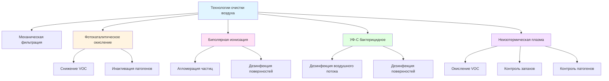

# Передовые технологии очистки воздуха для систем HVAC

Передовые технологии очистки воздуха выходят за рамки традиционной механической фильтрации для устранения газообразных загрязнений, патогенов и субмикронных частиц посредством активных химических и физических процессов. Эти системы используют механизмы, включающие фотокатализ, ионизацию, ультрафиолетовое облучение и генерацию плазмы для нейтрализации или удаления аэрозольных загрязнений.

## Фотокаталитическое окисление (PCO)

Фотокаталитическое окисление использует УФ-свет для активации поверхностей катализатора из диоксида титана (TiO₂), генерирующих реактивные кислородные соединения, которые окисляют органические соединения и инактивируют микроорганизмы.

### Механизмы реакций PCO

Фундаментальный фотокаталитический процесс происходит, когда энергия фотона превышает ширину запрещённной зоны катализатора:

$$E_{photon} = h\nu \geq E_g$$

Где $E_g$ – ширина запрещённной зоны (3,2 эВ для анатаза TiO₂), h – постоянная Планка, ν – частота фотона.

Генерация пар электрон-дырка:

$$\text{TiO}_2 + h\nu \rightarrow e^- + h^+$$

Образование реактивных кислородных соединений:

$$h^+ + \text{H}_2\text{O} \rightarrow \text{OH}^{\bullet} + \text{H}^+$$

$$e^- + \text{O}_2 \rightarrow \text{O}_2^{-\bullet}$$

Гидроксильный радикал (OH•) обладает высокой окислительной способностью (E° = +2,8 В) и разлагает летучие органические соединения посредством последовательных реакций окисления, в итоге образуя CO₂ и H₂O.

### Параметры проектирования систем PCO

**Требования интенсивности УФ-излучения:**

$$I = \frac{\Phi}{A}$$

Где Φ – световой поток (Вт), A – площадь поверхности катализатора (м²). Эффективные системы PCO требуют интенсивности УФ-A 1–10 мВт/см² на поверхности катализатора.

**Время контакта:**

$$\tau = \frac{V}{Q}$$

Где V – объём реактора (м³), Q – расход воздуха (м³/с). Типичное время контакта составляет от 0,1 до 1,0 секунды в зависимости от целевой концентрации загрязнения и требуемой эффективности удаления.

## Биполярная ионизация

Системы биполярной ионизации генерируют равные количества положительных и отрицательных ионов, которые прикрепляются к аэрозольным частицам и патогенам, способствуя агломерации и микробной инактивации.

### Механизмы генерации ионов

**Игольчатая ионизация:**

Высокое напряжение, приложенное к острым электродам, создаёт корону разряда, ионизирующую молекулы кислорода и воды:

$$\text{O}_2 + e^- \rightarrow \text{O}_2^- \text{  (отрицательный ион)}$$

$$\text{H}_2\text{O} - e^- \rightarrow \text{H}_2\text{O}^+ \text{  (положительный ион)}$$

Концентрации ионов обычно составляют 10⁵–10⁶ ионов/см³ в точке генерации и уменьшаются с расстоянием согласно:

$$N(x) = N_0 e^{-\beta x}$$

Где N₀ – начальная концентрация ионов, β – коэффициент спада (обычно 0,01–0,1 см⁻¹), x – расстояние от источника.

### Агломерация частиц

Прикрепление ионов увеличивает эффективный диаметр частицы, улучшая эффективность механической фильтрации:

$$d_{eff} = d_p + 2\delta$$

Где δ – вклад ионного диаметра (обычно 1–10 нм на скопление прикреплённых ионов). Это смещает субмикронные частицы в диапазоны размеров, где инерционное столкновение становится значимым.

## УФ-C бактерицидное облучение (UVGI)

УФ-C излучение (длина волны 200–280 нм) инактивирует микроорганизмы, нарушая структуру нуклеиновых кислот. Бактерицидная эффективность достигает максимума при 265 нм, что соответствует максимальному поглощению ДНК/РНК.

### Расчёты УФ-дозы

Микробная инактивация подчиняется кинетике первого порядка:

$$\ln\left(\frac{N}{N_0}\right) = -k \cdot D_{UV}$$

Где N/N₀ – доля выживших микроорганизмов, k – константа скорости инактивации, специфичная для патогена (см²/мДж), D_UV – УФ-доза (мДж/см²).

**Подача УФ-дозы:**

$$D_{UV} = I \cdot t$$

Где I – облучённость (мВт/см²), t – время экспозиции (секунды).

Для применения внутри воздуховода с скоростью воздушного потока v:

$$D_{UV} = \frac{I \cdot L}{v}$$

Где L – длина облучаемой зоны (м), v – скорость воздуха (м/с).

### Рекомендации ASHRAE

Стандарт ASHRAE 185.1 устанавливает минимальные УФ-дозы для 90%-ной инактивации (снижение на 1 логарифм) распространённых патогенов:

| Микроорганизм | Доза D₉₀ (мДж/см²) | Применение |
|---------------|-------------------|-----------|
| Staphylococcus aureus | 26 | Контроль бактерий |
| Mycobacterium tuberculosis | 10 | Медицинские учреждения |
| Influenza A | 35 | Общее качество воздуха |
| SARS-CoV-2 | 16–21 | Ответ на пандемию |
| Aspergillus niger (споры) | 132 | Контроль грибков |

## Очистка воздуха неизотермической плазмой

Системы неизотермической плазмы генерируют энергичные электроны, создающие реактивные соединения, включая озон, атомарный кислород, гидроксильные радикалы и возбуждённые соединения азота.

### Генерация плазмы

**Диэлектрический барьерный разряд (DBD):**

Переменное высокое напряжение (5–20 кВ на 1–100 кГц) через диэлектрический материал создаёт микроразряды без теплового разгона. Температуры электронов достигают 1–10 эВ, при этом объём газа остаётся близким к окружающей температуре.

**Образование реактивных соединений:**

$$e^- + \text{O}_2 \rightarrow \text{O} + \text{O}^- + e^-$$

$$e^- + \text{H}_2\text{O} \rightarrow \text{OH}^{\bullet} + \text{H}^{\bullet} + e^-$$

$$e^- + \text{N}_2 \rightarrow \text{N}_2^* + e^-$$

### Управление озоном

Плазменные системы по своей природе производят озон как побочный продукт. Стандарт ASHRAE 62.1 ограничивает постоянное воздействие озона до 0,05 ppm (8-часовая средневзвешенная концентрация). Эффективные системы плазменной очистки включают:

- Каталитическое разложение озона (MnO₂, Pt/Al₂O₃)
- Вторичные реактивные зоны для потребления озона
- Оптимизацию времени контакта для минимизации чистого выхода озона

## Матрица сравнения технологий

| Технология | Основной механизм | Целевые загрязнения | Перепад давления | Техническое обслуживание | Побочные продукты |
|------------|------------------|---------------------|------------------|----------------------|------------------|
| Фильтрация HEPA | Механический захват | Частицы >0,3 мкм | 250–500 Па | Замена фильтра | Нет |
| PCO | Фотокатализ | VOC, биоаэрозоли | 10–50 Па | УФ-лампа, катализатор | Альдегиды (следы) |
| Биполярная ионизация | Прикрепление ионов | Частицы, патогены | 0–10 Па | Очистка электрода | Озон (следы) |
| УФ-C | Нарушение ДНК/РНК | Микроорганизмы | 0 Па | Замена УФ-лампы | Нет |
| Плазма | Реактивные соединения | VOC, патогены, запахи | 20–100 Па | Техническое обслуживание электрода | Озон, NOₓ |

## Соображения интеграции системы

### Многоэтапный подход

Эффективная передовая очистка использует последовательные технологии:

1. **Предварительная фильтрация:** MERV 13–14 удаляет частицы >0,3 мкм
2. **Активная очистка:** PCO, ионизация или плазма для субмикронных частиц и VOC
3. **UVGI:** Инактивация микроорганизмов в концентрированной зоне
4. **Послеобработка:** Активированный уголь или каталитическое окисление для управления побочными продуктами

### Распределение воздушного потока

Равномерное распределение воздуха обеспечивает согласованную обработку. Коэффициент вариации скорости по зоне обработки должен удовлетворять:

$$CV = \frac{\sigma_v}{\bar{v}} < 0,20$$

Где σ_v – стандартное отклонение, v̄ – средняя скорость.

### Потребление энергии

Требования к мощности значительно варьируются:

- **PCO:** 20–50 Вт на 1 000 CFM (1 700 м³/ч)
- **Биполярная ионизация:** 5–15 Вт на систему (в зависимости от охвата)
- **УФ-C внутри воздуховода:** 30–100 Вт на лампу (в зависимости от охвата)
- **Плазма:** 50–150 Вт на 1 000 CFM (1 700 м³/ч)

Общая энергия системы включает устройства очистки плюс любую дополнительную мощность вентилятора для преодоления перепада давления.

## Проверка производительности

Стандарт ASHRAE 145.2 предоставляет методы испытаний для устройств очистки воздуха, требующие измерения:

- Эффективность удаления в одиночном проходе для частиц и газов
- Скорость доставки чистого воздуха (CADR)
- Скорость выработки озона и других побочных продуктов
- Перепад давления в рабочем диапазоне
- Эффективность микробной инактивации (где применимо)

Независимые испытания согласно этим стандартам проверяют заявления производителя и обеспечивают безопасную и эффективную работу в занятых помещениях.

## Будущие разработки

Появляющиеся исследования сосредоточены на:

- **Фотокатализаторы, активируемые видимым светом:** Легированный TiO₂ и альтернативные материалы (g-C₃N₄, BiVO₄), активируемые более длинными волнами
- **Гибридные плазменно-каталитические системы:** Объединение генерации плазмы с каталитическими поверхностями для повышенной эффективности
- **УФ-C далёкого диапазона (222 нм):** Длина волны, инактивирующая патогены без проникновения через кожу или глаза человека
- **Оптимизация машинного обучения:** Реальная регулировка интенсивности очистки на основе датчиков загрязнения

Эти технологии представляют эволюцию за пределами пассивной фильтрации в направлении активного, энергоэффективного контроля загрязнений, интегрированного в центральные системы HVAC и децентрализованные устройства очистки воздуха.

---

**Ссылки:**
- Стандарт ASHRAE 62.1: Вентиляция для приемлемого качества воздуха в помещении
- Стандарт ASHRAE 185.1: Метод испытания УФ-C ламп для использования в устройствах HVAC&R или плёнумах
- Стандарт ASHRAE 145.2: Лабораторный метод испытания для оценки производительности систем очистки воздуха в газовой фазе
- Справочник ASHRAE—Приложения HVAC, Глава 62: Системы УФ-ламп
