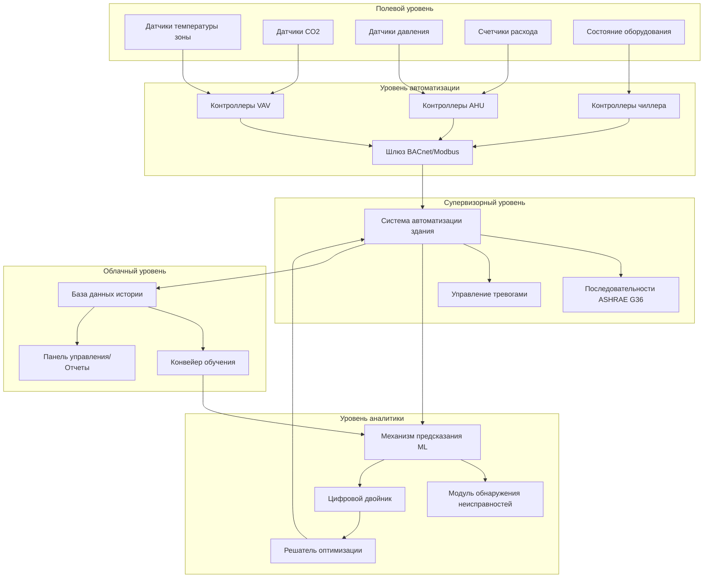
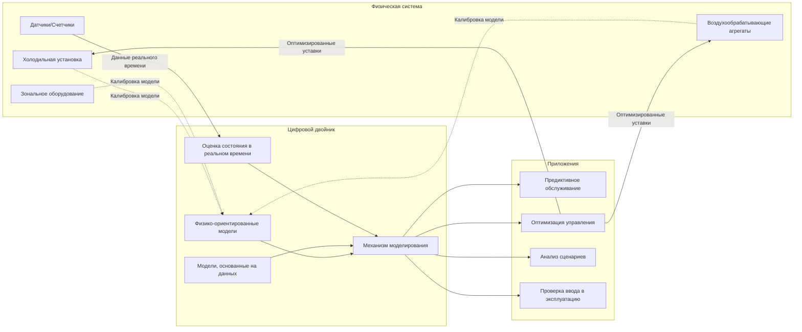

## Обзор интеллектуальных систем управления HVAC

Современные системы HVAC все чаще используют машинное обучение (ML), искусственный интеллект (AI) и продвинутую автоматизацию для достижения превосходной энергоэффективности, комфорта для пользователей и надежности системы. Эти технологии обеспечивают предиктивные стратегии управления, которые предвосхищают нагрузки на здание, обнаруживают неисправности оборудования до отказа и оптимизируют многозонные операции в режиме реального времени. ASHRAE Guideline 36 устанавливает последовательности высокопроизводительного управления для систем HVAC, предоставляя базовую структуру для реализации продвинутых стратегий управления.

Интеграция цифровых двойников — виртуальных копий физических систем HVAC — создает беспрецедентные возможности для оптимизации на основе моделирования, проверки ввода в эксплуатацию и мониторинга производительности на протяжении жизненного цикла. В сочетании с облачной аналитикой и пограничными вычислениями эти системы преобразуют реактивное обслуживание в проактивную оптимизацию.

## Машинное обучение для оптимизации HVAC

### Предиктивное прогнозирование нагрузок

Алгоритмы ML предсказывают тепловые нагрузки путем анализа исторических паттернов, прогнозов погоды, расписания занятости и тепловых характеристик здания. Распространенные подходы включают:

**Модели временных рядов регрессии:**

$$\hat{Q}_{t+h} = \beta_0 + \sum_{i=1}^{p} \beta_i Q_{t-i} + \sum_{j=1}^{q} \gamma_j T_{amb,t-j} + \sum_{k=1}^{r} \delta_k O_{t-k} + \epsilon$$

Где:
- $\hat{Q}_{t+h}$ = прогнозируемая нагрузка охлаждения/отопления в момент времени $t+h$ (кВт)
- $Q_{t-i}$ = исторические значения нагрузки (члены авторегрессии)
- $T_{amb,t-j}$ = история температуры окружающей среды (°C)
- $O_{t-k}$ = переменные индикаторов занятости
- $\beta_i, \gamma_j, \delta_k$ = коэффициенты модели
- $\epsilon$ = член ошибки

**Подходы нейронных сетей** используют несколько скрытых слоев для захвата нелинейных отношений между входными данными (погода, время суток, занятость) и выходными данными (температуры зон, нагрузки оборудования).

### Прогностическое управление моделями (MPC)

MPC оптимизирует работу HVAC на горизонте прогнозирования путем решения:

$$\min_{u(t)} \sum_{k=0}^{N-1} \left[ \alpha \cdot E(k) + \beta \cdot D(k) \right]$$

При условии:
- $T_{min} \leq T_{zone}(k) \leq T_{max}$ (ограничения комфорта)
- $0 \leq u_{cool}(k) \leq u_{cool,max}$ (ограничения пропускной способности оборудования)
- $x(k+1) = f(x(k), u(k), d(k))$ (динамика системы)

Где:
- $E(k)$ = потребление энергии на временном шаге $k$
- $D(k)$ = штраф за тепловой дискомфорт
- $u(k)$ = входные сигналы управления (позиции заслонок, позиции клапанов, скорости вентилятора)
- $\alpha, \beta$ = коэффициенты взвешивания для энергии и комфорта
- $N$ = длина горизонта прогнозирования

MPC позволяет реализовать стратегии предварительного охлаждения, которые используют тепловую массу в периоды низких цен на электроэнергию и минимизируют плату за пиковый спрос.

## Архитектура системы управления

## Диагностика и обнаружение неисправностей (FDD)

### Статистические подходы

Автоматизированная FDD выявляет отклонения от ожидаемой производительности с использованием анализа остатков:

$$r(t) = y_{measured}(t) - y_{predicted}(t)$$

Триггер обнаружения неисправности:

$$|r(t)| > \mu_r + 3\sigma_r$$

Где $\mu_r$ — среднее значение остатка, а $\sigma_r$ — стандартное отклонение при нормальной работе.

### Типичные неисправности HVAC, обнаруживаемые ИИ

| Тип неисправности | Индикаторы | Метод обнаружения |
|-----------|-----------|------------------|
| Застрявшая заслонка | Постоянный расход воздуха несмотря на изменение команды | Корреляция позиции привода и измеренного расхода |
| Утечка хладагента | Снижение переохлаждения, повышение перегрева | Анализ термодинамического состояния |
| Загрязненный теплообменник | Увеличение перепада давления, снижение пропускной способности | Тренд эффективности теплопередачи |
| Дрейф датчика | Несогласованные показания в сравнении с коррелированными датчиками | Сравнительный статистический анализ |
| Одновременное отопление/охлаждение | Высокое потребление энергии, низкая эффективность | Нарушения баланса энергии |

### Правило-ориентированная и основанная на данных FDD

**Правило-ориентированные системы** кодируют экспертные знания:
- ЕСЛИ (T_supply > T_setpoint + 2,8°C) И (valve_position > 95%) ТО "недостаточная пропускная способность охлаждения"

**Основанные на данных подходы** используют алгоритмы классификации:
- Машины опорных векторов (SVM) классифицируют рабочие состояния как нормальные или неисправные
- Случайные леса определяют важность признаков для изоляции неисправностей
- Автокодеры обнаруживают аномалии в многомерных данных датчиков

## Реализация цифрового двойника

Цифровые двойники объединяют:
1. **Физико-ориентированные модели**: Уравнения баланса энергии, термодинамические циклы
2. **Модели на основе данных**: Модели ML, обученные на операционных данных
3. **Гибридные подходы**: Физико-ориентированные нейронные сети, которые соблюдают законы сохранения

## Стратегии предиктивного обслуживания

### Оценка оставшегося полезного ресурса (RUL)

Модели ML предсказывают вероятность отказа компонента:

$$P(failure|t) = 1 - e^{-\lambda(t)}$$

Где $\lambda(t)$ — функция опасности, полученная из признаков, включая:
- Сигнатуры вибрации (износ подшипника)
- Анализ масла (деградация компрессора)
- Часы работы под нагрузкой
- Количество циклов пуска/остановки
- Условия эксплуатации (экстремальные температуры, давления)

### Оптимизация затрат на обслуживание

Определение оптимального времени обслуживания:

$$C_{total} = C_{preventive} \cdot P(maintain) + C_{failure} \cdot P(failure) + C_{downtime} \cdot E[downtime]$$

График обслуживания минимизирует общие ожидаемые затраты при поддержании целевых показателей надежности.

## Интеграция ASHRAE Guideline 36

Guideline 36 предоставляет продвинутые последовательности для:
- **Управление зоной**: Логика двойного максимума с подстройкой и ответом
- **Управление AHU**: Сброс температуры приточного воздуха на основе спроса зоны
- **Управление экономайзером**: Интегрированная дифференциальная логика сухого термометра и энтальпии
- **Управление вентиляцией с контролем спроса**: Модуляция наружного воздуха на основе CO2

Системы ИИ расширяют эти последовательности путем:
1. Обучения оптимальным графикам сброса из производительности конкретного здания
2. Адаптации параметров управления к изменяющимся моделям занятости
3. Координации нескольких систем для оптимизации всего здания
4. Выявления отклонений от предписанных последовательностей как потенциальных неисправностей

## Соображения при реализации

**Требования к данным:**
- Минимум 1 год исторических данных для обучения сезонным паттернам
- Интервалы выборки 1–5 минут для характеризации динамического отклика
- Комплексное покрытие датчиками (температура, расход, мощность, давление)

**Вычислительная инфраструктура:**
- Граничные устройства для управления в реальном времени (задержка < 1 секунда)
- Облачные платформы для обучения, долгосрочного хранения, многозданичной аналитики
- Защищенные протоколы связи (TLS, VPN)

**Показатели производительности:**
- Сбережение энергии: 10–30% типично для оптимизированного управления в сравнении с базовым уровнем
- Частота обнаружения неисправностей: >90% для серьезных проблем оборудования
- Частота ложных тревог: <5% для поддержания доверия оператора

**Валидация:**
- Сравнение прогнозируемой и измеренной производительности с использованием NMBE и CV(RMSE) в соответствии с ASHRAE Guideline 14
- A/B тестирование стратегий управления на аналогичных зонах/зданиях
- Непрерывное переобучение моделей для предотвращения деградации

## Будущие направления

Появляющиеся возможности включают:
- **Федеративное обучение**: Обучение моделей на нескольких зданиях без обмена необработанными данными
- **Обучение с подкреплением**: Агенты изучают оптимальные политики через взаимодействие с окружающей средой зданий
- **Трансферное обучение**: Применение знаний от одного здания для ускорения ввода в эксплуатацию новых установок
- **Объяснимый ИИ**: Предоставление операторам интерпретируемых причин для решений, управляемых ИИ

Сходимость датчиков IoT, недорогих вычислений и продвинутых алгоритмов позиционирует интеллектуальное управление HVAC как краеугольный камень высокопроизводительной, устойчивой работы зданий.
