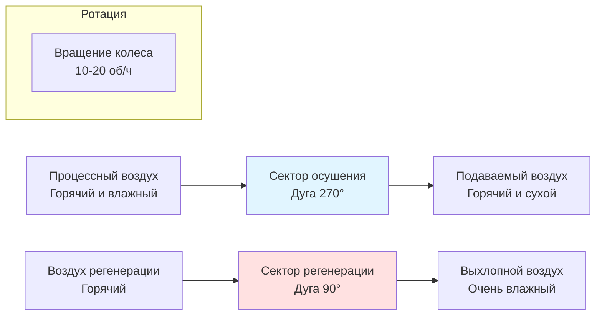

Технология осушителей обеспечивает превосходное удаление влаги в приложениях HVAC путем использования гигроскопических материалов, которые адсорбируют или абсорбируют водяной пар из воздуха через физические и химические механизмы. В отличие от традиционных систем компрессионного охлаждения, которые конденсируют влагу путем охлаждения воздуха ниже точки росы, системы осушителей удаляют влагу при контролируемых температурах, обеспечивая независимое управление явными и скрытыми нагрузками охлаждения.

## Физические принципы адсорбции и абсорбции влаги

Материалы осушителей притягивают и удерживают молекулы воды двумя основными механизмами:

**Адсорбция** происходит, когда молекулы водяного пара прилипают к поверхности твердых осушителей через силы ван-дер-Ваальса. Процесс регулируется изотермами, которые связывают равновесное содержание влаги с относительной влажностью при постоянной температуре:

$$W_e = f(\phi, T)$$

где $W_e$ — равновесное содержание влаги (кг воды/кг осушителя), $\phi$ — относительная влажность (доля), $T$ — температура (К).

**Абсорбция** включает растворение водяного пара в структуре жидких осушителей согласно закону Рауля для снижения давления пара:

$$P_v = x_w \cdot P_{sat}(T)$$

где $P_v$ — давление пара раствора, $x_w$ — мольная доля воды, $P_{sat}(T)$ — давление насыщения чистой воды при температуре $T$.

Скорость удаления влаги из процессного воздуха определяется движущей силой массопередачи:

$$\dot{m}_w = h_m \cdot A \cdot \rho_a \cdot (W_1 - W_2)$$

где $h_m$ — коэффициент массопередачи (м/с), $A$ — площадь контакта (м²), $\rho_a$ — плотность воздуха (кг/м³), $W_1$, $W_2$ — влагосодержание на входе и выходе (кг воды/кг сухого воздуха).

## Системы твердых осушителей

Ротационные колеса осушителей представляют собой наиболее распространенную конфигурацию в коммерческих приложениях HVAC. Вращающееся колесо содержит сотовую матрицу, пропитанную гигроскопическим материалом.

### Распространенные материалы осушителей

| Материал | Емкость влаги | Температура регенерации | Применение |
|----------|-------------------|-------------------|--------------|
| Силикагель | 35-40% по массе | 90-150°C | Общее HVAC, низкая влажность |
| Молекулярные сита | 20-25% по массе | 180-260°C | Сверхнизкие точки росы |
| Хлорид лития | 15-20% по массе | 65-95°C | Низкотемпературная регенерация |
| Активированный глинозем | 15-20% по массе | 120-200°C | Промышленные применения |

### Работа ротационного колеса осушителя

Колесо непрерывно вращается через две или три потока воздуха:

Психрометрический процесс для потока процессного воздуха показывает повышение температуры при удалении влаги:

$$h_2 = h_1 - \Delta h_{ads}$$

где $h_1$ и $h_2$ — энтальпии на входе и выходе (кДж/кг), $\Delta h_{ads}$ — теплота адсорбции, выделяемая в поток воздуха, обычно 2500-2800 кДж/кг удаленной воды.

Повышение температуры на выходе приближается следующим образом:

$$T_2 = T_1 + \frac{\Delta h_{ads} \cdot (W_1 - W_2)}{c_p}$$

где $c_p$ — удельная теплоемкость воздуха (приблизительно 1,006 кДж/кг·К).

## Методы регенерации

Эффективная регенерация критична для непрерывной работы. Энергия, необходимая для регенерации:

$$Q_{regen} = \dot{m}_a \cdot c_p \cdot (T_{regen} - T_{ambient}) + \dot{m}_w \cdot h_{fg}$$

где $\dot{m}_a$ — массовый расход воздуха регенерации (кг/с), $T_{regen}$ — температура регенерации (°C), $h_{fg}$ — теплота испарения (2450 кДж/кг при 20°C).

**Источники тепла для регенерации:**
- Газовые горелки (прямой или косвенный нагрев)
- Электрические нагревательные элементы
- Утилизация тепла из систем здания
- Солнечные тепловые коллекторы
- Отходящее тепло генераторов или технологического оборудования
- Тепло конденсатора теплового насоса

Стандарт ASHRAE 139 предоставляет методы тестирования для оценки осушителей адсорбентов и устанавливает показатели производительности, включая емкость удаления влаги (MRC) и коэффициент производительности (COP).

## Системы жидких осушителей

Системы жидких осушителей используют концентрированные соляные растворы (обычно хлорид лития, бромид лития или хлорид кальция), которые контактируют с воздухом напрямую или через мембраны.

### Конфигурация системы

```mermaid
flowchart TD
    A[Процессный воздух на входе] --> B[Кондиционер<br/>Распылительная камера]
    B --> C[Процессный воздух на выходе<br/>Осушенный]
    D[Крепкий раствор<br/>Низкое содержание воды] --> B
    B --> E[Слабый раствор<br/>Высокое содержание воды]
    E --> F[Регенератор<br/>Нагреваемый]
    F --> G[Водяной пар<br/>Выхлопной]
    F --> D
    H[Подвод тепла] --> F

    style B fill:#e1f5ff
    style F fill:#ffe1e1
```

Соотношение равновесного давления пара управляет производительностью:

$$\ln\left(\frac{P_v}{P_{sat}}\right) = -\nu \cdot \phi \cdot \frac{m}{M_w}$$

где $\nu$ — коэффициент Вант-Гоффа, $\phi$ — осмотический коэффициент, $m$ — моляльность (моль/кг воды), $M_w$ — молярная масса воды.

## Гибридные системы осушителей и компрессионного охлаждения

Интеграция технологии осушителей с традиционными системами компрессионного охлаждения позволяет оптимизировать энергетическую производительность путем разделения явных и скрытых нагрузок.

**Конфигурация 1: Последовательное расположение**
Ротационное колесо осушителя обрабатывает скрытую нагрузку, за которым следует охлаждающий змеевик для явного охлаждения. Это предотвращает переохлаждение и штрафы на повторный нагрев.

**Конфигурация 2: Параллельное расположение**
Система осушителя работает при высоких скрытых нагрузках; компрессионное охлаждение обрабатывает явную нагрузку и умеренные скрытые нагрузки.

Общий коэффициент производительности охлаждения для гибридных систем:

$$\text{COP}_{system} = \frac{Q_{sensible} + Q_{latent}}{W_{compressor} + Q_{regen}/\eta_{heat}}$$

где $W_{compressor}$ — мощность компрессора, $Q_{regen}$ — тепло регенерации, $\eta_{heat}$ — термический КПД источника тепла.

## Показатели производительности и применение

Требования стандарта ASHRAE 62.1 по вентиляции часто накладывают высокие скрытые нагрузки из-за подачи наружного воздуха. Системы осушителей превосходны в:

- Приложениях с высокой скоростью вентиляции (больницы, лаборатории)
- Требованиях низкой влажности (фармацевтика, музеи)
- Системах со 100% наружным воздухом
- Жарко-влажных климатах с круглогодичными скрытыми нагрузками
- Охлаждении супермаркетов (предотвращение образования инея)
- Крытых плавательных бассейнах (контроль влажности)

Типичные диапазоны производительности:
- Удаление влаги: 5-15 г/кг воздуха
- Температуры регенерации: 65-150°C
- Тепловой COP: 0,5-1,2 (на основе тепловой энергии)
- Лицевые скорости: 2,0-3,5 м/с для твердых колес

Экономическая целесообразность зависит от разницы в стоимости между тепловой энергией (для регенерации) и электрической энергией (для традиционного охлаждения), доступности отходящего тепла и величины скрытых нагрузок охлаждения относительно общих нагрузок HVAC.

---

**Литература:**
- ASHRAE Standard 139: Method of Testing for Rating Desiccant Dehumidifiers Utilizing Heat for the Regeneration Process
- ASHRAE Handbook—HVAC Systems and Equipment, Chapter on Desiccant Dehumidification
- ASHRAE Standard 62.1: Ventilation for Acceptable Indoor Air Quality
