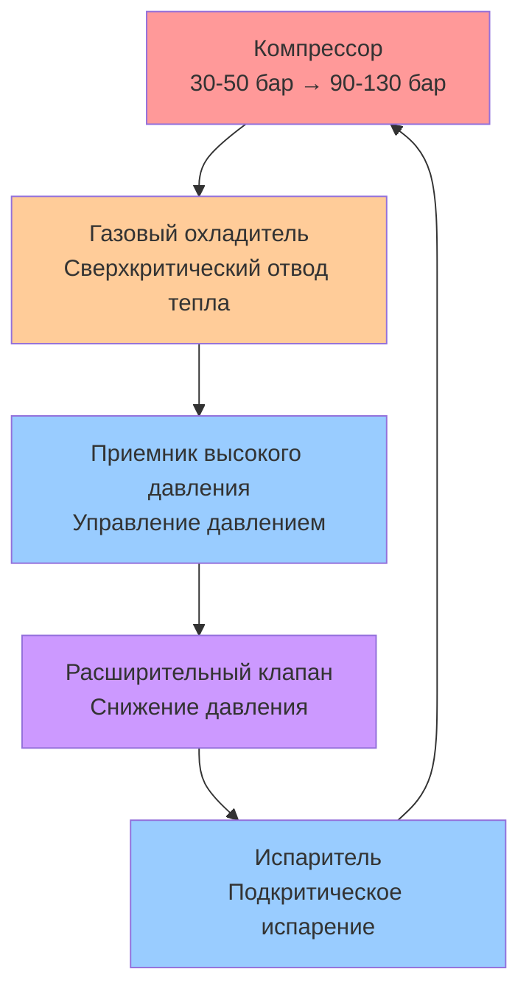
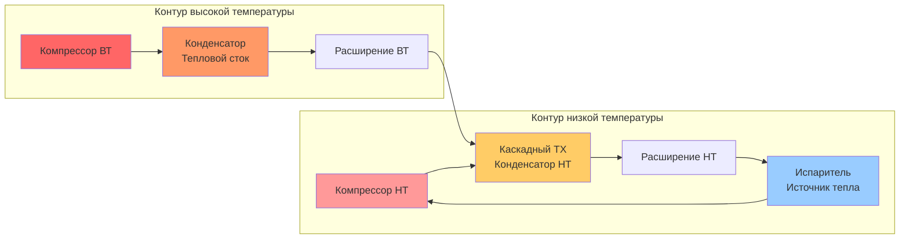

Технология тепловых насосов значительно продвинулась благодаря инновациям в выборе хладагентов, технологии компрессоров и конфигурации циклов, которые расширяют диапазоны эксплуатации и повышают эффективность. Эти разработки устраняют традиционные ограничения, достигая значений коэффициента производительности (COP), ранее недостижимых в обычных системах парокомпрессионного цикла.

## Трансритические циклы на CO2

Углекислый газ (R744) работает как природный хладагент в трансритических циклах, где давление на стороне высокого давления превышает критическую точку (73,8 бар при 31,1°C). В отличие от подкритических циклов с изотермической конденсацией, CO2 отводит тепло через охлаждение сверхкритического газа, создавая уникальные термодинамические преимущества.

### Термодинамические характеристики

Трансритический цикл работает с:
- Испарением при подкритическом давлении (обычно 30-50 бар)
- Сжатием до сверхкритического давления (90-130 бар)
- Отводом тепла через охлаждение газа, а не переходом фазы
- Расширением через дроссельное устройство с значительной необратимостью

COP для трансритических тепловых насосов на CO2 рассчитывается как:

$$\text{COP}_{\text{heating}} = \frac{Q_h}{W_{\text{comp}}} = \frac{\dot{m} (h_2 - h_3)}{\dot{m} (h_2 - h_1)}$$

Где:
- $h_1$ = энтальпия на входе компрессора (выходе испарителя)
- $h_2$ = энтальпия на выходе компрессора (изэнтропическая или фактическая)
- $h_3$ = энтальпия после газового охладителя
- $\dot{m}$ = массовый расход хладагента

### Оптимизация производительности

Давление в газовом охладителе значительно влияет на производительность системы. Оптимальное давление на выходе $P_{\text{opt}}$ максимизирует COP и обычно возникает при:

$$P_{\text{opt}} \approx 2,7 \cdot T_{\text{gc,out}} - 7,0 \text{ [бар, °C]}$$

Эта корреляция (основанная на эмпирических данных) показывает, что оптимальное давление линейно увеличивается с температурой на выходе газового охладителя. Электронные расширительные клапаны с управлением давлением на стороне высокого давления необходимы для поддержания оптимальных условий при различных нагрузках.

### Преимущества систем R744

Трансритические тепловые насосы на CO2 предоставляют:
- **Превосходное производство горячей воды**: Температурный скользящий процесс при охлаждении газа эффективно соответствует нагрузкам чувствительного отопления
- **Экологические преимущества**: GWP = 1, нулевой потенциал разрушения озонового слоя
- **Высокая объемная производительность**: Снижает требования к рабочему объему компрессора на 4-6 раз по сравнению с R134a
- **Безопасность**: Невоспламеняющийся, нетоксичный (классификация A1 согласно ASHRAE 34)
- **Производительность в холодном климате**: Сохраняет производительность при наружных температурах ниже -25°C

Коммерческие приложения водяного отопления достигают значений COP 3,5-4,5 при нагреве воды с 10°C до 90°C, превосходя производительность обычных тепловых насосов в приложениях с высокой разностью температур.

## Каскадные системы тепловых насосов

Каскадные системы используют два отдельных контура холодильной установки, работающих на разных температурных уровнях и соединенные через промежуточный теплообменник (каскадный конденсатор/испаритель). Эта конфигурация позволяет достигать экстремальных разностей температур, превышающих 100 K, при сохранении приемлемых степеней сжатия компрессора.

### Архитектура системы

### Анализ производительности

Общий COP системы представляет последовательную эффективность обоих этапов:

$$\text{COP}_{\text{cascade}} = \frac{Q_h}{W_{\text{LT}} + W_{\text{HT}}} = \frac{Q_h}{Q_h \left(\frac{1}{\text{COP}_{\text{HT}}}\right) + Q_h \left(\frac{1}{\text{COP}_{\text{LT}}}\right) - Q_h}$$

Для каскадных систем с согласованной производительностью в промежуточном теплообменнике:

$$\frac{1}{\text{COP}_{\text{cascade}}} \approx \frac{1}{\text{COP}_{\text{LT}}} + \frac{1}{\text{COP}_{\text{HT}}} - 1$$

Оптимизация промежуточной температуры $T_{\text{int}}$ балансирует степени сжатия обоих контуров. Для максимального COP при идеальных циклах:

$$T_{\text{int,opt}} = \sqrt{T_{\text{evap}} \cdot T_{\text{cond}}}$$

Где температуры выражены в абсолютных единицах (Кельвины).

Каскадные системы установлены в ASHRAE 15 для приложений, требующих хладагентов с различными классификациями безопасности или разностями температур, превышающими возможности одноступенчатых систем.

## Технология компрессоров с переменной скоростью

Инверторные компрессоры модулируют производительность с 10% до 100%, варьируя скорость двигателя, устраняя потери эффективности, связанные с циклами включения-выключения, и улучшая производительность при частичной нагрузке, где системы работают 80-95% годового времени.

### Модуляция производительности и мощности

Производительность компрессора масштабируется приблизительно линейно со скоростью:

$$\dot{Q} \propto N \cdot \eta_v$$

Где $N$ — скорость компрессора, а $\eta_v$ — объемный КПД. Потребление мощности следует кубическому соотношению при постоянной степени сжатия:

$$W \propto N^3$$

Это создает благоприятные характеристики COP при частичной нагрузке. При 50% производительности потребление мощности снижается примерно до 40-45% от полной нагрузки, повышая COP на 15-25% по сравнению с номинальными условиями.

### Преимущества производительности

Технология переменной скорости обеспечивает:
- **Улучшенную сезонную эффективность**: Повышение HSPF на 25-40% по сравнению с односкоростными установками
- **Улучшенный комфорт**: Исключает колебания температуры от циклирования
- **Сниженный пусковой ток**: Мягкий пуск снижает электрические требования
- **Расширенный диапазон эксплуатации**: Сохраняет отопительную производительность при более низких наружных температурах
- **Снижение шума**: Более низкие скорости снижают шум компрессора и вентилятора на 6-10 дБ

Стандарты тестирования ASHRAE 116 и AHRI 210/240 включают точки рейтинга при частичной нагрузке при температуре наружного воздуха 27,8°C и 16,7°C для отражения преимуществ эффективности переменной скорости.

## Тепловые насосы для холодного климата

Передовые тепловые насосы сохраняют отопительную производительность и эффективность при наружных температурах до -25°C через улучшенную инжекцию пара, оптимизированный выбор хладагента и улучшенную конструкцию теплообменника.

### Улучшенная инжекция пара (EVI)

Системы EVI инжектируют хладагент промежуточного давления в процесс сжатия, эффективно создавая двухступенчатый цикл сжатия в одном винтовом или ротационном компрессоре.

Процесс инжекции:
1. Газ вспышки генерируется через теплообменник экономайзера или газосборник
2. Пар инжектируется в порт промежуточного сжатия
3. Дополнительный массовый расход хладагента увеличивает отопительную производительность
4. Промежуточное охлаждение снижает температуру на выходе

Улучшение отопительной производительности с EVI:

$$\frac{Q_{\text{EVI}}}{Q_{\text{standard}}} = \frac{\dot{m}_{\text{main}} + \dot{m}_{\text{inj}}}{\dot{m}_{\text{main}}} \cdot \frac{h_{\text{cond,out}} - h_{\text{evap,in}}}{h_{\text{cond,out}} - h_{\text{evap,in}}}$$

Увеличение производительности на 15-30% при наружной температуре -15°C являются типичными с улучшением COP на 10-15% по сравнению с одноступенчатым сжатием.

### Требования к конструкции

Конструкция теплового насоса для холодного климата согласно ASHRAE 205 включает:
- **Выбор компрессора**: Винтовые или ротационные компрессоры с портами EVI, рассчитанные на степень сжатия 4,5 и выше
- **Хладагенты**: R410A или R32 с достаточным перепадом давления при низких температурах
- **Размер теплообменника**: Увеличенные наружные блоки (на 20-30% большая площадь оребрения) для поддержания производительности
- **Оптимизация оттаивания**: Основанное на спросе оттаивание с продолжительностью обратного цикла менее 90 секунд
- **Управление переохлаждением**: Поддерживается переохлаждение 8-12°C через модуляцию TXV или EXV

Системы, соответствующие спецификациям холодного климата NEEP (Northeast Energy Efficiency Partnerships), сохраняют минимальный COP 1,75 при -15°C и 70% производительности при -25°C по сравнению с номинальной производительностью при 8,3°C.

## Интеграция и соответствие стандартам

Современные инновации в тепловых насосах должны соответствовать:
- **ASHRAE 15**: Стандарт безопасности для систем холодильной установки
- **ASHRAE 34**: Классификация безопасности хладагентов и пределы концентрации
- **ASHRAE 37**: Методы тестирования электроприводных унитарных тепловых насосов
- **AHRI 210/240**: Рейтинг производительности унитарных тепловых насосов и кондиционеров воздуха
- **ISO 13256-1**: Тестирование и рейтинг тепловых насосов с источником воды
- **EN 14511**: Европейский стандарт тестирования тепловых насосов (часто упоминается для производительности в холодном климате)

Эти инновации в совокупности расширяют диапазоны применения тепловых насосов, улучшая эффективность, позволяя электрифицировать отопительные нагрузки, ранее обслуживаемые оборудованием сжигания топлива, и расширяя возможность применения тепловых насосов в экстремальных климатических зонах.

## Компоненты

- Тепловые насосы высокотемпературные промышленные
- Трансритические тепловые насосы на CO2
- Гибридные системы тепловых насосов
- Воздушно-водяные тепловые насосы высокой эффективности
- Достижения в грунтовых тепловых насосах
- Термически приводимые тепловые насосы
- Абсорбционные промышленные тепловые насосы
- Химические тепловые насосы
