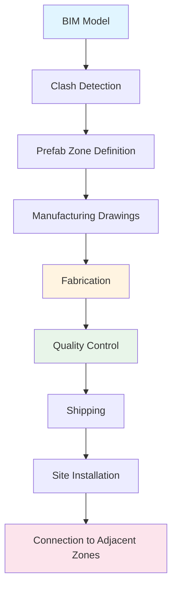
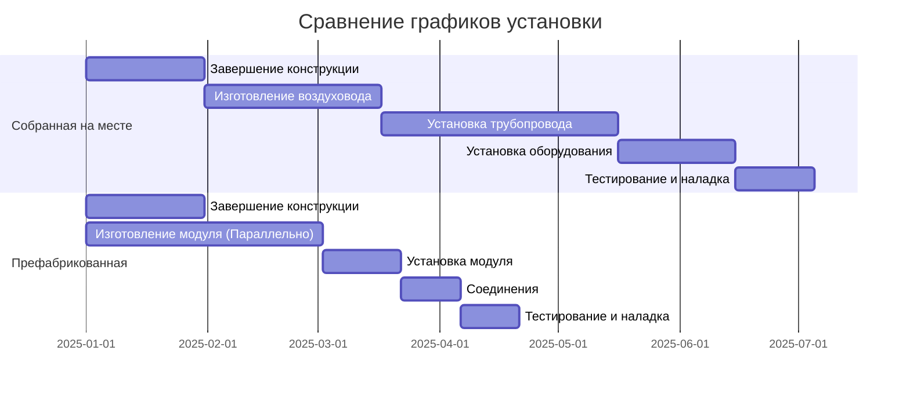

## Основы префабрикованных систем HVAC

Префабрикация и модульное строительство представляют парадигматический сдвиг в методологии монтажа HVAC, переводя операции сборки из полевых условий в контролируемые производственные среды. Этот подход снижает требования к трудозатратам на объекте на 40-60% при одновременном улучшении консистентности качества благодаря стандартизированным производственным процессам.

Физика теплотехнических характеристик остается неизменной, но методология выполнения принципиально изменяет графики установки, протоколы гарантии качества и доступность обслуживания на протяжении жизненного цикла.

### Преимущества производственной среды

Контролируемые условия на заводе обеспечивают стабильность температуры, доступ к прецизионному инструменту и контрольные точки гарантии качества, которые полевые условия не могут воспроизвести. Сварные и пайки соединения проходят немедленное испытание на герметичность. Применение изоляции происходит в чистых, сухих условиях, предотвращая захват влаги, который приводит к деградации теплотехнических характеристик.

Сборка при контролируемой температуре предотвращает проблемы термического расширения при изготовлении. Медное трубное паяное соединение, созданное при температуре заводских условий 21°C в сравнении с переменными полевыми температурами, демонстрирует превосходную консистентность металлургического соединения.

## Типы префабрикованных компонентов HVAC

### Модули механического оборудования

**Кровельные комплектные системы**: Заводские сборные воздухообрабатывающие агрегаты, конденсаторные блоки и органы управления снижают точки полевого подключения с сотен на десятки. Электрические клеммы, контуры хладагента и управляющие проводки завершены перед отправкой.

**Модули машинного помещения**: Полные котельные, чиллерные установки или насосные станции, собранные на конструкционные рамы. Трубопровод, клапаны, приборы и электрические системы установлены согласно утвержденным чертежам перед доставкой.

**Сборки теплообменников**: Несколько теплообменников, смонтированных на общих распределительных коллекторах с предустановленными балансировочными клапанами, задвижками отсечки и приборами.

### Сборки трубопроводов и воздуховодов

**Трубные модули**: Префабрикованные участки трубопровода с фитингами, опорами, изоляцией и бирками идентификации. Оптимизация длины снижает полевые соединения на 60-70%.

**Секции воздуховодов**: Колена, переходники и прямые участки, изготовленные с армированием, дверцами доступа и объемными заслонками. Изоляция и паробарьеры применяются в контролируемых условиях.

## Требования к координации проекта

### Интеграция информационного моделирования зданий

Префабрикация требует точной 3D-координации перед производством. ASHRAE Guideline 41 подчеркивает требования точности размеров для модульных систем. Анализ накопления допусков определяет потенциальные условия вмешательства перед изготовлением.

Зоны координации определяют границы префабрикации:

### Управление размерными допусками

Полевые допуски обычно находятся в пределах ±2,5 см для конструктивных элементов. Префабрикованные модули требуют контроля допусков ±0,6 см. Интерфейсы подключения должны учитывать совокупные строительные допуски при сохранении точных внутренних размеров.

Взаимосвязь коэффициента термического расширения:

$$\Delta L = \alpha \cdot L_0 \cdot \Delta T$$

Где:
- $\Delta L$ = изменение длины (см)
- $\alpha$ = коэффициент термического расширения (см/см·°C)
- $L_0$ = исходная длина (см)
- $\Delta T$ = изменение температуры (°C)

Для медной трубы: $\alpha = 1.76 \times 10^{-5}$ см/см·°C

Медная труба длиной 12 м, испытывающая изменение температуры 28°C, расширяется:

$$\Delta L = 1.76 \times 10^{-5} \times 1200 \times 28 = 0.592 \text{ см}$$

Конструкция префабрикации должна учитывать это расширение с помощью компенсационных петель или гибких соединений на границах модуля.

## Преимущества контроля качества

### Протоколы заводского испытания

| Тип испытания | Возможность в полевых условиях | Возможность на заводе | Коэффициент улучшения |
|-----------|------------------|--------------------|--------------------|
| Испытание давлением | Визуальный осмотр | Цифровое регистрирование, 24-часовая выдержка | 3-5x обнаружение |
| Обнаружение утечек | Мыльные пузыри | Масс-спектрометрия гелия | 1000x чувствительность |
| Электрическое испытание | Непрерывность | Hi-pot, сопротивление изоляции | Полная верификация |
| Балансировка потока | Грубое приближение | Калиброванные станции измерения потока | Точные установки |
| Испытание вибрации | После установки | Анализ перед отправкой | Раннее обнаружение проблем |
| Целостность изоляции | Визуальная | Тепловизионная камера | Количественная оценка производительности |

### Префабрикация гидронной системы

Заводские гидронные системы проходят полное испытание давлением при 1,5× расчетного давления минимум на 24 часа. Автоматизированное регистрирование данных документирует стабильность давления, подтверждая нулевую утечку перед применением изоляции.

Испытание потока использует калиброванные испытательные стенды, измеряющие фактические значения потока по сравнению с расчетными. Балансировочные клапаны предварительно установлены на рассчитанные позиции. Взаимосвязь падения давления:

$$\Delta P = f \cdot \frac{L}{D} \cdot \frac{\rho V^2}{2}$$

Где:
- $\Delta P$ = падение давления (кПа)
- $f$ = коэффициент трения (безразмерный)
- $L$ = длина трубы (м)
- $D$ = диаметр трубы (м)
- $\rho$ = плотность жидкости (кг/м³)
- $V$ = скорость жидкости (м/с)

Префабрикованные сборки прибывают с задокументированными значениями падения давления, устраняя неопределенности полевого расчета.

## Метрики эффективности установки

### Улучшения производительности труда

Традиционная установка "собранная на месте": 8-12 трудозатрат в час на кВт охлаждающей способности

Установка префабрикованной системы: 3-5 трудозатрат в час на кВт охлаждающей способности

Улучшение производительности: сокращение полевого труда на 60-70%

### Сжатие графика

Параллельное производство во время строительства здания сжимает критические пути графиков. Графики от фундамента до механической готовности сокращаются с 18-24 месяцев до 12-16 месяцев для коммерческих проектов.

Критические операции пути переходят с последовательного на параллельный:

## Экономический анализ

### Рассмотрения первоначальной стоимости

| Компонент затрат | Собранная на месте | Префабрикованная | Дисперсия |
|----------------|-------------|---------------|----------|
| Стоимость материалов | Базовая | +5 на +8% | Производственные накладные расходы |
| Полевой труд | Базовая | -50 на -60% | Сокращение часов объекта |
| Аренда оборудования | Базовая | -30 на -40% | Более короткая продолжительность |
| Дефекты качества | 2-4% затрат | 0.5-1% затрат | Улучшенное КК |
| Влияние графика | Переменный риск | Предсказуемая | Сокращенный резерв |
| **Общая установленная стоимость** | **Базовая** | **-5 на -15%** | **Зависит от проекта** |

### Преимущества по стоимости жизненного цикла

Улучшенное качество установки снижает обратные вызовы технического обслуживания на 40-50% в течение первого операционного года. Задокументированное тестирование обеспечивает базовые данные наладки, улучшающие эффективность диагностики.

Стандартизированные конструкции позволяют оптимизировать инвентарь запасных частей. Модули замены поставляются предварительно сконфигурированными, сокращая время простоя с дней до часов.

## Транспортировка и логистика

### Размерные ограничения

Ограничения наземного транспорта:
- Ширина: 2,6 м без разрешений
- Высота: 4,1 м типичный зазор
- Длина: стандартный прицеп 16,2 м
- Масса: 36 288 кг общий вес транспортного средства

Проектируйте модули в соответствии с этими ограничениями или планируйте маршруты с разрешениями. Распределение веса модуля влияет на стоимость доставки и выбор крана.

### Строповка и установка

Конструкция проушин строповки следует стандартам ASME B30.20. Расчет нагрузки включает:

$$W_{total} = W_{equipment} + W_{piping} + W_{insulation} + W_{fluid} + SF$$

Где $SF$ = коэффициент безопасности (минимум 1.5 по OSHA)

## Стандартизация и повторяемость

### Разработка каталога конструкций

Организации, разрабатывающие программы префабрикации, создают стандартизированные конструкции для типичных применений:

- **Типичные сборки VAV-терминалов**: 5-7 стандартных конфигураций охватывают 80% применений
- **Насосные модули**: первичные, вторичные и третичные конструкции насосов со стандартными конфигурациями трубопровода
- **Стояки теплообменников**: вертикальные сборки стояков, обслуживающие несколько этажей с ответвлениями подключения

Стандартизация снижает инженерные часы по проекту на 30-40% при одновременном улучшении предсказуемости стоимости.

## Интеграция с целями устойчивости

Префабрикация поддерживает цели экологичного строительства посредством:

1. **Сокращение отходов**: Оптимизация заводского материала снижает отходы на 30-50% в сравнении с полевой обрезкой
2. **Энергетическая эффективность**: Контролируемое применение изоляции устраняет тепловые мосты
3. **Консистентность качества**: Заводское тестирование обеспечивает достижение проектной производительности
4. **Углеродный отпечаток воплощенный**: Оптимизированное использование материалов и сокращенная переделка снижают углеродный отпечаток воплощенный

ASHRAE Standard 189.1 признает префабрикацию стратегией достижения целей высокоэффективного здания посредством улучшенного контроля качества и сокращенных отходов строительства.

## Вызовы внедрения

### Требования фазы проектирования

Более ранние требования к закрепления проекта вызывают трудности для традиционной доставки проектно-торговую-строительную. Доставка проектно-помощь или проектно-строительная лучше учитывает графики префабрикации.

Обязательство по оборудованию и выбору материалов происходит на 3-6 месяцев раньше, чем в обычных проектах. Принятие решений владельцем должно согласоваться с ускоренными графиками.

### Доступ на объекте и охват крана

Большие модули требуют адекватной грузоподъемности крана и доступа на объект. Городские объекты с ограниченными площадями складирования или ограничениями радиуса стрелы крана могут потребовать уменьшения размера модуля, снижая преимущества префабрикации.

### Координация интерфейса

Границы модулей создают интерфейсы подключения, требующие тщательной координации. Точки подключения в полевых условиях должны быть в доступных местах с адекватным зазором для сварки, пайки или механического соединения.

Стандартизация подключения снижает сложность в полевых условиях. Общие интерфейсы, повторяющиеся во всех модулях, позволяют бригадам освоить и ускорить установку.

## Тенденции будущего развития

Передовые методы производства, включая роботизированную сварку, автоматизированное применение изоляции и интегрированную установку датчиков, продолжают улучшать возможности префабрикации. Технология цифровых двойников связывает данные заводского производства с системами управления зданием, обеспечивая автоматическую документацию как построено.

Принципы массовой кастомизации позволяют экономичные специализированные конструкции с использованием параметрического моделирования и гибких производственных систем. Различие между стандартизированной и специализированной префабрикацией сокращается по мере развития производственных технологий.

---

**Ссылки:**
- ASHRAE Guideline 41-2023: Design and Construction of Modular HVAC Systems
- ASME B30.20: Below-the-Hook Lifting Devices
- OSHA 1926 Subpart CC: Cranes and Derricks in Construction
