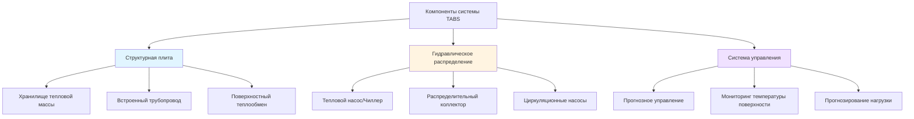
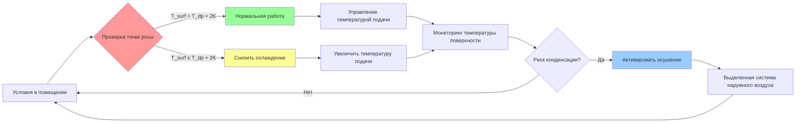

## Обзор инновационных лучистых технологий

Современные лучистые системы представляют смену парадигмы от традиционного воздушного HVAC, используя тепловое излучение и поверхностный теплообмен для достижения высокого уровня комфорта при сниженном энергопотреблении. В отличие от систем с принудительной подачей воздуха, которые нагревают или охлаждают воздушные массы, лучистые системы кондиционируют непосредственно жильцов и поверхности через электромагнитное излучение в инфракрасном спектре.

Фундаментальный теплообмен от лучистых поверхностей следует закону Стефана-Больцмана для теплового излучения в сочетании с конвективными компонентами:

$$q_{total} = q_{rad} + q_{conv} = \epsilon \sigma A (T_s^4 - T_{mrt}^4) + h_c A (T_s - T_a)$$

Где:
- $q_{total}$ = общая скорость передачи тепла (Вт)
- $\epsilon$ = коэффициент излучательности поверхности (обычно 0,9 для строительных материалов)
- $\sigma$ = постоянная Стефана-Больцмана (5,67 × 10⁻⁸ Вт/м²·K⁴)
- $A$ = площадь поверхности (м²)
- $T_s$ = температура поверхности (K)
- $T_{mrt}$ = средняя радиационная температура (K)
- $h_c$ = коэффициент конвективного теплообмена (Вт/м²·K)
- $T_a$ = температура воздуха (K)

## Термически активные строительные системы (TABS)

TABS интегрируют гидравлические трубопроводы непосредственно в структурные бетонные плиты, создавая массивные элементы тепловых накопителей. Эти системы используют тепловую массу бетона (типичная плотность 2400 кг/м³, удельная теплоёмкость 880 Дж/кг·K) для обеспечения сдвига нагрузки и динамического отклика.

### Характеристики теплообмена

Переходящая теплопроводность через бетонные плиты следует второму закону Фурье:

$$\frac{\partial T}{\partial t} = \alpha \nabla^2 T$$

Где коэффициент температурной диффузивности $\alpha = k/(\rho c_p)$ определяет время отклика. Для бетона с коэффициентом теплопроводности $k$ = 1,4 Вт/м·K глубина теплового проникновения за 24 часа достигает приблизительно 0,3 м.

### Рассмотрения при проектировании

**Расстояние между трубами и компоновка:**
- Типичное расстояние: 150-300 мм
- Диаметр трубы: 15-20 мм PE-X или PE-RT
- Глубина залегания: 50-100 мм от поверхности
- Диапазон температуры подачи: 16-26°C (охлаждение), 28-35°C (отопление)

**Метрики производительности:**

| Параметр | Режим охлаждения | Режим отопления |
|-----------|------------------|------------------|
| Тепловой поток | 30-50 Вт/м² | 40-80 Вт/м² |
| Температура поверхности | 19-22°C | 24-28°C |
| Подача/обратно ΔT | 2-4 K | 5-10 K |
| Тепловой отклик | 3-6 часов | 2-4 часа |
| Скорость потока воды | 15-25 л/ч·м² | 20-30 л/ч·м² |

## Капиллярные коврики

Капиллярные системы используют тонкие трубы (диаметр 3-5 мм), расположенные в плотных сетях (расстояние 10-30 мм) в тонких слоях (15-25 мм). Высокая площадь поверхности на единицу объема обеспечивает исключительные скорости теплообмена.

### Тепловая производительность

Эффективность теплообмена зависит от расстояния между трубами и проводимости материала:

$$q = \frac{T_f - T_{surf}}{R_{total}} = \frac{T_f - T_{surf}}{\frac{1}{h_i \pi d_i L} + \frac{\ln(d_o/d_i)}{2\pi k_{pipe} L} + R_{plaster}}$$

Где:
- $T_f$ = температура жидкости (K)
- $d_i$, $d_o$ = внутренний и наружный диаметры трубы (м)
- $L$ = длина трубы на единицу площади (м/м²)
- $R_{plaster}$ = тепловое сопротивление слоя штукатурки (м²·K/Вт)

**Преимущества капиллярных систем:**
- Высокая плотность теплообмена: 80-150 Вт/м² охлаждение, 100-180 Вт/м² отопление
- Минимальная толщина: 15-25 мм общая глубина системы
- Низкое содержание воды: 0,7-1,2 л/м² снижает тепловую инерцию
- Быстрый отклик: время реакции 15-45 минут
- Легкий вес: подходит для приложений модернизации

## Лучистые панели и динамические системы

### Металлические лучистые панели

Сборные металлические панели (алюминий или медь) обеспечивают контролируемые температуры поверхности с быстрым откликом. Теплообмен от встроенных труб к поверхности панели следует:

$$q = \frac{\Delta T}{R_{contact} + \frac{t}{k_{panel}A}}$$

Проводимость панели (алюминий: 205 Вт/м·K) обеспечивает равномерные температуры поверхности в пределах ±0,5 K по ширине панели.

### Интеграция материалов с изменением фазы (PCM)

Продвинутые лучистые панели включают PCM (типичная точка плавления 18-24°C, скрытая теплота 150-250 кДж/кг) для пассивного теплового регулирования. Емкость теплового хранилища:

$$Q_{storage} = m_{PCM}(c_p \Delta T + h_{fg})$$

Где $h_{fg}$ представляет скрытую теплоту плавления во время фазового перехода.

## Стратегии управления и предотвращение конденсации

Лучистое охлаждение требует мониторинга точки росы для предотвращения конденсации на поверхности. Критическая температура поверхности:

$$T_{surf,min} = T_{dp} + \Delta T_{safety}$$

Где $\Delta T_{safety}$ = 1-2 K обеспечивает рабочий запас.

## Интеграция системы и лучшие практики

**Соответствие стандарту ASHRAE 55:**
- Пределы асимметричного излучения для теплового комфорта
- Температура поверхности пола: приемлемый диапазон 19-29°C
- Асимметрия радиационной температуры: <10 K для вертикальных поверхностей, <5 K для потолка/пола

**Конфигурация гибридной системы:**
Сочетание лучистых систем с выделенными системами наружного воздуха (DOAS) оптимизирует производительность:
- Лучистая система обрабатывает чувствительные нагрузки (60-80% от общей)
- DOAS обеспечивает вентиляцию и контроль скрытой нагрузки
- Независимое управление температурой и влажностью

**Энергетическая производительность:**
Лучистые системы достигают 25-40% экономии энергии по сравнению с традиционными VAV за счет:
- Сниженной энергии вентилятора (отсутствие потерь давления в воздуховодах)
- Повышенных температур охладителя (18-20°C против 7-12°C для охлажденной воды)
- Улучшенного COP теплового насоса (4,5-6,5 против 3,0-4,5)
- Сдвига нагрузки теплового хранилища на часы с низким спросом

## Методология проектирования

1. **Расчет нагрузки:** Определить компоненты лучистой и конвективной нагрузки отдельно
2. **Выбор поверхности:** Потолочное (40-60 Вт/м²), напольное (60-100 Вт/м²) или настенное крепление
3. **Компоновка трубопровода:** Оптимизировать расстояние с использованием конечного элемента теплового моделирования
4. **Гидравлическое проектирование:** Размеры для числа Рейнольдса >4000 (турбулентный поток)
5. **Проектирование управления:** Внедрить прогнозные алгоритмы для систем с тепловой массой
6. **Анализ конденсации:** Проверить запасы точки росы при пиковых условиях влажности

Инновационные лучистые системы обеспечивают термически комфортные энергоэффективные окружающие среды через кондиционирование поверхности на основе физики. Надлежащее проектирование требует комплексного анализа механизмов теплообмена, тепловой массы здания и стратегий управления, согласованных с режимами занятости и условиями климата.
