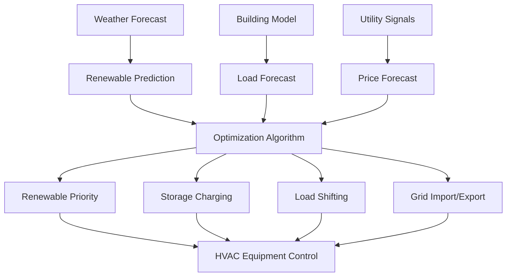

Передовая интеграция возобновляемых источников энергии преобразует системы HVAC из пассивных потребителей энергии в динамичные, многоисточниковые платформы, использующие солнечные, ветровые, геотермальные и биомассные ресурсы. Такая интеграция требует сложных стратегий управления, координации теплового аккумулирования и протоколов взаимодействия с сетью, которые максимизируют использование возобновляемых источников при сохранении комфорта и надежности.

## Фундаментальные принципы интеграции возобновляемых источников

Эффективность интеграции возобновляемых источников зависит от согласования переменной доступности возобновляемых ресурсов с тепловыми нагрузками здания посредством аккумулирования, сдвига нагрузок и дополнительных источников энергии.

### Энергетический баланс с несколькими источниками

Мгновенный энергетический баланс для системы HVAC с интегрированными возобновляемыми источниками:

$$Q_{load} = Q_{renewable} + Q_{storage,discharge} + Q_{conventional} - Q_{storage,charge}$$

Где:
- $Q_{load}$ = потребность здания в отоплении или охлаждении (кВт)
- $Q_{renewable}$ = возобновляемая энергия, подаваемая напрямую (кВт)
- $Q_{storage,discharge}$ = энергия, высвобождаемая из теплового аккумулирования (кВт)
- $Q_{conventional}$ = дополнительная условная энергия (кВт)
- $Q_{storage,charge}$ = энергия, направляемая в хранилище (кВт)

### Расчет доли возобновляемой энергии

Доля возобновляемой энергии количественно определяет устойчивость системы:

$$f_{renewable} = \frac{\int_0^t Q_{renewable} \, dt}{\int_0^t (Q_{renewable} + Q_{conventional}) \, dt}$$

Системы, достигающие $f_{renewable} > 0,70$, демонстрируют высокую долю возобновляемой энергии с эффективным аккумулированием и стратегиями управления.

## Стратегии интеграции солнечной тепловой энергии

Солнечные тепловые коллекторы обеспечивают прямое отопление или питают абсорбционные холодильники для охлаждения.

### Производительность солнечного коллектора

Мгновенный КПД коллектора в условиях эксплуатации:

$$\eta_{collector} = \eta_0 - a_1 \frac{(T_{in} - T_{ambient})}{G_T} - a_2 \frac{(T_{in} - T_{ambient})^2}{G_T}$$

Где:
- $\eta_0$ = оптический КПД (обычно 0,65-0,80)
- $a_1$ = коэффициент потерь тепла первого порядка (Вт/м²·K)
- $a_2$ = коэффициент потерь тепла второго порядка (Вт/м²·K²)
- $T_{in}$ = температура входа коллектора (°C)
- $T_{ambient}$ = температура окружающей среды (°C)
- $G_T$ = полная солнечная облученность (Вт/м²)

Стандарт ASHRAE 93 устанавливает протоколы испытаний для тепловой производительности солнечных коллекторов.

### Солнечные системы с тепловыми насосами

Солнечные тепловые коллекторы предварительно нагревают хладагент или рабочую жидкость теплового насоса, улучшая коэффициент производительности:

$$COP_{solar-assisted} = \frac{Q_{delivered}}{W_{compressor} - Q_{solar,useful}}$$

Типичные улучшения COP составляют 15-40% в сравнении с работой на воздухе во время доступности солнечной энергии.

## Интеграция геотермальных тепловых насосов

Геотермальные тепловые насосы извлекают или отводят тепло в землю, обеспечивая высокоэффективное отопление и охлаждение.

### Расчет размера грунтового теплообменника

Требуемая длина скважины для вертикальных грунтовых теплообменников:

$$L_{total} = \frac{Q_{peak} \cdot R_{effective} \cdot (T_{in} - T_{ground})}{(T_{fluid,avg} - T_{ground})}$$

Где:
- $L_{total}$ = общая длина скважины (м)
- $Q_{peak}$ = пиковое отведение или извлечение тепла (Вт)
- $R_{effective}$ = эффективное тепловое сопротивление (м·K/Вт)
- $T_{ground}$ = невозмущенная температура грунта (°C)
- $T_{fluid,avg}$ = средняя температура рабочей жидкости (°C)

Справочник ASHRAE - Приложение HVAC Глава 35 содержит полное руководство по проектированию геотермальных систем.

### Гибридные геотермальные системы

Гибридные системы сочетают грунтовые теплообменники с дополнительным отводом тепла (градирни) или источниками тепла (котлы) для снижения размера грунтового контура:

$$L_{hybrid} = L_{full} \cdot (1 - f_{supplemental})$$

Где $f_{supplemental}$ представляет долю пиковой нагрузки, обеспечиваемую дополнительным оборудованием, обычно 0,20-0,40.

## Интеграция ветровой энергии

Ветровая энергия в основном снабжает электроэнергией оборудование HVAC, при этом интеграция сосредоточена на управлении нагрузками и координации аккумулирования.

### Работа теплового насоса на ветровой энергии

Выход ветротурбины зависит от скорости ветра согласно кривой мощности:

$$P_{wind} = \begin{cases}
0 & v < v_{cut-in} \\
\frac{1}{2} \rho A v^3 C_p \eta_{generator} & v_{cut-in} \leq v < v_{rated} \\
P_{rated} & v_{rated} \leq v < v_{cut-out} \\
0 & v \geq v_{cut-out}
\end{cases}$$

Где:
- $\rho$ = плотность воздуха (кг/м³)
- $A$ = площадь ротора ветротурбины (м²)
- $v$ = скорость ветра (м/с)
- $C_p$ = коэффициент мощности (теоретический максимум 0,593)
- $\eta_{generator}$ = КПД генератора

Стратегии интеграции приоритизируют работу зарядки теплового аккумулирования во время периодов сильного ветра.

## Координация теплового аккумулирования

Тепловое аккумулирование разделяет доступность возобновляемых источников и нагрузки здания, повышая использование возобновляемых ресурсов.

### Определение размера накопителя для систем с возобновляемыми источниками

Требуемая емкость теплового аккумулирования для достижения целевой доли возобновляемой энергии:

$$V_{storage} = \frac{Q_{excess} \cdot \Delta t}{\rho c_p \Delta T \cdot \eta_{storage}}$$

Где:
- $V_{storage}$ = объем резервуара (м³)
- $Q_{excess}$ = избыточная производительность возобновляемых источников (кВт)
- $\Delta t$ = длительность аккумулирования (с)
- $\rho$ = плотность теплоносителя (кг/м³)
- $c_p$ = удельная теплоемкость (Дж/кг·K)
- $\Delta T$ = температурный перепад аккумулирования (K)
- $\eta_{storage}$ = КПД аккумулирования (обычно 0,85-0,95)

## Сравнительная производительность систем с возобновляемыми источниками

| Источник возобновляемой энергии | Типичный КПД | Коэффициент мощности | Требование к аккумулированию | Капитальные затраты |
|----------------------------------|--------------|----------------------|------------------------------|---------------------|
| Солнечная теплота | 40-70% | 0,15-0,25 | Высокое (6-12 ч) | $200-400/м² |
| Геотермальный ТН | COP 3,5-5,0 | 0,95-1,00 | Низкое (2-4 ч) | $2500-4000/кВт |
| Солнечная ФВ + ТН | 15-22% ФВ | 0,15-0,25 | Высокое (8-16 ч) | $150-250/м² |
| Ветер + ТН | 25-45% турбина | 0,20-0,40 | Высокое (12-24 ч) | $1500-3000/кВт |
| Биомасса, котел | 75-85% | 0,90-1,00 | Низкое (4-8 ч) | $300-600/кВт |

## Передовые стратегии управления

Оптимальная интеграция возобновляемых источников требует предсказательных алгоритмов управления, которые прогнозируют доступность возобновляемых ресурсов, тепловые нагрузки здания и тарифы на электроэнергию.

### Прогностическое управление моделью

MPC оптимизирует использование возобновляемых источников за горизонт прогнозирования $t_p$:

$$\min_{u(t)} \int_0^{t_p} [C_{energy}(t) + C_{demand}(t) - R_{export}(t)] \, dt$$

При соблюдении ограничений комфорта, пределов производительности оборудования и границ состояния заряда аккумулятора.

## Взаимодействующие с сетью эффективные здания

Передовые системы HVAC с интегрированными возобновляемыми источниками участвуют в услугах сетевой поддержки посредством реагирования на спрос и экспорта энергии.

### Метрика гибкости спроса

Коэффициент гибкости спроса количественно определяет возможность сдвига нагрузок:

$$DF = \frac{Q_{storage,available} + Q_{shifted,max}}{Q_{peak,design}}$$

Системы с $DF > 2,0$ обеспечивают существенную гибкость сети для интеграции возобновляемых источников в масштабе коммунальной компании.

### Производительность с нулевой чистой энергией

Достижение нулевой чистой энергии требует, чтобы годовое производство возобновляемых источников было равно или превышало потребление HVAC:

$$\int_0^{8760} (E_{renewable} - E_{HVAC}) \, dt \geq 0$$

Правильно спроектированные системы с тепловым аккумулированием достигают производительности с нулевой чистой энергией при сохранении стабильности сети за счет контролируемых профилей экспорта.

## Интеграция биомассы

Котлы на биомассе и системы комбинированного производства тепла и электроэнергии обеспечивают диспетчеризуемую возобновляемую энергию с синергией теплового аккумулирования.

### Определение размера биомассной когенерационной установки

Оптимальная мощность биомассной когенерационной установки балансирует тепловые и электрические нагрузки:

$$\dot{m}_{fuel} = \frac{Q_{thermal}}{\eta_{thermal} \cdot LHV} = \frac{P_{electrical}}{\eta_{electrical} \cdot LHV}$$

Где LHV - теплота сгорания топлива (МДж/кг), а соотношение $\eta_{thermal}/\eta_{electrical}$ обычно колеблется в пределах 1,5-2,5.

## Практические соображения при реализации

Успешная интеграция возобновляемых источников требует:

- **Точного прогнозирования нагрузок** с использованием тепловых моделей зданий и паттернов занятости
- **Интеграции предсказания погоды** для прогнозирования ресурсов солнечной и ветровой энергии
- **Оптимизации теплового аккумулирования** балансирования размера аккумулятора и переменности возобновляемых источников
- **Проектирования гибридных систем** сочетающих дополняющие возобновляемые источники
- **Соответствия стандартам подключения к сети** отвечая требованиям IEEE 1547 для распределенной генерации
- **Мониторинга производительности** отслеживания доли возобновляемой энергии и эффективности системы
- **Протоколов технического обслуживания** для различных типов оборудования возобновляемых источников

Системы, интегрирующие несколько источников возобновляемой энергии с тепловым аккумулированием и предсказательным управлением, достигают долей возобновляемой энергии, превышающих 80%, при одновременном снижении годовых энергетических затрат на 60-75% по сравнению с традиционными системами HVAC.

---

*Это содержимое отражает установленные инженерные принципы и стандарты ASHRAE для интеграции возобновляемых источников энергии в приложениях HVAC.*
