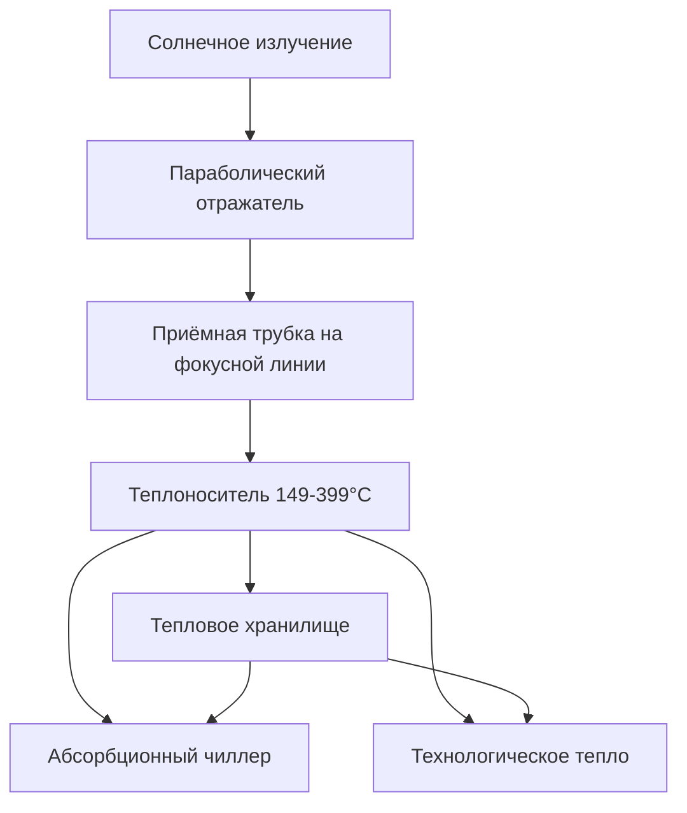

## Основы солнечной энергии для HVAC

Оборудование солнечной энергии преобразует падающее солнечное излучение в тепловую или электрическую энергию для работы систем HVAC. Фундаментальное соотношение энергии управляет всеми приложениями солнечной HVAC:

$$Q_{solar} = I_t \cdot A_c \cdot \eta_{collector} \cdot \tau$$

Где:
- $Q_{solar}$ = полезная солнечная энергия (кДж)
- $I_t$ = полное солнечное излучение на поверхность коллектора (Вт/м²)
- $A_c$ = площадь апертуры коллектора (м²)
- $\eta_{collector}$ = эффективность коллектора (безразмерная)
- $\tau$ = период времени работы (ч)

Стандарт ASHRAE 93 устанавливает процедуры испытания производительности солнечных коллекторов, определяя кривые эффективности на основе дифференциала рабочей температуры и падающего излучения.

## Типы солнечных тепловых коллекторов

Солнечные тепловые коллекторы преобразуют солнечный свет непосредственно в тепло для приложений HVAC, включая отопление помещений, горячее водоснабжение и абсорбционное охлаждение.

### Плоские коллекторы

Плоские коллекторы состоят из поглощающей пластины с интегрированными каналами потока, прозрачного остекления и теплоизолированной подложки. Тепловая эффективность подчиняется:

$$\eta_{fp} = F_R(\tau\alpha) - F_R U_L \frac{(T_i - T_a)}{I_t}$$

Где:
- $F_R$ = коэффициент удаления тепла (безразмерный)
- $\tau\alpha$ = произведение пропускания-поглощения (безразмерное)
- $U_L$ = общий коэффициент потерь тепла (Вт/м²·К)
- $T_i$ = температура жидкости на входе (°C)
- $T_a$ = температура окружающего воздуха (°C)

| Тип коллектора | Диапазон эффективности | Рабочая температура | Приложения |
|----------------|------------------------|---------------------|-----------|
| Однослойный плоский коллектор | 40-60% | 27-60°C | Подогрев бассейнов, низкотемпературные процессы |
| Двухслойный плоский коллектор | 50-70% | 38-82°C | Отопление помещений, горячее водоснабжение |
| Плоский коллектор с селективным покрытием | 60-75% | 49-93°C | ГВС, лучистое отопление |

### Вакуумированные трубчатые коллекторы

Вакуумированные трубчатые коллекторы исключают конвективные потери тепла через вакуумную изоляцию между поглощающей пластиной и стеклянной оболочкой. Они достигают более высокой эффективности при повышенных температурах:

$$\eta_{etc} = a_0 - a_1 \frac{(T_m - T_a)}{I_t} - a_2 \frac{(T_m - T_a)^2}{I_t}$$

Где $a_0$, $a_1$ и $a_2$ — эмпирически определённые коэффициенты коллектора, а $T_m$ — средняя температура жидкости.

Вакуумированные трубки поддерживают эффективность выше 50% при дифференциалах температуры выше 83°C, обеспечивая:
- Производство горячей воды с высокой температурой для абсорбционных холодильных агрегатов
- Производство пара для промышленных процессов
- Работу круглый год в холодном климате

### Концентрирующие коллекторы

Концентрирующие коллекторы используют отражающую или преломляющую оптику для фокусировки солнечного излучения на меньшие площади поглощающей пластины, достигая коэффициентов концентрации от 5:1 и более.

Оптическая эффективность зависит от отражательной способности, поглощаемости и геометрического коэффициента концентрации:

$$\eta_{optical} = \rho \cdot \gamma \cdot \alpha \cdot \frac{1}{C}$$

Где $\rho$ — отражательная способность зеркала, $\gamma$ — коэффициент перехвата, $\alpha$ — поглощаемость поглощающей пластины, а $C$ — коэффициент концентрации.

## Фотоэлектрические системы для HVAC

Фотоэлектрические (ФЭ) системы генерируют электроэнергию непосредственно из солнечного излучения, используя полупроводниковую переходную технологию. Приложения HVAC включают:

### Оборудование с прямым питанием от ФЭ

Компрессоры, вентиляторы и насосы, работающие на постоянном токе, работают непосредственно от ФЭ массивов без потерь инвертора. Баланс мощности системы:

$$P_{array} = P_{motor} + P_{controller} + P_{losses}$$

Контроллеры отслеживания точки максимальной мощности (MPPT) оптимизируют напряжение массива в соответствии с характеристиками двигателя при изменяющихся условиях освещённости.

### Сетевые ФЭ системы

Системы, подключённые к сети, компенсируют электрическое потребление HVAC через механизмы чистого учёта. Годовой компенсированный объём энергии:

$$E_{offset} = \sum_{i=1}^{8760} P_{array,i} \cdot \eta_{inverter} \cdot \eta_{system}$$

Где суммирование охватывает все часы в году, учитывая эффективность инвертора (обычно 95-98%) и потери в системе от загрязнения, затенения и температурных эффектов.

## Гибридные солнечные технологии

### ФЭ-тепловые (PVT) коллекторы

PVT коллекторы объединяют генерацию фотоэлектрического электричества с восстановлением тепла с тыльной стороны ФЭ модуля. Комбинированная эффективность:

$$\eta_{total} = \eta_{electrical} + \eta_{thermal} \cdot \frac{Q_{th}}{Q_{el}}$$

Общая эффективность превышает 70% при полезном использовании тепловой энергии, по сравнению с 15-25% для систем только с ФЭ.

### Солнечные тепловые насосы вспомогательного действия

Солнечные коллекторы предварительно нагревают хладагент или служат источниками тепла испарителя, улучшая COP теплового насоса на 15-40%. Существуют три основные конфигурации:

| Конфигурация | Описание | Типичное улучшение COP |
|--------------|---------|----------------------|
| Последовательная | Коллектор нагревает хранилище, тепловой насос извлекает из хранилища | 20-30% |
| Параллельная | Коллектор и тепловой насос независимо заряжают хранилище | 15-25% |
| Прямое расширение | Хладагент испаряется непосредственно в коллекторе | 30-40% |

## Интеграция системы и управление

Системы солнечной HVAC требуют сложного управления для контроля нескольких источников энергии и компонентов хранения. Стратегии управления приоритизируют солнечный вклад для максимизации компенсации ископаемого топлива при сохранении условий комфорта.

Мгновенная доля солнечной энергии:

$$SF = \frac{Q_{solar,delivered}}{Q_{solar,delivered} + Q_{auxiliary}}$$

Годовая производительность системы зависит от доли солнечной энергии, эффективности вспомогательной энергии и паразитного потребления насосом/вентилятором.

## Методы прогнозирования производительности

Приложение G стандарта ASHRAE 90.1 предоставляет методы расчёта для производительности системы солнечной энергии при всего энергетическом моделировании зданий. Метод f-Chart предсказывает долгосрочную производительность системы солнечного отопления на основе безразмерных параметров, коррелирующих вклад солнечной энергии с нагрузкой и характеристиками коллектора.

Для приложений охлаждения среда моделирования TRNSYS моделирует переходные солнечные тепловые системы, включая абсорбционные холодильные агрегаты, десикантные осушители и тепловое хранилище. Исследования валидации демонстрируют точность прогноза в пределах 10% от измеренной производительности для должным образом охарактеризованных систем.

## Экономические соображения

Системы солнечной HVAC требуют высоких начальных капитальных затрат, компенсируемых сокращением операционных расходов. Простые сроки окупаемости варьируются от 8-25 лет в зависимости от:
- Местного солнечного ресурса (уровни инсоляции)
- Вытесненных энергетических затрат (электричество, природный газ или мазут)
- Эффективности системы и коэффициента использования мощности
- Доступных стимулов и налоговых кредитов

Анализ стоимости жизненного цикла в соответствии со стандартом ASHRAE 90.1 учитывает срок службы оборудования (20-30 лет для тепловых коллекторов, 25+ лет для ФЭ), требования к техническому обслуживанию и темпы эскалации энергетических затрат для определения экономической целесообразности.
