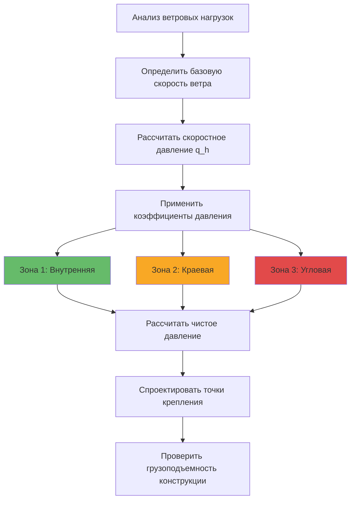

Интеграция солнечных тепловых систем в здание выходит за рамки простого размещения коллекторов на доступных поверхностях. Успешная интеграция требует согласования между конструктивной грузоподъемностью, архитектурной эстетикой, оптимизацией солнечного доступа и функциональностью систем HVAC. Физическая интеграция должна учитывать ветровые и снеговые нагрузки, тепловое расширение, гидроизоляцию и долгосрочную надежность, при этом максимизируя сбор энергии и минимизируя затраты на установку.

## Рассмотрение конструктивных нагрузок

Солнечные коллекторы создают постоянные нагрузки, временные нагрузки и динамические ветровые нагрузки на конструкции зданий. Надлежащий конструктивный анализ обеспечивает безопасность и предотвращает преждевременный отказ как монтажной системы, так и несущей конструкции.

### Анализ постоянных нагрузок

Постоянные нагрузки коллекторов включают вес сборок коллекторов, монтажного оборудования, трубопроводов, теплоизоляции и теплоносителя. Типичные значения на единицу площади коллектора:

| Компонент | Нагрузка (кг/м²) | Примечания |
|-----------|------------------|-----------|
| Плоский коллектор | 15-25 | Включая остекление и корпус |
| Трубчатые вакуумные коллекторы | 20-30 | Коллектор вносит значительный вклад |
| Направляющие/рамы монтажа | 5-10 | Алюминий или оцинкованная сталь |
| Трубопроводы и теплоноситель | 3-8 | Зависит от конструкции системы |
| Снегозадержание | 0-100+ | Зависит от климата |
| **Итоговая постоянная нагрузка** | **25-170** | Проектировать на максимальное сочетание |

Сосредоточенная нагрузка в точках крепления должна проверяться в соответствии с локальной грузоподъемностью конструкции. Для размещения коллекторов на крышах проходки через кровельное покрытие требуют надлежащего герметизирующего узла и конструктивного усиления для передачи нагрузок на основные несущие элементы (стропила, фермы или кровельные балки).

### Расчеты ветровых нагрузок

Ветровые нагрузки определяют конструктивный расчет для размещенных на крышах и наземных установок. ASCE 7 предоставляет методологию расчета ветровых давлений на солнечные коллекторы на основе высоты здания, категории открытости и локальных скоростей ветра.

Расчетное ветровое давление на поверхность наклонного коллектора:

$$p = q_h \left[ (GC_p) - (GC_{pi}) \right]$$

Где:
- $q_h$ = скоростное давление на средней высоте крыши (Па)
- $GC_p$ = коэффициент внешнего давления (зависит от положения на крыше)
- $GC_{pi}$ = коэффициент внутреннего давления (обычно ±0,18 для закрытых зданий)

Скоростное давление зависит от базовой скорости ветра и категории открытости:

$$q_h = 0.613 K_h K_{zt} K_d V^2$$

Где:
- $K_h$ = коэффициент скоростного давления по высоте и открытости (зависит от высоты и открытости)
- $K_{zt}$ = топографический фактор (1,0 для плоской местности)
- $K_d$ = фактор направленности ветра (0,85 для зданий)
- $V$ = базовая скорость ветра (м/с)

**Критические зоны проектирования:**

Установки коллекторов параллельно поверхностям крыш испытывают меньшие ветровые нагрузки, чем наклонные установки. ASCE 7 выявляет зоны повышенного давления на краях крыши, углах и коньках, где значения $GC_p$ увеличиваются на 50-100%. Коллекторы в этих зонах требуют усиленного крепления.

### Рассмотрение снеговых нагрузок

В холодном климате накопление снега на коллекторах должно анализироваться как при равномерном, так и при неравномерном распределении снега. Расчетная снеговая нагрузка на плоский коллектор:

$$p_f = 0.7 C_e C_t I_s p_g$$

Где:
- $C_e$ = фактор открытости (0,9-1,2 в зависимости от местности)
- $C_t$ = тепловой фактор (1,0 для неотапливаемых конструкций, сниженный для отапливаемых)
- $I_s$ = фактор важности (1,0-1,2)
- $p_g$ = нагрузка снега на грунт (кПа)

Углы наклона коллектора выше 30° способствуют сходу снега, но создают опасность схода снежных лавин и потенциальные ударные нагрузки на нижние элементы здания. Установки с углами наклона ниже 15° могут удерживать снег на протяжении всего отопительного сезона, что исключает сбор энергии в периоды максимального спроса.

Системы снегозадержания или удержания предотвращают внезапные лавинные события, но увеличивают конструктивную нагрузку. Нагрузка от удерживаемого снега может достигнуть:

$$p_{snow} = p_g \times 1.5 \text{ к } 2.0$$

Этот фактор учитывает уплотнение и образование льда в течение продолжительного периода удержания.

## Коллекторные системы на крышах

Размещение на крышах обеспечивает наиболее распространенный подход к интеграции, предлагая беспрепятственный солнечный доступ и минимальное использование земельных участков. Три стратегии монтажа доминируют:

### Балластные системы

Балластные крепления используют мертвый вес для сопротивления поднятию ветром без проходок через крышу. Требуемая масса балласта на точку крепления:

$$m_{ballast} = \frac{F_{uplift} - F_{dead}}{g \mu}$$

Где:
- $F_{uplift}$ = расчетная сила поднятия ветром (Н)
- $F_{dead}$ = вес коллекторов и монтажа (Н)
- $g$ = ускорение силы тяжести (9,81 м/с²)
- $\mu$ = коэффициент трения (обычно 0,3-0,5 для кровли EPDM)

**Преимущества:**
- Отсутствие проходок в крыше или проблем с гидроизоляцией
- Быстрая установка и демонтаж
- Подходит для сданных в аренду зданий или временных установок

**Ограничения:**
- Ограничено крышами с малым уклоном (<7°)
- Значительная дополнительная конструктивная нагрузка (50-150 кг/м² балласта)
- Неприемлемо для конструктивно ограниченных крыш
- Ограниченный диапазон регулировки угла наклона

### Механически закрепленные системы

Механические крепления проходят через кровельное покрытие и крепятся непосредственно к несущим элементам. Надлежащее герметизирующее оформление и применение герметиков сохраняют целостность гидроизоляции.

**Расстояние между точками крепления:**

$$s = \sqrt{\frac{4 F_{allow}}{p_{net}}}$$

Где:
- $s$ = расстояние между точками крепления (м)
- $F_{allow}$ = допустимая нагрузка на одно крепление (Н)
- $p_{net}$ = чистое расчетное давление на коллектор (Па)

Типичные расстояния между креплениями составляют от 0,6 до 1,8 м в зависимости от ветровых нагрузок и грузоподъемности конструкции.

**Требования герметизации:**
- Герметизирующее оформление типа бордюра для проходок через однослойные кровли
- Герметизирующие узлы или загрузочные площадки для меньших проходок
- Совместимость герметика с материалом кровли
- Регулярный осмотр и техническое обслуживание согласно ASHRAE 191

### Интегрированные рельсовые системы

Непрерывные рельсовые системы распределяют нагрузки между несколькими точками крепления и обеспечивают конструктивную целостность для больших установок. Рельсы проходят параллельно уклону крыши с поперечными элементами, поддерживающими каркасы коллекторов.

Пролет рельса между опорами следует ограничениям прогиба балки:

$$\delta_{max} = \frac{5wL^4}{384EI} \leq \frac{L}{240}$$

Где:
- $w$ = распределенная нагрузка (Н/м)
- $L$ = пролет между опорами (м)
- $E$ = модуль упругости материала рельса (Па)
- $I$ = момент инерции сечения рельса (м⁴)

Алюминиевые профили с $I$ = 10-40 см⁴ обычно ограничивают пролеты до 1,5-2,5 м при комбинированных постоянных и ветровых нагрузках.

## Встроенные в здание фотоэлектрические/тепловые системы (BIPV/T)

Системы BIPV/T объединяют фотоэлектрическое производство электричества с рекуперацией тепловой энергии, функционируя как ограждающая конструкция здания и система преобразования энергии. Гибридный коллектор поглощает солнечное излучение, преобразует часть его в электричество и захватывает отходящее тепло для применения в системах HVAC.

### Энергетический баланс

Энергетический баланс BIPV/T учитывает электрическую и тепловую мощность:

$$\eta_{total} = \eta_{elec} + \eta_{thermal}$$

Где электрическая эффективность:

$$\eta_{elec} = \eta_{ref} \left[1 - \beta(T_{cell} - T_{ref})\right]$$

И тепловая эффективность следует:

$$\eta_{thermal} = F_R(\tau\alpha)_{thermal} - F_R U_L \frac{T_{f,in} - T_a}{G_T}$$

Параметры:
- $\eta_{ref}$ = эффективность ФЭ при 25°C (обычно 0,15-0,22)
- $\beta$ = температурный коэффициент (-0,004 к -0,005 К⁻¹)
- $T_{cell}$ = рабочая температура элемента (°C)
- $(\tau\alpha)_{thermal}$ = эффективная пропускаемость-поглощаемость для теплового сбора

ФЭ элементы достигают повышенных температур (60-80°C) под солнечным излучением, снижая электрическую эффективность на 15-25% по сравнению с номинальными значениями. Извлечение тепла посредством принудительной циркуляции поддерживает более низкие температуры элементов, улучшая электрическую мощность при одновременном обеспечении полезной тепловой энергии.

### Типы конфигураций BIPV/T

**Остекленные и неостекленные:**

| Конфигурация | Электрическая эффективность | Тепловая эффективность | Применение |
|--------------|----------------------------|----------------------|-----------|
| Неостекленная | 14-18% | 30-50% | Низкотемпературные приложения, летнее охлаждение |
| Одинарное остекление | 12-16% | 45-65% | ГВС круглогодично, умеренное отопление |
| Двойное остекление | 10-14% | 50-70% | Отопление помещений, высокотемпературные приложения |

Остекление снижает электрическую эффективность через потери на отражение и более высокие температуры элементов, но значительно улучшает тепловую производительность, снижая конвективные потери тепла.

**Воздушные и жидкостные коллекторы:**

Системы BIPV/T на воздухе циркулируют вентиляционный воздух позади ФЭ панелей, предварительно нагревая наружный воздух для систем HVAC здания. Коэффициент теплопередачи для воздуха относительно низкий (10-25 Вт/м²·К), ограничивая тепловое извлечение.

Системы на жидкости достигают коэффициентов теплопередачи 100-400 Вт/м²·К, используя медные трубки или алюминиевые каналы, прикрепленные к задней поверхности ФЭ. Улучшенное тепловое извлечение снижает температуру элемента, увеличивая электрическую мощность на 5-10% при одновременной подаче тепловой энергии при полезных температурах (40-70°C).

### Проблемы интеграции

1. **Тепловое расширение:** Панели BIPV/T испытывают колебания температуры 80-100°C от холодных зимних ночей до летней стагнации. Компенсаторы и гибкие соединения компенсируют перемещение.

2. **Управление влагой:** Конденсат образуется на холодных панелях во время ночной работы. Пути дренажа и паровые барьеры предотвращают инфильтрацию влаги в ограждающую конструкцию здания.

3. **Координация электрической/тепловой:** Оптимизация мощности ФЭ требует низких температур; тепловая оптимизация требует высоких температур. Стратегии управления балансируют конкурирующие объективы на основе экономической ценности электричества в сравнении с теплом.

## Интеграция в фасад

Вертикальное размещение в фасаде интегрирует коллекторы в стены здания, служа облицовкой, затенением или элементами навесной стены. Вертикальная ориентация снижает летний прирост тепла, при этом улучшая зимний сбор, когда углы солнца низкие.

### Оптическая производительность при вертикальной ориентации

На широте φ южная вертикальная поверхность получает годовое солнечное излучение приблизительно:

$$H_{vertical} \approx 0.6 \times H_{horizontal}$$

Однако зимний сбор излучения улучшается относительно горизонтальных поверхностей:

$$\frac{H_{vertical,winter}}{H_{horizontal,winter}} \approx 1.2 \text{ к } 1.5$$

Это соотношение делает интеграцию в фасад привлекательной для климатов, ориентированных на отопление, где спрос на зимнюю энергию достигает максимума.

### Замена глухих панелей

Глухие панели в системах навесной стены представляют идеальные возможности для интеграции в фасад. Солнечные тепловые панели заменяют стандартные изолированные металлические панели, сохраняя тепловую производительность при одновременном добавлении сбора энергии.

**Сравнение производительности:**

| Тип панели | U-значение (Вт/м²·К) | Сбор энергии | Фактор стоимости |
|-----------|----------------------|-------------|------------------|
| Стандартная глухая панель | 0,3-0,5 | Нет | 1,0× |
| Изолированная металлическая панель | 0,2-0,3 | Нет | 1,2× |
| Солнечная тепловая панель | 0,4-0,8 | 200-400 кВт·ч/м²·год | 3,0-4,5× |

Более высокое U-значение в периоды без сбора энергии (ночь, облачные условия) должно быть компенсировано полезным сбором энергии для достижения чистой энергетической выгоды.

### Интеграция в балконы

Парапеты балконов, ограждения и потолки софитов обеспечивают дополнительные вертикальные поверхности для монтажа в жилых зданиях многоэтажной застройки. Южные балконы получают значительное солнечное излучение без помех видам и использованию жилья жильцами.

Соображения при монтаже включают:
- Доступность для технического обслуживания и осмотра
- Дренаж конденсата и дождевой воды
- Зазоры для ограждений безопасности и путей эвакуации
- Защита от контакта жильцов с горячими поверхностями

## Наземные установки и системы навесов

Когда площадь крыши недостаточна, наземные установки и конструкции навесов обеспечивают альтернативные стратегии интеграции.

### Проектирование наземных установок

Наземные установки предлагают неограниченную регулировку угла наклона и упрощенный доступ для технического обслуживания. Проектирование фундамента должно сопротивляться опрокидывающим моментам от ветровых нагрузок:

$$M_{overturn} = F_{wind} \times h_{centroid}$$

Где $h_{centroid}$ — высота до центра ветрового давления. Бетонные опорные фундаменты или винтовые сваи обеспечивают сопротивление через:

$$M_{resist} = W_{foundation} \times d_{lever}$$

Коэффициент безопасности против опрокидывания должен превышать 1,5 для постоянных установок.

### Применение солнечных навесов

Навесы над парковками, пешеходными путями или наружным оборудованием служат двойным целям: защита от погоды и сбор энергии. Конструкция должна поддерживать постоянные нагрузки коллекторов плюс снеговые и ветровые нагрузки при сохранении надлежащого зазора (минимум 2,4 м для проезда транспорта, 2,1 м для пешеходов).

Конструкции навесов превосходны в приложениях, требующих затенения летом при одновременном пропускании зимнего солнца. Оптимальный угол наклона балансирует годовой сбор энергии с летним затенением:

$$\beta_{canopy} = \phi - 10° \text{ к } \phi + 10°$$

Где φ — широта участка.

## Анализ затенения и оптимизация

Даже частичное затенение значительно снижает производительность солнечных тепловых систем. Всесторонний анализ затенения выявляет препятствия и количественно определяет потери энергии.

### Диаграммы солнечного пути

Угол высоты солнца α и азимут γ в любое время:

$$\sin(\alpha) = \sin(\delta)\sin(\phi) + \cos(\delta)\cos(\phi)\cos(h)$$

$$\sin(\gamma) = \frac{\cos(\delta)\sin(h)}{\cos(\alpha)}$$

Где:
- $\delta$ = угол солнечного склонения (градусы)
- $\phi$ = широта участка (градусы)
- $h$ = часовой угол (градусы)

Построение этих уравнений для 21-го дня каждого месяца создает диаграмму солнечного пути, показывающую траекторию солнца по небосводу. Наложение профилей зданий, деревьев и элементов рельефа выявляет периоды затенения.

### Расчет коэффициента затенения

Коэффициент затенения SF представляет долю времени, когда коллектор получает незатененное излучение:

$$SF = \frac{\sum(I_t \times A_{unshaded})}{\sum(I_t \times A_{total})}$$

Коллекторы должны сохранять SF > 0,80 в течение основного сезона отопления (октябрь-март в Северном полушарии). Значения ниже 0,70 обычно делают установку нежизнеспособной с экономической точки зрения.

### Типичные источники препятствий

1. **Соседние здания:** Минимальное расстояние = 2,5 × высота здания для беспрепятственного солнечного доступа
2. **Деревья:** Лиственные деревья имеют меньший эффект, чем хвойные; сохранять зазор > 1,5 × взрослая высота
3. **Механическое оборудование:** Кровельные блоки HVAC, парапеты, надстройки требуют отступления 1,5-3 м
4. **Самозатенение:** Расстояния между рядами в наклонных установках должны предотвращать зимнее затенение

Расстояние между рядами для предотвращения самозатенения в зимнее солнцестояние:

$$d = \frac{L \cos(\beta)}{\tan(\alpha_{min})} + L \sin(\beta)$$

Где:
- $d$ = расстояние между рядами (м)
- $L$ = длина коллектора (м)
- $\beta$ = угол наклона (градусы)
- $\alpha_{min}$ = минимальная приемлемая высота солнца (обычно 20-25°)

## Стандарты установки и лучшие практики

Стандарт ASHRAE 90.1 раздел 6.4.4 устанавливает минимальные требования для установки солнечных тепловых систем:

- Коллекторы должны быть ориентированы в пределах 45° от истинного юга (Северное полушарие) или истинного севера (Южное полушарие)
- Угол наклона должен быть в пределах 20° от оптимального для широты и приложения
- Коэффициент затенения должен превышать 0,75 в течение основного сезона отопления/охлаждения
- Монтажная конструкция должна соответствовать применимым строительным кодексам для конструктивных нагрузок
- Система должна включать защиту от перегрева и защиту от замерзания, соответствующие климату

Успешная интеграция в здание требует сотрудничества между конструкторами HVAC, инженерами-конструкторами и архитекторами с ранней стадии проектирования. Решения по интеграции, принятые во время схематического проектирования, имеют гораздо больший эффект, чем попытки оптимизации на стадиях разработки документации или установки.

Физическая интеграция оборудования солнечных тепловых систем преобразует пассивные поверхности зданий в активные системы сбора энергии, снижая потребление ископаемого топлива при сохранении конструктивной целостности и архитектурного качества.
