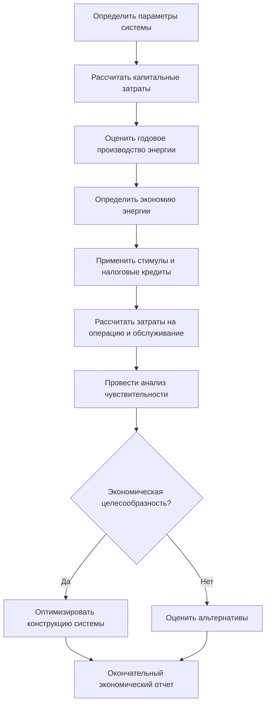

## Обзор

Экономическая целесообразность солнечных систем HVAC зависит от начальных капитальных затрат, операционных расходов, экономии энергии, требований к техническому обслуживанию и доступных стимулов. Данный анализ рассматривает затраты жизненного цикла, показатели возврата инвестиций и чувствительность к ключевым экономическим параметрам как для солнечных тепловых, так и для фотоэлектрических систем.

## Структура экономических показателей

### Простой период окупаемости

Простой период окупаемости (SPP) представляет собой время, необходимое для возмещения первоначальных инвестиций за счет экономии энергии:

$$SPP = \frac{C_0 - I}{S_{annual}}$$

Где:
- $C_0$ = Начальная капитальная стоимость (усл. ед.)
- $I$ = Стимулы и скидки (усл. ед.)
- $S_{annual}$ = Годовая экономия энергии (усл. ед./год)

### Чистая текущая стоимость

Чистая текущая стоимость (NPV) учитывает временную стоимость денег в течение срока службы системы:

$$NPV = \sum_{t=1}^{n} \frac{S_t - M_t}{(1+r)^t} - C_0 + \frac{SV}{(1+r)^n}$$

Где:
- $S_t$ = Экономия энергии в году t
- $M_t$ = Затраты на техническое обслуживание в году t
- $r$ = Ставка дисконтирования (обычно 3-8%)
- $n$ = Срок службы системы (лет)
- $SV$ = Остаточная стоимость

### Внутренняя норма доходности

Внутренняя норма доходности (IRR) — это ставка дисконтирования, при которой NPV равна нулю:

$$0 = \sum_{t=1}^{n} \frac{CF_t}{(1+IRR)^t} - C_0$$

Где $CF_t$ представляет чистый денежный поток в году t. Значения IRR, превышающие 8-12%, обычно указывают на выгодные инвестиции.

## Компоненты капитальных затрат

### Солнечные тепловые системы

| Компонент | Диапазон стоимости ($/м²) | Процент от общей стоимости |
|-----------|---------------------------|---------------------------|
| Коллекторы (плоские) | 323-646 | 35-45% |
| Коллекторы (вакуумные трубки) | 646-1075 | 40-50% |
| Накопительные баки | 86-162 | 15-20% |
| Теплообменники | 54-108 | 8-12% |
| Трубопровод и изоляция | 65-129 | 10-15% |
| Средства управления и приборы | 43-86 | 5-10% |
| Монтажные работы | 162-323 | 20-25% |

Полная стоимость установки солнечных тепловых систем составляет 860-1615 $/м² площади коллектора.

### Фотоэлектрические системы

| Компонент | Диапазон стоимости ($/Вт) | Процент от общей стоимости |
|-----------|---------------------------|---------------------------|
| Фотоэлектрические модули | 0,30-0,50 | 25-35% |
| Инверторы | 0,15-0,25 | 10-15% |
| Конструкции и крепежи | 0,20-0,35 | 15-20% |
| Электрическая вспомогательная система | 0,15-0,25 | 10-15% |
| Монтажные работы | 0,40-0,70 | 30-40% |
| Разрешения и проверка | 0,05-0,10 | 3-5% |

Полная стоимость установки сетевых фотоэлектрических систем составляет 1,25-2,15 $/Вт.

## Нивелированная стоимость энергии

Нивелированная стоимость энергии (LCOE) представляет собой полную стоимость жизненного цикла на единицу доставленной энергии:

$$LCOE = \frac{\sum_{t=1}^{n} \frac{C_0 + M_t + F_t}{(1+r)^t}}{\sum_{t=1}^{n} \frac{E_t}{(1+r)^t}}$$

Где:
- $F_t$ = Топливные затраты в году t (применяется к гибридным системам)
- $E_t$ = Производство энергии в году t

Для солнечных тепловых систем LCOE обычно составляет 0,04-0,12 $/кВт·ч тепловой энергии в зависимости от местоположения и конструкции системы.

## Процесс экономического анализа

## Стимулы на основе производительности

### Федеральный инвестиционный налоговый кредит

Федеральный инвестиционный налоговый кредит (ITC) предоставляет процентный кредит на затраты установки системы:

$$ITC_{value} = C_0 \times ITC_{rate}$$

Для коммерческих солнечных тепловых и фотоэлектрических систем ставка ITC исторически колебалась от 10-30%, при условии законодательных изменений.

### Государственные и коммунальные стимулы

| Тип стимула | Типичный диапазон | Влияние на экономику |
|------------|-------------------|---------------------|
| Авансовые скидки | 5,40-21,50 $/Вт или $/м² | Снижает начальный капитал на 10-30% |
| Стимулы на основе производства | 0,02-0,10 $/кВт·ч | Улучшает денежный поток на 5-10 лет |
| Ускоренная амортизация (MACRS) | График 5-летний | Снижает налоговое бремя на 15-25% |
| Кредиты чистого учета | Компенсация по розничной цене | Увеличивает экономию на 20-40% |
| Сертификаты возобновляемой энергии | 10-50 $/MWh | Дополнительный поток доходов |

## Затраты на операцию и техническое обслуживание

Годовые затраты на операцию и техническое обслуживание (O&M) солнечных систем HVAC:

$$C_{O\&M} = C_{routine} + C_{repairs} + C_{replacement} + C_{insurance}$$

Типичные затраты O&M составляют 0,5-2% начальной капитальной стоимости ежегодно.

### Техническое обслуживание солнечных тепловых систем

- Очистка коллекторов: 5,40-16,15 $/м²/год
- Замена гликоля: Каждые 3-5 лет
- Техническое обслуживание насоса: 215-540 усл. ед./год
- Калибровка системы управления: 323-646 усл. ед./год

### Техническое обслуживание фотоэлектрических систем

- Очистка панелей (при необходимости): 0,11-0,32 $/Вт/год
- Замена инвертора: Ожидается на 10-15 лет
- Система мониторинга: 108-323 усл. ед./год
- Электрические проверки: 215-431 усл. ед./год

## Параметры анализа чувствительности

Экономическая целесообразность зависит от нескольких ключевых переменных:

### Эскалация цен на энергию

Будущие затраты на энергию значительно влияют на экономику жизненного цикла. При предположении ставки эскалации цены электроэнергии $e$:

$$S_t = S_1 \times (1+e)^{t-1}$$

Типичные ставки эскалации составляют 2-5% ежегодно. Более высокие ставки эскалации существенно улучшают экономику солнечной энергии.

### Деградация системы

Производительность солнечной системы снижается с течением времени. Для фотоэлектрических систем:

$$E_t = E_1 \times (1-d)^{t-1}$$

Где ставка деградации $d$ обычно составляет 0,3-0,8% в год для кремниевых модулей.

### Влияние ставки дисконтирования

| Ставка дисконтирования | Влияние на NPV | Типичное применение |
|------------------------|----------------|---------------------|
| 3% | Более высокие значения NPV | Муниципальные/государственные проекты |
| 5% | Умеренная NPV | Некоммерческие организации |
| 7% | Более низкая NPV | Владельцы коммерческих зданий |
| 10%+ | Значительно сниженная NPV | Требования частного капитала |

## Географические вариации экономики

Экономика солнечных систем HVAC значительно варьируется по местоположению из-за:

1. **Доступность солнечного ресурса**: Уровни солнечного излучения напрямую влияют на производство энергии
2. **Структуры тарифов коммунальных предприятий**: Более высокие расходы на электроэнергию улучшают окупаемость
3. **Местные программы стимулирования**: Региональные вариации влияют на общую экономику
4. **Климатические нагрузки**: Климаты с преобладанием охлаждения благоприятствуют определенным технологиям
5. **Затраты на труд при установке**: Региональные различия в заработной плате влияют на капитальные затраты

Годовой коэффициент использования для солнечных тепловых систем составляет 15-40% в зависимости от местоположения и применения.

## Сравнительный экономический анализ

### Солнечная тепловая энергия в сравнении с традиционным отоплением

Для приложений отопления помещений и горячего водоснабжения:

| Показатель | Солнечная тепловая | Природный газ | Электрическое сопротивление |
|-----------|-------------------|---------------|----------------------------|
| Капитальные затраты | 8600-16150 усл. ед. | 3230-5376 усл. ед. | 1615-3230 усл. ед. |
| LCOE ($/кВт·ч тепл.) | 0,04-0,12 | 0,03-0,06 | 0,08-0,15 |
| Простая окупаемость | 8-15 лет | Базовый уровень | N/A |
| 25-летняя NPV (7% дисконт) | 5376-21505 усл. ед. | 0 | Отрицательная |

### Фотоэлектрические в сравнении с сетевыми системами кондиционирования воздуха

Для приложений кондиционирования воздуха:

| Показатель | Фотоэлектрические + сетевой кондиционер | Традиционный кондиционер |
|-----------|----------------------------------------|------------------------|
| Премия к капитальным затратам | +8600-16150 усл. ед. | Базовый уровень |
| Годовая стоимость энергии | Снижение на 30-70% | 860-2150 усл. ед. |
| Простая окупаемость | 6-12 лет | N/A |
| IRR | 8-18% | N/A |

## Оптимизация конструкции для экономики

### Оптимизация солнечной доли

Оптимальная солнечная доля уравновешивает капитальные затраты против экономии энергии:

$$SF = \frac{Q_{solar}}{Q_{total}}$$

Экономическая оптимизация обычно дает солнечные доли 40-70% для тепловых систем. Более высокие солнечные доли требуют непропорционально больших площадей коллекторов с убывающей предельной отдачей.

### Влияние размера накопителя

Объем накопителя влияет как на капитальные затраты, так и на производительность системы. Оптимальная емкость накопителя:

$$V_{storage} = 1.5 \text{ до } 3.0 \times Q_{daily} \times \frac{1}{\rho c_p \Delta T}$$

Больший накопитель улучшает утилизацию, но увеличивает капитальные затраты, требуя экономической оптимизации.

## Рассмотрения рисков

Экономические анализы должны учитывать:

- **Технологический риск**: Производительность может отклониться от прогнозов
- **Политический риск**: Программы стимулирования могут измениться или истечь
- **Волатильность цен на энергию**: Предположения об экономии могут не материализоваться
- **Неопределенность в обслуживании**: Фактические затраты O&M могут превысить оценки
- **Сложность интеграции**: Приложения модернизации могут столкнуться с непредвиденными затратами

Методы моделирования Монте-Карло могут количественно оценить диапазоны неопределенности для экономических показателей, обеспечивая доверительные интервалы для принятия решений.

## Справочник по стандартам ASHRAE

ASHRAE 173-2010 предоставляет методы тестирования солнечных тепловых систем, позволяя точные прогнозы производительности, необходимые для экономического анализа. ASHRAE 90.1 устанавливает базовую энергетическую производительность для экономических сравнений.

Экономические анализы должны использовать данные о погоде из климатических условий проектирования ASHRAE и наборы типичного метеорологического года (TMY) для прогнозов, специфичных для местоположения.
