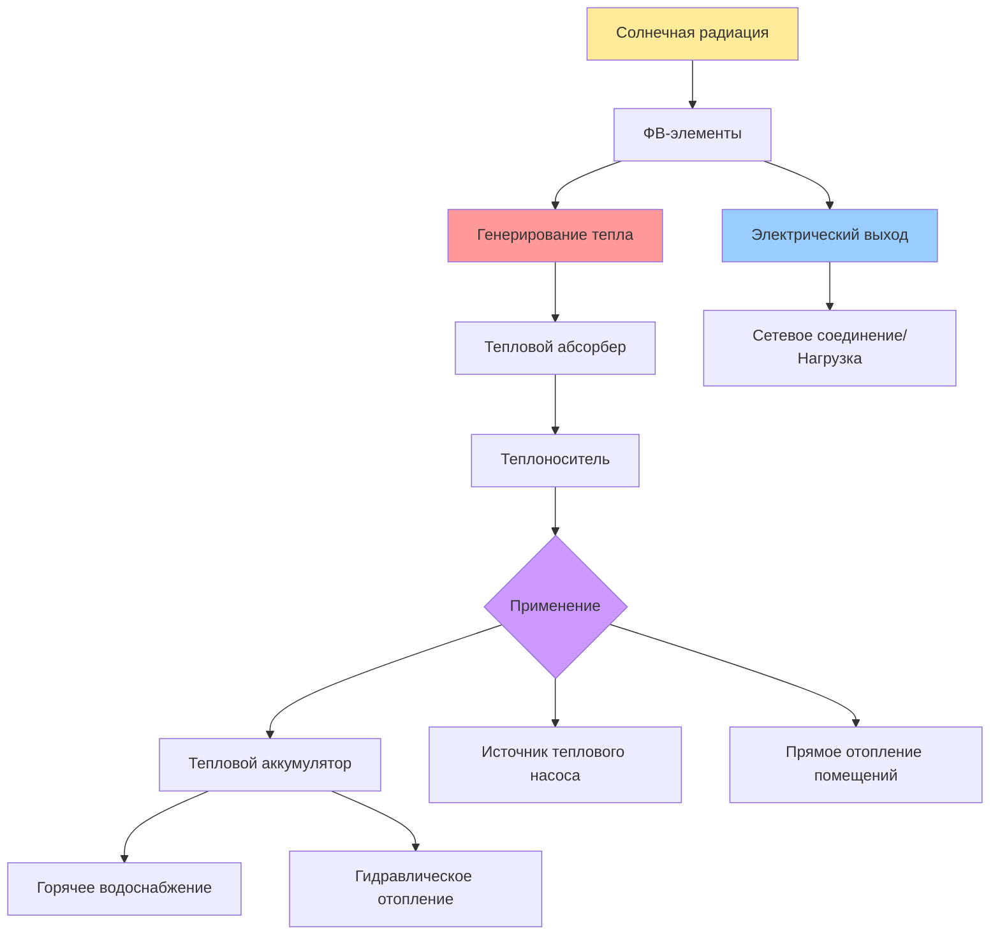

## Общие сведения

Гибридные фотовольтаико-тепловые (PVT) коллекторы одновременно генерируют электроэнергию через фотовольтаическое преобразование и улавливают тепловую энергию от охлаждения ФВ-элементов. Такой двойной подход решает фундаментальную проблему снижения эффективности ФВ-элементов с температурой, где типично наблюдается потеря 0,4-0,5% эффективности на каждый градус Цельсия выше 25°C. Активно удаляя тепло с поверхности ФВ, PVT-системы поддерживают более высокий электрический выход, одновременно производя полезную тепловую энергию для отопления помещений, подготовки горячей воды или технологических применений.

Суммарный энергетический выход значительно улучшает общее использование солнечной энергии по сравнению с отдельными ФВ и тепловыми коллекторами, занимающими одинаковую площадь. ASHRAE Standard 93 устанавливает процедуры тестирования производительности тепловых коллекторов, тогда как IEEE 1547 регламентирует сетевые ФВ-системы.

## Основные принципы работы

### Механизмы теплопередачи

PVT-коллекторы используют три механизма теплопередачи для извлечения тепловой энергии:

**Теплопроводность** через подложку ФВ-модуля передает тепло от слоя элемента к пластине теплового абсорбера. Теплопроводность связующего материала (типично 0,2-1,5 Вт/м·К) определяет температурный градиент между элементом и абсорбером.

**Конвекция** от абсорбера к теплоносителю удаляет тепловую энергию. Для жидкостных систем принудительная конвекция при числах Рейнольдса выше 2300 обеспечивает турбулентный поток и коэффициенты теплопередачи 300-1000 Вт/м²·К. Воздушные системы достигают 10-50 Вт/м²·К в зависимости от скорости воздуха.

**Излучение** потерь с поверхности коллектора в окружающую среду следует закону Стефана-Больцмана. Покрытия с низкой степенью черноты (ε < 0,15) минимизируют потери на излучение при сохранении высокой солнечной поглощаемости.

### Электротепловая связь

Мгновенная температура ФВ-элемента при условиях работы:

$$T_{cell} = T_{ambient} + \frac{G \cdot (1 - \eta_{PV})}{\alpha} - \frac{\dot{q}_{thermal}}{A \cdot \alpha}$$

где $G$ — солнечная радиация (Вт/м²), $\eta_{PV}$ — эффективность фотовольтаического преобразования, $\alpha$ — общий коэффициент теплопередачи (Вт/м²·К), и $\dot{q}_{thermal}$ — скорость удаления тепловой энергии.

Суммарная эффективность представляет общий энергетический выход:

$$\eta_{PVT} = \eta_{PV} + \eta_{thermal} = \eta_{PV,ref}[1 - \beta(T_{cell} - 25)] + \frac{\dot{m} c_p (T_{out} - T_{in})}{G \cdot A}$$

где $\beta$ — температурный коэффициент (типично -0,0045/°C для кристаллического кремния), $\dot{m}$ — массовый расход, и $c_p$ — удельная теплоемкость.

## Конфигурации систем

### Жидкостные PVT-коллекторы

**Конструкция "лист и трубка"** приклеивает медные или алюминиевые трубки к тыльной поверхности ФВ-модуля. Расстояние между трубками 100-150 мм уравновешивает перепад давления с равномерностью температуры. Смеси вода-гликоль (25-50% гликоля) обеспечивают защиту от замерзания при сохранении производительности теплопередачи.

**Конфигурация канального потока** использует прямоугольные каналы, обработанные в алюминиевом профиле, обеспечивая равномерное извлечение тепла по всей площади ФВ. Гидравлический диаметр 8-12 мм оптимизирует соотношение теплопередачи и насосной мощности.

**Конструкция с прямым потоком** позволяет воде течь непосредственно против тыльной поверхности ФВ в герметичном корпусе. Это максимизирует коэффициенты теплопередачи, но требует тщательного контроля химии воды для предотвращения коррозии.

### Воздушные PVT-коллекторы

Воздух течет через канал позади ФВ-модуля, типично глубиной 25-100 мм. Повышение поверхности за счет ребер, гофрировки или матричных материалов увеличивает эффективную площадь теплопередачи в 2-5 раз, компенсируя более низкую теплоемкость воздуха.

Скорость воздуха 2-4 м/с уравновешивает тепловую производительность против энергопотребления вентилятора. Тепловая эффективность:

$$\eta_{thermal,air} = F_R \left[\tau\alpha - U_L\frac{(T_{in} - T_{ambient})}{G}\right]$$

где $F_R$ — коэффициент удаления тепла (0,4-0,7 для воздушных систем), $\tau\alpha$ — произведение пропускания-поглощения, и $U_L$ — общий коэффициент потерь (3-6 Вт/м²·К).

### Концентрирующие PVT-системы

Низкоконцентрирующие конструкции (2-10× концентрация) используют отражатели или линзы Френеля для увеличения солнечного потока на ФВ-элементах. Концентрирующая конструкция требует активного отслеживания и улучшенного охлаждения, но достигает электрических эффективностей 20-28% в сочетании с тепловыми эффективностями 40-55%.

## Сравнение производительности

| Конфигурация | Электрическая эффективность | Тепловая эффективность | Суммарная эффективность | Температура жидкости | Применение |
|--------------|---------------------|-------------------|-----------------|------------------|--------------|
| Жидкостная PVT | 12-16% | 45-65% | 60-75% | 30-70°C | ГВС, отопление помещений |
| Воздушная PVT | 10-14% | 30-50% | 45-60% | 25-45°C | Отопление помещений, вентиляция |
| Концентрирующая PVT | 20-28% | 40-55% | 65-80% | 50-100°C | Технологическое тепло, охлаждение |
| Отдельные ФВ + солнечные тепловые | 15-18% + 60-70% | Суммарно 75-85% (требует 2× площадь) | - | Варьирует | Максимальная энергетическая плотность |

## Интеграция системы

### Интерфейс теплового аккумулирования

Слоистые накопительные резервуары поддерживают расслоение температуры, с обратной водой PVT входящей на соответствующем уровне на основе температуры. Типичный 300-литровый резервуар обеспечивает 50-70 кВт·ч тепловой аккумуляции с 40°C температурным дифференциалом.

Скорость зарядки должна уравновешивать выход PVT с требованием нагрузки:

$$\dot{Q}_{storage} = \dot{m}_{PVT} c_p (T_{PVT,out} - T_{tank,avg}) - UA_{tank}(T_{tank,avg} - T_{ambient})$$

### Интеграция с тепловым насосом

PVT-коллекторы служат улучшенными источниками испарителя для тепловых насосов, обеспечивая температуры источника на 5-15°C выше температуры воздуха. Это увеличивает COP теплового насоса на 15-30% в сравнении с воздушной работой. Суммарный коэффициент производительности системы:

$$COP_{system} = \frac{\dot{Q}_{heating} + W_{PV}}{W_{pump} + W_{circulation} - W_{PV}}$$

### Связь с HVAC зданий

Последовательное соединение подает тепловой выход PVT в системы отопления зданий. Оптимальные расходы 15-30 л/ч·м² уравновешивают тепловое извлечение против насосной мощности. Переменнооборотные насосы модулируют поток на основе доступной солнечной радиации и требований нагрузки.

Параллельное соединение с обычным отоплением позволяет PVT-системе предварительно нагревать отопительную жидкость, снижая дополнительное энергопотребление на 40-70% в зависимости от климата и профилей нагрузок.

## Стратегии управления

### Управление на основе температуры

Дифференциальные контроллеры активируют циркуляцию, когда температура коллектора превышает температуру аккумулятора на 5-8°C. Гистерезис 2-3°C предотвращает короткие циклы. Защита по максимальной температуре предохраняет от стагнационных температур, превышающих 95°C в жидкостных системах.

### Интеграция отслеживания точки максимальной мощности

Алгоритмы MPPT непрерывно регулируют рабочее напряжение ФВ для извлечения максимальной электрической мощности при сохранении приемлемых температур элемента. Комбинированная оптимизация ФВ-теплового обеспечивает максимизацию взвешенной суммы:

$$J = w_e \cdot P_{electric} + w_t \cdot \dot{Q}_{thermal}$$

где весовые коэффициенты $w_e$ и $w_t$ отражают экономическую стоимость электроэнергии в сравнении с тепловой энергией (типично 2,5-4,0 на основе коммунальных тарифов).

### Прогнозирующее управление

Модельно-прогнозирующее управление использует прогнозы погоды и прогнозы нагрузок зданий для оптимизации расходов и циклов зарядки аккумулятора. Этот подход улучшает сезонный энергетический выход на 8-15% в сравнении с обычным дифференциальным управлением.

## Мониторинг производительности

Ключевые показатели производительности отслеживают эффективность системы:

- **Коэффициент первичной энергии (PER)**: Суммарный выход энергии PVT, деленный на эквивалентное первичное энергопотребление из обычных источников (целевой показатель: PER > 2,5)
- **Эксергетическая эффективность**: Соотношение доставленной эксергии к падающей солнечной эксергии, учитывающее качество энергии, зависящее от температуры (15-25% для типичных систем)
- **Коэффициент использования**: Фактический годовой энергетический выход, деленный на теоретический максимум при номинальных условиях (25-40% для большинства климатов)

## Конструктивные соображения

### Методология расчета размера

Расчет размера PVT-массива уравновешивает инвестиционные затраты против энергетического смещения. Распространенный подход определяет размер тепловой мощности для встречи 60-80% летней нагрузки горячего водоснабжения, в результате чего получаются площади коллектора 0,015-0,025 м² на литр суточного потребления горячей воды.

Электрическая мощность нацелена на 40-60% средней дневной электрической нагрузки для минимизации сетевого экспорта в системах без тарифов на выдачу в сеть.

### Ориентация и наклон

Оптимальный наклон для максимального суммарного годового энергетического выхода:

$$\beta_{opt} = 0,9 \times \phi + 15° \times \frac{Q_{winter}}{Q_{annual}}$$

где $\phi$ — широта и второй член регулирует приложения с преобладанием отопления, требующие акцента на зиму.

Отклонение азимута от юга снижает годовой выход приблизительно на 1% на каждые 5° отклонения до ±30°.

### Выбор материалов

Алюминиевые рамы обеспечивают коррозионную стойкость и теплопроводность 200-250 Вт/м·К. Медные трубки обеспечивают превосходную теплопередачу, но требуют изоляции от алюминиевых компонентов для предотвращения гальванической коррозии.

Прокладки из этилен-пропилен-диенового каучука (EPDM) выдерживают температуры стагнации, поддерживая герметизацию от погодных воздействий в течение 20-летнего срока службы.

## Экономический анализ

Сроки окупаемости PVT-систем варьируются от 8-15 лет в зависимости от стоимости электроэнергии, согласованности тепловой нагрузки и доступных стимулов. Нормализованная стоимость суммарной энергии:

$$LCOE_{combined} = \frac{C_{capital} \cdot CRF + C_{O\&M,annual}}{E_{electric,annual}/c_e + E_{thermal,annual}/c_t}$$

где $CRF$ — коэффициент возврата капитала и $c_e$, $c_t$ — коэффициенты преобразования, нормализующие электроэнергию и тепловую энергию к эквивалентным единицам.

Системы достигают экономической целесообразности, когда стоимость смещаемой энергии превышает $0,12-0,18/кВт·ч эквивалента.

## Направления будущего развития

Технологии спектрального разделения отделяют солнечную радиацию на длины волн, оптимизированные для ФВ-преобразования (400-1100 нм) и теплового поглощения (>1100 нм), потенциально увеличивая суммарную эффективность до 85-90%.

Теплоносители с наночастицами, содержащие 1-5% наночастиц, увеличивают теплопроводность на 20-40% и коэффициенты теплопередачи на 15-25%, позволяя достичь более высоких рабочих температур и улучшенную интеграцию с тепловыми насосами.

Интегрированные в здание PVT-системы (BIPVT) служат одновременно оболочкой здания и генератором энергии, компенсируя затраты фасада при обеспечении тепловой изоляции, снижая чистую стоимость системы на 30-50%.
