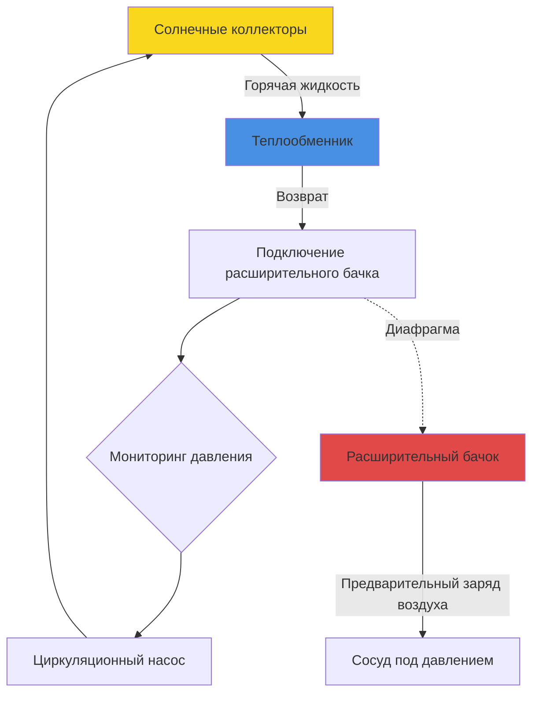
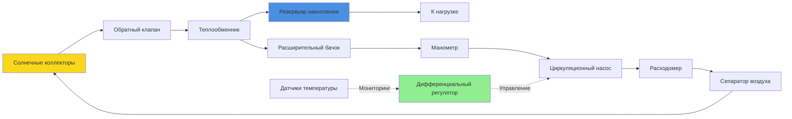

Системы солнечного теплоснабжения требуют правильно подобранных и настроенных вспомогательных компонентов для передачи, хранения и управления тепловой энергией с высокой эффективностью. Выбор компонентов напрямую влияет на надёжность системы, КПД и срок её эксплуатации. Данный анализ охватывает критическое оборудование, которое преобразует солнечные коллекторы в функциональные системы отопления.

## Теплообменники

Теплообменники осуществляют передачу тепловой энергии из контура коллектора в питьевую воду или системы отопления здания. Основной проблемой проектирования является баланс между эффективностью теплопередачи и потерей давления, а также паразитной энергией циркуляции.

### Основы теплопередачи

Производительность теплообменника следует соотношению эффективность-NTU:

$$\varepsilon = \frac{Q_{actual}}{Q_{max}} = \frac{\dot{m} c_p (T_{out} - T_{in})}{\dot{m} c_p (T_{hot,in} - T_{cold,in})}$$

Где:
- $\varepsilon$ = эффективность теплообменника (безразмерная величина)
- $Q_{actual}$ = фактический тепловой поток (Вт)
- $Q_{max}$ = максимально возможный тепловой поток (Вт)
- $\dot{m}$ = массовый расход (кг/с)
- $c_p$ = удельная теплоёмкость (Дж/кг·К)

Число единиц передачи (NTU) связано с физическими размерами и конфигурацией потока:

$$NTU = \frac{UA}{C_{min}}$$

Где:
- $U$ = общий коэффициент теплопередачи (Вт/м²·К)
- $A$ = площадь поверхности теплопередачи (м²)
- $C_{min}$ = минимальная ёмкость $= \dot{m} c_p$ (Вт/К)

Для противотока:

$$\varepsilon = \frac{1 - exp[-NTU(1-C_r)]}{1 - C_r \cdot exp[-NTU(1-C_r)]}$$

Где $C_r = C_{min}/C_{max}$ – отношение ёмкостей.

### Типы конфигураций

**Внешний теплообменник:**

Отдельный аппарат, установленный между контуром коллектора и резервуаром накопления. Основные типы:

- **Пластинчато-рамный**: пластины из нержавеющей стали создают турбулентные потоки, эффективность $\varepsilon$ = 0,70–0,85 при компактных габаритах
- **Кожухотрубный**: медные трубки в стальном корпусе, эффективность $\varepsilon$ = 0,50–0,70, подходит для приложений высокого давления
- **Пайный пластинчатый**: медь, паяная в нержавеющей стали, эффективность $\varepsilon$ = 0,60–0,75, экономичен для жилых систем

**Погруженная змеевик:**

Медная или нержавеющая стальная змеевик, погружённая в резервуар хранилища. Теплопередача управляется:

$$Q = UA \Delta T_{lm}$$

Где $\Delta T_{lm}$ – логарифмическая средняя разность температур:

$$\Delta T_{lm} = \frac{(T_{f,in} - T_{tank}) - (T_{f,out} - T_{tank})}{ln\left(\frac{T_{f,in} - T_{tank}}{T_{f,out} - T_{tank}}\right)}$$

**Критерии проектирования:**

| Параметр | Внешний ТО | Погружённая змеевик |
|----------|-----------|-------------------|
| Эффективность (ε) | 0,65–0,85 | 0,40–0,60 |
| Потеря давления | 5–15 кПа | 2–8 кПа |
| Стоимость | Выше | Ниже |
| Обслуживание | Сервисируемый | Постоянная установка |
| Риск замерзания | Внешние трубопроводы | Защищён резервуаром |

Рекомендация по проектированию ASHRAE: внешние теплообменники должны достигать минимальную эффективность $\varepsilon$ = 0,50 для поддержания приемлемых температур контура коллектора. Каждое снижение эффективности на 0,10 увеличивает температуру коллектора на 5–8°C, снижая КПД системы на 3–5%.

## Расширительные бачки

Закрытые контуры солнечных систем требуют расширительных бачков для компенсации теплового расширения теплоносителя. Размер бачка должен учитывать экстремальные диапазоны температур от окружающей среды до температуры застоя.

### Расчёт объёма

Требуемый объём расширения рассчитывается из теплового расширения жидкости:

$$V_{exp} = V_{system} \times (\rho_{cold} / \rho_{hot} - 1)$$

Где:
- $V_{system}$ = общий объём жидкости в системе (л)
- $\rho_{cold}$ = плотность жидкости при температуре заполнения (кг/м³)
- $\rho_{hot}$ = плотность жидкости при максимальной температуре (кг/м³)

Для солнечных систем рассчитывайте по температуре застоя (180–280°C в зависимости от типа коллектора):

$$V_{tank} = \frac{V_{exp} \times (P_{max} + P_{atm})}{(P_{max} - P_{initial})} \times 1.25$$

Коэффициент безопасности 1,25 учитывает неопределённость в объёме системы и обеспечивает достаточное пространство для пара.

**Пример расчёта:**

Параметры системы:
- Площадь коллектора: 20 м²
- Объём системы: 120 литров (типично 6 л/м²)
- Теплоноситель: 40% пропиленгликоль
- Температура заполнения: 20°C ($\rho$ = 1030 кг/м³)
- Температура застоя: 200°C ($\rho$ = 890 кг/м³)
- Максимальное давление: 600 кПа избыточного
- Начальное давление: 100 кПа избыточного

$$V_{exp} = 120 \times (1030/890 - 1) = 18,9 \text{ л}$$

$$V_{tank} = \frac{18,9 \times (600 + 101)}{(600 - 100)} \times 1,25 = 33,2 \text{ л}$$

Выберите расширительный бачок объёмом 35 литров.

### Конфигурация бачка

**Требования к установке:**

1. **Местоположение**: подключите к холодной части системы (сторона всасывания насоса) для минимизации воздействия температуры на диафрагму
2. **Давление предварительного заряда**: установите 70–80% от статического давления в системе
3. **Предохранительный клапан**: установите клапан сброса давления 600–800 кПа на стороне коллектора от обратного клапана
4. **Удаление воздуха**: автоматические воздушные клапаны в верхних точках предотвращают парообразование

## Теплоносители

Теплоносители должны обеспечивать защиту от замерзания, ингибирование коррозии и термическую стабильность в диапазоне рабочих температур −40°C до 200°C.

### Растворы пропиленгликоля

Растворы пропиленгликоля (ПГ) представляют стандартный выбор для систем солнечного теплоснабжения благодаря нетоксичной формуле, подходящей для потенциального контакта с питьевой водой.

**Выбор концентрации:**

| Защита от замерзания | Концентрация ПГ | Удельная теплоёмкость при 80°C | Вязкость при 0°C |
|----------------------|-----------------|------------------------------|------------------|
| −10°C | 25% | 4,0 кДж/кг·К | 3,2 мПа·с |
| −20°C | 35% | 3,8 кДж/кг·К | 5,8 мПа·с |
| −30°C | 45% | 3,6 кДж/кг·К | 11,5 мПа·с |
| −40°C | 50% | 3,5 кДж/кг·К | 18,2 мПа·с |

Тепловой штраф от использования гликоля проявляется в трёх формах:

**Снижение теплоёмкости:**

$$Q = \dot{m} c_{p,glycol} \Delta T$$

Смесь с 40% ПГ имеет на 10% более низкую удельную теплоёмкость, чем вода, требуя на 10% более высокого расхода для эквивалентной теплопередачи.

**Увеличенная вязкость:**

Потеря давления возрастает с вязкостью в соответствии с уравнением Дарси-Вейсбаха:

$$\Delta P = f \frac{L}{D} \frac{\rho V^2}{2}$$

Где коэффициент трения $f$ зависит от числа Рейнольдса:

$$Re = \frac{\rho V D}{\mu}$$

Более высокая вязкость снижает число Рейнольдса, увеличивая коэффициент трения и мощность насоса.

**Снижение конвективной теплопередачи:**

Корреляция числа Нуссельта для турбулентного потока:

$$Nu = 0,023 Re^{0,8} Pr^{0,4}$$

Более низкое число Рейнольдса и модификации числа Прандтля снижают коэффициент теплопередачи на 10–15% по сравнению с водой.

### Термическая деградация

Растворы гликоля деградируют при воздействии кислорода при повышенных температурах, формируя органические кислоты, которые вызывают коррозию компонентов системы и снижают pH. Скорость деградации экспоненциально возрастает выше 150°C:

**Оценка срока полезного использования:**

- Воздействие при 120°C: 15–20 лет
- Воздействие при 150°C: 8–12 лет
- Воздействие при 180°C: 3–5 лет
- Воздействие при 200°C: 1–2 года

Системы, испытывающие регулярное застойное состояние, требуют двухгодичного анализа жидкости и мониторинга pH. Заменяйте жидкость при падении pH ниже 7,0 или истощении резервной щёлочности.

## Циркуляционные насосы

Насосы солнечной системы должны преодолевать потерю давления коллектора, сопротивление теплообменника и трение трубопровода при минимизации паразитного энергопотребления.

### Подбор насоса

Общий напор в системе:

$$H_{total} = H_{collector} + H_{HX} + H_{pipe} + H_{elevation}$$

Расход рассчитывается из площади коллектора и повышения температуры:

$$\dot{m} = \frac{Q_{solar}}{c_p \Delta T}$$

Стандартные значения проектирования: 15–25 л/ч на м² площади коллектора, соответствующие повышению температуры 8–12°C.

**Параметры выбора насоса:**

| Размер системы | Расход | Напор | Мощность | Тип |
|---|---|---|---|---|
| <30 м² | 300–600 л/ч | 2–4 м | 40–80 Вт | Встроенный циркулятор |
| 30–100 м² | 600–2000 л/ч | 3–6 м | 80–180 Вт | Встроенный/плотносопряженный |
| >100 м² | 2000–6000 л/ч | 5–10 м | 180–500 Вт | На основании |

### Управление переменной скоростью

Частотные преобразователи оптимизируют потребление энергии, модулируя расход в зависимости от доступного солнечного излучения. Стратегия управления:

$$\dot{m} = \dot{m}_{max} \times \left(\frac{G_T}{G_{rated}}\right)^{0.5}$$

Где:
- $G_T$ = текущее облучение (Вт/м²)
- $G_{rated}$ = номинальное облучение (типично 800 Вт/м²)

Это пропорциональное управление поддерживает приблизительно постоянное повышение температуры, снижая энергопотребление насоса на 30–50% по сравнению с работой на фиксированной скорости.

## Дифференциальные регуляторы

Дифференциальные температурные регуляторы активируют циркуляцию, когда температура коллектора превышает температуру хранилища на установленный уровень, предотвращая потери тепла в периоды низкого излучения.

### Логика управления

Базовый алгоритм:

$$\text{ВКЛ если: } T_{collector} > T_{storage} + \Delta T_{on}$$
$$\text{ВЫКЛ если: } T_{collector} < T_{storage} + \Delta T_{off}$$

Типичные установки:
- $\Delta T_{on}$ = 8–12°C (дифференциал включения)
- $\Delta T_{off}$ = 3–5°C (дифференциал отключения)
- $T_{max}$ = 95–110°C (защита от перегрева)

**Продвинутые функции:**

1. **Ограничение максимальной температуры**: предотвращает перегрев хранилища
2. **Защита от замерзания**: циркулирует в морозных условиях для систем слива
3. **Охлаждение коллектора**: циркуляция в вечерние часы для предотвращения застоя
4. **Переключение приоритетов**: управляет несколькими зонами хранилища
5. **Блокировка котла**: отключает вспомогательный нагрев при наличии солнечной энергии

### Размещение датчиков

**Датчик коллектора:**
- Местоположение: коллектор возвращающегося тока или выходной трубопровод
- Тип: ДТС или термистор, точность ±1°C
- Монтаж: погруженный в защиту или закреплённый на поверхности с термической пастой
- Критично: датчик не должен быть подвержен воздействию застойной жидкости при остановке насоса

**Датчик хранилища:**
- Местоположение: нижняя треть резервуара для дифференциального измерения
- Избегайте: установку близ входа змеевика, где измерения отражают температуру контура коллектора
- Несколько датчиков: отслеживайте расслоение в больших резервуарах (>1000 л)

## Интеграция системы

Правильная интеграция компонентов обеспечивает надёжную и эффективную работу системы солнечного теплоснабжения:

**Критические точки интеграции:**

1. **Обратный клапан** после коллекторов предотвращает обратный термосифонный процесс, потеря давления <5 кПа
2. **Расходомер** позволяет проверку при пусконаладке и мониторинг производительности
3. **Сепаратор воздуха** удаляет захвачённый воздух, который снижает теплопередачу и вызывает кавитацию
4. **Манометр** контролирует давление в системе, выявляет утечки и проблемы расширения
5. **Изолирующие клапаны** у каждого компонента позволяют техническое обслуживание без слива системы

## Стандарты и производительность

**Применимые стандарты:**
- **ASHRAE 90.1-2022**: раздел 6.3.3 – требования систем солнечного теплоснабжения
- **ASHRAE 93-2010**: процедуры тестирования коллекторов (информативно для проектирования систем)
- **ASHRAE 191-2020**: протоколы мониторинга и проверки производительности
- **SRCC OG-300**: программа сертификации систем солнечного теплоснабжения

**Проверка проектирования:**

Метрика КПД системы:

$$\eta_{system} = \frac{Q_{delivered}}{A_c \times H_T} \times 100\%$$

Целевой годовой КПД системы: 30–45% в зависимости от типа коллектора и климата. Потери компонентов обычно составляют:
- Теплообменник: 5–10% снижение от единичной эффективности
- Трубопроводы: 2–5% для изолированных наружных линий
- Управление: 1–3% от дифференциальных установок и циклических потерь
- Циркуляция: паразитное энергоотношение должно оставаться ниже 5% доставляемой энергии

Правильно подобранные и настроенные компоненты преобразуют солнечные коллекторы в полные тепловые системы, достигая 20–70% годовых солнечных долей для приложений отопления. Успех требует внимания к основам теплопередачи, точных расчётов калибровки и интеграции систем управления, которые реагируют на динамическое наличие солнечной энергии.
