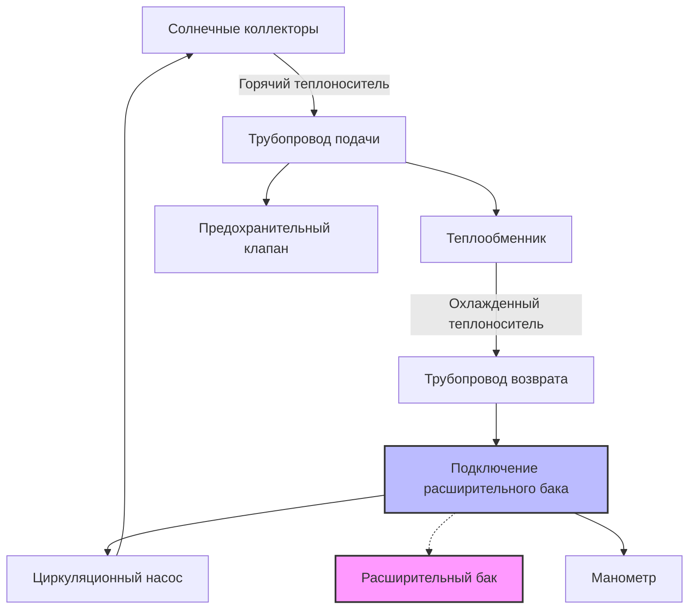

## Основы теплового расширения

Расширительные баки компенсируют изменения объема теплоносителя в системах солнечного теплоснабжения, вызванные колебаниями температуры. По мере нагрева теплоносителя в солнечных коллекторах тепловое расширение повышает давление в системе. Без надлежащего объема расширения возникает избыточное давление, которое приводит к срабатыванию предохранительного клапана или отказу компонентов.

Коэффициент объемного расширения определяет изменение объема жидкости при изменении температуры:

$$\Delta V = V_0 \beta \Delta T$$

где $\Delta V$ — изменение объема (л), $V_0$ — начальный объем жидкости (л), $\beta$ — коэффициент объемного расширения (1/°C), и $\Delta T$ — изменение температуры (°C).

Для растворов пропиленгликоля, обычно используемых в системах солнечного теплоснабжения, коэффициент расширения зависит от концентрации и температуры. 50%-й раствор пропиленгликоля имеет $\beta \approx 0,00099$ на °C, что значительно выше, чем для чистой воды при $\beta \approx 0,00038$ на °C.

## Типы расширительных баков

### Диафрагменные расширительные баки

Диафрагменные баки разделяют теплоноситель и сжатый воздух гибкой мембраной. Диафрагма предотвращает растворение воздуха в жидкости, исключая необходимость периодической подкачки воздуха. Эти баки используются в современных системах солнечного теплоснабжения благодаря надежности и минимальному техническому обслуживанию.

Бак имеет фиксированный воздушный заряд с одной стороны диафрагмы и теплоноситель с другой. По мере расширения жидкости диафрагма сжимает воздушную подушку, повышая давление в системе в соответствии с уравнением идеального газа:

$$P_1 V_1 = P_2 V_2$$

### Компрессионные баки

Старые компрессионные баки допускают прямой контакт между воздухом и теплоносителем. Воздух постепенно растворяется в жидкости, требуя периодической подкачки. Эти баки редко используются в новых солнечных установках из-за требований к обслуживанию и риска вовлечения воздуха в систему.

## Методика расчета размера бака

Правильный расчет размера расширительного бака требует определения объема принятия — объема теплоносителя, который бак должен вмещать между минимальным и максимальным давлением в системе.

### Метод расчета ASHRAE

Согласно ASHRAE Handbook—HVAC Systems and Equipment, глава 14, требуемый объем бака:

$$V_t = \frac{V_s \times \Delta V_{ratio} - 1,136}{1 - \frac{P_1}{P_2}}$$

где:
- $V_t$ = объем расширительного бака (л)
- $V_s$ = общий объем теплоносителя в системе (л)
- $\Delta V_{ratio}$ = коэффициент расширения объема жидкости (безразмерный)
- $P_1$ = минимальное давление в системе (кПа абсолютное)
- $P_2$ = максимальное давление в системе (кПа абсолютное)

Константа 1,136 л соответствует объему системы в трубопроводах и компонентах, не подверженных нагреву.

### Расчет объема теплоносителя в системе

Общий объем системы включает:

- **Массив коллекторов**: внутренний объем панели из данных производителя
- **Сеть трубопроводов**: расчет на основе диаметра и длины трубы
- **Теплообменник**: объем на стороне труб солнечного контура
- **Трубопроводы подключения расширительного бака**: обычно 4–8 л

Объем теплоносителя в коллекторе обычно варьируется от 0,5 до 1,2 л на м² площади коллектора в зависимости от конструкции абсорбера.

## Параметры давления

### Минимальное давление в системе

Минимальное давление $P_1$ должно превышать гидростатическое давление наивысшей точки системы плюс запас безопасности:

$$P_1 = \frac{h \times \rho}{101,97} + P_{атм} + P_{безоп}$$

где $h$ — перепад высоты (м), $\rho$ — плотность жидкости (кг/м³), давления указаны в кПа. Запас безопасности 20–35 кПа предотвращает кавитацию и обеспечивает положительное давление во всей системе.

### Максимальное давление в системе

Максимальное давление определяется компонентом системы с наименьшим номинальным давлением, обычно:

- Настройка предохранительного клапана минус 10%
- Максимальное рабочее давление коллектора
- Номинальное давление теплообменника
- Максимальный предел шкалы манометра

Стандартные системы солнечного теплоснабжения работают с максимальным давлением 207–345 кПа (манометрическое).

## Особенности растворов гликоля

| Свойство | Вода | 30% ПГ | 50% ПГ |
|----------|-------|---------|---------|
| Коэффициент расширения (1/°C) | 0,00038 | 0,00074 | 0,00099 |
| Плотность при 15°C (кг/л) | 1,00 | 1,03 | 1,05 |
| Температура замерзания (°C) | 0 | -3,9 | -33,3 |
| Вязкость относительно воды | 1,0 | 1,8 | 3,5 |

Растворы пропиленгликоля требуют больших расширительных баков из-за более высоких коэффициентов теплового расширения. Система с 50% гликолем, расширяясь от 4°C до 104°C, испытывает приблизительно 12%-е увеличение объема по сравнению с 6% для воды.

## Требования к установке

### Расположение и крепление

Устанавливайте расширительные баки на стороне нагнетания циркуляционного насоса, чтобы поддерживать постоянное давление на входе насоса. Точка подключения бака должна находиться:

- Выше по потоку от любых обратных клапанов или запорных клапанов
- Подключена через тройник без промежуточных клапанов
- Расположена для гравитационного слива во время обслуживания
- Доступна для проверки и снятия показаний манометра

Закрепляйте диафрагменные баки вертикально с подключением внизу, чтобы предотвратить накопление воздуха в камере теплоносителя.

### Предварительное давление заряда

Установите предварительное давление заряда бака равным минимальному давлению в системе:

$$P_{предзаряд} = P_1 = \frac{h \times \rho}{101,97} + P_{атм} + P_{безоп}$$

Проверяйте предварительное давление заряда ежегодно с помощью стандартного манометра шины, когда система холодная и сброшена давлением. Предварительное давление заряда на 14–21 кПа ниже расчетного значения указывает на разрыв диафрагмы или медленную утечку воздуха.

## Интеграция в систему

Расширительный бак подключается к системе в точке минимального колебания давления — между выходом теплообменника и входом насоса. Это место испытывает наименьшие колебания давления при работе насоса, позволяя баку функционировать в первую очередь как резервуар теплового расширения, а не компенсировать вызванные насосом колебания давления.

## Техническое обслуживание и устранение неисправностей

### Показатели производительности

Проверяйте эти параметры ежеквартально:

- Предварительное давление заряда бака (при холодной системе)
- Рабочее давление в системе при различных температурах
- Частота срабатывания предохранительного клапана
- Уровень жидкости в смотровом окне (если имеется)

### Распространенные режимы отказа

**Разрыв диафрагмы**: давление в системе падает ниже предварительного заряда, жидкость появляется на воздушном клапане, бак кажется равномерно холодным. Немедленно замените бак.

**Потеря воздушного заряда**: постепенное снижение давления в течение недель, бак кажется теплым по всей поверхности. Перезарядите согласно спецификации или замените, если утечка сохраняется.

**Недостаточный размер бака**: предохранительный клапан открывается при высокой солнечной радиации, система теряет теплоноситель. Рассчитайте правильный размер и установите более крупный блок.

## Проверка производительности

После установки и заполнения системы проверьте правильность работы расширительного бака:

1. Запишите давление холодной системы с выключенным насосом
2. Работайте системой до тех пор, пока коллекторы не достигнут температуры стагнации
3. Убедитесь, что горячее давление системы остается ниже настройки предохранительного клапана
4. Рассчитайте использованный объем принятия: $V_{используемый} = V_t \times (1 - \frac{P_1}{P_2})$
5. Сравните с требуемым объемом теплового расширения

Если горячее давление приближается к настройке предохранительного клапана, бак недостаточного размера или предварительное давление заряда неправильно.

## Конструктивные особенности для высокотемпературных систем

Системы солнечного теплоснабжения, способные достигать температуры стагнации свыше 176°C, требуют особого внимания к объему расширения. Расширение жидкости между окружающей температурой 4°C и стагнацией 176°C может достичь 15–18% для растворов гликоля, значительно больше, чем типичное расширение в системах отопления.

Эвакуированные трубчатые коллекторы и высокоэффективные плоские коллекторы в климатах с высокой солнечной радиацией регулярно достигают этих температур при отсутствии потока. Рассчитайте размер расширительных баков для наихудшего случая температуры стагнации, а не для нормальной рабочей температуры.

## Соответствие нормам и стандартам

Стандарт ASHRAE 90.1 требует, чтобы гидравлические системы включали расширительные баки, рассчитанные в соответствии с признанными методами инженерного расчета. Международный механический кодекс (IMC), раздел 1005, предусматривает расширительные баки для всех замкнутых гидравлических систем, подверженных колебаниям температуры.

Предохранительные клапаны, требуемые согласно ASME, раздел IV, для систем, превышающих 71°C, должны срабатывать при давлениях ниже максимального рабочего давления любого компонента системы. Расширительный бак предотвращает срабатывание предохранительного клапана при нормальном тепловом расширении, что в противном случае привело бы к постепенной потере теплоносителя и сниженному давлению в системе.
